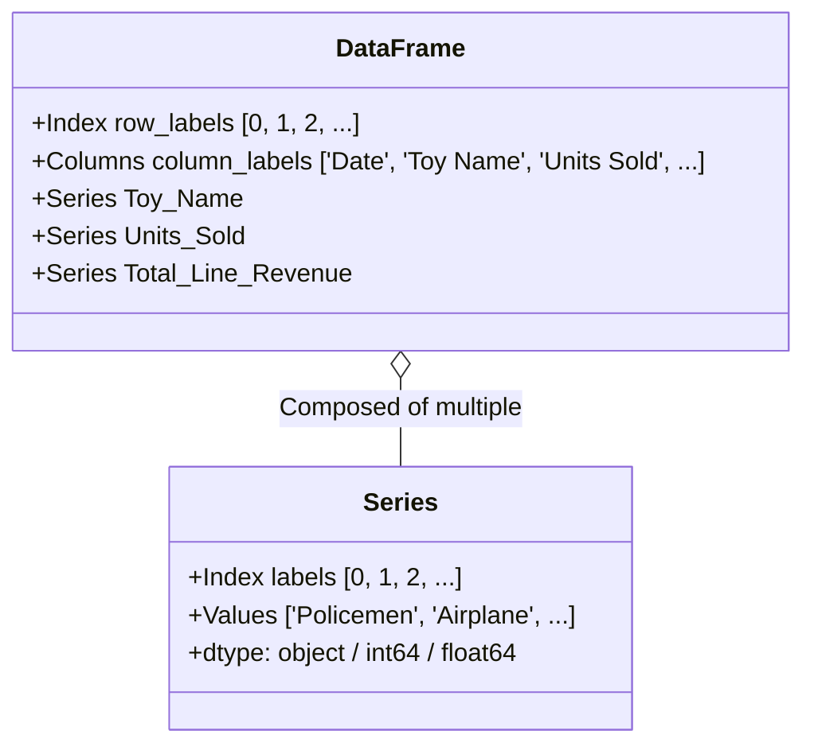
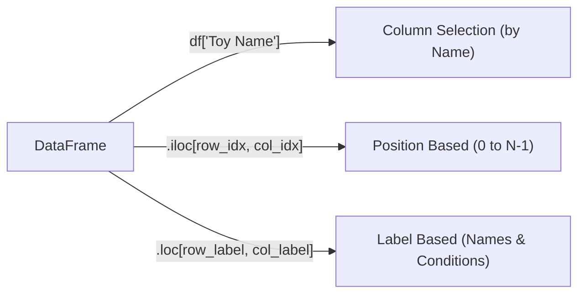
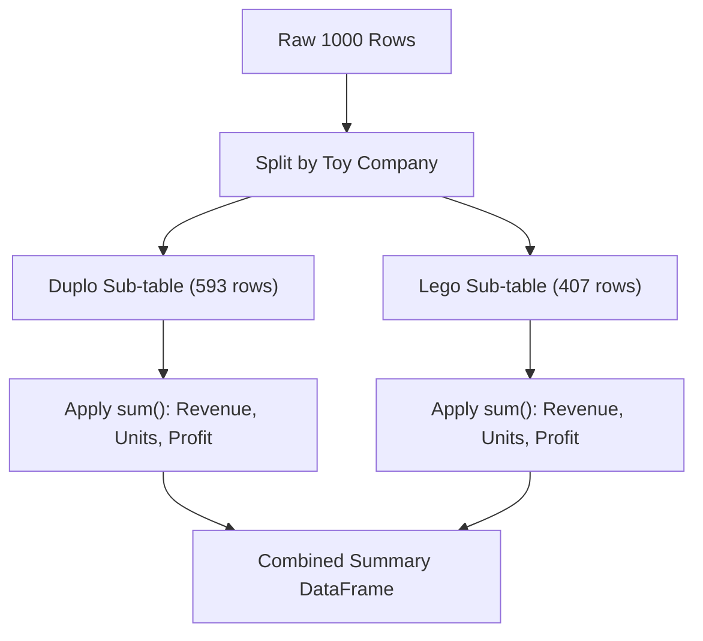
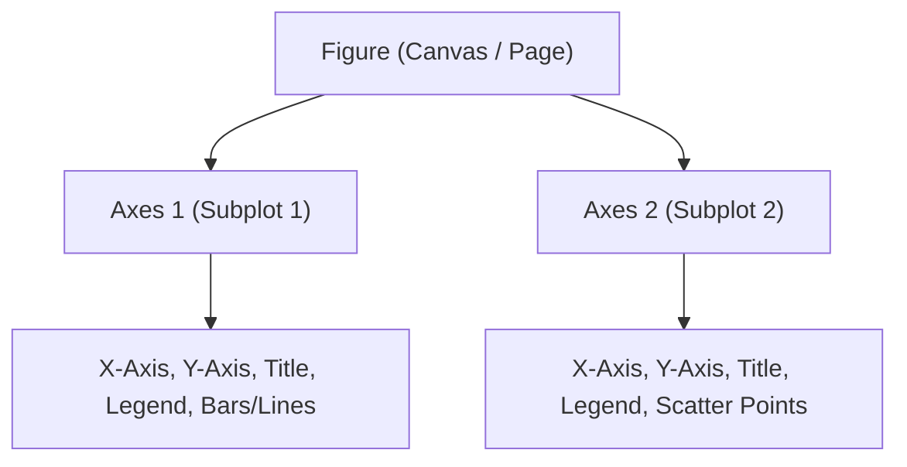

# Day 11: Data Science with Pandas, Matplotlib & Seaborn

Welcome to Day 11! Today's session is an intensive, hands-on journey into **Data Analysis and Visualization** using Python's foundational data science stack:
1. **Pandas**: Fast, expressive data structures (DataFrames and Series) for data manipulation, cleaning, aggregation, and time-series analysis.
2. **Matplotlib**: Python's fundamental 2D plotting library using the robust Object-Oriented (Figure & Axes) paradigm.
3. **Seaborn**: High-level statistical visualization library built on top of Matplotlib, offering elegant defaults, automated aggregations, and multi-variable segmentations.

All examples throughout this material utilize the real-world dataset located at **`Day_11/Sales.csv`**, representing 1,000 retail transactions from a specialty toy store (selling Lego and Duplo toys).

---

## Table of Contents

- [SECTION 0: Environment Setup & Verification](#section-0-environment-setup--verification)
  - [1. Creating an Isolated Virtual Environment](#1-creating-an-isolated-virtual-environment)
  - [2. Installing the Data Science Packages](#2-installing-the-data-science-packages)
  - [3. Verifying the Installation](#3-verifying-the-installation)
- [SECTION 1: Dataset Overview & Data Dictionary](#section-1-dataset-overview--data-dictionary)
  - [1. Business Scenario](#1-business-scenario)
  - [2. Data Dictionary](#2-data-dictionary)
- [SECTION 2: Pandas Fundamentals (Beginner to Intermediate)](#section-2-pandas-fundamentals-beginner-to-intermediate)
  - [Module 1: Loading Data & Mental Model (Series vs. DataFrame)](#module-1-loading-data--mental-model-series-vs-dataframe)
  - [Module 2: First Impressions & Exploratory Data Inspection](#module-2-first-impressions--exploratory-data-inspection)
  - [Module 3: Accessing & Subsetting (Columns, `.loc`, and `.iloc`)](#module-3-accessing--subsetting-columns-loc-and-iloc)
  - [Module 4: Boolean Indexing & Conditional Filtering](#module-4-boolean-indexing--conditional-filtering)
  - [Module 5: Real-World Data Cleaning & Type Conversion](#module-5-real-world-data-cleaning--type-conversion)
  - [Module 6: Feature Engineering & Derived Metrics](#module-6-feature-engineering--derived-metrics)
  - [Module 7: Aggregations, Sorting & GroupBy Mechanics](#module-7-aggregations-sorting--groupby-mechanics)
  - [Module 8: Multi-Dimensional Summaries: Pivot Tables & Cross-Tabs](#module-8-multi-dimensional-summaries-pivot-tables--cross-tabs)
- [SECTION 3: Data Visualization with Matplotlib & Seaborn](#section-3-data-visualization-with-matplotlib--seaborn)
  - [Module 9: Matplotlib Fundamentals (The Object-Oriented API)](#module-9-matplotlib-fundamentals-the-object-oriented-api)
    - [Chart 1: Horizontal Bar Chart — Top Toys by Total Revenue](#chart-1-horizontal-bar-chart--top-toys-by-total-revenue)
    - [Chart 2: Histogram & KDE — Purchaser Age Demographics](#chart-2-histogram--kde--purchaser-age-demographics)
    - [Chart 3: Line Chart — Monthly Sales Trends (The Holiday Peak)](#chart-3-line-chart--monthly-sales-trends-the-holiday-peak)
    - [Chart 4: Scatter Plot — Revenue vs. Cost of Goods Sold](#chart-4-scatter-plot--revenue-vs-cost-of-goods-sold)
  - [Module 10: Statistical Visualizations with Seaborn](#module-10-statistical-visualizations-with-seaborn)
    - [Chart 5: Categorical Countplot — Payment Method by Membership](#chart-5-categorical-countplot--payment-method-by-membership)
    - [Chart 6: Boxplot & Violin Plot — Purchaser Age by Toy Company](#chart-6-boxplot--violin-plot--purchaser-age-by-toy-company)
    - [Chart 7: Correlation Heatmap — Financial Metrics Matrix](#chart-7-correlation-heatmap--financial-metrics-matrix)
    - [Chart 8: Pivot Heatmap — Average Basket Size (Company vs. Payment)](#chart-8-pivot-heatmap--average-basket-size-company-vs-payment)
- [SECTION 4: Complete End-to-End Analytics Pipeline](#section-4-complete-end-to-end-analytics-pipeline)
  - [Complete Script: `sales_analytics_pipeline.py`](#complete-script-sales_analytics_pipelinepy)
- [SECTION 5: Practice Exercises for Students](#section-5-practice-exercises-for-students)

---

# SECTION 0: Environment Setup & Verification

Since Python 3 is already installed on your machine, we will set up a dedicated virtual environment and install the required data science packages.

### 1. Creating an Isolated Virtual Environment

Open your terminal or command prompt, navigate to your workspace or `Day_11` directory, and create a virtual environment named `.venv`:

#### On macOS / Linux:
```bash
cd Day_11
python3 -m venv .venv
source .venv/bin/activate
```

#### On Windows (Command Prompt / PowerShell):
```cmd
cd Day_11
python -m venv .venv
.venv\Scripts\activate
```

> **Note**: When activated, your command prompt will show `(.venv)` in front of the prompt line.

---

### 2. Installing the Data Science Packages

With your virtual environment active, run the following command to install the required libraries:

```bash
pip install --upgrade pip
pip install pandas matplotlib seaborn openpyxl jupyterlab
```

* **`pandas`**: High-performance data manipulation and analysis library.
* **`matplotlib`**: Low-level 2D plotting library for publication-quality figures.
* **`seaborn`**: High-level statistical visualization library.
* **`openpyxl`**: Excel file support for Pandas (`.xlsx` export/import).
* **`jupyterlab`**: Optional interactive browser-based notebook environment.

---

### 3. Verifying the Installation

To verify that all dependencies are installed properly, create and run a quick verification script:

```python
# test_setup.py
import sys
import pandas as pd
import matplotlib
import seaborn as sns

print(f"Python Version:     {sys.version.split()[0]}")
print(f"Pandas Version:     {pd.__version__}")
print(f"Matplotlib Version: {matplotlib.__version__}")
print(f"Seaborn Version:    {sns.__version__}")
print("\nEnvironment is ready for Data Science!")
```

Execute it from your terminal:
```bash
python test_setup.py
```

Expected output:
```text
Python Version:     3.12.x
Pandas Version:     2.2.x (or newer)
Matplotlib Version: 3.8.x (or newer)
Seaborn Version:    0.13.x (or newer)

Environment is ready for Data Science!
```

---

# SECTION 1: Dataset Overview & Data Dictionary

### 1. Business Scenario
The file `Sales.csv` contains historical records of **1,000 retail line-item purchases** made at a boutique toy store between **January 2010 and December 2012**. The store specializes in building sets from two major brands: **Lego** and **Duplo**.

Each row represents an individual line item on a customer invoice, containing details about the item purchased, pricing, manufacturing cost (COGS), payment method, customer attributes, and store cashier.

### 2. Data Dictionary

| Column Name | Raw Data Type | Real-World Description | Data Preparation Needed |
| :--- | :--- | :--- | :--- |
| **`Invoice Number`** | Integer / String | Unique order transaction ID (multiple items share an ID) | Treat as categorical/identifier |
| **`Date`** | String (`M/D/YYYY`) | Transaction date (e.g. `1/7/2010`) | Convert to `datetime64[ns]` |
| **`Time`** | String (`HH:MM`) | 24-hour time of purchase (e.g. `14:19`) | Parse hour for time-of-day analysis |
| **`Internal Toy ID Number`**| String | Warehouse SKU code (e.g. `D255/FE`) | Text categorical |
| **`Toy Item Number`** | Integer / String | Catalog product ID number (e.g. `192`) | Text identifier |
| **`Toy Company`** | String | Brand manufacturer (`Duplo`, `Lego`) | Clean categorical |
| **`Toy Name`** | String | Product name (e.g., `Policemen`, `Airplane`) | Clean categorical |
| **`Suggested Age`** | String | Target age category (e.g. `6 and up`) | Categorical / Ordinal |
| **`Price Per Toy`** | String (e.g. `"$9.95 "`) | Retail price per unit with dollar sign & spaces | Strip `$`, trim spaces, convert to `float` |
| **`Units Sold`** | Integer (1 to 5) | Quantity purchased in this line item | Convert to `int` |
| **`Total Line Revenue`** | String (e.g. `"$49.75 "`)| Total money received: `Price Per Toy * Units Sold` | Strip `$`, trim spaces, convert to `float` |
| **`Total COGS`** | String (e.g. `"$25.85 "`)| Cost of Goods Sold (wholesale cost to retailer) | Strip `$`, trim spaces, convert to `float` |
| **`Payment`** | String | Tender method (`Visa`, `Cash`, `Mastercard`, etc.)| Categorical |
| **`Cashier ID`** | String (e.g. `V.W.\|880-4523`)| Cashier initials joined with employee phone/station | Split into Cashier Code & Extension |
| **`Member?`** | String (`Yes` / `No`) | Store loyalty program membership status | Convert to Boolean (`True`/`False`) |
| **`Coupon?`** | String (`Yes` / `No`) | Whether a promotional coupon was applied | Convert to Boolean (`True`/`False`) |
| **`Purchaser Age`** | Integer (6 to 75) | Age of the person paying at the checkout counter | Numeric integer |
| **`Parking Validation?`**| String (`Yes` / `No`) | Whether store validated customer's parking ticket | Convert to Boolean (`True`/`False`) |

---

# SECTION 2: Pandas Fundamentals (Beginner to Intermediate)

---

## Module 1: Loading Data & Mental Model (Series vs. DataFrame)

### Concept: What is a DataFrame and a Series?
* A **Series** is a 1-dimensional labeled array capable of holding any data type (integers, floats, strings, Python objects). Think of it as a single column with an index.
* A **DataFrame** is a 2-dimensional labeled tabular data structure with columns of potentially different types. Think of it as an Excel spreadsheet or a SQL table. Every column in a DataFrame is a Series sharing the same index.



### Code Example 1.1: Loading the CSV
Save this script as `module1_load.py` or run it in your Python shell:

```python
import pandas as pd

# Load the CSV file into a pandas DataFrame
df = pd.read_csv("Sales.csv")

# Print the type and memory size
print(f"Data type: {type(df)}")
print(f"Dimensions (rows, columns): {df.shape}")

# Extract a single column as a Series
toy_series = df["Toy Name"]
print(f"Single column type: {type(toy_series)}")
print("\nFirst 3 toy names:")
print(toy_series.head(3))
```

#### Output:
```text
Data type: <class 'pandas.core.frame.DataFrame'>
Dimensions (rows, columns): (1000, 18)
Single column type: <class 'pandas.core.series.Series'>

First 3 toy names:
0        Policemen
1    Farming Scene
2         Airplane
Name: Toy Name, dtype: object
```

---

## Module 2: First Impressions & Exploratory Data Inspection

When working with any new dataset in data science, you must inspect its shape, column data types, missing values, and general distributions before performing calculations.

### Code Example 2.1: First Look Methods
```python
import pandas as pd

df = pd.read_csv("Sales.csv")

print("--- 1. First 5 Rows (.head()) ---")
print(df[["Invoice Number", "Toy Name", "Units Sold", "Total Line Revenue"]].head())

print("\n--- 2. Dataset Metadata & Memory (.info()) ---")
df.info()

print("\n--- 3. Missing Value Audit (.isnull().sum()) ---")
print(df.isnull().sum())

print("\n--- 4. Summary Statistics for Numeric Columns (.describe()) ---")
print(df.describe())
```

#### Output Explanation:
* Notice that `Units Sold` has a minimum of 1, median of 1, and max of 5.
* `Purchaser Age` has a min of 6 and max of 75, with an average of 37.2 years old.
* Notice that `Total Line Revenue` is listed as `object` (string) rather than `float64` because it contains dollar signs (`$`). We will clean this in Module 5.

---

## Module 3: Accessing & Subsetting (Columns, `.loc`, and `.iloc`)

Pandas provides distinct ways to select data:
1. **Column Selection**: `df['col']` (single Series) or `df[['col1', 'col2']]` (DataFrame subset).
2. **Position-based Indexing (`.iloc`)**: Integer location based on 0-indexed row and column offsets (identical to standard Python list indexing).
3. **Label-based Indexing (`.loc`)**: Label location based on row index labels and column names.



### Code Example 3.1: Indexing & Slicing
```python
import pandas as pd

df = pd.read_csv("Sales.csv")

# 1. Select specific columns
subset = df[["Invoice Number", "Toy Company", "Toy Name", "Units Sold"]]
print("--- Column Subset (first 3 rows) ---")
print(subset.head(3))

# 2. Position-based selection with .iloc
# Select first 4 rows and columns at index 0, 5, 6 (Invoice Number, Toy Company, Toy Name)
print("\n--- Position Selection (.iloc[0:4, [0, 5, 6]]) ---")
print(df.iloc[0:4, [0, 5, 6]])

# 3. Label-based selection with .loc
# Select rows with index 0 to 2 and explicit column names
print("\n--- Label Selection (.loc[0:2, ['Toy Company', 'Toy Name']]) ---")
print(df.loc[0:2, ["Toy Company", "Toy Name"]])
```

---

## Module 4: Boolean Indexing & Conditional Filtering

In data science, filtering rows based on business conditions is one of the most common tasks.
In Pandas, we use **Boolean Masks** (Series of `True` and `False` values):
* Use `&` for element-wise **AND** (do NOT use Python's `and`)
* Use `|` for element-wise **OR** (do NOT use Python's `or`)
* Use `~` for element-wise **NOT**
* **Always enclose each individual condition in parentheses `()`** to ensure correct operator precedence!

### Code Example 4.1: Filtering Transactions
```python
import pandas as pd

df = pd.read_csv("Sales.csv")

# 1. Single condition: Transactions where Units Sold is greater than or equal to 4
bulk_sales = df[df["Units Sold"] >= 4]
print(f"Total bulk sales (>= 4 units): {len(bulk_sales)}")

# 2. Multiple conditions (AND): Duplo toys purchased by loyalty Members
duplo_members = df[(df["Toy Company"] == "Duplo") & (df["Member?"] == "Yes")]
print(f"Duplo purchases by Members: {len(duplo_members)}")

# 3. Multiple conditions (OR): Purchases using Cash OR Check
cash_or_check = df[(df["Payment"] == "Cash") | (df["Payment"] == "Check")]
print(f"Cash or Check transactions: {len(cash_or_check)}")

# 4. Using .isin() for checking membership in a collection of items
target_toys = ["Airplane", "Fire Trucks", "Antique Car"]
selected_toys = df[df["Toy Name"].isin(target_toys)]
print(f"Selected vehicles sold: {len(selected_toys)}")

# 5. Using .between() for numeric ranges: Purchasers in their 20s (20 to 29 inclusive)
twenties = df[df["Purchaser Age"].between(20, 29)]
print(f"Purchasers in their 20s: {len(twenties)}")
```

#### Output:
```text
Total bulk sales (>= 4 units): 145
Duplo purchases by Members: 63
Cash or Check transactions: 296
Selected vehicles sold: 205
Purchasers in their 20s: 254
```

---

## Module 5: Real-World Data Cleaning & Type Conversion

Raw business datasets are rarely clean. In `Sales.csv`:
1. `Price Per Toy`, `Total Line Revenue`, and `Total COGS` contain dollar symbols (`$`) and trailing spaces.
2. `Cashier ID` contains two separate pieces of information (`Initial|Phone`) combined with a pipe delimiter.
3. `Date` is stored as an unparsed string (`1/7/2010`).
4. Boolean columns (`Member?`, `Coupon?`, `Parking Validation?`) are strings `"Yes"` and `"No"`.

### Code Example 5.1: Cleaning Pipeline
```python
import pandas as pd

df = pd.read_csv("Sales.csv")

# 1. Clean currency columns: remove '$', strip whitespace, convert to float
currency_cols = ["Price Per Toy", "Total Line Revenue", "Total COGS"]
for col in currency_cols:
    df[col] = df[col].astype(str).str.replace("$", "", regex=False).str.strip().astype(float)

# 2. Parse Date into true datetime objects
df["Date"] = pd.to_datetime(df["Date"], format="%m/%d/%Y")

# 3. String Splitting: Split 'Cashier ID' (e.g. 'V.W.|880-4523') into two clean columns
cashier_split = df["Cashier ID"].str.split("|", expand=True)
df["Cashier_Initials"] = cashier_split[0]
df["Cashier_Phone"] = cashier_split[1]

# 4. Convert Yes/No flags into genuine Boolean types
flag_cols = ["Member?", "Coupon?", "Parking Validation?"]
for col in flag_cols:
    df[col] = df[col].map({"Yes": True, "No": False})

print("--- Cleaned Column Types (.dtypes) ---")
print(df[["Price Per Toy", "Total Line Revenue", "Total COGS", "Date", "Member?"]].dtypes)

print("\n--- Cleaned Sample Rows ---")
print(df[["Invoice Number", "Date", "Toy Name", "Total Line Revenue", "Total COGS", "Cashier_Initials"]].head(3))
```

#### Output:
```text
--- Cleaned Column Types (.dtypes) ---
Price Per Toy                float64
Total Line Revenue           float64
Total COGS                   float64
Date                  datetime64[ns]
Member?                         bool
dtype: object

--- Cleaned Sample Rows ---
   Invoice Number       Date       Toy Name  Total Line Revenue  Total COGS Cashier_Initials
0          654522 2010-01-07      Policemen                9.95        5.17             V.W.
1          654526 2010-01-07  Farming Scene              124.75       81.10             B.X.
2          654568 2010-01-07       Airplane                5.95        3.09             Z.Q.
```

---

## Module 6: Feature Engineering & Derived Metrics

Feature engineering creates new business insights from existing data.

Let's derive:
1. **`Line Profit`**: $\text{Total Line Revenue} - \text{Total COGS}$
2. **`Profit Margin %`**: $\left(\frac{\text{Line Profit}}{\text{Total Line Revenue}}\right) \times 100$
3. **Date Features**: Extract `Year`, `Month`, `Month_Name`, and `Day_Name`.
4. **`Age Group`**: Discretize continuous customer age into demographic brackets using `pd.cut()`.

### Code Example 6.1: Engineering Columns
```python
import pandas as pd

# Load and clean currency
df = pd.read_csv("Sales.csv")
for col in ["Price Per Toy", "Total Line Revenue", "Total COGS"]:
    df[col] = df[col].astype(str).str.replace("$", "", regex=False).str.strip().astype(float)
df["Date"] = pd.to_datetime(df["Date"], format="%m/%d/%Y")

# 1. Financial Features
df["Line_Profit"] = df["Total Line Revenue"] - df["Total COGS"]
df["Profit_Margin_Pct"] = (df["Line_Profit"] / df["Total Line Revenue"]) * 100

# 2. Date / Time Features
df["Year"] = df["Date"].dt.year
df["Month"] = df["Date"].dt.month
df["Month_Name"] = df["Date"].dt.month_name()
df["Day_Name"] = df["Date"].dt.day_name()

# 3. Demographic Bins with pd.cut()
age_bins = [0, 18, 35, 55, 100]
age_labels = ["Kids (<18)", "Young Adults (18-35)", "Middle-Aged (36-55)", "Seniors (56+)"]
df["Age_Group"] = pd.cut(df["Purchaser Age"], bins=age_bins, labels=age_labels, right=True)

print("--- Newly Engineered Columns Sample ---")
print(df[["Toy Name", "Total Line Revenue", "Total COGS", "Line_Profit", "Profit_Margin_Pct", "Age_Group"]].head(4))

print("\n--- Customer Demographics Distribution ---")
print(df["Age_Group"].value_counts(sort=False))
```

#### Output:
```text
--- Newly Engineered Columns Sample ---
        Toy Name  Total Line Revenue  Total COGS  Line_Profit  Profit_Margin_Pct            Age_Group
0      Policemen                9.95        5.17         4.78          48.040201  Middle-Aged (36-55)
1  Farming Scene              124.75       81.10        43.65          34.989980  Young Adults (18-35)
2       Airplane                5.95        3.09         2.86          48.067227  Middle-Aged (36-55)
3  Police Officers              9.95        4.48         5.47          54.974874  Middle-Aged (36-55)

--- Customer Demographics Distribution ---
Age_Group
Kids (<18)               24
Young Adults (18-35)    427
Middle-Aged (36-55)     491
Seniors (56+)            58
Name: count, dtype: int64
```

---

## Module 7: Aggregations, Sorting & GroupBy Mechanics

The **Split-Apply-Combine** strategy is the foundation of group analysis:
1. **Split**: Break the dataset into groups based on key columns (e.g. `Toy Company`).
2. **Apply**: Compute an aggregation (such as `sum`, `mean`, `count`, `min`, `max`) on each group.
3. **Combine**: Merge the results into a single summary table.



### Code Example 7.1: GroupBy and Multi-Aggregations
```python
import pandas as pd

df = pd.read_csv("Sales.csv")
for col in ["Total Line Revenue", "Total COGS"]:
    df[col] = df[col].astype(str).str.replace("$", "", regex=False).str.strip().astype(float)
df["Line_Profit"] = df["Total Line Revenue"] - df["Total COGS"]

# 1. Value Counts: How many sales transactions per Payment method?
print("--- Payment Method Counts ---")
print(df["Payment"].value_counts())

# 2. Simple GroupBy: Total Revenue by Toy Company
print("\n--- Revenue by Toy Company ---")
print(df.groupby("Toy Company")["Total Line Revenue"].sum())

# 3. Advanced GroupBy: Named Aggregations with multiple metrics
company_summary = df.groupby("Toy Company").agg(
    Total_Transactions=("Invoice Number", "count"),
    Total_Units=("Units Sold", "sum"),
    Total_Revenue=("Total Line Revenue", "sum"),
    Total_COGS=("Total COGS", "sum"),
    Total_Profit=("Line_Profit", "sum"),
    Avg_Ticket_Size=("Total Line Revenue", "mean")
).reset_index()

# Calculate overall Profit Margin for each company
company_summary["Profit_Margin_%"] = (company_summary["Total_Profit"] / company_summary["Total_Revenue"]) * 100

print("\n--- Executive Summary by Toy Company ---")
print(company_summary.to_string(index=False))

# 4. Top 5 Toys by Total Revenue
top_toys = df.groupby("Toy Name").agg(
    Units_Sold=("Units Sold", "sum"),
    Total_Revenue=("Total Line Revenue", "sum"),
    Total_Profit=("Line_Profit", "sum")
).sort_values(by="Total_Revenue", ascending=False).head(5)

print("\n--- Top 5 Best-Selling Toys ---")
print(top_toys)
```

#### Output:
```text
--- Executive Summary by Toy Company ---
Toy Company  Total_Transactions  Total_Units  Total_Revenue  Total_COGS  Total_Profit  Avg_Ticket_Size  Profit_Margin_%
      Duplo                 593         1073       11071.35     5874.56       5196.79        18.670067        46.939081
       Lego                 407          773        6894.35     3426.33       3468.02        16.939435        50.302349

--- Top 5 Best-Selling Toys ---
                                Units_Sold  Total_Revenue  Total_Profit
Toy Name                                                               
Policemen                             1000        9950.00       4780.00
Police Officers and Motorcycle         310        3084.50       1695.70
Airplane                               365        2171.75       1043.90
Farming Scene                           38         948.10        331.74
Gas Station                             16         527.20        221.44
```

---

## Module 8: Multi-Dimensional Summaries: Pivot Tables & Cross-Tabs

When examining interactions between two or more categorical dimensions:
* **`pd.crosstab()`**: Calculates frequency counts (contingency tables) between two categorical variables.
* **`pd.pivot_table()`**: Aggregates numerical values across two or more categorical dimensions (rows and columns).

### Code Example 8.1: Cross-Tabs and Pivot Tables
```python
import pandas as pd

df = pd.read_csv("Sales.csv")
for col in ["Total Line Revenue", "Total COGS"]:
    df[col] = df[col].astype(str).str.replace("$", "", regex=False).str.strip().astype(float)
df["Line_Profit"] = df["Total Line Revenue"] - df["Total COGS"]

# 1. Cross-Tabulation: Frequency of Member vs. Coupon Usage
print("--- Cross-Tab: Loyalty Member vs Coupon Usage ---")
print(pd.crosstab(df["Member?"], df["Coupon?"], margins=True, margins_name="Total"))

# 2. Cross-Tabulation with Normalized Percentages
print("\n--- Cross-Tab (Normalized by Row %): Member vs Payment ---")
print((pd.crosstab(df["Member?"], df["Payment"], normalize="index") * 100).round(1))

# 3. Pivot Table: Total Revenue by Toy Company (Rows) and Payment Method (Columns)
pivot_revenue = pd.pivot_table(
    data=df,
    values="Total Line Revenue",
    index="Toy Company",
    columns="Payment",
    aggfunc="sum",
    fill_value=0
)
print("\n--- Pivot Table: Revenue by Company and Payment Method ---")
print(pivot_revenue.round(2))
```

#### Output:
```text
--- Cross-Tab: Loyalty Member vs Coupon Usage ---
Coupon?   No  Yes  Total
Member?                 
No       791   90    881
Yes       80   39    119
Total    871  129   1000

--- Pivot Table: Revenue by Company and Payment Method ---
Payment        Cash    Check  Discover  Gift Card  Mastercard     Visa
Toy Company                                                       
Duplo       2656.65   656.70    975.10     746.25     2298.45  3738.20
Lego        1572.05   422.45    587.05     456.20     1568.10  2288.50
```

---

# SECTION 3: Data Visualization with Matplotlib & Seaborn

Data visualization communicates patterns, trends, and anomalies. We will use:
* **Matplotlib** for custom, precise control over figures, axes, ticks, and layout.
* **Seaborn** for high-level statistical plots with automatic grouping, color palettes, and error bars.

### Essential Rules for Students:
1. **Use the Object-Oriented Interface**: `fig, ax = plt.subplots(...)`. Avoid relying on global `plt.plot()` calls when building robust scripts.
2. **Always Label Axes and Titles**: Visualizations without units or labels are meaningless.
3. **Save Figures Properly**: Use `plt.savefig("chart_name.png", dpi=300, bbox_inches='tight')`.

---

## Module 9: Matplotlib Fundamentals (The Object-Oriented API)

Let's understand the Figure vs. Axes mental model:
* **Figure (`fig`)**: The master canvas / page / window containing all graphic elements.
* **Axes (`ax`)**: The actual plot / subplot with an x-axis, y-axis, title, legend, and data artists. A Figure can have one or many Axes.



---

### Chart 1: Horizontal Bar Chart — Top Toys by Total Revenue

#### When to Use a Horizontal Bar Chart:
* **Best Suited For**: Ranking discrete items or comparing a quantitative metric (e.g., total sales, headcounts, average satisfaction) across categorical groups.
* **Data Requirements**: 1 categorical variable (items/categories) + 1 quantitative metric (sum, count, or mean).
* **Why Horizontal over Vertical?**:
  * **Long Text Labels**: When category names are lengthy (e.g., `"Police Officers and Motorcycle"`), vertical bars force awkward 45° or 90° label rotations that are difficult to read. Horizontal bars provide comfortable, natural left-to-right reading.
  * **Ranked Lists**: Ideal for Top 5, Top 10, or Pareto charts sorted in descending or ascending order.
* **When NOT to Use**:
  * Continuous time-series data (use a line chart instead to show progression over time).
  * Showing proportions of a whole with only 2 or 3 categories (use a stacked bar or normalized 100% bar chart).

```python
import pandas as pd
import matplotlib.pyplot as plt

# 1. Load and clean data
df = pd.read_csv("Sales.csv")
df["Total Line Revenue"] = df["Total Line Revenue"].astype(str).str.replace("$", "", regex=False).str.strip().astype(float)

# 2. Aggregate total revenue per toy name
toy_sales = df.groupby("Toy Name")["Total Line Revenue"].sum().sort_values(ascending=True)

# 3. Create Figure and Axes (Object-Oriented API)
fig, ax = plt.subplots(figsize=(10, 6))

# 4. Plot horizontal bars
bars = ax.barh(toy_sales.index, toy_sales.values, color="#1f77b4", edgecolor="black", height=0.65)

# 5. Styling and labels
ax.set_title("Total Revenue Generated by Toy Name (2010 - 2012)", fontsize=14, fontweight="bold", pad=15)
ax.set_xlabel("Total Revenue (USD $)", fontsize=12)
ax.set_ylabel("Toy Name", fontsize=12)
ax.grid(axis="x", linestyle="--", alpha=0.7)

# 6. Add formatted value annotations to the right of each bar
for bar in bars:
    width = bar.get_width()
    ax.text(width + 80, bar.get_y() + bar.get_height() / 2, f"${width:,.2f}",
            va="center", ha="left", fontsize=9, fontweight="medium")

# Expand x-limit to prevent text clipping
ax.set_xlim(0, max(toy_sales.values) * 1.15)

plt.tight_layout()
plt.savefig("images/chart1_revenue_by_toy.png", dpi=200)
plt.show()
```

#### Output Visualization:


> **Key Business Insight**: Duplo's `Policemen` is the flagship revenue driver for the store by an overwhelming margin, delivering **$9,950.00** (over 55% of all store sales), followed by Lego's `Police Officers and Motorcycle` at **$3,084.50**.

---

### Chart 2: Histogram & Summary Markers — Purchaser Age Demographics

#### When to Use a Histogram:
* **Best Suited For**: Discovering the underlying distribution, central tendency, dispersion (spread), skewness, and outliers of a continuous numerical variable.
* **Data Requirements**: 1 continuous or discrete numeric variable with many observations.
* **Why Add Mean and Median Markers?**:
  * Directly plotting vertical lines for `mean` and `median` reveals distribution symmetry:
    * If $\text{Mean} \approx \text{Median}$, the distribution is approximately symmetric (normal).
    * If $\text{Mean} > \text{Median}$, the distribution is right-skewed (positive skew, pulled by extreme large values).
    * If $\text{Mean} < \text{Median}$, the distribution is left-skewed (negative skew).
* **When NOT to Use**:
  * Categorical variables (use a countplot or bar chart).
  * Comparing distributions across 4 or more distinct categories simultaneously (use grouped boxplots or violin plots to avoid cluttered overlapping bins).

```python
import pandas as pd
import matplotlib.pyplot as plt

df = pd.read_csv("Sales.csv")

fig, ax = plt.subplots(figsize=(9, 5))

# Plot Histogram with 20 bins
counts, bins, patches = ax.hist(
    df["Purchaser Age"],
    bins=20,
    color="#2ca02c",
    edgecolor="white",
    alpha=0.85
)

# Add vertical reference lines for Mean and Median
mean_age = df["Purchaser Age"].mean()
median_age = df["Purchaser Age"].median()

ax.axvline(mean_age, color="red", linestyle="--", linewidth=2, label=f"Mean: {mean_age:.1f} yrs")
ax.axvline(median_age, color="blue", linestyle=":", linewidth=2, label=f"Median: {median_age:.0f} yrs")

# Styling
ax.set_title("Customer Age Distribution at Checkout", fontsize=14, fontweight="bold", pad=15)
ax.set_xlabel("Purchaser Age (Years)", fontsize=12)
ax.set_ylabel("Number of Transactions", fontsize=12)
ax.legend(loc="upper right", frameon=True)
ax.grid(axis="y", linestyle="--", alpha=0.5)

plt.tight_layout()
plt.savefig("images/chart2_age_distribution.png", dpi=200)
plt.show()
```

#### Output Visualization:


> **Key Business Insight**: Purchaser ages exhibit an approximately normal, bell-shaped distribution centered around **37.2 years** (median **36.0 years**). Even though the products are toys for young children, the checkout purchasers are primarily millennial parents and grandparents.

---

### Chart 3: Line Chart — Monthly Sales Trends (The Holiday Seasonality)

#### When to Use a Line Chart:
* **Best Suited For**: Visualizing trends, rates of change, seasonality, and cycles across an ordered, continuous dimension (usually time).
* **Data Requirements**: 1 ordered dimension (dates, timestamps, months, quarters) on the x-axis + 1 or more continuous numerical metrics on the y-axis.
* **Why a Line Chart?**:
  * The human eye interprets connected points as a continuous progression through time, allowing rapid identification of upward slopes, plateaus, and seasonal plunges.
  * Easy to annotate turning points, promotional milestones, or extreme events.
* **When NOT to Use**:
  * Unordered categorical variables on the x-axis (e.g., product names or payment types). Connecting non-sequential categories with a line creates an illusion of a non-existent chronological trend.

```python
import pandas as pd
import matplotlib.pyplot as plt

df = pd.read_csv("Sales.csv")
df["Total Line Revenue"] = df["Total Line Revenue"].astype(str).str.replace("$", "", regex=False).str.strip().astype(float)
df["Date"] = pd.to_datetime(df["Date"], format="%m/%d/%Y")

# Group by Year-Month period
df["YearMonth"] = df["Date"].dt.to_period("M")
monthly_trend = df.groupby("YearMonth")["Total Line Revenue"].sum()

x_labels = [str(p) for p in monthly_trend.index]
y_values = monthly_trend.values

fig, ax = plt.subplots(figsize=(12, 5))
ax.plot(x_labels, y_values, marker="o", color="#d62728", linewidth=2.5, markersize=6, label="Monthly Revenue")

# Styling
ax.set_title("Monthly Toy Store Sales Revenue (2010 - 2012)", fontsize=14, fontweight="bold", pad=15)
ax.set_xlabel("Year-Month", fontsize=12)
ax.set_ylabel("Total Revenue ($)", fontsize=12)
ax.set_xticks(range(0, len(x_labels), 2))
ax.set_xticklabels([x_labels[i] for i in range(0, len(x_labels), 2)], rotation=45, ha="right")
ax.grid(True, linestyle="--", alpha=0.6)
ax.legend(loc="upper left")

# Annotate holiday spikes (November & December)
max_rev = max(y_values)
max_idx = list(y_values).index(max_rev)
ax.annotate(
    "Holiday Season Surge!",
    xy=(max_idx, max_rev),
    xytext=(max_idx - 4, max_rev + 400),
    arrowprops=dict(facecolor="black", shrink=0.08, width=1.5, headwidth=8),
    fontsize=10,
    fontweight="bold"
)

plt.tight_layout()
plt.savefig("images/chart3_monthly_sales_trend.png", dpi=200)
plt.show()
```

#### Output Visualization:


> **Key Business Insight**: The toy store experiences massive, extreme seasonality. Sales remain modest between January and October (~$100 to $400/month), followed by an explosive spike in **November and December** (surging past $3,000/month) due to holiday gift shopping.

---

### Chart 4: Scatter Plot — Revenue vs. Cost of Goods Sold (COGS)

#### When to Use a Scatter Plot:
* **Best Suited For**: Examining the relationship, correlation, clustering, linear/nonlinear patterns, and outlier spread between two continuous numerical variables.
* **Data Requirements**: 2 paired numerical metrics per observation ($X$ and $Y$), optionally augmented with color/shape for a 3rd categorical dimension (`Toy Company`).
* **Analytical Questions it Answers**:
  * Does variable $Y$ increase linearly with variable $X$?
  * Are there natural clusters or price tiers?
  * Are there abnormal transactions with high wholesale cost but low retail revenue?
* **When NOT to Use**:
  * When $X$ is a discrete category (use a boxplot or violin plot instead).
  * When there are millions of points causing severe overplotting (use 2D density plots, hexbins, or transparency).

```python
import pandas as pd
import matplotlib.pyplot as plt

df = pd.read_csv("Sales.csv")
for col in ["Total Line Revenue", "Total COGS"]:
    df[col] = df[col].astype(str).str.replace("$", "", regex=False).str.strip().astype(float)

fig, ax = plt.subplots(figsize=(8, 6))

# Plot Lego transactions in orange, Duplo in blue
for company, color in [("Duplo", "#1f77b4"), ("Lego", "#ff7f0e")]:
    mask = df["Toy Company"] == company
    ax.scatter(
        df.loc[mask, "Total COGS"],
        df.loc[mask, "Total Line Revenue"],
        c=color,
        label=company,
        alpha=0.65,
        edgecolors="none",
        s=50
    )

ax.set_title("Total Line Revenue vs. Wholesale Cost (COGS)", fontsize=14, fontweight="bold", pad=15)
ax.set_xlabel("Total COGS (Wholesale Cost in $)", fontsize=12)
ax.set_ylabel("Total Line Revenue (Retail Price in $)", fontsize=12)
ax.legend(title="Toy Brand", loc="upper left")
ax.grid(True, linestyle="--", alpha=0.5)

plt.tight_layout()
plt.savefig("images/chart4_revenue_vs_cogs.png", dpi=200)
plt.show()
```

#### Output Visualization:


> **Key Business Insight**: Every line item follows distinct, strict linear rays emanating from the origin. This confirms that the retailer operates on fixed unit markups for each SKU, with larger basket orders (3 to 5 units) moving further outward along the diagonal.

---

## Module 10: Statistical Visualizations with Seaborn

Seaborn integrates deeply with Pandas DataFrames. Instead of writing custom grouping code, you can pass column names directly to the `x`, `y`, and `hue` arguments.

### Key Seaborn Advantages:
1. **Built-in Statistical Estimation**: Computes distributions, quartiles, and confidence intervals automatically.
2. **Multi-Variable Mapping via `hue`**: Adds a 3rd dimension of information by color-coding categorical groups.
3. **Aesthetic Palettes & Themes**: Polished default themes (`sns.set_theme(style="whitegrid")`).

---

### Chart 5: Categorical Countplot — Payment Method by Membership

#### When to Use a Categorical Countplot:
* **Best Suited For**: Showing the frequency distribution of categorical items, optionally broken down into subgroups using a `hue` segmentation variable.
* **Data Requirements**: 1 primary categorical variable ($X$) + 1 optional secondary categorical variable (`hue`).
* **Why a Grouped Countplot?**:
  * Quickly compares both the overall volume of categories (which payment method is most popular) and the internal composition (how members vs. non-members pay).
  * Automatically creates side-by-side grouped bars and a formatted legend without complex data pivoting.
* **When NOT to Use**:
  * Plotting continuous numerical values (use a histogram or boxplot).
  * Comparing more than 3 hue levels, which makes side-by-side bar comparisons visually cluttered.

```python
import pandas as pd
import matplotlib.pyplot as plt
import seaborn as sns

sns.set_theme(style="whitegrid", palette="deep")
df = pd.read_csv("Sales.csv")

fig, ax = plt.subplots(figsize=(10, 5))

# Plot counts of each payment method, grouped by store Member status
sns.countplot(
    data=df,
    x="Payment",
    hue="Member?",
    order=df["Payment"].value_counts().index,
    ax=ax
)

ax.set_title("Payment Methods Segmented by Customer Loyalty Membership", fontsize=14, fontweight="bold", pad=15)
ax.set_xlabel("Payment Tender Method", fontsize=12)
ax.set_ylabel("Transaction Count", fontsize=12)
ax.legend(title="Loyalty Member?", loc="upper right")

plt.tight_layout()
plt.savefig("images/chart5_payment_by_membership.png", dpi=200)
plt.show()
```

#### Output Visualization:


> **Key Business Insight**: **Visa** (341 transactions), **Cash** (240), and **Mastercard** (221) represent the top payment methods. Loyalty members represent approximately 12% of shoppers and show consistent adoption across all credit card payment types.

---

### Chart 6: Boxplot & Violin Plot — Purchaser Age by Toy Company

#### When to Use Boxplots & Violin Plots:
* **Best Suited For**: Comparing statistical distributions (medians, spreads, interquartile ranges, skewness, and outliers) of a continuous numerical variable across multiple discrete categories.
* **Data Requirements**: 1 categorical grouping variable ($X$) + 1 continuous numerical metric ($Y$).
* **Boxplot vs. Violin Plot**:
  * **Boxplot**: Shows the exact 5-number summary (Minimum, 25th percentile $Q_1$, Median, 75th percentile $Q_3$, Maximum) and highlights statistical outliers exceeding $1.5 \times \text{IQR}$.
  * **Violin Plot**: Combines the boxplot with a smoothed Kernel Density Estimate (KDE) curve. It reveals bimodal (twin-peaked) distributions or subtle cluster shapes that standard boxplots conceal.
* **When NOT to Use**:
  * Very small sample sizes ($N < 20$), where density estimation produces distorted curves (use a strip plot or beeswarm plot instead).

```python
import pandas as pd
import matplotlib.pyplot as plt
import seaborn as sns

sns.set_theme(style="whitegrid")
df = pd.read_csv("Sales.csv")

fig, (ax1, ax2) = plt.subplots(nrows=1, ncols=2, figsize=(14, 5))

# 1. Boxplot (use hue="Toy Company", legend=False for modern Seaborn standards)
sns.boxplot(
    data=df,
    x="Toy Company",
    y="Purchaser Age",
    hue="Toy Company",
    palette=["#4c72b0", "#dd8452"],
    legend=False,
    ax=ax1,
    width=0.4
)
ax1.set_title("Boxplot: Age Spread & Quartiles", fontsize=12, fontweight="bold")
ax1.set_xlabel("Toy Brand", fontsize=11)
ax1.set_ylabel("Purchaser Age", fontsize=11)

# 2. Violin Plot (Shows kernel density shape of distributions)
sns.violinplot(
    data=df,
    x="Toy Company",
    y="Purchaser Age",
    hue="Toy Company",
    palette=["#4c72b0", "#dd8452"],
    legend=False,
    inner="quartile",
    ax=ax2
)
ax2.set_title("Violin Plot: Age Probability Density", fontsize=12, fontweight="bold")
ax2.set_xlabel("Toy Brand", fontsize=11)
ax2.set_ylabel("Purchaser Age", fontsize=11)

fig.suptitle("Purchaser Age Comparison: Duplo vs. Lego Buyers", fontsize=15, fontweight="bold", y=1.02)
plt.tight_layout()
plt.savefig("images/chart6_age_comparison_box_violin.png", dpi=200)
plt.show()
```

#### Output Visualization:


> **Key Business Insight**: Both Duplo and Lego buyers share nearly identical median ages (~36 years) and IQRs (29 to 44 years), confirming that adult parents purchase both product lines. However, the violin plot reveals that Duplo has a slightly denser concentration of purchasers in the 30–35 age band (parents of toddlers).

---

### Chart 7: Correlation Heatmap — Financial Metrics Matrix

#### When to Use a Correlation Heatmap:
* **Best Suited For**: Exploratory Data Analysis (EDA) to evaluate all pairwise linear associations ($r$) across multiple numeric features at a glance.
* **Data Requirements**: A square correlation matrix computed from 3 or more continuous numeric variables (`df.corr()`).
* **Why a Heatmap?**:
  * Color encoding transforms dense tables of decimal numbers into instant visual insights.
  * Diverging color palettes (e.g. `vlag` or `coolwarm`) centered at 0 clearly contrast positive correlations (blue) from negative correlations (red).
* **When NOT to Use**:
  * Detecting nonlinear relationships (variables with strong curved relationships can have $r \approx 0$).
  * Categorical data without numeric conversion.

```python
import pandas as pd
import matplotlib.pyplot as plt
import seaborn as sns

df = pd.read_csv("Sales.csv")

# Clean numeric columns
for col in ["Price Per Toy", "Total Line Revenue", "Total COGS"]:
    df[col] = df[col].astype(str).str.replace("$", "", regex=False).str.strip().astype(float)
df["Line_Profit"] = df["Total Line Revenue"] - df["Total COGS"]

# Select purely numeric features for correlation
numeric_cols = ["Price Per Toy", "Units Sold", "Total Line Revenue", "Total COGS", "Line_Profit", "Purchaser Age"]
corr_matrix = df[numeric_cols].corr()

fig, ax = plt.subplots(figsize=(8, 6))

# Generate heatmap with annotations and diverging color map
sns.heatmap(
    corr_matrix,
    annot=True,
    fmt=".2f",
    cmap="vlag",
    vmin=-1,
    vmax=1,
    linewidths=0.5,
    cbar_kws={"label": "Pearson Correlation Coefficient (r)"},
    ax=ax
)

ax.set_title("Pairwise Correlation Matrix of Financial Metrics", fontsize=14, fontweight="bold", pad=15)
plt.tight_layout()
plt.savefig("images/chart7_correlation_heatmap.png", dpi=200)
plt.show()
```

#### Output Visualization:


> **Key Business Insight**: Total Line Revenue correlates almost perfectly with Total COGS ($r = 0.99$) and Line Profit ($r = 0.98$), demonstrating highly disciplined unit economics. In contrast, `Purchaser Age` exhibits an $r \approx 0.01$ with revenue, proving that checkout spend does not depend on customer age.

---

### Chart 8: Pivot Heatmap — Average Basket Size (Company vs. Payment)

#### When to Use a Pivot Heatmap:
* **Best Suited For**: Identifying hotspots, patterns, or anomalies at the intersection of two categorical dimensions with a continuous metric.
* **Data Requirements**: A 2D matrix from `pd.pivot_table()` (Rows = Category A, Columns = Category B, Cells = Aggregated numerical metric).
* **Why a Pivot Heatmap?**:
  * Instead of scanning a table of numbers row-by-row, stakeholders immediately see which cell combinations stand out (e.g. highest average revenue or lowest volume).
* **When NOT to Use**:
  * When categories have hundreds of rows/columns, making cells and text unreadable.

```python
import pandas as pd
import matplotlib.pyplot as plt
import seaborn as sns

df = pd.read_csv("Sales.csv")
df["Total Line Revenue"] = df["Total Line Revenue"].astype(str).str.replace("$", "", regex=False).str.strip().astype(float)

# Compute average ticket size by Toy Company and Payment method
pivot_avg = pd.pivot_table(
    data=df,
    values="Total Line Revenue",
    index="Toy Company",
    columns="Payment",
    aggfunc="mean"
)

fig, ax = plt.subplots(figsize=(10, 4))

sns.heatmap(
    pivot_avg,
    annot=True,
    fmt=".2f",
    cmap="YlGnBu",
    linewidths=1,
    cbar_kws={"label": "Average Line Revenue ($)"},
    ax=ax
)

ax.set_title("Average Ticket Size ($) by Brand & Payment Method", fontsize=14, fontweight="bold", pad=15)
ax.set_xlabel("Payment Method", fontsize=11)
ax.set_ylabel("Toy Brand", fontsize=11)

plt.tight_layout()
plt.savefig("images/chart8_pivot_ticket_size_heatmap.png", dpi=200)
plt.show()
```

#### Output Visualization:


> **Key Business Insight**: **Duplo transactions paid via Discover card** have the highest average ticket size (**$23.78**), followed by Duplo purchases via Visa (**$19.47**). Across both brands, transactions paid with checks and gift cards represent lower average order values.


---

# SECTION 4: Complete End-to-End Analytics Pipeline

Below is a single, production-grade Python script that executes the complete analytics cycle:
1. Loads raw `Sales.csv`
2. Cleans dirty currency, date, and string columns
3. Performs feature engineering (profit, margins, age categories)
4. Produces summary business KPIs on the console
5. Builds a multi-panel visual dashboard (4 subplots) saved as `sales_analytics_dashboard.png`.

### Complete Script: `sales_analytics_pipeline.py`

```python
"""
sales_analytics_pipeline.py
End-to-end Data Science workflow using Pandas, Matplotlib, and Seaborn.
Dataset: Day_11/Sales.csv
"""

import sys
from pathlib import Path
import pandas as pd
import matplotlib.pyplot as plt
import seaborn as sns

def load_and_clean_data(file_path: str) -> pd.DataFrame:
    """Loads Sales.csv and performs type conversions and feature engineering."""
    path = Path(file_path)
    if not path.exists():
        raise FileNotFoundError(f"Could not find dataset at '{file_path}'. Check your path.")

    df = pd.read_csv(path)
    print(f"Loaded {len(df)} transactions from {path.name}.")

    # 1. Clean currency columns
    currency_cols = ["Price Per Toy", "Total Line Revenue", "Total COGS"]
    for col in currency_cols:
        df[col] = df[col].astype(str).str.replace("$", "", regex=False).str.strip().astype(float)

    # 2. Parse Date & extract time components
    df["Date"] = pd.to_datetime(df["Date"], format="%m/%d/%Y")
    df["Year"] = df["Date"].dt.year
    df["Month"] = df["Date"].dt.month
    df["YearMonth"] = df["Date"].dt.to_period("M")

    # 3. Clean Cashier ID
    cashier_split = df["Cashier ID"].str.split("|", expand=True)
    df["Cashier_Initials"] = cashier_split[0]

    # 4. Feature engineering
    df["Line_Profit"] = df["Total Line Revenue"] - df["Total COGS"]
    df["Profit_Margin_Pct"] = (df["Line_Profit"] / df["Total Line Revenue"]) * 100

    # 5. Age categorization
    age_bins = [0, 18, 35, 55, 100]
    age_labels = ["Kids (<18)", "Young Adults (18-35)", "Middle-Aged (36-55)", "Seniors (56+)"]
    df["Age_Group"] = pd.cut(df["Purchaser Age"], bins=age_bins, labels=age_labels, right=True)

    return df

def print_executive_summary(df: pd.DataFrame):
    """Prints key business metrics to the console."""
    total_rev = df["Total Line Revenue"].sum()
    total_cogs = df["Total COGS"].sum()
    total_profit = df["Line_Profit"].sum()
    total_units = df["Units Sold"].sum()
    overall_margin = (total_profit / total_rev) * 100

    print("\n" + "="*50)
    print("           EXECUTIVE KPI SUMMARY           ")
    print("="*50)
    print(f"Total Transactions:   {len(df):,}")
    print(f"Total Units Sold:     {total_units:,}")
    print(f"Total Gross Revenue:  ${total_rev:,.2f}")
    print(f"Total COGS:           ${total_cogs:,.2f}")
    print(f"Total Net Profit:     ${total_profit:,.2f}")
    print(f"Overall Profit Margin:{overall_margin:6.2f}%")
    print("="*50)

    print("\nTop 3 Toys by Total Revenue:")
    top_3 = df.groupby("Toy Name")["Total Line Revenue"].sum().nlargest(3)
    for rank, (toy, rev) in enumerate(top_3.items(), 1):
        print(f"  {rank}. {toy:<30} ${rev:,.2f}")
    print("="*50 + "\n")

def generate_dashboard(df: pd.DataFrame, output_image: str = "sales_analytics_dashboard.png"):
    """Generates a 4-panel comprehensive visual dashboard."""
    sns.set_theme(style="whitegrid")
    fig, axes = plt.subplots(nrows=2, ncols=2, figsize=(16, 11))
    fig.suptitle("Retail Toy Store Analytics Dashboard (2010 - 2012)", fontsize=18, fontweight="bold", y=0.98)

    # --- Panel 1: Top Toys by Revenue (Horizontal Bar Chart) ---
    ax1 = axes[0, 0]
    toy_rev = df.groupby("Toy Name")["Total Line Revenue"].sum().sort_values(ascending=True)
    bars = ax1.barh(toy_rev.index, toy_rev.values, color="#2b5c8f", edgecolor="black", height=0.6)
    ax1.set_title("Total Revenue by Toy Item", fontsize=13, fontweight="bold")
    ax1.set_xlabel("Revenue (USD $)")
    ax1.set_xlim(0, max(toy_rev.values) * 1.2)
    for bar in bars:
        w = bar.get_width()
        ax1.text(w + 100, bar.get_y() + bar.get_height()/2, f"${w:,.0f}", va="center", fontsize=8)

    # --- Panel 2: Monthly Sales Trend (Seasonality) ---
    ax2 = axes[0, 1]
    monthly = df.groupby("YearMonth")["Total Line Revenue"].sum()
    x_dates = [str(p) for p in monthly.index]
    ax2.plot(x_dates, monthly.values, marker="o", color="#c0392b", linewidth=2.2, markersize=5)
    ax2.set_title("Monthly Revenue Trend (Q4 Holiday Surge)", fontsize=13, fontweight="bold")
    ax2.set_ylabel("Revenue (USD $)")
    ax2.set_xticks(range(0, len(x_dates), 3))
    ax2.set_xticklabels([x_dates[i] for i in range(0, len(x_dates), 3)], rotation=40, ha="right")

    # --- Panel 3: Age Distribution by Brand (Boxplot) ---
    ax3 = axes[1, 0]
    sns.boxplot(data=df, x="Toy Company", y="Purchaser Age", palette="Set2", ax=ax3, width=0.45)
    ax3.set_title("Customer Age Spread: Duplo vs. Lego", fontsize=13, fontweight="bold")
    ax3.set_xlabel("Toy Brand")
    ax3.set_ylabel("Purchaser Age (Years)")

    # --- Panel 4: Payment Method by Member Status (Countplot) ---
    ax4 = axes[1, 1]
    sns.countplot(data=df, x="Payment", hue="Member?", order=df["Payment"].value_counts().index, ax=ax4, palette="muted")
    ax4.set_title("Payment Methods by Loyalty Membership", fontsize=13, fontweight="bold")
    ax4.set_xlabel("Payment Tender")
    ax4.set_ylabel("Number of Purchases")
    ax4.legend(title="Member?", loc="upper right")

    plt.tight_layout(rect=[0, 0, 1, 0.96])
    plt.savefig(output_image, dpi=300)
    print(f"Dashboard saved successfully as '{output_image}'.")
    plt.show()

if __name__ == "__main__":
    # Point to Sales.csv in the same directory
    csv_file = "Sales.csv"
    data = load_and_clean_data(csv_file)
    print_executive_summary(data)
    generate_dashboard(data, output_image="images/sales_analytics_dashboard.png")
```

#### Generated Executive Dashboard:


---


# SECTION 5: Practice Exercises for Students

Here are 5 incremental practice exercises designed to consolidate your understanding:

### Exercise 1: Cashier Performance
* **Task**: Calculate the total sales revenue processed by each cashier initials (`Cashier_Initials`).
* **Hint**: Clean `Cashier ID` using `.str.split('|', expand=True)` and use `.groupby('Cashier_Initials')['Total Line Revenue'].sum()`.

### Exercise 2: Coupon Discount Effectiveness
* **Task**: Compare the average units sold per transaction between customers who used a coupon (`Coupon? == 'Yes'`) vs. those who did not (`Coupon? == 'No'`).
* **Expected Result**: Does using a coupon encourage purchasing more units?

### Exercise 3: Weekend vs. Weekday Toy Sales
* **Task**: Create a boolean column `Is_Weekend` (`True` if the transaction day is Saturday or Sunday, `False` otherwise). Compute the total revenue generated on weekends vs. weekdays.
* **Hint**: `df['Date'].dt.dayofweek >= 5`.

### Exercise 4: Profit Margin Distribution Plot
* **Task**: Using Seaborn, generate a histogram with a KDE curve (`sns.histplot(data=df, x='Profit_Margin_Pct', kde=True)`) to visualize which profit margins are most common across transactions.

### Exercise 5: Multi-Level Pivot
* **Task**: Create a pivot table showing total units sold where rows are `Suggested Age` categories, columns are `Toy Company`, and values are `Units Sold` (aggregated by `sum`).

---

## Solutions to Practice Exercises

Students can use these complete, runnable solutions to cross-check their work:

### Solution 1: Cashier Performance
```python
import pandas as pd

df = pd.read_csv("Sales.csv")
df["Total Line Revenue"] = df["Total Line Revenue"].astype(str).str.replace("$", "", regex=False).str.strip().astype(float)
df["Cashier_Initials"] = df["Cashier ID"].str.split("|", expand=True)[0]

cashier_revenue = df.groupby("Cashier_Initials")["Total Line Revenue"].sum().sort_values(ascending=False)
print("Top 5 Cashiers by Revenue Processed:")
print(cashier_revenue.head(5).map("${:,.2f}".format))
```
**Output**:
```text
Top 5 Cashiers by Revenue Processed:
Cashier_Initials
V.W.    $1,479.70
H.B.      $986.80
S.Y.      $938.25
Z.T.      $858.55
B.X.      $823.25
Name: Total Line Revenue, dtype: object
```

---

### Solution 2: Coupon Discount Effectiveness
```python
import pandas as pd

df = pd.read_csv("Sales.csv")
coupon_stats = df.groupby("Coupon?").agg(
    Avg_Units_Per_Transaction=("Units Sold", "mean"),
    Total_Transactions=("Invoice Number", "count")
)
print("Coupon Usage Comparison:")
print(coupon_stats.round(2))
```
**Output**:
```text
Coupon Usage Comparison:
         Avg_Units_Per_Transaction  Total_Transactions
Coupon?                                               
No                            1.85                 871
Yes                           1.82                 129
```
*Insight*: Customers with coupons purchased an average of 1.82 units vs. 1.85 units without coupons. Coupons in this dataset drove traffic rather than larger basket quantities!

---

### Solution 3: Weekend vs. Weekday Toy Sales
```python
import pandas as pd

df = pd.read_csv("Sales.csv")
df["Total Line Revenue"] = df["Total Line Revenue"].astype(str).str.replace("$", "", regex=False).str.strip().astype(float)
df["Date"] = pd.to_datetime(df["Date"], format="%m/%d/%Y")

df["Is_Weekend"] = df["Date"].dt.dayofweek >= 5
df["Day_Type"] = df["Is_Weekend"].map({True: "Weekend", False: "Weekday"})

sales_by_day_type = df.groupby("Day_Type").agg(
    Transactions=("Invoice Number", "count"),
    Total_Revenue=("Total Line Revenue", "sum")
)
sales_by_day_type["Pct_of_Revenue"] = (sales_by_day_type["Total_Revenue"] / sales_by_day_type["Total_Revenue"].sum()) * 100
print("Weekday vs Weekend Performance:")
print(sales_by_day_type.round(2))
```
**Output**:
```text
Weekday vs Weekend Performance:
          Transactions  Total_Revenue  Pct_of_Revenue
Day_Type                                             
Weekday            719       12869.15            71.63
Weekend            281        5096.55            28.37
```

---

### Solution 4: Profit Margin Distribution Plot
```python
import pandas as pd
import matplotlib.pyplot as plt
import seaborn as sns

df = pd.read_csv("Sales.csv")
for col in ["Total Line Revenue", "Total COGS"]:
    df[col] = df[col].astype(str).str.replace("$", "", regex=False).str.strip().astype(float)

df["Profit_Margin_Pct"] = ((df["Total Line Revenue"] - df["Total COGS"]) / df["Total Line Revenue"]) * 100

fig, ax = plt.subplots(figsize=(8, 5))
sns.histplot(data=df, x="Profit_Margin_Pct", kde=True, bins=15, color="#17becf", edgecolor="white", ax=ax)
ax.set_title("Distribution of Transaction Profit Margins (%)", fontsize=13, fontweight="bold")
ax.set_xlabel("Profit Margin (%)")
ax.set_ylabel("Number of Transactions")

plt.tight_layout()
plt.savefig("exercise4_margin_distribution.png", dpi=300)
plt.show()
```

---

### Solution 5: Multi-Level Pivot
```python
import pandas as pd

df = pd.read_csv("Sales.csv")

age_pivot = pd.pivot_table(
    data=df,
    values="Units Sold",
    index="Suggested Age",
    columns="Toy Company",
    aggfunc="sum",
    fill_value=0,
    margins=True,
    margins_name="Total"
)
print("Units Sold: Target Age Group vs Toy Brand:")
print(age_pivot)
```
**Output**:
```text
Units Sold: Target Age Group vs Toy Brand:
Toy Company    Duplo  Lego  Total
Suggested Age                    
4 and up          35    15     50
6 and up        1000    52   1052
7 and up          38     0     38
8 and up           0   396    396
9 and up           0   310    310
Total           1073   773   1846
```
*Insight*: Duplo products heavily dominate younger demographics (ages 4 to 7), while Lego products serve older children (ages 8 and 9+).

