# Advanced Programming using Python — Course Compendium

Welcome to the comprehensive course compendium for **Advanced Programming using Python**. This unified document compiles all lecture notes, architecture diagrams, method signatures, parameter tables, runnable code examples, and laboratory walk-throughs from **Day 01** through **Day 11**.

### Curriculum Quick Navigation

| Module                                                                                          | Core Topics Covered                                                                                     |
| :---------------------------------------------------------------------------------------------- | :------------------------------------------------------------------------------------------------------ |
| [**Day 01**](#day-01-python-history-philosophy--capabilities)                                   | Python History, Philosophy, Setup, Basic Syntax, Variables, Operators, Control Flow & Loops             |
| [**Day 02**](#day-02-sequence-types--strings--tuples)                                           | Sequence Types: Strings (Formatting, Methods, Slicing) and Immutable Tuples (Packing/Unpacking)         |
| [**Day 03**](#day-03-mutable-sequences--working-with-lists)                                     | Mutable Sequences: List Fundamentals, Methods, Transformations, Comprehensions, Pitfalls                |
| [**Day 04**](#day-04-dictionaries--exception-handling)                                          | Dictionaries (Hash Maps), Exception Handling Protocols (`try`/`except`/`else`/`finally`)                |
| [**Day 05**](#day-05-functions-scopes--regular-expressions)                                     | Functions & Abstractions, Scoping (LEGB), Lambdas, Built-ins, Closures & Regular Expressions            |
| [**Day 06**](#day-06-object-oriented-programming-oop-in-python)                                 | Object-Oriented Programming: Classes, Instances, Class/Static Methods, MRO, Polymorphism, Encapsulation |
| [**Day 07**](#day-07-file-handling-data-formats-serialization--relational-databases)            | File I/O Streams, CSV Parsing, JSON Serialization, Binary Pickle, Relational DB-API & SQLite            |
| [**Day 08**](#day-08-laboratory-hands-on--object-serialization-sqlite-transactions--generators) | Hands-on Lab: Object Serialization, SQLite Transactions & Custom Generators/Iterators                   |
| [**Day 09**](#day-09-web-architecture-design-patterns--flask-framework)                         | Web Architecture, Client-Server Model, HTTP Lifecycle, MVC/MVT Patterns, Flask & Jinja2 SSR             |
| [**Day 10**](#day-10-restful-apis-with-flask-web-scraping--introduction-to-numpy)               | RESTful API Architecture with Flask, Web Scraping (`BeautifulSoup`), Introduction to NumPy              |
| [**Day 11**](#day-11-data-science-with-pandas-matplotlib--seaborn)                              | Data Science: Pandas DataFrames/Series, Matplotlib Visualizations, Seaborn Statistical Plots            |

---

<a id="table-of-contents"></a>

## Table of Contents

- <a id="toc-day-01-python-history-philosophy--capabilities"></a>[**Day 01: Python History, Philosophy & Capabilities**](#day-01-python-history-philosophy--capabilities)
  - <a id="toc-1-a-brief-history-of-python"></a>[1. A Brief History of Python](#1-a-brief-history-of-python)
    - <a id="toc-why-the-name-python"></a>[Why the name "Python"?](#why-the-name-python)
  - <a id="toc-2-the-intent-behind-python-design-philosophy"></a>[2. The Intent Behind Python (Design Philosophy)](#2-the-intent-behind-python-design-philosophy)
  - <a id="toc-3-what-are-pythons-capabilities"></a>[3. What are Python's Capabilities?](#3-what-are-pythons-capabilities)
    - <a id="toc-key-core-strengths"></a>[Key Core Strengths](#key-core-strengths)
    - <a id="toc-major-application-domains"></a>[Major Application Domains](#major-application-domains)
  - <a id="toc-4-installing-python--setting-up-your-workspace"></a>[4. Installing Python & Setting Up Your Workspace](#4-installing-python--setting-up-your-workspace)
    - <a id="toc-installing-python"></a>[Installing Python](#installing-python)
  - <a id="toc-5-introducing-python-development-environments-ides"></a>[5. Introducing Python Development Environments (IDEs)](#5-introducing-python-development-environments-ides)
    - <a id="toc-1-idle-integrated-development-and-learning-environment"></a>[1. IDLE (Integrated Development and Learning Environment)](#1-idle-integrated-development-and-learning-environment)
    - <a id="toc-2-visual-studio-code-vs-code"></a>[2. Visual Studio Code (VS Code)](#2-visual-studio-code-vs-code)
    - <a id="toc-3-pycharm"></a>[3. PyCharm](#3-pycharm)
    - <a id="toc-4-jupyter-notebook--jupyterlab"></a>[4. Jupyter Notebook / JupyterLab](#4-jupyter-notebook--jupyterlab)
  - <a id="toc-6-python-basic-syntax-guidelines"></a>[6. Python Basic Syntax Guidelines](#6-python-basic-syntax-guidelines)
    - <a id="toc-1-indentation-is-mandatory"></a>[1. Indentation is Mandatory](#1-indentation-is-mandatory)
    - <a id="toc-2-line-termination"></a>[2. Line Termination](#2-line-termination)
    - <a id="toc-3-case-sensitivity"></a>[3. Case Sensitivity](#3-case-sensitivity)
    - <a id="toc-4-comments"></a>[4. Comments](#4-comments)
  - <a id="toc-7-the-hello-world-program"></a>[7. The "Hello, World!" Program](#7-the-hello-world-program)
    - <a id="toc-code-implementation"></a>[Code Implementation](#code-implementation)
    - <a id="toc-running-the-program"></a>[Running the Program](#running-the-program)
    - <a id="toc-anatomy-of-the-code"></a>[Anatomy of the Code](#anatomy-of-the-code)
  - <a id="toc-8-data-types-in-python-scalar-vs-collection-types"></a>[8. Data Types in Python: Scalar vs. Collection Types](#8-data-types-in-python-scalar-vs-collection-types)
    - <a id="toc-a-scalar-data-types-single-value-types"></a>[A. Scalar Data Types (Single-Value Types)](#a-scalar-data-types-single-value-types)
    - <a id="toc-b-collection-data-types-multi-value--compound-types"></a>[B. Collection Data Types (Multi-Value / Compound Types)](#b-collection-data-types-multi-value--compound-types)
  - <a id="toc-9-creating--using-variables-in-python"></a>[9. Creating & Using Variables in Python](#9-creating--using-variables-in-python)
    - <a id="toc-1-variables-are-references"></a>[1. Variables are References](#1-variables-are-references)
    - <a id="toc-2-variable-naming-rules"></a>[2. Variable Naming Rules](#2-variable-naming-rules)
    - <a id="toc-3-multiple-assignments"></a>[3. Multiple Assignments](#3-multiple-assignments)
  - <a id="toc-10-operators-in-python"></a>[10. Operators in Python](#10-operators-in-python)
    - <a id="toc-a-arithmetic-operators"></a>[A. Arithmetic Operators](#a-arithmetic-operators)
    - <a id="toc-b-comparison-relational-operators"></a>[B. Comparison (Relational) Operators](#b-comparison-relational-operators)
    - <a id="toc-c-logical-operators"></a>[C. Logical Operators](#c-logical-operators)
    - <a id="toc-d-assignment-operators"></a>[D. Assignment Operators](#d-assignment-operators)
  - <a id="toc-11-basic-inputoutput-io-operations-in-python"></a>[11. Basic Input/Output (I/O) Operations in Python](#11-basic-inputoutput-io-operations-in-python)
    - <a id="toc-a-output-operations-print"></a>[A. Output Operations: `print()`](#a-output-operations-print)
    - <a id="toc-b-input-operations-input"></a>[B. Input Operations: `input()`](#b-input-operations-input)
  - <a id="toc-12-flow-of-control-conditional-statements"></a>[12. Flow of Control: Conditional Statements](#12-flow-of-control-conditional-statements)
    - <a id="toc-a-core-rules-of-conditional-statements"></a>[A. Core Rules of Conditional Statements](#a-core-rules-of-conditional-statements)
    - <a id="toc-b-the-if-statement"></a>[B. The `if` Statement](#b-the-if-statement)
    - <a id="toc-c-the-if-else-statement"></a>[C. The `if-else` Statement](#c-the-if-else-statement)
    - <a id="toc-d-the-if-elif-else-chain"></a>[D. The `if-elif-else` Chain](#d-the-if-elif-else-chain)
    - <a id="toc-e-nested-if-else-statements"></a>[E. Nested `if-else` Statements](#e-nested-if-else-statements)
    - <a id="toc-f-truthy-and-falsy-values-in-python"></a>[F. Truthy and Falsy Values in Python](#f-truthy-and-falsy-values-in-python)
  - <a id="toc-13-looping-structures-in-python"></a>[13. Looping Structures in Python](#13-looping-structures-in-python)
    - <a id="toc-a-the-while-loop"></a>[A. The `while` Loop](#a-the-while-loop)
    - <a id="toc-b-the-for-loop"></a>[B. The `for` Loop](#b-the-for-loop)
    - <a id="toc-c-loop-control-statements-break-and-continue"></a>[C. Loop Control Statements: `break` and `continue`](#c-loop-control-statements-break-and-continue)
    - <a id="toc-d-the-unique-else-clause-in-loops"></a>[D. The Unique `else` Clause in Loops](#d-the-unique-else-clause-in-loops)
    - <a id="toc-e-nested-loops"></a>[E. Nested Loops](#e-nested-loops)
  - <a id="toc-14-loop-control-structures-break-continue-and-pass"></a>[14. Loop Control Structures: `break`, `continue`, and `pass`](#14-loop-control-structures-break-continue-and-pass)
    - <a id="toc-a-the-break-statement"></a>[A. The `break` Statement](#a-the-break-statement)
    - <a id="toc-b-the-continue-statement"></a>[B. The `continue` Statement](#b-the-continue-statement)
    - <a id="toc-c-the-pass-statement"></a>[C. The `pass` Statement](#c-the-pass-statement)
    - <a id="toc-d-side-by-side-comparison"></a>[D. Side-by-Side Comparison](#d-side-by-side-comparison)
- <a id="toc-day-02-sequence-types--strings--tuples"></a>[**Day 02: Sequence Types — Strings & Tuples**](#day-02-sequence-types--strings--tuples)
  - <a id="toc-section-1-strings"></a>[Section 1: Strings](#section-1-strings)
    - <a id="toc-11-what-is-a-string"></a>[1.1 What is a String?](#11-what-is-a-string)
    - <a id="toc-12-different-ways-to-create-strings-in-python"></a>[1.2 Different Ways to Create Strings in Python](#12-different-ways-to-create-strings-in-python)
    - <a id="toc-13-understanding-the-str-class"></a>[1.3 Understanding the `str` Class](#13-understanding-the-str-class)
    - <a id="toc-14-accessing-characters-in-strings-indexing"></a>[1.4 Accessing Characters in Strings (Indexing)](#14-accessing-characters-in-strings-indexing)
    - <a id="toc-15-basic-string-operations-concatenation--repetition"></a>[1.5 Basic String Operations (Concatenation & Repetition)](#15-basic-string-operations-concatenation--repetition)
    - <a id="toc-16-string-formatting"></a>[1.6 String Formatting](#16-string-formatting)
    - <a id="toc-17-built-in-string-methods"></a>[1.7 Built-in String Methods](#17-built-in-string-methods)
  - <a id="toc-section-2-tuples"></a>[Section 2: Tuples](#section-2-tuples)
    - <a id="toc-21-defining-and-accessing-tuples"></a>[2.1 Defining and Accessing Tuples](#21-defining-and-accessing-tuples)
    - <a id="toc-22-operations-and-immutability"></a>[2.2 Operations and Immutability](#22-operations-and-immutability)
    - <a id="toc-23-tuple-packing-and-unpacking"></a>[2.3 Tuple Packing and Unpacking](#23-tuple-packing-and-unpacking)
- <a id="toc-day-03-mutable-sequences--working-with-lists"></a>[**Day 03: Mutable Sequences — Working with Lists**](#day-03-mutable-sequences--working-with-lists)
  - <a id="toc-section-1-list-fundamentals--accessing-elements"></a>[Section 1: List Fundamentals & Accessing Elements](#section-1-list-fundamentals--accessing-elements)
    - <a id="toc-11-what-is-a-list"></a>[1.1 What is a List?](#11-what-is-a-list)
    - <a id="toc-12-accessing-elements-indexing--slicing"></a>[1.2 Accessing Elements (Indexing & Slicing)](#12-accessing-elements-indexing--slicing)
    - <a id="toc-13-memory-behavior-aliasing-vs-copying-crucial"></a>[1.3 Memory Behavior: Aliasing vs. Copying (Crucial!)](#13-memory-behavior-aliasing-vs-copying-crucial)
  - <a id="toc-section-2-modifying-lists--list-methods"></a>[Section 2: Modifying Lists & List Methods](#section-2-modifying-lists--list-methods)
    - <a id="toc-21-modifying-elements-by-index"></a>[2.1 Modifying Elements by Index](#21-modifying-elements-by-index)
    - <a id="toc-22-adding-elements"></a>[2.2 Adding Elements](#22-adding-elements)
    - <a id="toc-23-removing-elements"></a>[2.3 Removing Elements](#23-removing-elements)
    - <a id="toc-24-searching-and-sorting-operations"></a>[2.4 Searching and Sorting Operations](#24-searching-and-sorting-operations)
  - <a id="toc-section-3-list-operators--helpers"></a>[Section 3: List Operators & Helpers](#section-3-list-operators--helpers)
    - <a id="toc-31-common-list-operators"></a>[3.1 Common List Operators](#31-common-list-operators)
  - <a id="toc-section-4-list-transformations--list-comprehensions"></a>[Section 4: List Transformations & List Comprehensions](#section-4-list-transformations--list-comprehensions)
    - <a id="toc-41-basic-syntax"></a>[4.1 Basic Syntax](#41-basic-syntax)
    - <a id="toc-42-comparison-standard-for-loop-vs-list-comprehension"></a>[4.2 Comparison: Standard For Loop vs. List Comprehension](#42-comparison-standard-for-loop-vs-list-comprehension)
    - <a id="toc-43-practical-use-cases-of-list-comprehensions"></a>[4.3 Practical Use Cases of List Comprehensions](#43-practical-use-cases-of-list-comprehensions)
  - <a id="toc-section-5-converting-between-lists-and-strings"></a>[Section 5: Converting between Lists and Strings](#section-5-converting-between-lists-and-strings)
    - <a id="toc-51-splitting-strings-to-lists-split"></a>[5.1 Splitting Strings to Lists: `.split()`](#51-splitting-strings-to-lists-split)
    - <a id="toc-52-joining-list-items-to-strings-join"></a>[5.2 Joining List items to Strings: `.join()`](#52-joining-list-items-to-strings-join)
  - <a id="toc-section-6-beginner-pitfalls"></a>[Section 6: Beginner Pitfalls](#section-6-beginner-pitfalls)
    - <a id="toc-1-the-indexerror"></a>[1. The `IndexError`](#1-the-indexerror)
    - <a id="toc-2-modifying-a-list-while-iterating-over-it"></a>[2. Modifying a List while Iterating Over It](#2-modifying-a-list-while-iterating-over-it)
- <a id="toc-day-04-dictionaries--exception-handling"></a>[**Day 04: Dictionaries & Exception Handling**](#day-04-dictionaries--exception-handling)
  - <a id="toc-part-1-associative-arrays-dictionaries"></a>[Part 1: Associative Arrays (Dictionaries)](#part-1-associative-arrays-dictionaries)
    - <a id="toc-1-introduction-to-dictionaries"></a>[1. Introduction to Dictionaries](#1-introduction-to-dictionaries)
    - <a id="toc-2-defining-dictionaries"></a>[2. Defining Dictionaries](#2-defining-dictionaries)
    - <a id="toc-3-accessing-items"></a>[3. Accessing Items](#3-accessing-items)
    - <a id="toc-4-modifying-and-adding-items"></a>[4. Modifying and Adding Items](#4-modifying-and-adding-items)
    - <a id="toc-5-deleting-items"></a>[5. Deleting Items](#5-deleting-items)
    - <a id="toc-6-dictionary-comprehensions"></a>[6. Dictionary Comprehensions](#6-dictionary-comprehensions)
    - <a id="toc-7-iterating-through-dictionaries"></a>[7. Iterating Through Dictionaries](#7-iterating-through-dictionaries)
  - <a id="toc-part-2-exception-handling"></a>[Part 2: Exception Handling](#part-2-exception-handling)
    - <a id="toc-1-understanding-exceptions"></a>[1. Understanding Exceptions](#1-understanding-exceptions)
    - <a id="toc-2-the-try-except-block"></a>[2. The `try-except` Block](#2-the-try-except-block)
    - <a id="toc-3-the-else-clause"></a>[3. The `else` Clause](#3-the-else-clause)
    - <a id="toc-4-the-finally-clause-cleanup"></a>[4. The `finally` Clause (Cleanup)](#4-the-finally-clause-cleanup)
    - <a id="toc-5-raising-exceptions-raise"></a>[5. Raising Exceptions (`raise`)](#5-raising-exceptions-raise)
    - <a id="toc-6-custom-exceptions"></a>[6. Custom Exceptions](#6-custom-exceptions)
    - <a id="toc-7-behavior-of-return-in-try-except-finally"></a>[7. Behavior of `return` in `try-except-finally`](#7-behavior-of-return-in-try-except-finally)
  - <a id="toc-part-3-practical-examples-interactive--runnable"></a>[Part 3: Practical Examples (Interactive & Runnable)](#part-3-practical-examples-interactive--runnable)
    - <a id="toc-example-1-document-word-frequency-counter"></a>[Example 1: Document Word Frequency Counter](#example-1-document-word-frequency-counter)
    - <a id="toc-example-2-robust-numeric-input-reader"></a>[Example 2: Robust Numeric Input Reader](#example-2-robust-numeric-input-reader)
- <a id="toc-day-05-functions-scopes--regular-expressions"></a>[**Day 05: Functions, Scopes & Regular Expressions**](#day-05-functions-scopes--regular-expressions)
  - <a id="toc-part-1-functions--abstraction"></a>[Part 1: Functions & Abstraction](#part-1-functions--abstraction)
    - <a id="toc-1-defining-and-calling-functions"></a>[1. Defining and Calling Functions](#1-defining-and-calling-functions)
    - <a id="toc-2-argument-passing-mechanics"></a>[2. Argument Passing Mechanics](#2-argument-passing-mechanics)
  - <a id="toc-part-2-scoping-rules-legb-rule"></a>[Part 2: Scoping Rules (LEGB Rule)](#part-2-scoping-rules-legb-rule)
    - <a id="toc-1-variables-and-boundaries"></a>[1. Variables and Boundaries](#1-variables-and-boundaries)
    - <a id="toc-2-the-global-keyword"></a>[2. The `global` Keyword](#2-the-global-keyword)
    - <a id="toc-3-the-nonlocal-keyword"></a>[3. The `nonlocal` Keyword](#3-the-nonlocal-keyword)
  - <a id="toc-part-3-anonymous-lambda-functions"></a>[Part 3: Anonymous (Lambda) Functions](#part-3-anonymous-lambda-functions)
  - <a id="toc-part-4-built-in-helper-functions"></a>[Part 4: Built-in Helper Functions](#part-4-built-in-helper-functions)
  - <a id="toc-part-5-regular-expressions-regex"></a>[Part 5: Regular Expressions (RegEx)](#part-5-regular-expressions-regex)
    - <a id="toc-1-key-meta-characters"></a>[1. Key Meta-characters](#1-key-meta-characters)
    - <a id="toc-2-core-re-module-functions"></a>[2. Core `re` Module Functions](#2-core-re-module-functions)
    - <a id="toc-3-capture-groups-and-patterns"></a>[3. Capture Groups and Patterns](#3-capture-groups-and-patterns)
  - <a id="toc-practical-examples-interactive--runnable"></a>[Practical Examples (Interactive & Runnable)](#practical-examples-interactive--runnable)
    - <a id="toc-example-1-robust-password-quality-assurer"></a>[Example 1: Robust Password Quality Assurer](#example-1-robust-password-quality-assurer)
    - <a id="toc-example-2-closure-based-rate-limiter-stateful-closure"></a>[Example 2: Closure-Based Rate Limiter (Stateful Closure)](#example-2-closure-based-rate-limiter-stateful-closure)
- <a id="toc-day-06-object-oriented-programming-oop-in-python"></a>[**Day 06: Object-Oriented Programming (OOP) in Python**](#day-06-object-oriented-programming-oop-in-python)
  - <a id="toc-part-1-core-oop-concepts"></a>[Part 1: Core OOP Concepts](#part-1-core-oop-concepts)
    - <a id="toc-1-classes-objects-and-instantiation"></a>[1. Classes, Objects, and Instantiation](#1-classes-objects-and-instantiation)
    - <a id="toc-2-the-self-parameter"></a>[2. The `self` Parameter](#2-the-self-parameter)
    - <a id="toc-3-instance-variables-vs-class-variables"></a>[3. Instance Variables vs. Class Variables](#3-instance-variables-vs-class-variables)
  - <a id="toc-part-2-oop-decorators"></a>[Part 2: OOP Decorators](#part-2-oop-decorators)
    - <a id="toc-1-class-methods-classmethod"></a>[1. Class Methods (`@classmethod`)](#1-class-methods-classmethod)
    - <a id="toc-2-static-methods-staticmethod"></a>[2. Static Methods (`@staticmethod`)](#2-static-methods-staticmethod)
    - <a id="toc-3-properties-property"></a>[3. Properties (`@property`)](#3-properties-property)
  - <a id="toc-part-3-inheritance--method-resolution-order-mro"></a>[Part 3: Inheritance & Method Resolution Order (MRO)](#part-3-inheritance--method-resolution-order-mro)
    - <a id="toc-1-single-inheritance"></a>[1. Single Inheritance](#1-single-inheritance)
    - <a id="toc-2-multiple-inheritance--mro"></a>[2. Multiple Inheritance & MRO](#2-multiple-inheritance--mro)
  - <a id="toc-part-4-polymorphism"></a>[Part 4: Polymorphism](#part-4-polymorphism)
    - <a id="toc-1-method-overriding"></a>[1. Method Overriding](#1-method-overriding)
    - <a id="toc-2-method-overloading-in-python"></a>[2. Method Overloading (in Python)](#2-method-overloading-in-python)
  - <a id="toc-part-5-encapsulation--data-hiding"></a>[Part 5: Encapsulation & Data Hiding](#part-5-encapsulation--data-hiding)
  - <a id="toc-part-6-special-dunder-methods"></a>[Part 6: Special Dunder Methods](#part-6-special-dunder-methods)
    - <a id="toc-1-string-representation-str-vs-repr"></a>[1. String Representation: `__str__` vs. `__repr__`](#1-string-representation-str-vs-repr)
    - <a id="toc-2-operator-overloading"></a>[2. Operator Overloading](#2-operator-overloading)
    - <a id="toc-3-custom-iterators-iter-and-next"></a>[3. Custom Iterators (`__iter__` and `__next__`)](#3-custom-iterators-iter-and-next)
- <a id="toc-day-07-file-handling-data-formats-serialization--relational-databases"></a>[**Day 07: File Handling, Data Formats, Serialization & Relational Databases**](#day-07-file-handling-data-formats-serialization--relational-databases)
  - <a id="toc-part-1-file-io-streams--context-managers"></a>[Part 1: File I/O Streams & Context Managers](#part-1-file-io-streams--context-managers)
    - <a id="toc-1-the-file-stream-architecture"></a>[1. The File Stream Architecture](#1-the-file-stream-architecture)
    - <a id="toc-2-main-functions--methods-in-file-io"></a>[2. Main Functions & Methods in File I/O](#2-main-functions--methods-in-file-io)
    - <a id="toc-3-context-managers--the-with-statement-protocol"></a>[3. Context Managers & The `with` Statement Protocol](#3-context-managers--the-with-statement-protocol)
  - <a id="toc-part-2-structured-tabular-formats-csv-module"></a>[Part 2: Structured Tabular Formats (`csv` Module)](#part-2-structured-tabular-formats-csv-module)
    - <a id="toc-1-main-functions--classes-in-csv"></a>[1. Main Functions & Classes in `csv`](#1-main-functions--classes-in-csv)
  - <a id="toc-part-3-hierarchical-serialization-json-module"></a>[Part 3: Hierarchical Serialization (`json` Module)](#part-3-hierarchical-serialization-json-module)
    - <a id="toc-1-data-type-mapping"></a>[1. Data Type Mapping](#1-data-type-mapping)
    - <a id="toc-2-the-four-core-json-functions-matrix"></a>[2. The Four Core JSON Functions Matrix](#2-the-four-core-json-functions-matrix)
  - <a id="toc-part-4-object-serialization--binary-persistence-pickle-module"></a>[Part 4: Object Serialization & Binary Persistence (`pickle` Module)](#part-4-object-serialization--binary-persistence-pickle-module)
    - <a id="toc-1-what-is-pickling"></a>[1. What is Pickling?](#1-what-is-pickling)
    - <a id="toc-2-the-four-core-pickle-functions-matrix"></a>[2. The Four Core Pickle Functions Matrix](#2-the-four-core-pickle-functions-matrix)
    - <a id="toc-3-what-can-and-cannot-be-pickled"></a>[3. What Can and Cannot Be Pickled?](#3-what-can-and-cannot-be-pickled)
  - <a id="toc-part-5-relational-databases--sqlite-python-db-api-20--sqlite3"></a>[Part 5: Relational Databases & SQLite (Python DB-API 2.0 / `sqlite3`)](#part-5-relational-databases--sqlite-python-db-api-20--sqlite3)
    - <a id="toc-1-main-objects--methods-in-sqlite3"></a>[1. Main Objects & Methods in `sqlite3`](#1-main-objects--methods-in-sqlite3)
    - <a id="toc-2-concise-db-api-crud-workflow--parameterization"></a>[2. Concise DB-API CRUD Workflow & Parameterization](#2-concise-db-api-crud-workflow--parameterization)
- <a id="toc-day-08-laboratory-hands-on--object-serialization-sqlite-transactions--generators"></a>[**Day 08: Laboratory Hands-on — Object Serialization, SQLite Transactions & Generators**](#day-08-laboratory-hands-on--object-serialization-sqlite-transactions--generators)
  - <a id="toc-section-1-hands-on-laboratory-overview--repository-artifacts"></a>[Section 1: Hands-on Laboratory Overview & Repository Artifacts](#section-1-hands-on-laboratory-overview--repository-artifacts)
  - <a id="toc-section-2-generators--the-custom-iterator-protocol"></a>[Section 2: Generators & The Custom Iterator Protocol](#section-2-generators--the-custom-iterator-protocol)
    - <a id="toc-1-the-yield-keyword--state-suspension"></a>[1. The `yield` Keyword & State Suspension](#1-the-yield-keyword--state-suspension)
    - <a id="toc-2-implementing-custom-iterables"></a>[2. Implementing Custom Iterables](#2-implementing-custom-iterables)
- <a id="toc-day-09-web-architecture-design-patterns--flask-framework"></a>[**Day 09: Web Architecture, Design Patterns & Flask Framework**](#day-09-web-architecture-design-patterns--flask-framework)
  - <a id="toc-part-1-the-client-server-architecture"></a>[Part 1: The Client-Server Architecture](#part-1-the-client-server-architecture)
    - <a id="toc-1-the-client-frontend--user-agent"></a>[1. The Client (Frontend / User Agent)](#1-the-client-frontend--user-agent)
    - <a id="toc-2-the-server-backend"></a>[2. The Server (Backend)](#2-the-server-backend)
  - <a id="toc-part-2-the-http-request-response-cycle"></a>[Part 2: The HTTP Request-Response Cycle](#part-2-the-http-request-response-cycle)
    - <a id="toc-anatomy-of-an-http-request"></a>[Anatomy of an HTTP Request](#anatomy-of-an-http-request)
    - <a id="toc-anatomy-of-an-http-response"></a>[Anatomy of an HTTP Response](#anatomy-of-an-http-response)
  - <a id="toc-part-3-http-and-https-protocols"></a>[Part 3: HTTP and HTTPS Protocols](#part-3-http-and-https-protocols)
    - <a id="toc-1-http-hypertext-transfer-protocol"></a>[1. HTTP (HyperText Transfer Protocol)](#1-http-hypertext-transfer-protocol)
    - <a id="toc-2-common-http-methods-verbs"></a>[2. Common HTTP Methods (Verbs)](#2-common-http-methods-verbs)
    - <a id="toc-3-http-status-codes"></a>[3. HTTP Status Codes](#3-http-status-codes)
    - <a id="toc-4-https-http-secure"></a>[4. HTTPS (HTTP Secure)](#4-https-http-secure)
  - <a id="toc-part-4-architectural-design-patterns-mvc--mvt"></a>[Part 4: Architectural Design Patterns: MVC & MVT](#part-4-architectural-design-patterns-mvc--mvt)
    - <a id="toc-1-the-mvc-model---view---controller-pattern"></a>[1. The MVC (Model - View - Controller) Pattern](#1-the-mvc-model---view---controller-pattern)
    - <a id="toc-2-the-mvt-model---view---template-pattern"></a>[2. The MVT (Model - View - Template) Pattern](#2-the-mvt-model---view---template-pattern)
    - <a id="toc-3-comparing-mvc-and-mvt"></a>[3. Comparing MVC and MVT](#3-comparing-mvc-and-mvt)
  - <a id="toc-part-5-introduction-to-flask--comparison-with-django"></a>[Part 5: Introduction to Flask & Comparison with Django](#part-5-introduction-to-flask--comparison-with-django)
    - <a id="toc-1-what-is-flask"></a>[1. What is Flask?](#1-what-is-flask)
    - <a id="toc-2-comparing-flask-and-django"></a>[2. Comparing Flask and Django](#2-comparing-flask-and-django)
  - <a id="toc-part-6-python-virtual-environments-venv"></a>[Part 6: Python Virtual Environments (`venv`)](#part-6-python-virtual-environments-venv)
    - <a id="toc-1-why-are-virtual-environments-essential"></a>[1. Why are Virtual Environments Essential?](#1-why-are-virtual-environments-essential)
    - <a id="toc-2-managing-virtual-environments-with-venv"></a>[2. Managing Virtual Environments with `venv`](#2-managing-virtual-environments-with-venv)
  - <a id="toc-part-7-flask-project-setup--first-html-web-page"></a>[Part 7: Flask Project Setup & First HTML Web Page](#part-7-flask-project-setup--first-html-web-page)
    - <a id="toc-1-recommended-project-directory-structure"></a>[1. Recommended Project Directory Structure](#1-recommended-project-directory-structure)
    - <a id="toc-2-step-by-step-setup-walkthrough"></a>[2. Step-by-Step Setup Walkthrough](#2-step-by-step-setup-walkthrough)
    - <a id="toc-3-writing-the-code"></a>[3. Writing the Code](#3-writing-the-code)
    - <a id="toc-4-running-and-testing-the-application"></a>[4. Running and Testing the Application](#4-running-and-testing-the-application)
  - <a id="toc-part-8-practical-use-case-book-management-with-flask--sqlite"></a>[Part 8: Practical Use Case: Book Management with Flask & SQLite](#part-8-practical-use-case-book-management-with-flask--sqlite)
    - <a id="toc-1-application-flow--architecture"></a>[1. Application Flow & Architecture](#1-application-flow--architecture)
    - <a id="toc-2-project-directory-structure"></a>[2. Project Directory Structure](#2-project-directory-structure)
    - <a id="toc-3-application-code-apppy"></a>[3. Application Code: `app.py`](#3-application-code-apppy)
    - <a id="toc-4-template-templatesbookshtml"></a>[4. Template: `templates/books.html`](#4-template-templatesbookshtml)
    - <a id="toc-5-detailed-explanations-of-key-apis--methods-used"></a>[5. Detailed Explanations of Key APIs & Methods Used](#5-detailed-explanations-of-key-apis--methods-used)
  - <a id="toc-summary--quick-reference"></a>[Summary & Quick Reference](#summary--quick-reference)
- <a id="toc-day-10-restful-apis-with-flask-web-scraping--introduction-to-numpy"></a>[**Day 10: RESTful APIs with Flask, Web Scraping & Introduction to NumPy**](#day-10-restful-apis-with-flask-web-scraping--introduction-to-numpy)
  - <a id="toc-section-a-fundamentals-of-rest-api-using-flask"></a>[Section A: Fundamentals of REST API using Flask](#section-a-fundamentals-of-rest-api-using-flask)
    - <a id="toc-part-1-architectural-foundations-of-rest"></a>[Part 1: Architectural Foundations of REST](#part-1-architectural-foundations-of-rest)
    - <a id="toc-part-2-restful-uri-design--http-semantics"></a>[Part 2: RESTful URI Design & HTTP Semantics](#part-2-restful-uri-design--http-semantics)
    - <a id="toc-part-3-core-flask-tools-for-rest-apis"></a>[Part 3: Core Flask Tools for REST APIs](#part-3-core-flask-tools-for-rest-apis)
    - <a id="toc-part-4-practical-project-building-a-products-crud-rest-api-with-flask--sqlite"></a>[Part 4: Practical Project: Building a Products CRUD REST API with Flask & SQLite](#part-4-practical-project-building-a-products-crud-rest-api-with-flask--sqlite)
  - <a id="toc-section-b-web-scraping-basics-in-python"></a>[Section B: Web Scraping Basics in Python](#section-b-web-scraping-basics-in-python)
    - <a id="toc-1-what-is-web-scraping"></a>[1. What is Web Scraping?](#1-what-is-web-scraping)
    - <a id="toc-2-key-libraries-requests-and-beautifulsoup"></a>[2. Key Libraries: `requests` and `BeautifulSoup`](#2-key-libraries-requests-and-beautifulsoup)
    - <a id="toc-3-core-scraping-workflow--methods"></a>[3. Core Scraping Workflow & Methods](#3-core-scraping-workflow--methods)
    - <a id="toc-4-practical-scraping-example"></a>[4. Practical Scraping Example](#4-practical-scraping-example)
    - <a id="toc-5-best-practices--ethical-scraping"></a>[5. Best Practices & Ethical Scraping](#5-best-practices--ethical-scraping)
  - <a id="toc-section-c-introduction-to-numpy--image-manipulation"></a>[Section C: Introduction to NumPy & Image Manipulation](#section-c-introduction-to-numpy--image-manipulation)
    - <a id="toc-1-introduction-to-numpy-capabilities-applications--list-comparison"></a>[1. Introduction to NumPy: Capabilities, Applications & List Comparison](#1-introduction-to-numpy-capabilities-applications--list-comparison)
    - <a id="toc-2-digital-images-as-numpy-arrays"></a>[2. Digital Images as NumPy Arrays](#2-digital-images-as-numpy-arrays)
    - <a id="toc-3-loading--inspecting-an-image"></a>[3. Loading & Inspecting an Image](#3-loading--inspecting-an-image)
    - <a id="toc-4-image-manipulation-examples"></a>[4. Image Manipulation Examples](#4-image-manipulation-examples)
    - <a id="toc-5-complete-image-processing-script"></a>[5. Complete Image Processing Script](#5-complete-image-processing-script)
    - <a id="toc-quick-reference-common-image-operations"></a>[Quick Reference: Common Image Operations](#quick-reference-common-image-operations)
- <a id="toc-day-11-data-science-with-pandas-matplotlib--seaborn"></a>[**Day 11: Data Science with Pandas, Matplotlib & Seaborn**](#day-11-data-science-with-pandas-matplotlib--seaborn)
  - <a id="toc-section-0-environment-setup--verification"></a>[Section 0: Environment Setup & Verification](#section-0-environment-setup--verification)
    - <a id="toc-1-creating-an-isolated-virtual-environment"></a>[1. Creating an Isolated Virtual Environment](#1-creating-an-isolated-virtual-environment)
    - <a id="toc-2-installing-the-data-science-packages"></a>[2. Installing the Data Science Packages](#2-installing-the-data-science-packages)
    - <a id="toc-3-verifying-the-installation"></a>[3. Verifying the Installation](#3-verifying-the-installation)
  - <a id="toc-section-1-dataset-overview--data-dictionary"></a>[Section 1: Dataset Overview & Data Dictionary](#section-1-dataset-overview--data-dictionary)
    - <a id="toc-1-business-scenario"></a>[1. Business Scenario](#1-business-scenario)
    - <a id="toc-2-data-dictionary"></a>[2. Data Dictionary](#2-data-dictionary)
  - <a id="toc-section-2-pandas-fundamentals-beginner-to-intermediate"></a>[Section 2: Pandas Fundamentals (Beginner to Intermediate)](#section-2-pandas-fundamentals-beginner-to-intermediate)
    - <a id="toc-module-1-loading-data--mental-model-series-vs-dataframe"></a>[Module 1: Loading Data & Mental Model (Series vs. DataFrame)](#module-1-loading-data--mental-model-series-vs-dataframe)
    - <a id="toc-module-2-first-impressions--exploratory-data-inspection"></a>[Module 2: First Impressions & Exploratory Data Inspection](#module-2-first-impressions--exploratory-data-inspection)
    - <a id="toc-module-3-accessing--subsetting-columns-loc-and-iloc"></a>[Module 3: Accessing & Subsetting (Columns, `.loc`, and `.iloc`)](#module-3-accessing--subsetting-columns-loc-and-iloc)
    - <a id="toc-module-4-boolean-indexing--conditional-filtering"></a>[Module 4: Boolean Indexing & Conditional Filtering](#module-4-boolean-indexing--conditional-filtering)
    - <a id="toc-module-5-real-world-data-cleaning--type-conversion"></a>[Module 5: Real-World Data Cleaning & Type Conversion](#module-5-real-world-data-cleaning--type-conversion)
    - <a id="toc-module-6-feature-engineering--derived-metrics"></a>[Module 6: Feature Engineering & Derived Metrics](#module-6-feature-engineering--derived-metrics)
    - <a id="toc-module-7-aggregations-sorting--groupby-mechanics"></a>[Module 7: Aggregations, Sorting & GroupBy Mechanics](#module-7-aggregations-sorting--groupby-mechanics)
    - <a id="toc-module-8-multi-dimensional-summaries-pivot-tables--cross-tabs"></a>[Module 8: Multi-Dimensional Summaries: Pivot Tables & Cross-Tabs](#module-8-multi-dimensional-summaries-pivot-tables--cross-tabs)
  - <a id="toc-section-3-data-visualization-with-matplotlib--seaborn"></a>[Section 3: Data Visualization with Matplotlib & Seaborn](#section-3-data-visualization-with-matplotlib--seaborn)
    - <a id="toc-module-9-matplotlib-fundamentals-the-object-oriented-api"></a>[Module 9: Matplotlib Fundamentals (The Object-Oriented API)](#module-9-matplotlib-fundamentals-the-object-oriented-api)
    - <a id="toc-module-10-statistical-visualizations-with-seaborn"></a>[Module 10: Statistical Visualizations with Seaborn](#module-10-statistical-visualizations-with-seaborn)
  - <a id="toc-section-4-complete-end-to-end-analytics-pipeline"></a>[Section 4: Complete End-to-End Analytics Pipeline](#section-4-complete-end-to-end-analytics-pipeline)
    - <a id="toc-complete-script-salesanalyticspipelinepy"></a>[Complete Script: `sales_analytics_pipeline.py`](#complete-script-salesanalyticspipelinepy)
  - <a id="toc-section-5-practice-exercises-for-students"></a>[Section 5: Practice Exercises for Students](#section-5-practice-exercises-for-students)
    - <a id="toc-exercise-1-cashier-performance"></a>[Exercise 1: Cashier Performance](#exercise-1-cashier-performance)
    - <a id="toc-exercise-2-coupon-discount-effectiveness"></a>[Exercise 2: Coupon Discount Effectiveness](#exercise-2-coupon-discount-effectiveness)
    - <a id="toc-exercise-3-weekend-vs-weekday-toy-sales"></a>[Exercise 3: Weekend vs. Weekday Toy Sales](#exercise-3-weekend-vs-weekday-toy-sales)
    - <a id="toc-exercise-4-profit-margin-distribution-plot"></a>[Exercise 4: Profit Margin Distribution Plot](#exercise-4-profit-margin-distribution-plot)
    - <a id="toc-exercise-5-multi-level-pivot"></a>[Exercise 5: Multi-Level Pivot](#exercise-5-multi-level-pivot)
    - <a id="toc-solutions-to-practice-exercises"></a>[Solutions to Practice Exercises](#solutions-to-practice-exercises)

---

# Day 01: Python History, Philosophy & Capabilities

Welcome to your first day of Python programming! Before we write any code, it is essential to understand where Python came from, why it was designed the way it was, and what makes it such a powerful tool in modern computing (especially in Artificial Intelligence and Data Science).

---

## 1. A Brief History of Python

Python was conceived in the **late 1980s** by **Guido van Rossum** at the _Centrum Wiskunde & Informatica_ (CWI) in the Netherlands.

- Implementation of the language began in **December 1989** as a hobby project. Guido wanted a successor to the **ABC programming language** that could interface with the **Amoeba distributed operating system** and handle exceptions.
- **First Release (0.9.0)**: February 1991. It included classes, inheritance, exception handling, functions, and core data types like lists, dicts, and strings.
- **Python 2.0**: Released in October 2000. It introduced list comprehensions, garbage collection, and Unicode support.
- **Python 3.0**: Released in December 2008. It was a major, backward-incompatible release designed to fix structural design flaws in the language (such as fixing string representation to be Unicode by default and streamlining division).

> [!NOTE]
> Guido van Rossum was known as Python's **Benevolent Dictator for Life (BDFL)** until he stepped down from the role in July 2018. The language is now governed by a five-member steering committee.

### Why the name "Python"?

Contrary to popular belief, Python was not named after the snake. Guido van Rossum named the language after the British comedy group **Monty Python**, as he was reading published scripts from _"Monty Python's Flying Circus"_ at the time and wanted a name that was short, unique, and slightly mysterious.

[↑ Back to Table of Contents](#toc-why-the-name-python) | [Back to Section TOC](#toc-1-a-brief-history-of-python)

---

## 2. The Intent Behind Python (Design Philosophy)

Guido's goal was to design a language that was easy to read, write, and maintain. The core philosophy of Python is summarized in **The Zen of Python** (written by software engineer Tim Peters). You can read it in any Python console by typing:

```python
import this
```

Key design tenets include:

- **Readability**: Code is read much more often than it is written. Python uses clean English-like keywords and relies on formatting indentation rather than braces or semicolons.
- **Developer Time over CPU Time**: Computers are cheap, but developer time is expensive. Python focuses on rapid prototyping and clear syntax.
- **Explicit over Implicit**: Code should not make magic assumptions.
- **One Clear Way**: There should be one—and preferably only one—obvious way to solve a problem.

[↑ Back to Table of Contents](#toc-2-the-intent-behind-python-design-philosophy)

---

## 3. What are Python's Capabilities?

Python is a **general-purpose, high-level, interpreted, dynamically typed** programming language. Its versatility enables it to power systems across diverse domains:

### Key Core Strengths

1. **Multi-Paradigm Support**: You can write code using **Procedural**, **Object-Oriented (OOP)**, or **Functional** programming styles.
2. **Dynamically Typed**: Variable types are determined at runtime, allowing quick, flexible modifications.
3. **Batteries Included**: Python comes with a massive standard library for system tasks, mathematics, text parsing, file handling, and network requests.
4. **C/C++ Extensibility**: Python easily interfaces with compiled lower-level languages. This is crucial because high-performance scientific libraries (like NumPy, TensorFlow, and PyTorch) write their heavy mathematical logic in C/C++ for speed, but expose simple Python interfaces for ease of use.

[↑ Back to Table of Contents](#toc-key-core-strengths)

---

### Major Application Domains

- **Artificial Intelligence & Machine Learning**: Python is the undisputed industry standard for AI. Frame libraries like PyTorch, TensorFlow, Scikit-learn, and Keras are built for Python.
- **Data Science & Scientific Computing**: Powered by NumPy, Pandas, SciPy, and Matplotlib.
- **Web Development**: Web frameworks like **Django** (batteries-included) and **Flask** (micro-framework) allow for rapid development of web servers and APIs.
- **Automation & Scripting**: Often used by system administrators to automate repetitive tasks, parse files, and manage cloud infrastructures.
- **Web Scraping & APIs**: Libraries like BeautifulSoup, Requests, and Scrapy allow developers to harvest large-scale data off the internet.

[↑ Back to Table of Contents](#toc-major-application-domains) | [Back to Section TOC](#toc-3-what-are-pythons-capabilities)

---

## 4. Installing Python & Setting Up Your Workspace

To begin programming in Python, you need to install the Python interpreter and choose a development environment that suits your workflow.

### Installing Python

1. **Windows**:
   - Download the installer from the official website [python.org/downloads](https://www.python.org/downloads/).
   - **IMPORTANT**: During installation, check the box that says **"Add Python to PATH"**. If you skip this, your command line will not recognize the `python` command.
2. **macOS**:
   - macOS usually comes with a system version of Python 2.x or 3.x. It is recommended to install the latest Python version using the official installer or via [Homebrew](https://brew.sh/):
     ```bash
     brew install python
     ```
3. **Linux (Ubuntu/Debian)**:
   - Install python via the package manager:
     ```bash
     sudo apt update
     sudo apt install python3 python3-pip
     ```

To verify your installation, open your Terminal or Command Prompt and type:

```bash
python3 --version   # Or 'python --version' on Windows
```

[↑ Back to Table of Contents](#toc-installing-python) | [Back to Section TOC](#toc-4-installing-python--setting-up-your-workspace)

---

## 5. Introducing Python Development Environments (IDEs)

An Integrated Development Environment (IDE) or text editor is where you write and run your Python code. Here are the four most common choices:

### 1. IDLE (Integrated Development and Learning Environment)

- **What it is**: Python's built-in, default editor that comes bundled with standard installer packages.
- **Key Features**:
  - Features a simple Interactive Shell (Read-Eval-Print Loop - REPL) where you can type code and see results instantly.
  - Offers basic syntax highlighting and a simple text editor.
- **Best for**: Beginners writing their first scripts or trying out syntax snippets without installing third-party editors.

[↑ Back to Table of Contents](#toc-1-idle-integrated-development-and-learning-environment)

---

### 2. Visual Studio Code (VS Code)

- **What it is**: A free, open-source, lightweight code editor developed by Microsoft.
- **Key Features**:
  - Extensively customizable using extensions (install the **Python** and **Pylance** extensions).
  - Built-in terminal, source control (Git) integration, and highly flexible debugger.
  - Auto-formatting (via `black` or `ruff`) and syntax checking (linting) as you type.
- **Best for**: General-purpose developers, web developers, and system automation engineers who want a fast, extensible editor.

[↑ Back to Table of Contents](#toc-2-visual-studio-code-vs-code)

---

### 3. PyCharm

- **What it is**: A dedicated Python IDE developed by JetBrains. It comes in a free "Community Edition" and a paid "Professional Edition".
- **Key Features**:
  - Deep code intelligence: advanced autocomplete, automated code refactoring (renaming variables/methods across files), and quick-fix suggestions.
  - Built-in database tools, virtual environment manager, and Django/Flask support (in Professional).
- **Best for**: Large-scale commercial Python projects and developers who want a fully configured, out-of-the-box professional workspace.

[↑ Back to Table of Contents](#toc-3-pycharm)

---

### 4. Jupyter Notebook / JupyterLab

- **What it is**: An open-source web application that allows you to create documents containing live code, equations, visualizations, and narrative text.
- **Key Features**:
  - Code is split into executable "cells" rather than run as a whole script.
  - Remembers variable states in memory between executions, allowing you to run cells out of order.
  - Displays graphs, tables, and HTML directly below the code cells.
- **Best for**: Data Scientists, Machine Learning Engineers, and researchers who perform iterative data explorations and visualization.

[↑ Back to Table of Contents](#toc-4-jupyter-notebook--jupyterlab) | [Back to Section TOC](#toc-5-introducing-python-development-environments-ides)

---

## 6. Python Basic Syntax Guidelines

Before writing programs, you must familiarize yourself with Python's grammar rules. Python syntax is designed to be highly readable, which introduces a few unique rules:

### 1. Indentation is Mandatory

Unlike C, Java, or C++, which use curly braces `{}` to define code blocks, Python uses **indentation** (whitespace at the beginning of a line).

- In Python, all statements inside a block (like a loop, function, or conditional) must be indented by the same number of spaces.
- The standard convention is **4 spaces** per indentation level. Do not mix tabs and spaces, as it leads to compilation errors.

[↑ Back to Table of Contents](#toc-1-indentation-is-mandatory)

---

### 2. Line Termination

Python statements are terminated by a **newline** (pressing Enter). Semicolons `;` at the end of a line are **not required** and are generally discouraged.

- If you have a very long statement that you want to split across multiple lines, you can use the backslash line continuation character `\`:
  ```python
  total_sum = 1 + 2 + 3 + \
              4 + 5 + 6
  ```

[↑ Back to Table of Contents](#toc-2-line-termination)

---

### 3. Case Sensitivity

Python is strictly **case-sensitive**. This means variables named `age`, `Age`, and `AGE` are treated as three completely different, independent variables.

[↑ Back to Table of Contents](#toc-3-case-sensitivity)

---

### 4. Comments

Comments are annotations written in the code to explain what it does. The Python interpreter completely ignores comments during execution.

- **Single-line Comments**: Start with a hash symbol `#`.
  ```python
  # This is a single-line comment
  x = 10  # This is an inline comment
  ```
- **Multi-line Comments / Docstrings**: Written using triple quotes `'''` or `"""`.
  ```python
  """
  This is a multi-line comment
  or docstring, which is often used
  to document functions and classes.
  """
  ```

[↑ Back to Table of Contents](#toc-4-comments) | [Back to Section TOC](#toc-6-python-basic-syntax-guidelines)

---

## 7. The "Hello, World!" Program

The traditional entry point into learning any programming language is printing `"Hello, World!"` to the screen.

### Code Implementation

Create a text file named `hello_world.py` and write the following single line:

```python
print("Hello, World!")
```

[↑ Back to Table of Contents](#toc-code-implementation)

---

### Running the Program

You can run this program in two ways:

#### Option A: Running as a Script

Open your Terminal or Command Prompt, navigate to the directory where you saved `hello_world.py`, and run:

```bash
python3 hello_world.py
```

**Output:**

```text
Hello, World!
```

#### Option B: Running in the Interactive REPL Shell

Open your Terminal, type `python3` (or `python` on Windows) to launch the interactive shell, and type the statement directly:

```python
>>> print("Hello, World!")
Hello, World!
```

To exit the interactive shell, type `exit()` and press Enter.

[↑ Back to Table of Contents](#toc-running-the-program)

---

### Anatomy of the Code

- **`print()`**: This is a built-in Python function that outputs text to the console.
- **`"Hello, World!"`**: This is a literal string (a sequence of characters). It must be enclosed in double quotes `"..."` or single quotes `'...'` so Python knows it is text and not variable names.

[↑ Back to Table of Contents](#toc-anatomy-of-the-code) | [Back to Section TOC](#toc-7-the-hello-world-program)

---

## 8. Data Types in Python: Scalar vs. Collection Types

Data types determine what kind of value a variable can store and what operations can be performed on it. In Python, data types are broadly divided into two categories: **Scalar (Primitive) Types** and **Collection (Compound) Types**.

---

### A. Scalar Data Types (Single-Value Types)

Scalar data types represent a single value. They are the most basic building blocks in Python.

| Data Type          | Keyword    | Description                                                                  | Example                   |
| :----------------- | :--------- | :--------------------------------------------------------------------------- | :------------------------ |
| **Integer**        | `int`      | Whole numbers, positive or negative, of arbitrary length.                    | `x = -45`                 |
| **Floating-Point** | `float`    | Fractional numbers containing decimal points. Supports scientific notations. | `y = 3.1415`, `z = 2.5e3` |
| **Complex**        | `complex`  | Numbers containing a real and an imaginary part (written with a `j`).        | `val = 2 + 3j`            |
| **Boolean**        | `bool`     | Represents logical states. Can only be `True` or `False`.                    | `is_valid = True`         |
| **None Type**      | `NoneType` | A special constant (`None`) representing the absence of a value.             | `data = None`             |

#### Code Examples for Scalar Types:

```python
# Numeric checks
a = 10
b = 3.5
c = 1 + 2j

print(type(a))  # <class 'int'>
print(type(b))  # <class 'float'>
print(type(c))  # <class 'complex'>

# Boolean evaluations
is_greater = 10 > 5  # Evaluates to True
print(is_greater)    # True
print(type(is_greater)) # <class 'bool'>
```

[↑ Back to Table of Contents](#toc-a-scalar-data-types-single-value-types)

---

### B. Collection Data Types (Multi-Value / Compound Types)

Collection data types store multiple items inside a single variable reference. Python has four primary built-in collection types.

#### 1. Lists (`list`)

- **Description**: Ordered, mutable (changeable) sequences of items. Allows duplicate elements.
- **Syntax**: Square brackets `[...]`
- **Example**: `fruits = ["apple", "banana", 10, True]`

#### 2. Tuples (`tuple`)

- **Description**: Ordered, **immutable** (cannot be modified after creation) sequences of items. Allows duplicate elements.
- **Syntax**: Parentheses `(...)`
- **Example**: `coordinates = (12.97, 77.59)`

#### 3. Dictionaries (`dict`)

- **Description**: Unordered, mutable mappings of key-value pairs. Keys must be unique and immutable.
- **Syntax**: Curly braces with colons `{key: value}`
- **Example**: `student = {"name": "Arham", "age": 24}`

#### 4. Sets (`set`)

- **Description**: Unordered, mutable collections of **unique** elements. Does not allow duplicates.
- **Syntax**: Curly braces `{...}`
- **Example**: `unique_ids = {101, 102, 103, 101}  # Automatically filters duplicate 101`

#### Code Examples for Collection Types:

```python
# List vs. Tuple mutability demo
my_list = [1, 2, 3]
my_list[0] = 99  # Valid! my_list becomes [99, 2, 3]

my_tuple = (1, 2, 3)
# my_tuple[0] = 99  # TypeError: 'tuple' object does not support item assignment

# Dictionary lookup
phone_book = {"Police": 100, "Ambulance": 102}
print(phone_book["Police"])  # 100
```

[↑ Back to Table of Contents](#toc-b-collection-data-types-multi-value--compound-types) | [Back to Section TOC](#toc-8-data-types-in-python-scalar-vs-collection-types)

---

## 9. Creating & Using Variables in Python

In Python, a **variable** is a named reference (or label) pointing to an object stored in the computer's memory.

### 1. Variables are References

When you write `x = 10`, Python does the following:

1. Creates an integer object in memory containing the value `10`.
2. Binds the name `x` to point to that object.
3. If you later reassign `x = "hello"`, Python creates a string object `"hello"`, redirects `x` to point to it, and the old integer `10` is eventually cleaned up by Python's **garbage collector** if nothing else points to it.

```python
x = 5
y = x  # y now points to the same object as x
print(id(x) == id(y))  # True (they share the same memory location)
```

[↑ Back to Table of Contents](#toc-1-variables-are-references)

---

### 2. Variable Naming Rules

When naming variables, you must follow these rules:

- Variable names must start with a **letter** or an **underscore (`_`)**. They cannot start with a digit.
- They can contain letters, numbers, and underscores (`a-z, A-Z, 0-9, _`).
- They cannot contain spaces, punctuation marks, or mathematical symbols.
- They cannot be one of Python's **reserved keywords** (e.g., `if`, `else`, `for`, `while`, `def`, `class`, `import`, `return`, `True`, `False`, `None`).
- Follow standard Python styling conventions (**PEP 8**): Use `snake_case` for variable and function names (e.g., `user_age`, `total_price`).

[↑ Back to Table of Contents](#toc-2-variable-naming-rules)

---

### 3. Multiple Assignments

Python allows you to bind multiple variables in a single line:

```python
# Bind multiple variables to the same value
x = y = z = 100

# Parallel assignment (unpacking)
name, age, is_student = "Alice", 21, True
```

[↑ Back to Table of Contents](#toc-3-multiple-assignments) | [Back to Section TOC](#toc-9-creating--using-variables-in-python)

---

## 10. Operators in Python

Operators are special symbols used to perform computations on variables and values.

### A. Arithmetic Operators

Used to perform standard mathematical operations:

| Operator |      Name      | Description                                                 | Example                     |
| :------: | :------------: | :---------------------------------------------------------- | :-------------------------- |
|   `+`    |    Addition    | Adds two values.                                            | `5 + 3` $\rightarrow$ `8`   |
|   `-`    |  Subtraction   | Subtracts second value from first.                          | `5 - 3` $\rightarrow$ `2`   |
|   `*`    | Multiplication | Multiplies two values.                                      | `5 * 3` $\rightarrow$ `15`  |
|   `/`    |    Division    | Divides and returns a floating-point result.                | `5 / 2` $\rightarrow$ `2.5` |
|   `//`   | Floor Division | Divides and discards the decimal fraction (truncates down). | `5 // 2` $\rightarrow$ `2`  |
|   `%`    |     Modulo     | Returns the division remainder.                             | `5 % 2` $\rightarrow$ `1`   |
|   `**`   | Exponentiation | Raises base to the power of exponent.                       | `2 ** 3` $\rightarrow$ `8`  |

#### The Difference between `/` and `//`

```python
print(10 / 3)   # 3.3333333333333335 (float division)
print(10 // 3)  # 3 (truncates the decimal part, returns int)
print(-10 // 3) # -4 (rounds down towards negative infinity)
```

[↑ Back to Table of Contents](#toc-a-arithmetic-operators)

---

### B. Comparison (Relational) Operators

Used to compare two values. They always return a Boolean: `True` or `False`.

| Operator | Meaning                  | Example  | Result |
| :------: | :----------------------- | :------- | :----- |
|   `==`   | Equal to                 | `5 == 5` | `True` |
|   `!=`   | Not equal to             | `5 != 3` | `True` |
|   `>`    | Greater than             | `5 > 3`  | `True` |
|   `<`    | Less than                | `3 < 5`  | `True` |
|   `>=`   | Greater than or equal to | `5 >= 5` | `True` |
|   `<=`   | Less than or equal to    | `3 <= 5` | `True` |

[↑ Back to Table of Contents](#toc-b-comparison-relational-operators)

---

### C. Logical Operators

Used to combine conditional statements:

- **`and`**: Returns `True` if **both** statements are true (e.g., `5 > 3 and 10 > 2` is `True`).
- **`or`**: Returns `True` if **at least one** statement is true (e.g., `5 > 10 or 10 > 2` is `True`).
- **`not`**: Reverses the logical state (e.g., `not(5 > 3)` is `False`).

#### Short-circuit Evaluation:

Logical operators in Python use short-circuiting:

- In `A and B`, if `A` is `False`, Python does not evaluate `B` because the overall result is guaranteed to be `False`.
- In `A or B`, if `A` is `True`, Python does not evaluate `B` because the overall result is guaranteed to be `True`.

[↑ Back to Table of Contents](#toc-c-logical-operators)

---

### D. Assignment Operators

Used to assign values to variables, often combined with arithmetic operations (shorthand operators):

```python
x = 10   # Standard assignment
x += 5   # Equivalent to x = x + 5 (x becomes 15)
x -= 2   # Equivalent to x = x - 2 (x becomes 13)
x *= 2   # Equivalent to x = x * 2 (x becomes 26)
x /= 2   # Equivalent to x = x / 2 (x becomes 13.0)
```

[↑ Back to Table of Contents](#toc-d-assignment-operators) | [Back to Section TOC](#toc-10-operators-in-python)

---

## 11. Basic Input/Output (I/O) Operations in Python

A program interacts with users by taking data in (Input) and showing results back (Output). In Python, this is primarily managed by the built-in functions `print()` and `input()`.

---

### A. Output Operations: `print()`

The `print()` function writes data to the standard output (usually the terminal screen).

#### 1. Printing Multiple Values

You can print multiple variables or values in a single call by separating them with commas. By default, Python separates them with a space.

```python
name = "Alice"
age = 21
print("Name:", name, "Age:", age)  # Output: Name: Alice Age: 21
```

#### 2. Custom Separators (`sep=`)

You can override the default space separator between items using the `sep` parameter.

```python
print("24", "08", "2026", sep="-")  # Output: 24-08-2026
```

#### 3. Custom Line Endings (`end=`)

By default, the `print()` function appends a newline character (`\n`) at the end of the print statement. You can change this using the `end` parameter.

```python
print("Hello", end=" ")
print("World")  # Output: Hello World (on the same line)
```

#### 4. Formatting Output Strings

There are three main ways to inject variables into output strings:

- **Method 1: String Concatenation** (Legacy / Tedious)
  - Requires manually casting variables to strings.
  ```python
  print("Age: " + str(age))
  ```
- **Method 2: `.format()` method** (Legacy)
  ```python
  print("Name: {}, Age: {}".format(name, age))
  ```
- **Method 3: F-strings (Formatted String Literals)** (Modern / Recommended)
  - Prefix the string with an `f` or `F`, and write variables directly inside curly braces `{}`. It is faster, cleaner, and allows evaluating expressions.
  ```python
  print(f"Name: {name}, Age: {age}")
  print(f"Double of age is: {age * 2}")
  ```

[↑ Back to Table of Contents](#toc-a-output-operations-print)

---

### B. Input Operations: `input()`

The `input()` function pauses program execution and waits for the user to type text on the keyboard and press Enter.

> [!IMPORTANT]
> **The `input()` function ALWAYS returns the user's input as a string (`str`).** If you need numeric values, you must convert (cast) them explicitly using functions like `int()` or `float()`.

#### Handling String Input:

```python
user_name = input("Enter your username: ")
print(f"Hello, {user_name}!")
```

#### Handling Numeric Input (Casting):

```python
# Convert to integer
qty = int(input("Enter quantity: "))
price = float(input("Enter unit price: "))

total_cost = qty * price
print(f"Total Cost: ${total_cost:.2f}")  # ':.2f' limits output to 2 decimal places
```

#### What happens if you forget to cast?

If you try to perform arithmetic operations directly on string inputs, Python will perform string concatenation (for `+`) or raise a `TypeError` (for other operators like `-`, `*`, `/`):

```python
x = input("Enter first number: ")  # User enters: 5
y = input("Enter second number: ") # User enters: 3
print(x + y)  # Output: "53" (concatenates strings rather than adding numbers!)
```

[↑ Back to Table of Contents](#toc-b-input-operations-input) | [Back to Section TOC](#toc-11-basic-inputoutput-io-operations-in-python)

---

## 12. Flow of Control: Conditional Statements

By default, Python executes statements sequentially from top to bottom. Conditional statements allow you to diverge this execution path by running certain blocks of code only if specific conditions are met.

In Python, conditional flow is controlled by the keywords `if`, `elif` (short for else-if), and `else`.

---

### A. Core Rules of Conditional Statements

1. **The Colon (`:`)**: Every conditional statement header (`if`, `elif`, `else`) must end with a colon.
2. **Indentation**: The code block to be executed if a condition is met must be indented (standard 4 spaces). The end of the block is marked by returning to the outer indentation level.
3. **Condition Expression**: Python evaluates the expression after `if` or `elif` as a Boolean (`True` or `False`).

[↑ Back to Table of Contents](#toc-a-core-rules-of-conditional-statements)

---

### B. The `if` Statement

Runs a block of code only if the condition evaluates to `True`.

```python
temperature = 35

if temperature > 30:
    print("It is a hot day!")  # Runs only if temperature > 30
print("Drive safely.")         # Always runs (outside the if block)
```

[↑ Back to Table of Contents](#toc-b-the-if-statement)

---

### C. The `if-else` Statement

Provides an alternative execution block when the condition is `False`.

```python
age = int(input("Enter your age: "))

if age >= 18:
    print("You are eligible to vote.")
else:
    print("You are too young to vote.")
```

[↑ Back to Table of Contents](#toc-c-the-if-else-statement)

---

### D. The `if-elif-else` Chain

Used to check multiple mutually-exclusive conditions in sequence. Python checks the conditions from top to bottom and executes **only the first block** whose condition is `True`. All subsequent blocks are skipped.

```python
score = int(input("Enter your exam score (0-100): "))

if score >= 90:
    print("Grade: A")
elif score >= 80:
    print("Grade: B")
elif score >= 70:
    print("Grade: C")
else:
    print("Grade: F")
```

[↑ Back to Table of Contents](#toc-d-the-if-elif-else-chain)

---

### E. Nested `if-else` Statements

You can place conditional structures inside other conditional blocks to resolve complex, dependent criteria.

```python
has_license = True
age = 20

if age >= 18:
    print("Age verified.")
    if has_license:
        print("You are allowed to rent a car.")
    else:
        print("You need a valid license to rent a car.")
else:
    print("You are too young to drive.")
```

[↑ Back to Table of Contents](#toc-e-nested-if-else-statements)

---

### F. Truthy and Falsy Values in Python

In Python, values of non-Boolean data types can be implicitly evaluated in conditional tests.

- **Falsy Values**: Evaluate to `False` in conditions:
  - `None`
  - `False`
  - `0` (integer zero)
  - `0.0` (float zero)
  - `""` (empty string)
  - `[]` (empty list), `()` (empty tuple), `{}` (empty dictionary/set)
- **Truthy Values**: Any value not on the Falsy list evaluates to `True`.

```python
# checking for empty lists or strings pythonically
name = input("Enter name: ")
if name:  # Evaluates to True if name is not an empty string
    print(f"Hi {name}!")
else:
    print("You didn't enter a name!")
```

[↑ Back to Table of Contents](#toc-f-truthy-and-falsy-values-in-python) | [Back to Section TOC](#toc-12-flow-of-control-conditional-statements)

---

## 13. Looping Structures in Python

Loops are used to repeatedly execute a block of code. Python supports two main loop types: `while` loops and `for` loops.

---

### A. The `while` Loop

A `while` loop repeatedly executes a block of code as long as a specified condition remains `True`.

```python
count = 1
while count <= 5:
    print(f"Count is: {count}")
    count += 1  # IMPORTANT: Update condition variable to prevent an infinite loop!
```

#### Infinite Loops

If the loop condition never evaluates to `False`, the loop runs forever, freezing your program.

```python
# Warning: Infinite Loop!
# count = 1
# while count <= 5:
#     print(count)  # Missing 'count += 1', count stays 1 forever
```

Press `Ctrl + C` in your terminal to force-terminate an infinite loop.

[↑ Back to Table of Contents](#toc-a-the-while-loop)

---

### B. The `for` Loop

A `for` loop is used to iterate over a sequence (such as a string, list, tuple, set, dictionary, or a numeric range).

#### 1. Iterating over a string

```python
word = "Python"
for letter in word:
    print(letter)  # Prints each character on a new line
```

#### 2. The `range()` Function

To run a loop a specific number of times, combine the `for` loop with the built-in `range()` function.

- `range(stop)`: Runs from `0` up to `stop - 1` (stop is exclusive).
  ```python
  for i in range(3):
      print(i)  # Prints: 0, 1, 2
  ```
- `range(start, stop)`: Runs from `start` up to `stop - 1`.
  ```python
  for i in range(2, 6):
      print(i)  # Prints: 2, 3, 4, 5
  ```
- `range(start, stop, step)`: Runs from `start` to `stop - 1`, incrementing by `step` each time.
  ```python
  for i in range(1, 10, 2):
      print(i)  # Prints odd numbers: 1, 3, 5, 7, 9
  ```

[↑ Back to Table of Contents](#toc-b-the-for-loop)

---

### C. Loop Control Statements: `break` and `continue`

You can alter the standard execution of a loop using `break` and `continue`.

- **`break`**: Terminates the loop immediately.
  ```python
  # Search for value 7
  for num in range(1, 10):
      if num == 7:
          print("Found 7! Stopping search.")
          break
      print(f"Checking {num}...")
  ```
- **`continue`**: Skips the rest of the current iteration and jumps directly to the next cycle.
  ```python
  # Print numbers 1-5 except 3
  for num in range(1, 6):
      if num == 3:
          continue  # Skip the print line below for 3
      print(num)
  ```

[↑ Back to Table of Contents](#toc-c-loop-control-statements-break-and-continue)

---

### D. The Unique `else` Clause in Loops

In Python, loops can have an optional `else` block.

- **Rule**: The code in the `else` block runs **only if the loop finishes successfully without encountering a `break` statement**.
- **Use Case**: Ideal for search operations to run "not found" fallback code.

```python
# Search for even numbers in a list
numbers = [1, 3, 5, 7]

for num in numbers:
    if num % 2 == 0:
        print(f"Found even number: {num}")
        break
else:
    # Runs only if the loop finished without hitting 'break'
    print("No even numbers found in the list.")
```

[↑ Back to Table of Contents](#toc-d-the-unique-else-clause-in-loops)

---

### E. Nested Loops

A loop written inside the body of another loop.

```python
# Print coordinates grid
for x in range(1, 3):
    for y in range(1, 4):
        print(f"({x}, {y})", end=" ")
    print()  # Line break after inner loop completes
(1, 1) (1, 2) (1, 3)
(2, 1) (2, 2) (2, 3)
```

[↑ Back to Table of Contents](#toc-e-nested-loops) | [Back to Section TOC](#toc-13-looping-structures-in-python)

---

## 14. Loop Control Structures: `break`, `continue`, and `pass`

While writing loops, you often need to alter the flow of iteration based on external conditions. Python provides three core control keywords: `break`, `continue`, and `pass`.

---

### A. The `break` Statement

The `break` statement immediately terminates the current loop execution. Program control jumps directly to the first statement outside the loop block.

#### Flow Diagram Analogy:

```text
[ Start Loop ] -> [ Condition True? ] -> [ Code Block ] -> [ break encountered? ] -> Yes -> [ Exit Loop ]
                       |                                           | No
                       v                                           v
                 [ Exit Loop ]                             [ Next Iteration ]
```

#### Practical Example:

A simple console menu that loops indefinitely until the user chooses to exit:

```python
while True:
    choice = input("Enter 'q' to quit, any other key to continue: ")
    if choice.lower() == 'q':
        print("Exiting loop...")
        break  # Immediately exits the while loop
    print("Running process...")
print("Program continues here.")
```

[↑ Back to Table of Contents](#toc-a-the-break-statement)

---

### B. The `continue` Statement

The `continue` statement skips the remaining code statements inside the loop body for the **current iteration only**, and immediately jumps to the next cycle of the loop (re-evaluates the loop condition).

#### Practical Example:

Printing only odd numbers from a list:

```python
numbers = [1, 2, 3, 4, 5, 6]

for num in numbers:
    if num % 2 == 0:
        continue  # Skips print(num) for even numbers and goes to next loop iteration
    print(f"Odd number: {num}")
```

**Output:**

```text
Odd number: 1
Odd number: 3
Odd number: 5
```

[↑ Back to Table of Contents](#toc-b-the-continue-statement)

---

### C. The `pass` Statement

The `pass` statement is a **null operation**—nothing happens when it executes.

- **Why do we need it?**: Python relies on indentation blocks. If you write a loop, function, or class block with no body, Python will crash with an `IndentationError`. The `pass` statement serves as a syntactic placeholder.

#### Practical Example:

```python
# 1. Placeholder in a loop to write logic later
for i in range(100):
    pass  # Keeps the loop valid without raising IndentationError

# 2. Placeholder in a conditional branch
if score > 90:
    pass  # TODO: Add bonus marks logic
else:
    print("No change.")

# 3. Placeholder for empty function shells
def fetch_api_data():
    pass  # Skeleton definition
```

[↑ Back to Table of Contents](#toc-c-the-pass-statement)

---

### D. Side-by-Side Comparison

| Feature         | `break`                                    | `continue`                                    | `pass`                                         |
| :-------------- | :----------------------------------------- | :-------------------------------------------- | :--------------------------------------------- |
| **Action**      | Terminates the loop structure immediately. | Skips current loop cycle and starts the next. | Does nothing; acts as a syntactic placeholder. |
| **Loop Exit?**  | Yes                                        | No                                            | No                                             |
| **Line Skip?**  | Yes (all remaining lines and iterations)   | Yes (remaining lines of current cycle only)   | No (all lines continue executing normally)     |
| **Syntax Role** | Behavioral control.                        | Behavioral control.                           | Syntactic placeholder only.                    |

[↑ Back to Table of Contents](#toc-d-side-by-side-comparison) | [Back to Section TOC](#toc-14-loop-control-structures-break-continue-and-pass)

---

# Day 02: Sequence Types — Strings & Tuples

Welcome to Day 2! Today we focus on Python's primary immutable sequence structures: **Strings** (sequences of characters) and **Tuples** (sequences of arbitrary objects). We will explore how they store values, how to access and slice them, and how their immutable nature affects memory management.

---

## Section 1: Strings

### 1.1 What is a String?

In Python, a **String** is an ordered sequence of Unicode characters representing textual data.

- Strings are **immutable**. Once created, their contents in memory cannot be altered. Any operation that appears to modify a string actually creates a brand-new string object in memory.

[↑ Back to Table of Contents](#toc-11-what-is-a-string)

---

### 1.2 Different Ways to Create Strings in Python

Python provides multiple ways to declare and initialize strings, offering flexibility depending on the content of the text:

#### A. Single Quotes (`'...'`)

The most basic way to define a string.

```python
message = 'Hello, Python!'
```

#### B. Double Quotes (`"..."`)

Works exactly like single quotes. However, double quotes are useful when your string contains a single quote/apostrophe, as it avoids the need to write escape characters (`\\`).

```python
# No escaping needed for the apostrophe
quote = "Python is Guido's creation."

# If single quotes were used, escaping is required:
# quote = 'Python is Guido\\'s creation.'
```

#### C. Triple Quotes (`'''...'''` or `"""..."""`)

Triple quotes are used for defining **multiline strings** or text containing both single and double quotes.

```python
multiline_text = """This is a string
that spans across multiple
different lines in Python."""
```

_Note: Triple quotes are also used for writing **docstrings** (documentation comments) at the beginning of functions, classes, and modules._

#### D. Using the `str()` Constructor (Type Casting)

You can convert other data types (integers, floats, lists, booleans) into their string representations using the built-in `str()` function.

```python
age = 25
age_string = str(age)  # Converted to "25"
pi_string = str(3.14)   # Converted to "3.14"
```

[↑ Back to Table of Contents](#toc-12-different-ways-to-create-strings-in-python)

---

### 1.3 Understanding the `str` Class

In Python, every string we create is an instance (an object) of the built-in class `str`.

```python
s = "acts"
print(type(s))  # Output: <class 'str'>
```

#### Core Characteristics of the `str` Class:

#### 1. Immutability in Memory

When you perform operations on a string object, Python leaves the original string completely untouched in memory. Instead, it computes and registers a new string object elsewhere in memory.

```python
original = "Python"
print(id(original))  # E.g., 4381982704

# Modifying the string
modified = original + " 3"
print(id(modified))  # E.g., 4381983584 (a completely new address!)
print(original)      # Still prints "Python"
```

#### 2. The `__str__()` Method

When you invoke the `str(object)` constructor, Python internally looks up and executes that object's `__str__()` special (dunder) method. This method defines how the object should represent itself as a readable text string.

- For example, printing a list object internally uses the list's `__str__()` method to format it inside brackets `[...]`.

#### 3. Inspecting the Class

You can see all methods and attributes exposed by the `str` class in your console using the `dir()` function:

```python
print(dir(str))  # Displays all string helper methods
```

And to see full documentation on how to use any method:

```python
help(str.split)  # Displays usage info for split()
```

[↑ Back to Table of Contents](#toc-13-understanding-the-str-class)

---

### 1.4 Accessing Characters in Strings (Indexing)

Since strings are ordered sequences, every character in a string occupies a specific numerical position called an **index**. Python allows you to retrieve individual characters using square brackets `[]` enclosing the index number.

---

#### A. Positive Indexing (Zero-Based)

Python uses **zero-based indexing**, meaning the first character of the string starts at index `0`, the second at index `1`, and the last character is at index `len(string) - 1`.

---

#### B. Negative Indexing (Backward Counting)

Python also supports **negative indexing** to access elements from right to left.

- The last character of the string is at index `-1`.
- The second-to-last character is at index `-2`.
- The first character is at index `-len(string)`.

---

#### C. Visual Representation of String Indexing

Let's look at how the string `"PYTHON"` is indexed:

```text
 Character:     P     Y     T     H     O     N
               ---   ---   ---   ---   ---   ---
Positive Idx:   0     1     2     3     4     5
Negative Idx:  -6    -5    -4    -3    -2    -1
```

#### Code Examples:

```python
text = "PYTHON"

# Positive Indexing
print(text[0])  # Output: 'P' (First character)
print(text[2])  # Output: 'T' (Third character)
print(text[5])  # Output: 'N' (Last character)

# Negative Indexing
print(text[-1]) # Output: 'N' (Last character)
print(text[-2]) # Output: 'O' (Second-to-last character)
print(text[-6]) # Output: 'P' (First character)
```

---

#### D. Pitfall: The `IndexError`

If you attempt to access an index that is outside the range of the string, Python will raise an `IndexError`.

```python
text = "PYTHON"  # len(text) is 6
# print(text[6])  # IndexError: string index out of range
# print(text[-7]) # IndexError: string index out of range
```

_Always ensure that your target index is between `-len(string)` and `len(string) - 1`._

[↑ Back to Table of Contents](#toc-14-accessing-characters-in-strings-indexing)

---

### 1.5 Basic String Operations (Concatenation & Repetition)

Python provides simple operators (`+` and `*`) to combine and multiply text strings.

---

#### A. String Concatenation (`+`)

Concatenation means gluing two or more strings together end-to-end. You do this in Python using the plus (`+`) operator.

```python
first_name = "Guido"
last_name = "van Rossum"

# Concatenate with a space in between
full_name = first_name + " " + last_name
print(full_name)  # Output: Guido van Rossum
```

#### Implicit Concatenation

If you place two string **literals** adjacent to each other, Python automatically concatenates them even without the `+` operator.

```python
message = "Hello " "World"
print(message)  # Output: Hello World
```

_Note: This only works with literal strings, not with variables._

#### Pitfall: TypeError on Non-String Concatenation

You cannot concatenate a string with a non-string data type (like an integer or a float) directly. You must cast the non-string to a string first.

```python
age = 35
# print("Age: " + age)  # TypeError: can only concatenate str (not "int") to str

# Fix by casting
print("Age: " + str(age))  # Output: Age: 35
```

---

#### B. String Repetition (`*`)

You can repeat a string a specified number of times using the multiplication (`*`) operator. The multiplier **must be an integer**.

```python
prefix = "la "
chorus = prefix * 3
print(chorus)  # Output: la la la

# Creating a divider line
divider = "-" * 30
print(divider)  # Output: ------------------------------
```

#### Code Examples:

```python
# Combining Concatenation and Repetition
laugh = "Ha"
fun = laugh * 3 + "!"
print(fun)  # Output: HaHaHa!
```

_Note: Multiplying a string by 0 or a negative integer returns an empty string `""`._

[↑ Back to Table of Contents](#toc-15-basic-string-operations-concatenation--repetition)

---

### 1.6 String Formatting

String formatting allows you to insert dynamic variables or expressions into static text strings. In Python, there are three main methods of formatting:

---

#### A. C-Style `%` Formatting (Legacy)

The oldest method, borrowing syntax from the C language's `printf` function. It uses format specifiers (like `%s` for string, `%d` for integer, `%f` for float) as placeholders.

```python
name = "Rajan"
age = 24
result = "Name: %s, Age: %d" % (name, age)
print(result)  # Output: Name: Rajan, Age: 24
```

_Note: This method is legacy and generally discouraged in modern Python because it gets hard to read when handling many variables._

---

#### B. The `str.format()` Method (Python 2.6+)

Uses curly braces `{}` as placeholders. You supply variables inside the `.format()` call.

```python
name = "Rajan"
age = 24

# Positional formatting
print("Name: {}, Age: {}".format(name, age))

# Positional indexing
print("Age: {1}, Name: {0}".format(name, age))  # Swaps order

# Named keyword placeholders
print("Name: {n}, Age: {a}".format(n="Kishori", a=22))
```

---

#### C. F-Strings (Formatted String Literals - Python 3.6+)

The modern, fastest, and most readable string formatting technique. You prefix the string literal with an `f` or `F` and write variable names or expressions directly inside the `{}` braces.

```python
name = "Esha"
age = 23
print(f"Name: {name}, Age: {age}")  # Output: Name: Esha, Age: 23
```

---

#### D. Advanced F-String Features & "Hacks"

The `{}` syntax inside f-strings is incredibly powerful and offers several built-in format specifiers and formatting hacks:

#### 1. Self-Documenting Debugging Syntax (`{variable=}`) (Python 3.8+)

If you append an equal sign `=` to a variable or expression inside `{}`, Python prints both the literal expression text and its evaluated value. This is highly useful for debugging and logging.

```python
name = "Vinod Kumar"
city = "Bangalore"

# Traditional print debugging
print(f"name={name}, city={city}")  # Output: name=Vinod Kumar, city=Bangalore

# Using the '=' debugging hack
print(f"{name=}, {city=}")          # Output: name='Vinod Kumar', city='Bangalore'
```

#### 2. Alignment and Padding (`:<`, `:>`, `:^`)

You can control the width, alignment, and fill character of the text output using format specifiers following a colon `:`:

- `:<width`: Left-align within a fixed width (default for strings).
- `:>width`: Right-align within a fixed width (default for numbers).
- `:^width`: Center-align within a fixed width.
- Provide a character before the alignment symbol to act as a custom fill character.

```python
city = "Bangalore"

print(f"[{city:<15}]")  # Left-aligned:  [Bangalore      ]
print(f"[{city:>15}]")  # Right-aligned: [      Bangalore]
print(f"[{city:^15}]")  # Center-aligned: [   Bangalore   ]

# Using a custom padding fill character (e.g. '*')
print(f"{city:*^17}")   # Center star-padded: ****Bangalore****
```

#### 3. Number Conversions: Binary, Octal, Hex, and Percents

You can convert integers or floats inline into other representations using special formats:

- `:b`: Binary representation.
- `:o`: Octal representation.
- `:x`: Hexadecimal representation.
- `:%`: Percentage representation (multiplies by 100 and formats as %).

```python
num = 42
print(f"Binary of {num}: {num:b}")  # Output: 101010
print(f"Hex of {num}: {num:x}")     # Output: 2a

ratio = 0.275
print(f"Percentage: {ratio:.1%}")   # Output: 27.5%
```

#### 4. Inline Datetime Formatting

Instead of importing datetime and calling `.strftime()` to get pretty strings, you can format date/time objects directly inside f-strings:

```python
import datetime
today = datetime.date(2026, 8, 26)
print(f"Date: {today:%B %d, %Y}")   # Output: Date: August 26, 2026
```

#### 5. Dictionary Key Lookup and Quote Nesting (Python 3.12+ updates)

How Python handles quotes inside f-string expressions depends on the Python version you are running:

- **Python 3.12 and newer (PEP 701)**: Quote reuse is **fully permitted**. You can use the same quotes inside the `{}` placeholders as the outer string without causing errors.
  ```python
  profile = {"name": "Vinod", "city": "Bangalore"}
  # Valid in Python 3.12+
  print(f"City: {profile["city"]}")  # Output: City: Bangalore
  ```
- **Python 3.11 and older**: Reusing the same quotes causes a `SyntaxError` because the interpreter misinterprets the inner quotes as the closing bound of the f-string. You must alternate single and double quotes.
  ```python
  # Required for Python 3.11 and older (and good for backward compatibility)
  print(f"City: {profile['city']}")  # Output: City: Bangalore
  ```

[↑ Back to Table of Contents](#toc-16-string-formatting)

---

### 1.7 Built-in String Methods

The `str` class provides a set of built-in methods to perform manipulations on strings. Here are some of the most commonly used methods, using data related to the name **Vinod Kumar Kayartaya**, email **vinod@vinod.co**, and city **Bangalore**:

---

#### 1. Case Conversions: `.upper()`, `.lower()`, `.title()`

- **`.upper()`**: Converts all characters to uppercase.
- **`.lower()`**: Converts all characters to lowercase.
- **`.title()`**: Capitalizes the first letter of every word.

```python
name = "Vinod Kumar Kayartaya"

print(name.upper())  # Output: VINOD KUMAR KAYARTAYA
print(name.lower())  # Output: vinod kumar kayartaya
print("vinod kumar".title()) # Output: Vinod Kumar
```

---

#### 2. Stripping Whitespace: `.strip()`, `.lstrip()`, `.rstrip()`

Removes leading and trailing spaces, tabs, or newlines.

- **`.strip()`**: Removes whitespace from both ends.
- **`.lstrip()`**: Removes from left side only.
- **`.rstrip()`**: Removes from right side only.

```python
email = "   vinod@vinod.co   "

print(f"[{email}]")          # Output: [   vinod@vinod.co   ]
print(f"[{email.strip()}]")  # Output: [vinod@vinod.co]
```

---

#### 3. Splitting and Joining: `.split()`, `.join()`

- **`.split(separator)`**: Splits a string into a list of substrings based on the separator (defaults to spaces).
- **`string.join(iterable)`**: Concatenates a list of strings using the primary string as a glue separator.

```python
name = "Vinod Kumar Kayartaya"
# Split the string by spaces into a list
name_parts = name.split()
print(name_parts)  # Output: ['Vinod', 'Kumar', 'Kayartaya']

# Join the list parts back using a dash '-'
joined_name = "-".join(name_parts)
print(joined_name)  # Output: Vinod-Kumar-Kayartaya
```

---

#### 4. Search and Index: `.find()`, `.index()`

Used to search for a substring within a string.

- **`.find(sub)`**: Returns the lowest start index where substring is found. Returns `-1` if not found.
- **`.index(sub)`**: Same as `.find()`, but raises a `ValueError` if the substring is not found.

```python
city = "Bangalore"

print(city.find("galore"))  # Output: 3 (Index of 'g')
print(city.find("Acts"))    # Output: -1 (Not found)
# print(city.index("Acts")) # Raises ValueError: substring not found
```

---

#### 5. Prefix/Suffix Checks: `.startswith()`, `.endswith()`

Returns a Boolean indicating if a string starts or ends with a target pattern.

```python
email = "vinod@vinod.co"

print(email.startswith("vinod"))  # Output: True
print(email.endswith(".co"))       # Output: True
print(email.endswith(".com"))      # Output: False
```

---

#### 6. Substring Replacement: `.replace()`

Replaces all occurrences of a target substring with a new substring.

```python
city = "Bangalore"

# Replace 'B' with 'M' (Wordplay: Bangalore -> Mangalore)
new_city = city.replace("B", "M")
print(new_city)  # Output: Mangalore
```

[↑ Back to Table of Contents](#toc-17-built-in-string-methods) | [Back to Section TOC](#toc-section-1-strings)

---

## Section 2: Tuples

A **Tuple** is a built-in Python sequence type that is **ordered** and **immutable**. Tuples can store multiple items of different data types (heterogeneous data) inside a single variable.

---

### 2.1 Defining and Accessing Tuples

#### 1. Defining Tuples

Tuples are written as a list of values separated by commas, usually enclosed in parentheses `()`. Note that in Python, parentheses are technically optional when defining tuples, but they are highly recommended for code readability.

```python
# A tuple containing integers
numbers = (1, 2, 3)

# Defined without parentheses (Tuple Packing)
shorthand_tuple = "Vinod", "Bangalore", 560001
print(type(shorthand_tuple))  # Output: <class 'tuple'>

# A tuple containing heterogeneous (mixed) data types
profile = ("Vinod", 25, "Bangalore", True)

# Nested tuples
nested_tuple = ((1, 2), ("a", "b"))
```

#### Rule: The Single-Item Tuple Comma

If you want to create a tuple that contains only one element, you **must include a trailing comma**. Without the comma, Python treats the parentheses as mathematical parentheses and infers the scalar type of the inner element.

```python
not_a_tuple = ("Bangalore")  # Python infers this as a string
print(type(not_a_tuple))     # Output: <class 'str'>

actual_tuple = ("Bangalore",) # Trailing comma marks it as a tuple
print(type(actual_tuple))    # Output: <class 'tuple'>
```

#### 2. Accessing Elements

Like strings, tuples support zero-based positive indexing, negative indexing, and slicing using square brackets `[]`.

```python
city_coords = ("Bangalore", 12.97, 77.59)

# Positive indexing
print(city_coords[0])   # Output: 'Bangalore' (First element)

# Negative indexing
print(city_coords[-1])  # Output: 77.59 (Last element)

# Slicing tuples
sub_tuple = city_coords[1:3]
print(sub_tuple)        # Output: (12.97, 77.59)
```

[↑ Back to Table of Contents](#toc-21-defining-and-accessing-tuples)

---

### 2.2 Operations and Immutability

#### 1. Operations on Tuples

Since tuples are sequences, they support basic concatenation (`+`) and repetition (`*`) operations. Because tuples are immutable, these operations do not modify the original tuples; they return new ones.

```python
t1 = (1, 2)
t2 = (3, 4)

# Concatenation
t3 = t1 + t2
print(t3)  # Output: (1, 2, 3, 4)

# Repetition
t4 = t1 * 3
print(t4)  # Output: (1, 2, 1, 2, 1, 2)
```

#### 2. Understanding Immutability

Once a tuple is created in memory, its elements cannot be reassigned, added, or deleted. Attempting to do so raises a `TypeError`.

```python
user_info = ("vinod@vinod.co", "Bangalore")

# Attempting to reassign an element
# user_info[1] = "Mangalore"  # TypeError: 'tuple' object does not support item assignment
```

#### The Exception: Mutable Objects inside an Immutable Tuple

Immutability applies only to the **references** held by the tuple, not the values inside mutable referents. If a tuple contains a mutable object (like a list), you cannot replace the list object with another object, but you **can** modify the elements inside that list!

```python
# A tuple containing an integer and a mutable list
mixed_tuple = (10, [20, 30])

# This is NOT allowed (modifying the tuple reference at index 1)
# mixed_tuple[1] = [40, 50]  # Raises TypeError

# This IS allowed (modifying the contents of the mutable list inside the tuple)
mixed_tuple[1][0] = 99
print(mixed_tuple)  # Output: (10, [99, 30])
```

[↑ Back to Table of Contents](#toc-22-operations-and-immutability)

---

### 2.3 Tuple Packing and Unpacking

Tuple packing and unpacking are powerful features in Python that allow you to bundle values together and separate them into individual variables efficiently.

#### 1. Tuple Packing

When we assign multiple values to a single variable name separated by commas, Python "packs" those values into a single tuple.

```python
# Packing values
address = ("vinod@vinod.co", "Bangalore", 560001)
```

#### 2. Tuple Unpacking

Unpacking extracts the values from a tuple and assigns them to individual variables. The number of variables on the left side of the assignment **must match** the number of elements in the tuple.

```python
# Unpacking values
email, city, pin = address
print(email)  # Output: vinod@vinod.co
print(city)   # Output: Bangalore
```

#### Extended Unpacking with the Star (`*`) Operator

If the number of variables on the left does not match the number of elements in the tuple, you can collect multiple values into a list using the `*` operator.

```python
numbers = (1, 2, 3, 4, 5)

# Collect all middle values into a list
first, *middle, last = numbers
print(first)   # Output: 1
print(middle)  # Output: [2, 3, 4] (List of remaining values)
print(last)    # Output: 5
```

#### Swapping Variables

Tuple unpacking makes swapping variable values clean and readable without requiring a temporary variable:

```python
a = "Vinod"
b = "Bangalore"

# Swap values
a, b = b, a
print(a)  # Output: Bangalore
print(b)  # Output: Vinod
```

[↑ Back to Table of Contents](#toc-23-tuple-packing-and-unpacking) | [Back to Section TOC](#toc-section-2-tuples)

---

# Day 03: Mutable Sequences — Working with Lists

Welcome to Day 3! Today, we transition from immutable sequences (Strings and Tuples) to **Lists**, which are Python's primary **mutable** sequence type. Lists are incredibly versatile: they can grow or shrink dynamically, hold heterogeneous data types, and be modified directly in memory without creating new objects.

---

## Section 1: List Fundamentals & Accessing Elements

### 1.1 What is a List?

A list is an ordered, indexed collection of items. In Python, lists are:

- **Mutable**: You can add, remove, or modify elements in-place.
- **Heterogeneous**: A single list can contain elements of different data types (e.g., integers, strings, other lists, booleans).
- **Dynamic**: Python handles resizing automatically.

> [!NOTE]
> **Under the Hood (CPython Implementation)**:
> In the standard CPython interpreter, lists are **not** implemented as linked lists. Instead, they are implemented as **variable-length dynamic arrays of object references (pointers)**.
>
> - **Access Speed**: This contiguous array structure allows for very fast $O(1)$ constant-time lookup/modification of any element by index.
> - **Memory Pre-allocation**: To avoid resizing the array on every `.append()`, Python overallocates capacity. As a result, appending elements has an **amortized** time complexity of $O(1)$.
> - **Insertion/Deletion Costs**: Inserting or deleting elements from the beginning or middle of the list requires shifting all subsequent elements, yielding a time complexity of $O(n)$.

#### Syntax:

Lists are defined by enclosing comma-separated values inside square brackets `[...]`.

```python
# An empty list
empty_list = []

# List of integers
numbers = [10, 20, 30, 40]

# List of mixed data types
mixed_list = ["Alice", 42, 3.14, True, None]

# Nested list (representing a 2D grid/matrix)
matrix = [
    [1, 2, 3],
    [4, 5, 6]
]
```

[↑ Back to Table of Contents](#toc-11-what-is-a-list)

---

### 1.2 Accessing Elements (Indexing & Slicing)

Like Strings and Tuples, Lists are zero-indexed and support slicing.

#### 1. Indexing

```python
fruits = ["apple", "banana", "cherry", "date"]

# Positive Indexing (Left-to-Right)
print(fruits[0])   # Output: apple
print(fruits[2])   # Output: cherry

# Negative Indexing (Right-to-Left)
print(fruits[-1])  # Output: date (Last element)
print(fruits[-3])  # Output: banana
```

#### 2. Slicing

Slicing extracts a sub-list using the syntax `list[start:stop:step]` (stop index is exclusive).

```python
numbers = [0, 1, 2, 3, 4, 5, 6, 7, 8, 9]

print(numbers[2:6])    # Output: [2, 3, 4, 5] (index 2 to 5)
print(numbers[:4])     # Output: [0, 1, 2, 3] (start to index 3)
print(numbers[5:])     # Output: [5, 6, 7, 8, 9] (index 5 to end)
print(numbers[::2])    # Output: [0, 2, 4, 6, 8] (every second element)
print(numbers[::-1])   # Output: [9, 8, 7, 6, 5, 4, 3, 2, 1, 0] (reverses list)
```

[↑ Back to Table of Contents](#toc-12-accessing-elements-indexing--slicing)

---

### 1.3 Memory Behavior: Aliasing vs. Copying (Crucial!)

Because lists are mutable, you must understand how Python manages variables pointing to them in memory.

#### 1. Aliasing (Sharing References)

When you assign one list variable to another, Python does **not** create a copy of the list. Instead, both variables point to the **same object in memory**.

```python
list1 = [1, 2, 3]
list2 = list1  # list2 is now an alias for list1

list2.append(99)
print(list1)  # Output: [1, 2, 3, 99] (list1 changed because list2 is list1!)
print(id(list1) == id(list2))  # Output: True
```

---

#### 2. Shallow Copy (Outer-level Copy)

A **Shallow Copy** creates a new list container, but copies references to the items inside. If your list contains nested mutable objects (like nested lists), the copy and the original will still share the same nested sub-lists!

- **Methods**: Use `.copy()`, slice notation `[:]`, or the `list()` constructor.

```python
# Shallow copy with simple values (works fine)
simple1 = [1, 2, 3]
simple2 = simple1.copy()
simple2.append(99)
print(simple1)  # Output: [1, 2, 3] (Original is unaffected)

# Shallow copy with nested lists (shares reference to inner lists)
nested1 = [[1, 2], [3, 4]]
nested2 = nested1.copy()

# Modify the nested sub-list in the copy
nested2[0][0] = 99
print(nested1)  # Output: [[99, 2], [3, 4]] (Original was modified!)
print(id(nested1[0]) == id(nested2[0]))  # Output: True (Inner lists share the same reference)
```

---

#### 3. Deep Copy (Recursive Copy)

A **Deep Copy** recursively copies all objects inside the list, creating entirely new, independent copies of all nested mutable elements.

- **Method**: Use Python's built-in `copy` module and call `copy.deepcopy()`.

```python
import copy

nested1 = [[1, 2], [3, 4]]
nested2 = copy.deepcopy(nested1)  # Recursively copies nested lists

# Modify the nested sub-list in the deep copy
nested2[0][0] = 99
print(nested1)  # Output: [[1, 2], [3, 4]] (Original is completely safe and unaffected!)
print(nested2)  # Output: [[99, 2], [3, 4]]
print(id(nested1[0]) == id(nested2[0]))  # Output: False (Separate memory allocations)
```

[↑ Back to Table of Contents](#toc-13-memory-behavior-aliasing-vs-copying-crucial) | [Back to Section TOC](#toc-section-1-list-fundamentals--accessing-elements)

---

## Section 2: Modifying Lists & List Methods

Since lists are mutable, we can add, modify, or remove elements in-place.

### 2.1 Modifying Elements by Index

```python
items = ["phone", "laptop", "tablet"]
items[1] = "desktop"
print(items)  # Output: ['phone', 'desktop', 'tablet']
```

[↑ Back to Table of Contents](#toc-21-modifying-elements-by-index)

---

### 2.2 Adding Elements

- **`.append(item)`**: Adds an item to the end of the list.
- **`.insert(index, item)`**: Inserts an item at a specific index, shifting subsequent items to the right.
- **`.extend(iterable)`**: Appends all items of another iterable (like a list) to the end.

```python
shopping = ["milk", "bread"]

# Append
shopping.append("eggs")
print(shopping)  # Output: ['milk', 'bread', 'eggs']

# Insert
shopping.insert(1, "butter")
print(shopping)  # Output: ['milk', 'butter', 'bread', 'eggs']

# Extend
snacks = ["chips", "cookies"]
shopping.extend(snacks)
print(shopping)  # Output: ['milk', 'butter', 'bread', 'eggs', 'chips', 'cookies']
```

[↑ Back to Table of Contents](#toc-22-adding-elements)

---

### 2.3 Removing Elements

- **`.remove(item)`**: Removes the first occurrence of `item` from the list. Raises a `ValueError` if the item is not found.
- **`.pop(index)`**: Removes and returns the item at `index`. If no index is provided, it removes and returns the **last** item.
- **`del list[index]`**: Deletes the element at the specified index or slice range.
- **`.clear()`**: Removes all elements, leaving the list empty.

```python
tasks = ["code", "test", "deploy", "test"]

# Remove first occurrence
tasks.remove("test")
print(tasks)  # Output: ['code', 'deploy', 'test']

# Pop last element
popped_item = tasks.pop()
print(f"Popped: {popped_item}")  # Output: Popped: test
print(tasks)  # Output: ['code', 'deploy']

# Pop by index
first_task = tasks.pop(0)
print(f"Popped index 0: {first_task}")  # Output: Popped index 0: code
print(tasks)  # Output: ['deploy']

# Del statement
numbers = [10, 20, 30, 40]
del numbers[1:3]  # Deletes indices 1 and 2
print(numbers)  # Output: [10, 40]
```

[↑ Back to Table of Contents](#toc-23-removing-elements)

---

### 2.4 Searching and Sorting Operations

- **`.index(item)`**: Returns the index of the first occurrence of `item`. Raises `ValueError` if not present.
- **`.count(item)`**: Returns the number of times `item` appears in the list.
- **`.sort()`**: Sorts the list in-place (ascending order).
- **`.reverse()`**: Reverses the elements of the list in-place.

```python
grades = [90, 75, 88, 75, 95]

print(grades.count(75))  # Output: 2
print(grades.index(88))  # Output: 2

# Sort in-place (ascending)
grades.sort()
print(grades)  # Output: [75, 75, 88, 90, 95]

# Sort in-place (descending)
grades.sort(reverse=True)
print(grades)  # Output: [95, 90, 88, 75, 75]

# Reverse in-place
grades.reverse()
print(grades)  # Output: [75, 75, 88, 90, 95]
```

[↑ Back to Table of Contents](#toc-24-searching-and-sorting-operations) | [Back to Section TOC](#toc-section-2-modifying-lists--list-methods)

---

## Section 3: List Operators & Helpers

### 3.1 Common List Operators

- **Concatenation (`+`)**: Joins two lists to form a **new** list.
- **Repetition (`*`)**: Repeats the list elements a specified number of times, returning a **new** list.
- **Membership (`in` / `not in`)**: Checks if an item exists inside a list, returning a Boolean.
- **In-Place Concatenation (`+=`)**: Appends the elements of another list to the existing list in-place (equivalent to `.extend()`).
- **In-Place Repetition (`*=`)**: Multiplies the elements of the list in-place.

#### Memory Comparison: Standard vs. In-Place Operators

Because lists are mutable, there is a major difference in memory handling between standard operators and their in-place shorthands:

```python
# 1. Standard Concatenation vs. In-Place
lst = [1, 2]
print(id(lst))      # E.g., 4390192832

# Standard Concatenation (creates a NEW list object)
lst = lst + [3, 4]
print(id(lst))      # E.g., 4390195584 (Different ID - new list created!)

# In-Place Concatenation (modifies existing list in-place)
lst += [5, 6]
print(id(lst))      # E.g., 4390195584 (Same ID - modified in-place!)
```

```python
# 2. Basic Operator Usage Examples
group1 = [1, 2]
group2 = [3, 4]

# Plus operator
combined = group1 + group2
print(combined)  # Output: [1, 2, 3, 4]

# Multiply operator
repeated = group1 * 3
print(repeated)  # Output: [1, 2, 1, 2, 1, 2]

# In-place repetition
group1 *= 2
print(group1)    # Output: [1, 2, 1, 2]

# Membership tests
colors = ["red", "green", "blue"]
print("red" in colors)      # Output: True
print("yellow" not in colors) # Output: True
```

[↑ Back to Table of Contents](#toc-31-common-list-operators) | [Back to Section TOC](#toc-section-3-list-operators--helpers)

---

## Section 4: List Transformations & List Comprehensions

List comprehensions provide a clean, concise syntax for creating a new list by executing an operation on each element of an existing sequence.

### 4.1 Basic Syntax

The syntax for list comprehensions is written inside square brackets. Keywords are highlighted in **<span style="color: #d73a49">red</span>**, and the optional filtering clause is enclosed in **`[ ]`**:

<pre>
new_list = [expression <b><span style="color: #d73a49">for</span></b> item <b><span style="color: #d73a49">in</span></b> iterable [<b><span style="color: #d73a49">if</span></b> condition]]
</pre>

- **`expression`**: The output value or operation to perform on each item (e.g., `x ** 2`, `x.upper()`).
- **`item`**: The variable representing the current element from the iterable (e.g., `x`, `num`, `word`).
- **`iterable`**: The sequence or collection being looped over (e.g., `range()`, `list`, `string`).
- **`[if condition]`**: An **optional** filter. The item is only processed if this condition evaluates to `True`.

[↑ Back to Table of Contents](#toc-41-basic-syntax)

---

### 4.2 Comparison: Standard For Loop vs. List Comprehension

Let's create a list of squares of even numbers from 1 to 5.

#### Traditional Way:

```python
squares = []
for x in range(1, 6):
    if x % 2 == 0:
        squares.append(x ** 2)
print(squares)  # Output: [4, 16]
```

#### List Comprehension Way:

```python
squares = [x ** 2 for x in range(1, 6) if x % 2 == 0]
print(squares)  # Output: [4, 16]
```

[↑ Back to Table of Contents](#toc-42-comparison-standard-for-loop-vs-list-comprehension)

---

### 4.3 Practical Use Cases of List Comprehensions

List comprehensions are not just syntactic sugar; they are widely used in Python for clean and efficient data processing. Here are the most common practical use cases:

#### 1. Data Type Conversion (Type Casting)

Often, inputs read from a file or user terminal are received as strings. List comprehensions make it easy to parse them into numerical types.

```python
string_numbers = ["10", "20", "30", "40"]
integers = [int(num) for num in string_numbers]
print(integers)  # Output: [10, 20, 30, 40]
```

#### 2. Text Cleaning & Normalization

You can clean lists of user strings (e.g., removing whitespace and converting to lowercase) in a single line.

```python
raw_cities = ["  Bangalore ", " MANGALORE", "chennai   ", "Delhi"]
clean_cities = [city.strip().title() for city in raw_cities]
print(clean_cities)  # Output: ['Bangalore', 'Mangalore', 'Chennai', 'Delhi']
```

#### 3. Filtering Data

Extracting specific items from a list that match a logical condition.

```python
emails = ["vinod@vinod.co", "kishori@acts.in", "student@gmail.com", "admin@vinod.co"]

# Keep only emails belonging to the 'vinod.co' domain
corporate_emails = [email for email in emails if email.endswith("@vinod.co")]
print(corporate_emails)  # Output: ['vinod@vinod.co', 'admin@vinod.co']
```

#### 4. Conditional Transformations (If-Else Expressions)

If you want to transform elements _and_ include a fallback value when the condition is false, you can write the `if-else` statement **before** the `for` loop.

- **Syntax**: `[expr_if_true if condition else expr_if_false for item in iterable]`

```python
scores = [45, 88, 30, 92, 50]
# Classify scores as "Pass" (>= 50) or "Fail" (< 50)
results = ["Pass" if score >= 50 else "Fail" for score in scores]
print(results)  # Output: ['Fail', 'Pass', 'Fail', 'Pass', 'Pass']
```

#### 5. Flattening a 2D List (Nested Loops)

You can flatten a multi-dimensional array (list of lists) into a flat 1D list using nested loop syntax inside the comprehension.

- **Syntax**: `[item for sublist in matrix for item in sublist]` (loops are written in the order they would be nested traditionally).

```python
matrix = [[1, 2], [3, 4], [5, 6]]
flat_list = [num for row in matrix for num in row]
print(flat_list)  # Output: [1, 2, 3, 4, 5, 6]
```

[↑ Back to Table of Contents](#toc-43-practical-use-cases-of-list-comprehensions) | [Back to Section TOC](#toc-section-4-list-transformations--list-comprehensions)

---

## Section 5: Converting between Lists and Strings

Converting data between text strings and list collections is one of the most common scripting tasks.

### 5.1 Splitting Strings to Lists: `.split()`

The string method `.split(separator)` splits a single string into a list of strings based on the specified separator pattern. If no separator is provided, it splits by any whitespace.

```python
csv_data = "apple,banana,cherry"
fruits_list = csv_data.split(",")
print(fruits_list)  # Output: ['apple', 'banana', 'cherry']

sentence = "Python is awesome"
words = sentence.split()  # Splits by spaces
print(words)  # Output: ['Python', 'is', 'awesome']
```

[↑ Back to Table of Contents](#toc-51-splitting-strings-to-lists-split)

---

### 5.2 Joining List items to Strings: `.join()`

The string method `separator.join(list)` joins a list of strings into a single string, inserting the separator string in between elements.

```python
words = ["Python", "is", "awesome"]
sentence = " ".join(words)
print(sentence)  # Output: Python is awesome

items = ["milk", "eggs", "bread"]
comma_separated = ", ".join(items)
print(comma_separated)  # Output: milk, eggs, bread
```

_Note: `.join()` only works if all elements inside the list are strings. If you have integers, cast them to strings first._

[↑ Back to Table of Contents](#toc-52-joining-list-items-to-strings-join) | [Back to Section TOC](#toc-section-5-converting-between-lists-and-strings)

---

## Section 6: Beginner Pitfalls

### 1. The `IndexError`

Trying to access or modify an index that does not exist in the list.

```python
names = ["Alice", "Bob"]
# print(names[2])  # IndexError: list index out of range
```

_Tip: Always use `len(list)` to verify boundaries._

[↑ Back to Table of Contents](#toc-1-the-indexerror)

---

### 2. Modifying a List while Iterating Over It

Modifying a list (adding or removing items) while looping over it using a `for` loop causes indices to shift, leading to skipped elements or logic errors.

```python
# Dangerous Example (Avoid this):
nums = [1, 2, 3, 4]
for num in nums:
    if num % 2 == 0:
        nums.remove(num)  # Modifying inside iteration!
```

_Fix: Iterate over a copy of the list instead:_

```python
for num in nums.copy():
    if num % 2 == 0:
        nums.remove(num)
```

[↑ Back to Table of Contents](#toc-2-modifying-a-list-while-iterating-over-it) | [Back to Section TOC](#toc-section-6-beginner-pitfalls)

---

# Day 04: Dictionaries & Exception Handling

Welcome to Day 4! Today we cover two essential pillars of robust Python programming:

1. **Dictionaries**: Python’s native implementation of associative arrays or hash maps.
2. **Exception Handling**: The mechanism to handle runtime errors gracefully, keeping programs running under unexpected conditions.

---

## Part 1: Associative Arrays (Dictionaries)

### 1. Introduction to Dictionaries

A **dictionary** in Python is an unordered collection (insertion-ordered starting from Python 3.7) of items. Each item is stored as a **key-value pair**.

- **Key**: Must be unique and **hashable** (immutable types such as strings, numbers, or tuples containing only immutable elements).
- **Value**: Can be of any arbitrary Python data type (lists, dictionaries, integers, custom objects, etc.) and does not need to be unique.

Dictionaries are optimized for retrieving data. Under the hood, Python uses a hash table structure, allowing lookup, insertion, and deletion operations in average $O(1)$ time complexity.

[↑ Back to Table of Contents](#toc-1-introduction-to-dictionaries)

---

### 2. Defining Dictionaries

There are multiple ways to define a dictionary:

```python
# 1. Empty dictionary
empty_dict_1 = {}
empty_dict_2 = dict()

# 2. Dictionary literal with data
student = {
    "name": "Arham",
    "age": 21,
    "course": "PGCP-AI",
    "grades": [85, 90, 88]
}

# 3. Using the dict() constructor with keyword arguments
employee = dict(name="Lisa", id=1042, department="R&D")

# 4. Using dict() with list of tuples (key-value pairs)
colors = dict([("red", "#FF0000"), ("green", "#00FF00"), ("blue", "#0000FF")])

print("Student:", student)
print("Employee:", employee)
print("Colors:", colors)
```

[↑ Back to Table of Contents](#toc-2-defining-dictionaries)

---

### 3. Accessing Items

You can access values using their corresponding keys. Python offers two primary methods:

#### A. Bracket Notation (`dict[key]`)

Directly look up a key. If the key does not exist, Python raises a `KeyError`.

```python
profile = {"username": "vinod_k", "role": "admin"}

# Valid access
print(profile["username"])  # Output: vinod_k

# Invalid access (raises KeyError)
try:
    print(profile["email"])
except KeyError as e:
    print(f"KeyError caught: Key {e} does not exist.")
```

#### B. The Safe `.get()` Method

Returns the value if the key exists; otherwise, returns `None` or a specified default value. It **never** raises a `KeyError`.

```python
profile = {"username": "vinod_k", "role": "admin"}

# Safe retrieval
email = profile.get("email")
print("Email:", email)  # Output: Email: None

# Safe retrieval with custom default
email_with_default = profile.get("email", "no-email@example.com")
print("Email (with default):", email_with_default)  # Output: no-email@example.com
```

#### C. Retrieving Views (`.keys()`, `.values()`, and `.items()`)

These methods return dynamic view objects that reflect dictionary changes in real time.

```python
inventory = {"apples": 10, "bananas": 24}

# View of keys
keys_view = inventory.keys()
print("Keys:", list(keys_view))  # Output: ['apples', 'bananas']

# View of values
values_view = inventory.values()
print("Values:", list(values_view))  # Output: [10, 24]

# View of key-value tuples
items_view = inventory.items()
print("Items:", list(items_view))  # Output: [('apples', 10), ('bananas', 24)]
```

[↑ Back to Table of Contents](#toc-3-accessing-items)

---

### 4. Modifying and Adding Items

Dictionaries are mutable. You can add new key-value pairs or update existing ones.

```python
car = {"brand": "Tesla", "model": "Model 3"}

# Adding a new key-value pair
car["year"] = 2023

# Modifying an existing value
car["model"] = "Model S"

# Using the .update() method to add/modify multiple items at once
car.update({"color": "red", "year": 2024})

print("Updated Car:", car)
# Output: {'brand': 'Tesla', 'model': 'Model S', 'year': 2024, 'color': 'red'}
```

[↑ Back to Table of Contents](#toc-4-modifying-and-adding-items)

---

### 5. Deleting Items

Python provides several ways to delete entries:

```python
stats = {"HP": 100, "MP": 50, "Speed": 75, "Defense": 60}

# 1. del keyword: Removes key-value pair. Raises KeyError if key doesn't exist.
del stats["Defense"]

# 2. .pop(): Removes key and returns its value. Returns default if key is not found (avoids KeyError).
mp_value = stats.pop("MP")
print(f"Popped MP value: {mp_value}")

speed_fallback = stats.pop("Stamina", 0) # Stamina is not in stats, returns 0
print(f"Popped Stamina (fallback): {speed_fallback}")

# 3. .popitem(): Removes and returns the last inserted key-value pair as a tuple.
last_item = stats.popitem()
print(f"Popped last item: {last_item}")  # Output: ('Speed', 75)

# 4. .clear(): Wipes the entire dictionary, making it empty.
stats.clear()
print("Cleared stats:", stats)  # Output: {}
```

[↑ Back to Table of Contents](#toc-5-deleting-items)

---

### 6. Dictionary Comprehensions

Similar to list comprehensions, dictionary comprehensions provide a concise way to construct dictionaries from iterables.

**Syntax:**

```python
{key_expression: value_expression for item in iterable if condition}
```

**Example:**

```python
# Create a dictionary of squares for even numbers from 1 to 10
squares = {x: x**2 for x in range(1, 11) if x % 2 == 0}
print("Even Squares:", squares)
# Output: {2: 4, 4: 16, 6: 36, 8: 64, 10: 100}

# Inverting a dictionary (assuming unique values)
original = {"a": 1, "b": 2, "c": 3}
inverted = {value: key for key, value in original.items()}
print("Inverted:", inverted)
# Output: {1: 'a', 2: 'b', 3: 'c'}
```

[↑ Back to Table of Contents](#toc-6-dictionary-comprehensions)

---

### 7. Iterating Through Dictionaries

You can loop through a dictionary in different ways:

```python
user_roles = {"alice": "manager", "bob": "developer", "charlie": "tester"}

print("--- Iterating over Keys (Default) ---")
for name in user_roles:
    print(name)

print("\n--- Iterating over Values ---")
for role in user_roles.values():
    print(role)

print("\n--- Iterating over Key-Value Pairs ---")
for name, role in user_roles.items():
    print(f"User: {name} | Role: {role}")
```

[↑ Back to Table of Contents](#toc-7-iterating-through-dictionaries) | [Back to Section TOC](#toc-part-1-associative-arrays-dictionaries)

---

## Part 2: Exception Handling

### 1. Understanding Exceptions

An **exception** is an error that occurs during the execution of a program (runtime). When Python encounters an error it cannot handle, it creates (or "raises") an exception object. If unhandled, the program terminates abruptly (crashes).

Common built-in exceptions include:

- `ZeroDivisionError`: Raised when dividing a number by zero.
- `ValueError`: Raised when a function receives an argument of correct type but inappropriate value (e.g., trying to convert `"abc"` to an integer).
- `KeyError`: Raised when a dictionary key is not found.
- `IndexError`: Raised when a sequence subscript is out of range.
- `TypeError`: Raised when an operation is applied to an object of inappropriate type.
- `FileNotFoundError`: Raised when a file or directory is requested but does not exist.

[↑ Back to Table of Contents](#toc-1-understanding-exceptions)

---

### 2. The `try-except` Block

To prevent crashes, wrap error-prone code inside a `try` block, and handle potential errors inside one or more `except` blocks.

```python
try:
    number = int(input("Enter an integer: "))
    result = 100 / number
    print(f"Result: {result}")
except ValueError:
    print("Error: That was not a valid integer!")
except ZeroDivisionError:
    print("Error: Cannot divide by zero!")
```

#### Catching Multiple Exceptions in a Single Block

You can group multiple exceptions into a tuple if they share the same handling logic:

```python
try:
    # Potentially problematic operations
    data = [10, 20]
    val = data[5] / 0
except (IndexError, ZeroDivisionError) as e:
    print(f"An index or arithmetic error occurred: {e}")
```

#### Catching All Exceptions (Generic Catch)

Use a generic `except Exception as e` to catch all standard errors. Avoid using a bare `except:` as it catches system-exiting signals (`SystemExit`, `KeyboardInterrupt`), which makes stopping your program with `Ctrl+C` difficult.

```python
try:
    x = 1 / 0
except Exception as e:
    print(f"Something went wrong: {e}")
```

[↑ Back to Table of Contents](#toc-2-the-try-except-block)

---

### 3. The `else` Clause

The `else` block runs **only if no exceptions were raised** in the `try` block. It is useful for separating the code that might cause exceptions from code that should execute only upon successful completion.

```python
try:
    file_content = "105"
    number = int(file_content)
except ValueError:
    print("Could not parse file content as an integer.")
else:
    # Executes only if no ValueError occurred
    print(f"Successfully parsed number: {number}")
    double_val = number * 2
    print(f"Double: {double_val}")
```

[↑ Back to Table of Contents](#toc-3-the-else-clause)

---

### 4. The `finally` Clause (Cleanup)

The `finally` block **always executes**, regardless of whether an exception was raised, caught, or completely unhandled. It is primarily used to release external resources (like files, database connections, or network sockets).

```python
try:
    print("Opening transaction log...")
    # Simulate a crash inside the try block
    result = 1 / 0
except ZeroDivisionError:
    print("Handling division by zero...")
finally:
    # This block executes no matter what
    print("Closing transaction log safely. Done.")
```

**Output:**

```text
Opening transaction log...
Handling division by zero...
Closing transaction log safely. Done.
```

[↑ Back to Table of Contents](#toc-4-the-finally-clause-cleanup)

---

### 5. Raising Exceptions (`raise`)

You can manually trigger an exception using the `raise` keyword. This is useful for enforcing business rules or validating function arguments.

```python
def set_percentage(value):
    if value < 0 or value > 100:
        raise ValueError("Percentage must be between 0 and 100 inclusive.")
    print(f"Percentage set to: {value}%")

try:
    set_percentage(150)
except ValueError as e:
    print(f"Validation failed: {e}")
```

[↑ Back to Table of Contents](#toc-5-raising-exceptions-raise)

---

### 6. Custom Exceptions

You can define custom exceptions to represent errors specific to your application domain. To do this, inherit from the built-in `Exception` class.

```python
# Define a custom exception class
class InsufficientFundsError(Exception):
    """Raised when an account withdrawal exceeds the available balance."""
    def __init__(self, balance, amount):
        super().__init__(f"Attempted to withdraw ${amount} with a balance of ${balance}.")
        self.balance = balance
        self.amount = amount

# Usage
def withdraw(balance, amount):
    if amount > balance:
        raise InsufficientFundsError(balance, amount)
    return balance - amount

try:
    current_balance = 50
    new_balance = withdraw(current_balance, 75)
except InsufficientFundsError as e:
    print(f"Transaction Rejected: {e}")
```

[↑ Back to Table of Contents](#toc-6-custom-exceptions)

---

### 7. Behavior of `return` in `try-except-finally`

A common conceptual pitfall: **What happens if a function executes `return` statements inside both the `try` (or `except`) block AND the `finally` block?**

**Rule:** The `finally` block's `return` statement will override any prior `return` statements or active exceptions in the `try` or `except` blocks.

```python
def check_return_behavior():
    try:
        print("Inside try block")
        return "Return from try"
    except Exception:
        return "Return from except"
    finally:
        print("Inside finally block")
        return "Return from finally"  # This overrides the try block's return

result = check_return_behavior()
print("Result of function call:", result)
```

**Output:**

```text
Inside try block
Inside finally block
Result of function call: Return from finally
```

> [!WARNING]
> Putting `return` statements inside `finally` blocks is generally discouraged because it can suppress unhandled exceptions silently, making debugging difficult.

[↑ Back to Table of Contents](#toc-7-behavior-of-return-in-try-except-finally) | [Back to Section TOC](#toc-part-2-exception-handling)

---

## Part 3: Practical Examples (Interactive & Runnable)

### Example 1: Document Word Frequency Counter

A complete program that processes text to count words, utilizing string methods, dictionary operations, and sorting.

```python
def count_word_frequencies(paragraph):
    # Dictionary to hold the word counts
    word_counts = {}

    # Preprocessing: remove punctuation, convert to lowercase, and split
    cleaned_text = ""
    for char in paragraph.lower():
        if char.isalnum() or char.isspace():
            cleaned_text += char
        else:
            cleaned_text += " " # Replace punctuation with spaces

    words = cleaned_text.split()

    # Counting frequencies
    for word in words:
        # Using get() to safely handle initial counting
        word_counts[word] = word_counts.get(word, 0) + 1

    return word_counts

# Run Example
sample_text = "Python is amazing! Python is fast, and Python is easy to learn."
frequencies = count_word_frequencies(sample_text)

# Sort dictionary by value (frequencies) in descending order
sorted_frequencies = dict(sorted(frequencies.items(), key=lambda item: item[1], reverse=True))

print("Word Frequencies:")
for word, count in sorted_frequencies.items():
    print(f" - {word}: {count}")
```

[↑ Back to Table of Contents](#toc-example-1-document-word-frequency-counter)

---

### Example 2: Robust Numeric Input Reader

An interactive loop that guarantees retrieval of a valid number from user terminal input.

```python
def read_valid_integer(prompt, min_val=0, max_val=100):
    while True:
        try:
            user_input = input(prompt)
            # Try to convert input to integer
            value = int(user_input)

            # Business rule validation
            if value < min_val or value > max_val:
                raise ValueError(f"Value must be between {min_val} and {max_val} inclusive.")

        except ValueError as err:
            # Catches both non-numeric text and values outside range
            print(f"Invalid input: {err}. Please try again.\n")
        else:
            # Executes only if conversion and validation succeeded
            print("Input successfully accepted!")
            return value
```

[↑ Back to Table of Contents](#toc-example-2-robust-numeric-input-reader) | [Back to Section TOC](#toc-part-3-practical-examples-interactive--runnable)

---

# Day 05: Functions, Scopes & Regular Expressions

Welcome to Day 5! Today we will explore:

1. **Functions and Abstraction**: Organizing and modularizing code.
2. **Scoping Rules**: How variable lookups work under the LEGB rule.
3. **Anonymous (Lambda) Functions**: Creating light, one-line functions.
4. **Built-in Helpers**: Inspecting and manipulating data with standard functions.
5. **Regular Expressions (RegEx)**: Pattern matching and string manipulation.

---

## Part 1: Functions & Abstraction

### 1. Defining and Calling Functions

A **function** is a reusable block of organized code used to perform a single, related action. Functions provide better modularity for your application and a high degree of code reusing.

```python
# Defining a simple function
def greet_student(name):
    """Docstring explaining the function's purpose: greet a student."""
    return f"Welcome, {name}, to CDAC PGCP-AI!"

# Calling the function
message = greet_student("Arham")
print(message)  # Output: Welcome, Arham, to CDAC PGCP-AI!
```

[↑ Back to Table of Contents](#toc-1-defining-and-calling-functions)

---

### 2. Argument Passing Mechanics

Python offers extremely flexible ways to pass arguments to functions.

#### A. Positional and Keyword Arguments

- **Positional Arguments**: Assigned based on their position/order in the call.
- **Keyword Arguments**: Assigned by specifying parameter names during the call, allowing you to pass them in any order.

```python
def describe_pet(animal_type, pet_name):
    print(f"My {animal_type}'s name is {pet_name}.")

# Positional call
describe_pet("Hamster", "Harry")  # Output: My Hamster's name is Harry.

# Keyword call (order doesn't matter)
describe_pet(pet_name="Bruno", animal_type="Dog")  # Output: My Dog's name is Bruno.
```

#### B. Default Parameter Values

Parameters can have default values. If a value is not supplied during execution, the default is used.

```python
def make_coffee(size, flavor="Regular"):
    print(f"Serving a {size} cup of {flavor} coffee.")

make_coffee("Large")             # Output: Serving a Large cup of Regular coffee.
make_coffee("Medium", "Vanilla") # Output: Serving a Medium cup of Vanilla coffee.
```

> [!IMPORTANT]
> Non-default parameters must always be declared **before** default parameters in the function definition. `def func(a=10, b):` is syntax error.

#### C. Arbitrary Arguments: `*args` and `**kwargs`

- `*args`: Collects extra positional arguments as a **tuple**.
- `**kwargs`: Collects extra keyword arguments as a **dictionary**.

```python
def report_achievements(student_name, *subjects, **details):
    print(f"Student: {student_name}")
    print(f"Enrolled in: {subjects}")
    print(f"Metadata:")
    for key, val in details.items():
        print(f" - {key}: {val}")

report_achievements("Lisa", "Python", "AI Basics", batch="August 2026", id="A104")
# Output:
# Student: Lisa
# Enrolled in: ('Python', 'AI Basics')
# Metadata:
#  - batch: August 2026
#  - id: A104
```

#### D. Keyword-Only and Positional-Only Arguments

Introduced in modern Python:

- `/`: Denotes parameters to its left must be **positional-only**.
- `*`: Denotes parameters to its right must be **keyword-only**.

```python
def strict_function(pos_only, /, standard, *, kw_only):
    print(pos_only, standard, kw_only)

# Valid call
strict_function(10, "hello", kw_only="world")

# Invalid calls (will raise TypeError)
# strict_function(pos_only=10, standard="hello", kw_only="world")
# strict_function(10, "hello", "world")
```

[↑ Back to Table of Contents](#toc-2-argument-passing-mechanics) | [Back to Section TOC](#toc-part-1-functions--abstraction)

---

## Part 2: Scoping Rules (LEGB Rule)

Python looks up variables in a specific order: **L**ocal $\rightarrow$ **E**nclosing $\rightarrow$ **G**lobal $\rightarrow$ **B**uilt-in.

```text
+-------------------------------------------------+
| BUILT-IN (e.g., print, len, range)              |
|  +-------------------------------------------+  |
|  | GLOBAL (Module level variables)           |  |
|  |  +-------------------------------------+  |  |
|  |  | ENCLOSING (Outer nested functions)  |  |  |
|  |  |  +-------------------------------+  |  |  |
|  |  |  | LOCAL (Current function body) |  |  |  |
|  |  |  +-------------------------------+  |  |  |
|  |  +-------------------------------------+  |  |
|  +-------------------------------------------+  |
+-------------------------------------------------+
```

### 1. Variables and Boundaries

- **Local**: Variables created inside the executing function.
- **Enclosing**: Variables inside outer scopes of nested functions.
- **Global**: Variables declared at the top-level of a module.
- **Built-in**: Names preloaded by Python (like `print()`, `ValueError`).

[↑ Back to Table of Contents](#toc-1-variables-and-boundaries)

---

### 2. The `global` Keyword

To modify a variable defined at the module-level from inside a function, declare it as `global`.

```python
count = 10  # Global variable

def increment_global():
    global count
    count += 1
    print("Inside function:", count)

increment_global() # Output: Inside function: 11
print("Global scope:", count) # Output: Global scope: 11
```

[↑ Back to Table of Contents](#toc-2-the-global-keyword)

---

### 3. The `nonlocal` Keyword

In nested functions, to modify a variable in the immediate outer (enclosing) scope, declare it as `nonlocal`.

```python
def outer_counter():
    step = 0  # Enclosing scope variable

    def inner():
        nonlocal step
        step += 1
        return step

    return inner

counter = outer_counter()
print(counter())  # Output: 1
print(counter())  # Output: 2
```

[↑ Back to Table of Contents](#toc-3-the-nonlocal-keyword) | [Back to Section TOC](#toc-part-2-scoping-rules-legb-rule)

---

## Part 3: Anonymous (Lambda) Functions

A **lambda function** is a small, anonymous function that can have any number of arguments but only a **single expression**.

**Syntax:**

```python
lambda arguments: expression
```

```python
# Simple addition lambda
add = lambda x, y: x + y
print(add(5, 7))  # Output: 12

# Commonly used with map, filter, and sorted:
numbers = [1, 2, 3, 4, 5, 6]

# 1. Filter: extract even values
evens = list(filter(lambda x: x % 2 == 0, numbers))
print("Evens:", evens)  # Output: [2, 4, 6]

# 2. Map: square the list
squares = list(map(lambda x: x**2, numbers))
print("Squares:", squares)  # Output: [1, 4, 9, 16, 25, 36]

# 3. Sorted: sorting tuples by second value
points = [(1, 9), (5, 2), (3, 7)]
points_sorted = sorted(points, key=lambda point: point[1])
print("Sorted Points:", points_sorted)  # Output: [(5, 2), (3, 7), (1, 9)]
```

[↑ Back to Table of Contents](#toc-part-3-anonymous-lambda-functions)

---

## Part 4: Built-in Helper Functions

Python has useful built-in inspection helpers:

- `type(obj)`: Returns the type of `obj`.
- `id(obj)`: Returns the memory identity of `obj`.
- `dir(obj)`: Lists valid attributes/methods available on `obj`.
- `enumerate(iterable)`: Returns an iterator yielding tuple pairs: `(index, item)`.
- `zip(*iterables)`: Aggregates elements from multiple iterables into tuples.

```python
# Enumeration demo
names = ["Alice", "Bob"]
for idx, name in enumerate(names, start=1):
    print(f"{idx}: {name}")

# Zip demo
scores = [85, 92]
zipped = dict(zip(names, scores))
print("Zipped Dict:", zipped)  # Output: {'Alice': 85, 'Bob': 92}
```

[↑ Back to Table of Contents](#toc-part-4-built-in-helper-functions)

---

## Part 5: Regular Expressions (RegEx)

Regular expressions are patterns used to match and extract character combinations in strings. In Python, use the `re` module.

### 1. Key Meta-characters

- `\d`: Matches any decimal digit (equivalent to `[0-9]`).
- `\w`: Matches alphanumeric characters and underscores (`[a-zA-Z0-9_]`).
- `\s`: Matches whitespace characters (spaces, tabs, newlines).
- `+`: Matches 1 or more repetitions of the preceding pattern.
- `*`: Matches 0 or more repetitions of the preceding pattern.
- `?`: Matches 0 or 1 repetition of the preceding pattern.
- `^` / `$`: Matches the start / end of a string.
- `.`: Matches any character except a newline.

[↑ Back to Table of Contents](#toc-1-key-meta-characters)

---

### 2. Core `re` Module Functions

#### A. Finding Matches: `re.search()` vs `re.match()`

- `re.match()`: Checks for a match **only at the beginning** of the string.
- `re.search()`: Scans the **entire string** for a match.

```python
import re

text = "CDAC acts Bangalore"

# Match checks only the beginning
match_res = re.match(r"acts", text)
print("Match found:", match_res)  # Output: None

# Search checks the entire string
search_res = re.search(r"acts", text)
print("Search found:", search_res.group())  # Output: acts
```

#### B. Getting Multiple Matches: `re.findall()` & `re.finditer()`

- `re.findall(pattern, string)`: Returns all non-overlapping matches as a list of strings.
- `re.finditer(pattern, string)`: Returns an iterator yielding match objects.

```python
numbers_text = "Today is 28th, temperature is 26 degrees, speed limit is 60."
digits = re.findall(r"\d+", numbers_text)
print("Digits:", digits)  # Output: ['28', '26', '60']
```

#### C. Substituting Patterns: `re.sub()`

Replaces occurrences of a pattern with a replacement string.

```python
raw_log = "Secret code: 456-789. System OK."
# Mask numeric codes
masked_log = re.sub(r"\d+", "XXX", raw_log)
print("Masked:", masked_log)  # Output: Secret code: XXX-XXX. System OK.
```

[↑ Back to Table of Contents](#toc-2-core-re-module-functions)

---

### 3. Capture Groups and Patterns

By surrounding parts of your regex with parentheses `()`, you define **capture groups** to extract specific subsets of matches.

```python
email = "info_office@cdac.in"
pattern = r"^([a-z0-9._]+)@([a-z0-9.-]+)$"

match = re.search(pattern, email)
if match:
    # group(0) returns the entire matching string
    print("Full Email:", match.group(0))
    # group(1) returns the first capture group
    print("Username:", match.group(1))  # Output: info_office
    # group(2) returns the second capture group
    print("Domain:", match.group(2))    # Output: cdac.in
```

[↑ Back to Table of Contents](#toc-3-capture-groups-and-patterns) | [Back to Section TOC](#toc-part-5-regular-expressions-regex)

---

## Practical Examples (Interactive & Runnable)

### Example 1: Robust Password Quality Assurer

Uses a RegEx query to check password specifications.

```python
import re

def is_strong_password(password):
    # Rule 1: Length >= 8
    if len(password) < 8:
        return False, "Password must be at least 8 characters long."

    # Rule 2: At least one uppercase letter
    if not re.search(r"[A-Z]", password):
        return False, "Password must contain at least one uppercase letter."

    # Rule 3: At least one lowercase letter
    if not re.search(r"[a-z]", password):
        return False, "Password must contain at least one lowercase letter."

    # Rule 4: At least one digit
    if not re.search(r"\d", password):
        return False, "Password must contain at least one digit."

    # Rule 5: At least one special symbol
    if not re.search(r"[@#$%&+=!]", password):
        return False, "Password must contain at least one special character (@#$%&+=!)."

    return True, "Strong password!"

# Run tests
test_pass = "P@ssw0rd2026"
valid, feedback = is_strong_password(test_pass)
print(f"Password '{test_pass}' check: {feedback}")
# Output: Password 'P@ssw0rd2026' check: Strong password!
```

[↑ Back to Table of Contents](#toc-example-1-robust-password-quality-assurer)

---

### Example 2: Closure-Based Rate Limiter (Stateful Closure)

Demonstrates scopes, closures, and the `nonlocal` keyword to throttle events.

```python
import time

def create_rate_limiter(max_calls, interval_seconds):
    """Creates a throttling closure state machine."""
    call_timestamps = []

    def attempt_execution(task_name):
        nonlocal call_timestamps
        current_time = time.time()

        # Keep only timestamps within the current interval window
        call_timestamps = [t for t in call_timestamps if current_time - t < interval_seconds]

        if len(call_timestamps) < max_calls:
            call_timestamps.append(current_time)
            print(f"[SUCCESS] Running task: {task_name}. Calls in window: {len(call_timestamps)}")
            return True
        else:
            print(f"[BLOCKED] Rate limit exceeded for {task_name}. Try again later.")
            return False

    return attempt_execution

# Run Example
limiter = create_rate_limiter(max_calls=2, interval_seconds=3)
limiter("Download File 1") # Success
limiter("Download File 2") # Success
limiter("Download File 3") # Blocked
```

[↑ Back to Table of Contents](#toc-example-2-closure-based-rate-limiter-stateful-closure) | [Back to Section TOC](#toc-practical-examples-interactive--runnable)

---

# Day 06: Object-Oriented Programming (OOP) in Python

Welcome to Day 6! Today we explore **Object-Oriented Programming (OOP)**, a programming paradigm that structures code using classes and objects. We will cover:

1. **Core Concepts**: Classes, Objects, Instantiation, and the `self` parameter.
2. **Attributes & Scopes**: Instance vs. Class variables, and references.
3. **OOP Decorators**: `@classmethod`, `@staticmethod`, and `@property`.
4. **Inheritance & MRO**: Single/Multiple inheritance, and cooperative super calls.
5. **Polymorphism**: Method overriding and overloading behavior.
6. **Encapsulation**: Private/Protected naming conventions and name mangling.
7. **Special Dunder Methods**: Representation (`__str__`, `__repr__`), Operator Overloading (`__add__`, `__eq__`), and Custom Iterators (`__iter__`, `__next__`).

---

## Part 1: Core OOP Concepts

### 1. Classes, Objects, and Instantiation

- **Class**: A user-defined blueprint or template for creating objects.
- **Object**: An instance of a class containing real values and executable behaviors.
- **Instantiation**: The process of allocating memory and initializing a new object.

```python
class Student:
    # Constructor/Initializer method
    def __init__(self, name, age):
        self.name = name  # Instance attribute
        self.age = age    # Instance attribute

    # Instance method
    def display_details(self):
        return f"Student: {self.name}, Age: {self.age}"

# Instantiation
student_1 = Student("Arham", 21)
print(student_1.display_details())  # Output: Student: Arham, Age: 21
```

[↑ Back to Table of Contents](#toc-1-classes-objects-and-instantiation)

---

### 2. The `self` Parameter

In Python, `self` represents the specific instance of the class that is currently invoking the method.

- You must include `self` as the first parameter in all instance methods.
- When you call the method as `obj.method()`, Python automatically passes the object reference as the first argument (`self`).

[↑ Back to Table of Contents](#toc-2-the-self-parameter)

---

### 3. Instance Variables vs. Class Variables

- **Instance Variables**: Defined inside methods (usually `__init__`) prefixed with `self.`. They belong to a specific object instance.
- **Class Variables**: Defined directly inside the class body but outside any methods. They are shared across all instances of the class.

```python
class CDACStudent:
    course = "PGCP-AI"  # Class Variable (shared by all)

    def __init__(self, name):
        self.name = name  # Instance Variable (unique to each)

s1 = CDACStudent("Arham")
s2 = CDACStudent("Lisa")

print(s1.name, "| Course:", s1.course)  # Arham | Course: PGCP-AI
print(s2.name, "| Course:", s2.course)  # Lisa | Course: PGCP-AI
```

[↑ Back to Table of Contents](#toc-3-instance-variables-vs-class-variables) | [Back to Section TOC](#toc-part-1-core-oop-concepts)

---

## Part 2: OOP Decorators

Python provides built-in decorators to modify class method behavior.

### 1. Class Methods (`@classmethod`)

- Receives the class (`cls`) as the first parameter instead of `self`.
- Can modify class state that applies to all instances.
- Often used to define "factory methods" (alternative constructors).

```python
class DateConverter:
    def __init__(self, year, month, day):
        self.year, self.month, self.day = year, month, day

    @classmethod
    def from_string(cls, date_str):
        # Parses "YYYY-MM-DD" and creates a new object
        parts = list(map(int, date_str.split("-")))
        return cls(parts[0], parts[1], parts[2])

# Use the factory classmethod to instantiate
date_obj = DateConverter.from_string("2026-08-28")
print(date_obj.year)  # Output: 2026
```

[↑ Back to Table of Contents](#toc-1-class-methods-classmethod)

---

### 2. Static Methods (`@staticmethod`)

- Does not receive `self` or `cls` parameters.
- Behaves exactly like a standard function, but resides inside the class namespace.
- Used for helper or utility functions that don't need to access or modify class/instance state.

```python
class MathUtility:
    @staticmethod
    def is_even(num):
        return num % 2 == 0

print(MathUtility.is_even(10))  # Output: True
```

[↑ Back to Table of Contents](#toc-2-static-methods-staticmethod)

---

### 3. Properties (`@property`)

- Converts a method call into a read-only attribute getter.
- Combined with `.setter` and `.deleter` decorators, properties allow you to enforce validations on attribute updates.

```python
class Account:
    def __init__(self, balance):
        self.__balance = balance  # Private attribute

    @property
    def balance(self):
        """Getter property."""
        return self.__balance

    @balance.setter
    def balance(self, new_val):
        """Setter property with validation."""
        if new_val < 0:
            raise ValueError("Balance cannot be negative.")
        self.__balance = new_val

acc = Account(100.0)
print(acc.balance)  # Output: 100.0 (called without parenthesis)
acc.balance = 150.0 # Invokes the setter
# acc.balance = -50.0  # Raises ValueError
```

[↑ Back to Table of Contents](#toc-3-properties-property) | [Back to Section TOC](#toc-part-2-oop-decorators)

---

## Part 3: Inheritance & Method Resolution Order (MRO)

### 1. Single Inheritance

A child class inherits attributes and methods from a single parent class. Use `super()` to invoke parent methods.

```python
class Person:
    def __init__(self, name):
        self.name = name

class Employee(Person):
    def __init__(self, name, emp_id):
        super().__init__(name)  # Initialize parent class attributes
        self.emp_id = emp_id
```

[↑ Back to Table of Contents](#toc-1-single-inheritance)

---

### 2. Multiple Inheritance & MRO

A class can inherit from multiple parent classes.

- **Method Resolution Order (MRO)**: The order in which Python searches for a method or attribute in a class hierarchy.
- You can inspect this order using the `.__mro__` attribute or `.mro()` method.

```python
class A:
    def process(self):
        print("Process A")

class B(A):
    def process(self):
        print("Process B")
        super().process()

class C(A):
    def process(self):
        print("Process C")
        super().process()

class D(B, C):
    def process(self):
        print("Process D")
        super().process()

d = D()
d.process()
# Output order shows the cooperative MRO resolution:
# Process D -> Process B -> Process C -> Process A

print(D.__mro__)
# Output: (<class 'D'>, <class 'B'>, <class 'C'>, <class 'A'>, <class 'object'>)
```

[↑ Back to Table of Contents](#toc-2-multiple-inheritance--mro) | [Back to Section TOC](#toc-part-3-inheritance--method-resolution-order-mro)

---

## Part 4: Polymorphism

Polymorphism allows different classes to define methods with the same name.

### 1. Method Overriding

A subclass provides a specific implementation of a method that is already defined by its parent class.

```python
class Animal:
    def make_sound(self):
        return "Generic Sound"

class Dog(Animal):
    def make_sound(self):
        return "Woof"

class Cat(Animal):
    def make_sound(self):
        return "Meow"

animals = [Dog(), Cat()]
for animal in animals:
    print(animal.make_sound())  # Woof, then Meow
```

[↑ Back to Table of Contents](#toc-1-method-overriding)

---

### 2. Method Overloading (in Python)

Unlike Java or C++, Python does not support standard method overloading (defining multiple methods with the same name but different signatures). In Python, the last method definition overrides all previous ones.

To implement overloading behavior, use default parameters or variable arguments (`*args`):

```python
class Calculator:
    def add(self, a, b, c=None):
        if c is not None:
            return a + b + c
        return a + b

calc = Calculator()
print(calc.add(2, 3))    # Output: 5
print(calc.add(2, 3, 5)) # Output: 10
```

[↑ Back to Table of Contents](#toc-2-method-overloading-in-python) | [Back to Section TOC](#toc-part-4-polymorphism)

---

## Part 5: Encapsulation & Data Hiding

Encapsulation restricts direct access to some of an object's components.

- **Public**: Accessible from anywhere (default). E.g., `self.name`.
- **Protected**: A convention indicating the variable should not be accessed outside the class. Prefixed with a single underscore. E.g., `self._name`.
- **Private**: Restricts direct access. Prefixed with double underscores. E.g., `self.__name`.
  - **Name Mangling**: Python replaces double-underscore variable names under the hood with `_ClassName__variable_name` to prevent external access.

```python
class SecureDevice:
    def __init__(self, key):
        self.__secret_key = key  # Private attribute

device = SecureDevice("12345")

# Trying to access directly raises AttributeError
try:
    print(device.__secret_key)
except AttributeError:
    print("Cannot access private variable __secret_key")

# Accessing via name mangling (Discouraged, but possible)
print("Mangling access:", device._SecureDevice__secret_key)  # Output: 12345
```

[↑ Back to Table of Contents](#toc-part-5-encapsulation--data-hiding)

---

## Part 6: Special Dunder Methods

Special methods are prefixed and suffixed with double underscores (`__`). They allow objects to integrate with Python built-in behaviors.

### 1. String Representation: `__str__` vs. `__repr__`

- `__str__`: Returns a user-friendly string representation of the object (called by `print()` or `str()`).
- `__repr__`: Returns an unambiguous, developer-friendly string representation (called by `repr()` or in interactive shells).

```python
class Coordinates:
    def __init__(self, x, y):
        self.x, self.y = x, y

    def __str__(self):
        return f"({self.x}, {self.y})"

    def __repr__(self):
        return f"Coordinates(x={self.x}, y={self.y})"

pt = Coordinates(3, 4)
print(str(pt))   # Output: (3, 4)
print(repr(pt))  # Output: Coordinates(x=3, y=4)
```

[↑ Back to Table of Contents](#toc-1-string-representation-str-vs-repr)

---

### 2. Operator Overloading

You can define custom behavior for mathematical and comparison operators:

```python
class Money:
    def __init__(self, amount):
        self.amount = amount

    def __add__(self, other):
        """Overloads the + operator."""
        if not isinstance(other, Money):
            raise TypeError("Can only add Money objects.")
        return Money(self.amount + other.amount)

    def __eq__(self, other):
        """Overloads the == operator."""
        if not isinstance(other, Money):
            return False
        return self.amount == other.amount

m1 = Money(10)
m2 = Money(20)
m3 = m1 + m2
print(m3.amount)  # Output: 30
print(m1 == Money(10))  # Output: True
```

[↑ Back to Table of Contents](#toc-2-operator-overloading)

---

### 3. Custom Iterators (`__iter__` and `__next__`)

An object can be made iterable by implementing the iterator protocol:

```python
class CountDown:
    def __init__(self, start):
        self.current = start

    def __iter__(self):
        return self

    def __next__(self):
        if self.current <= 0:
            raise StopIteration
        val = self.current
        self.current -= 1
        return val

for num in CountDown(3):
    print(num)
# Output:
# 3
# 2
# 1
```

[↑ Back to Table of Contents](#toc-3-custom-iterators-iter-and-next) | [Back to Section TOC](#toc-part-6-special-dunder-methods)

---

# Day 07: File Handling, Data Formats, Serialization & Relational Databases

Welcome to Day 7! Today we explore the mechanisms Python uses to persist, format, serialize, and query data. Rather than just memorizing boilerplate scripts, we will focus on understanding the **core functions, method signatures, parameter mechanics, and architectural concepts** that power Python's file I/O, structured format parsers, object serialization, and relational database drivers.

---

## Part 1: File I/O Streams & Context Managers

### 1. The File Stream Architecture

When Python interacts with a file on disk, it does not directly manipulate the storage hardware. Instead, the Operating System allocates an **I/O Stream** and a **File Descriptor** (an integer handle in the OS kernel table). Python wraps this descriptor in a high-level file object that maintains:

- A **Stream Position Pointer** (cursor offset indicating where the next byte/character will be read or written).
- An **Internal I/O Buffer** (reducing expensive physical disk writes by batching data in memory).
- A **Character Encoding Decoder** (e.g., UTF-8 translation between raw bytes and Python `str` Unicode codepoints).

[↑ Back to Table of Contents](#toc-1-the-file-stream-architecture)

---

### 2. Main Functions & Methods in File I/O

#### The `open()` Constructor Function

```python
file_object = open(file, mode='r', buffering=-1, encoding=None, errors=None, newline=None)
```

- **`file`**: String path (or `pathlib.Path`) to the target file.
- **`mode`**: Access mode specifying stream permissions and pointer placement:
  - `'r'` (_Read_): Opens existing file for reading from byte offset `0`. Raises `FileNotFoundError` if absent.
  - `'w'` (_Write_): Opens for writing. Truncates (erases) file to 0 bytes if it exists, or creates a new file.
  - `'a'` (_Append_): Opens for writing with stream pointer at the end of the file. Preserves existing data.
  - `'r+'` (_Read & Write_): Opens existing file for both reading and writing without automatic truncation.
  - `'b'` (_Binary Mode_): Disables automatic Unicode encoding/decoding, returning raw `bytes` (e.g. `'rb'`, `'wb'`).
- **`encoding`**: Character encoding standard. **Always specify `encoding="utf-8"`** to ensure cross-platform consistency between macOS, Linux, and Windows.
- **`newline`**: Controls universal newline translation (`\n` vs `\r\n`). When writing CSVs, setting `newline=''` is mandatory to prevent blank lines on Windows.

---

#### Core Stream Reading Methods

| Method               | Signature              | Return Type     | Operational Behavior                                                                                                      |
| :------------------- | :--------------------- | :-------------- | :------------------------------------------------------------------------------------------------------------------------ |
| **`read()`**         | `f.read(size=-1)`      | `str` / `bytes` | Reads the entire file content into a single string (or up to `size` characters/bytes if specified).                       |
| **`readline()`**     | `f.readline(size=-1)`  | `str` / `bytes` | Reads the next single line up to the newline character `\n`. Returns `""` (empty string) upon reaching EOF (End of File). |
| **`readlines()`**    | `f.readlines(hint=-1)` | `list[str]`     | Reads all remaining lines and returns them as a list of strings.                                                          |
| **Direct Iteration** | `for line in f:`       | Generator `str` | **Best Practice**: Streams lines lazily into memory one line at a time. Ideal for massive (multi-gigabyte) files.         |

---

#### Core Stream Writing & Positioning Methods

- **`f.write(string)`**: Writes a string to the stream buffer and returns the integer count of characters written. It does **not** append an automatic newline (`\n`).
- **`f.writelines(iterable)`**: Writes a sequence of strings (e.g., a list of lines) to the stream. Does not add line separators.
- **`f.tell()`**: Returns the current integer byte offset of the stream cursor.
- **`f.seek(offset, whence=0)`**: Moves the stream cursor to a new position:
  - `whence=0` (_default_): Absolute offset from the beginning of the file.
  - `whence=1`: Relative offset from the current stream position.
  - `whence=2`: Relative offset from the end of the file (typically used with negative offsets in binary mode).
- **`f.flush()`**: Forces immediate flushing of the internal Python write buffer to the OS disk buffer without closing the stream.
- **`f.close()`**: Flushes buffers and releases the operating system file descriptor handle.

[↑ Back to Table of Contents](#toc-2-main-functions--methods-in-file-io)

---

### 3. Context Managers & The `with` Statement Protocol

Manual file handling requires explicit `try...finally` blocks to ensure `f.close()` executes even during runtime crashes. The `with` statement utilizes Python's Context Manager protocol:

- Upon entering the block, Python executes `f.__enter__()`, returning the file object.
- Upon exiting the block (normally or via an unhandled exception), Python automatically invokes `f.__exit__(exc_type, exc_val, exc_tb)`, guaranteeing that the stream closes immediately.

```python
# Concise Context-Managed File Operations
with open("system_log.txt", "w", encoding="utf-8") as f:
    f.write("Line 1: System Boot\nLine 2: Ready\n")

# Reading lazily line by line
with open("system_log.txt", "r", encoding="utf-8") as f:
    for line in f:
        print("Log Entry:", line.strip())
```

[↑ Back to Table of Contents](#toc-3-context-managers--the-with-statement-protocol) | [Back to Section TOC](#toc-part-1-file-io-streams--context-managers)

---

## Part 2: Structured Tabular Formats (`csv` Module)

The standard `csv` module parses delimited tabular text files without requiring manual `.split(",")` operations, properly handling quoted fields, commas inside text, and escaped newlines.

### 1. Main Functions & Classes in `csv`

#### A. Positional Row Processing: `csv.reader` & `csv.writer`

- **`csv.reader(csvfile, dialect='excel', **fmtparams)`\*\*:
  - Returns an iterator that parses each line into a **list of strings**.
  - Key parameters: `delimiter=','` (column separator), `quotechar='"'` (quoting character).
- **`csv.writer(csvfile, dialect='excel', **fmtparams)`\*\*:
  - Returns a writer object responsible for converting sequences into delimited strings.
  - **`writer.writerow(row_sequence)`**: Writes a single row list/tuple.
  - **`writer.writerows(list_of_rows)`**: Writes multiple rows in batch.

#### B. Dictionary-Based Column Mapping: `csv.DictReader` & `csv.DictWriter`

- **`csv.DictReader(f, fieldnames=None, restkey=None, restval=None)`**:
  - Reads tabular data directly into Python dictionaries (`dict`).
  - If `fieldnames` is omitted, the first row of the CSV is automatically consumed as dictionary keys.
  - Each subsequent row maps column headers to corresponding row string values.
- **`csv.DictWriter(f, fieldnames, restval='', extrasaction='raise')`**:
  - Writes dictionary mappings into CSV rows based on the prescribed `fieldnames` list.
  - **`writer.writeheader()`**: Writes the header row containing the keys listed in `fieldnames`.
  - **`writer.writerow(row_dict)`**: Writes a dictionary where keys match `fieldnames`.

```python
import csv

# Writing CSV via DictWriter
records = [{"id": 1, "product": "Chai", "price": 18.0}, {"id": 2, "product": "Chang", "price": 19.0}]
with open("products.csv", "w", newline="", encoding="utf-8") as f:
    writer = csv.DictWriter(f, fieldnames=["id", "product", "price"])
    writer.writeheader()
    writer.writerows(records)

# Reading CSV via DictReader
with open("products.csv", "r", encoding="utf-8") as f:
    for row in csv.DictReader(f):
        print(f"Product: {row['product']} | Price: ${float(row['price']):.2f}")
```

[↑ Back to Table of Contents](#toc-1-main-functions--classes-in-csv) | [Back to Section TOC](#toc-part-2-structured-tabular-formats-csv-module)

---

## Part 3: Hierarchical Serialization (`json` Module)

**JSON (JavaScript Object Notation)** is a lightweight, human-readable text format for hierarchical data exchange. Python’s standard `json` module translates between JSON types and Python native types.

### 1. Data Type Mapping

| JSON Data Type                | Python Native Equivalent  |
| :---------------------------- | :------------------------ |
| `object` (`{"key": "value"}`) | `dict`                    |
| `array` (`[1, 2, 3]`)         | `list`                    |
| `string` (`"hello"`)          | `str`                     |
| `number (int / real)`         | `int` / `float`           |
| `boolean` (`true` / `false`)  | `bool` (`True` / `False`) |
| `null`                        | `None`                    |

[↑ Back to Table of Contents](#toc-1-data-type-mapping)

---

### 2. The Four Core JSON Functions Matrix

The `json` module is built around **four fundamental functions**, divided into **string conversions** (functions ending in `s`) and **file stream conversions**:

```
                  ┌───────────────────────────────┐
                  │    In-Memory Python Object    │
                  └───────┬───────────────▲───────┘
                          │               │
            json.dumps()  │               │  json.loads()
      (Serialize to str)  │               │  (Deserialize from str)
                          ▼               │
                  ┌───────────────────────────────┐
                  │      JSON-Formatted String    │
                  └───────────────────────────────┘

                  ┌───────────────────────────────┐
                  │    In-Memory Python Object    │
                  └───────┬───────────────▲───────┘
                          │               │
             json.dump()  │               │  json.load()
     (Serialize to stream)│               │  (Deserialize from stream)
                          ▼               │
                  ┌───────────────────────────────┐
                  │     File Stream on Disk       │
                  └───────────────────────────────┘
```

#### Function 1: `json.dumps(obj, *, indent=None, sort_keys=False, default=None)`

- **Purpose**: Serializes in-memory Python object `obj` into a formatted JSON **string** (`str`).
- **`indent`**: Integer indentation level for human-readable pretty-printing (e.g. `indent=4`).
- **`sort_keys`**: If `True`, sorts dictionary keys alphabetically.
- **`default`**: A fallback callable for encoding custom objects that are not natively serializable.

#### Function 2: `json.loads(s, *, parse_float=None, parse_int=None)`

- **Purpose**: Deserializes a JSON **string** `s` back into native Python dictionaries/lists.
- Raises `json.JSONDecodeError` if the string contains malformed JSON syntax.

#### Function 3: `json.dump(obj, fp, *, indent=None, sort_keys=False)`

- **Purpose**: Serializes Python object `obj` and writes it directly to an open text file stream `fp`.

#### Function 4: `json.load(fp)`

- **Purpose**: Reads directly from an open text file stream `fp` and parses JSON into a Python data structure.

```python
import json

payload = {"order_id": 10248, "customer": "VINET", "items": [{"id": 11, "qty": 12}]}

# 1. To String (dumps) & From String (loads)
json_str = json.dumps(payload, indent=2)
restored_obj = json.loads(json_str)

# 2. To File (dump) & From File (load)
with open("order.json", "w", encoding="utf-8") as f:
    json.dump(payload, f, indent=4)

with open("order.json", "r", encoding="utf-8") as f:
    data_from_file = json.load(f)
```

[↑ Back to Table of Contents](#toc-2-the-four-core-json-functions-matrix) | [Back to Section TOC](#toc-part-3-hierarchical-serialization-json-module)

---

## Part 4: Object Serialization & Binary Persistence (`pickle` Module)

### 1. What is Pickling?

While JSON only represents generic data types (strings, numbers, lists, dictionaries), Python applications often need to persist **exact in-memory Python objects**—including custom class instances, function references, and recursive data structures.

**Pickling** (_Object Serialization_) converts a Python object hierarchy into a byte stream (`bytes`), which can be stored on disk or transmitted over a network. **Unpickling** reconstructs the exact Python object back in memory.

[↑ Back to Table of Contents](#toc-1-what-is-pickling)

---

### 2. The Four Core Pickle Functions Matrix

Similar to `json`, the `pickle` module provides two string/byte functions and two stream functions:

| Function                       | Input                | Output                | Operational Behavior                                                     |
| :----------------------------- | :------------------- | :-------------------- | :----------------------------------------------------------------------- |
| **`pickle.dumps(obj)`**        | Python object        | `bytes` object        | Serializes object into an in-memory binary byte stream.                  |
| **`pickle.loads(bytes_data)`** | `bytes` object       | Python object         | Deserializes an in-memory byte buffer back into a live Python object.    |
| **`pickle.dump(obj, file)`**   | Object + File stream | None (writes to disk) | Serializes object directly to an open binary file (`'wb'`).              |
| **`pickle.load(file)`**        | Binary file stream   | Python object         | Reads byte stream from binary file (`'rb'`) and reconstructs the object. |

```python
import pickle

class ProductCatalog:
    def __init__(self, category):
        self.category = category
        self.items = []

    def add_product(self, name, price):
        self.items.append({"name": name, "price": price})

catalog = ProductCatalog("Beverages")
catalog.add_product("Chai", 18.0)

# Save live class instance to binary file (dump)
with open("catalog.pkl", "wb") as f:
    pickle.dump(catalog, f)

# Restore live class instance from binary file (load)
with open("catalog.pkl", "rb") as f:
    restored_catalog = pickle.load(f)

print(f"Restored Category: {restored_catalog.category} | Items: {restored_catalog.items}")
```

[↑ Back to Table of Contents](#toc-2-the-four-core-pickle-functions-matrix)

---

### 3. What Can and Cannot Be Pickled?

#### Supported Types:

- Built-in primitives: `None`, booleans, integers, floats, complex numbers, strings, bytes.
- Built-in containers: `tuples`, `lists`, `sets`, `dictionaries` containing picklable objects.
- Top-level functions and built-in functions (pickled by name reference).
- Top-level classes and class instances whose `__dict__` attributes are picklable.

#### Unsupported Types:

- Open OS resources: Active file descriptors, active database connections, network sockets.
- Execution frames, generators, and running coroutines.
- Anonymous lambda functions and nested closures.

> [!CAUTION]
> **Pickle Security Warning**: The `pickle` format is **not secure against untrusted data**. Pickled streams can encode instructions to execute arbitrary system commands during unpickling via the `__reduce__` method. **Never unpickle untrusted data received over public networks.**

[↑ Back to Table of Contents](#toc-3-what-can-and-cannot-be-pickled) | [Back to Section TOC](#toc-part-4-object-serialization--binary-persistence-pickle-module)

---

## Part 5: Relational Databases & SQLite (Python DB-API 2.0 / `sqlite3`)

Python interacts with relational database management systems (RDBMS) via the **PEP 249 Database API Specification v2.0 (DB-API)**. Python includes native SQLite support via the `sqlite3` module.

```
┌────────────────────────────────────────────────────────┐
│                   Python Application                   │
└───────────────────────────┬────────────────────────────┘
                            │ Calls PEP 249 Methods (connect, execute, commit)
                            ▼
┌────────────────────────────────────────────────────────┐
│                Python DB-API (sqlite3)                 │
└───────────────────────────┬────────────────────────────┘
                            │ Manages C-level library calls & memory cursors
                            ▼
┌────────────────────────────────────────────────────────┐
│               Embedded SQLite SQL Engine               │
│               (Database File / In-Memory)              │
└────────────────────────────────────────────────────────┘
```

---

### 1. Main Objects & Methods in `sqlite3`

#### Object 1: The Connection Object (`sqlite3.Connection`)

Created via `sqlite3.connect(database, timeout=5.0, ...)`:

- **`conn.cursor()`**: Instantiates and returns a new Cursor object to execute SQL commands.
- **`conn.commit()`**: Commits the current active transaction to disk storage. Required after any `INSERT`, `UPDATE`, or `DELETE`.
- **`conn.rollback()`**: Aborts the active transaction, reverting all modifications made since the last `commit()`.
- **`conn.close()`**: Closes the database connection and releases OS locks.
- **`conn.row_factory`**: Callable to customize row representations (e.g. `sqlite3.Row` allows dictionary-like column name access `row["column_name"]`).

---

#### Object 2: The Cursor Object (`sqlite3.Cursor`)

The cursor acts as a pointer and execution context for running SQL statements and retrieving result sets.

#### Core Execution Methods:

- **`cursor.execute(sql, parameters)`**:
  - Prepares and executes a single SQL statement.
  - **Always use parameter tuples (`?`)** instead of string concatenation.
  - Example: `cursor.execute("SELECT * FROM orders WHERE freight > ?", (50.0,))`.
- **`cursor.executemany(sql, seq_of_parameters)`**:
  - Executes a parameterized SQL command repeatedly against an iterable sequence of parameter tuples (high-speed batch inserts).
- **`cursor.executescript(sql_script)`**:
  - Executes multiple raw SQL statements separated by semicolons (e.g., initial table creation scripts).

#### Core Data Retrieval Methods:

- **`cursor.fetchone()`**: Retrieves the next single row tuple from the query result set, or returns `None` when exhausted.
- **`cursor.fetchmany(size)`**: Retrieves the next batch of rows as a list of tuples (up to `size` rows).
- **`cursor.fetchall()`**: Retrieves all remaining rows from the result set as a list of tuples.

#### Core Metadata Attributes:

- **`cursor.rowcount`**: Returns the number of rows modified, inserted, or deleted by the last SQL execution.
- **`cursor.lastrowid`**: Returns the integer primary key `id` generated by the most recent `INSERT` operation on an `AUTOINCREMENT` column.

[↑ Back to Table of Contents](#toc-1-main-objects--methods-in-sqlite3)

---

### 2. Concise DB-API CRUD Workflow & Parameterization

```python
import sqlite3

# 1. Establish Connection & Cursor
conn = sqlite3.connect("store.db")
conn.row_factory = sqlite3.Row  # Enables column-name indexing
cursor = conn.cursor()

# 2. DDL: Create Table
cursor.execute('''
CREATE TABLE IF NOT EXISTS orders (
    order_id INTEGER PRIMARY KEY,
    customer_id TEXT NOT NULL,
    freight REAL NOT NULL
)
''')

# 3. Batch Parameterized Insert (executemany)
sample_orders = [(10248, "VINET", 32.38), (10249, "TOMSP", 11.61), (10250, "HANAR", 65.83)]
cursor.executemany("INSERT OR IGNORE INTO orders VALUES (?, ?, ?)", sample_orders)
conn.commit()

# 4. Parameterized Query (execute + fetchall)
cursor.execute("SELECT order_id, customer_id, freight FROM orders WHERE freight > ?", (20.0,))
for row in cursor.fetchall():
    print(f"Order #{row['order_id']} | Cust: {row['customer_id']} | Freight: ${row['freight']:.2f}")

# 5. Clean up
conn.close()
```

> [!IMPORTANT]
> **Preventing SQL Injection**: Never format SQL queries with Python string formatting (e.g., `f"SELECT * FROM users WHERE name = '{user_input}'"`). Attackers can pass malicious payloads like `' OR '1'='1` to bypass security. **Always pass data as a separate tuple using `?` placeholders.**

[↑ Back to Table of Contents](#toc-2-concise-db-api-crud-workflow--parameterization) | [Back to Section TOC](#toc-part-5-relational-databases--sqlite-python-db-api-20--sqlite3)

---

# Day 08: Laboratory Hands-on — Object Serialization, SQLite Transactions & Generators

Welcome to Day 8! This session was conducted as an intensive, hands-on programming laboratory extending the persistence concepts from Day 7 into concrete data workflows and introducing advanced iteration protocols in Python.

---

## Section 1: Hands-on Laboratory Overview & Repository Artifacts

The practical source code and database artifacts for this session are organized in the [`Day_08/workspace/`](Day_08/workspace/) directory:

| Script / Artifact                                                             | Description                            | Core Python Concepts                                           |
| :---------------------------------------------------------------------------- | :------------------------------------- | :------------------------------------------------------------- |
| **[`ex01_pickle_demo.py`](Day_08/workspace/ex01_pickle_demo.py)**             | Serializing complex objects            | `pickle.dump()`, binary streams (`wb`), custom classes         |
| **[`ex02_unpickle_demo.py`](Day_08/workspace/ex02_unpickle_demo.py)**         | Deserializing binary streams           | `pickle.load()`, state reconstruction (`rb`)                   |
| **[`ex03_create_emps_table.py`](Day_08/workspace/ex03_create_emps_table.py)** | Relational DDL execution               | `sqlite3.connect()`, `cursor.execute()`, table schemas         |
| **[`ex04_add_emps.py`](Day_08/workspace/ex04_add_emps.py)**                   | Data insertion & parameterization      | SQL injection defense, parameterized `INSERT`, `conn.commit()` |
| **[`ex05_display_emps.py`](Day_08/workspace/ex05_display_emps.py)**           | Query execution & result fetching      | `cursor.fetchall()`, iterating tabular result sets             |
| **[`ex05_display_one_emp.py`](Day_08/workspace/ex05_display_one_emp.py)**     | Parameterized point queries            | `cursor.fetchone()`, parameter tuples `(emp_id,)`              |
| **[`ex07_generator_demo.py`](Day_08/workspace/ex07_generator_demo.py)**       | Lazy evaluation & generator functions  | `yield` keyword, state suspension, generator iteration         |
| **[`ex08.py`](Day_08/workspace/ex08.py)**                                     | Custom iterables & generator mechanics | `__iter__()` protocol, infinite sequence generators, `next()`  |
| **[`myclasses.py`](Day_08/workspace/myclasses.py)**                           | Domain models                          | Class attributes, initialization, object state                 |
| **[`emps.sqlite`](Day_08/workspace/emps.sqlite)**                             | SQLite database file                   | SQLite persistent binary storage                               |

[↑ Back to Table of Contents](#toc-section-1-hands-on-laboratory-overview--repository-artifacts)

---

## Section 2: Generators & The Custom Iterator Protocol

While standard collections (lists, tuples, sets) load all elements into memory at once, Python **generators** compute values on demand (lazy evaluation). This provides massive memory savings when processing large data streams.

### 1. The `yield` Keyword & State Suspension

A generator function uses `yield` instead of `return`. When called, it returns a generator object without executing the function body immediately. Each call to `next()` advances execution until the next `yield` expression:

```python
def fibonacci(limit):
    """Generates Fibonacci numbers lazily up to limit elements."""
    a, b = 0, 1
    for _ in range(limit):
        yield a
        a, b = b, a + b

# Lazily stream Fibonacci numbers
for num in fibonacci(8):
    print(num, end=" ")  # Output: 0 1 1 2 3 5 8 13
```

[↑ Back to Table of Contents](#toc-1-the-yield-keyword--state-suspension)

---

### 2. Implementing Custom Iterables

Any Python class can become iterable by implementing the `__iter__()` magic method as a generator using `yield`:

```python
class Person:
    def __init__(self, name, city):
        self.name = name
        self.city = city

    def __iter__(self):
        """Yield each attribute to make Person iterable."""
        yield self.name
        yield self.city

p = Person("Vinod", "Bangalore")
for field in p:
    print(field)
# Output:
# Vinod
# Bangalore
```

[↑ Back to Table of Contents](#toc-2-implementing-custom-iterables) | [Back to Section TOC](#toc-section-2-generators--the-custom-iterator-protocol)

---

# Day 09: Web Architecture, Design Patterns & Flask Framework

Welcome to Day 9! Today we transition into web development concepts. We begin by understanding the architectural foundations of the World Wide Web: how distributed systems communicate, how protocols govern interactions, and how industry-standard design patterns structure web applications. Then, we dive into hands-on web development using the **Flask** micro-framework, learning how to isolate project dependencies with virtual environments and build our first web application serving dynamic HTML pages.

---

## Part 1: The Client-Server Architecture

Modern web systems are distributed systems built on the **Client-Server model**. In this model, tasks and workloads are partitioned between the provider of a resource or service (the **server**) and the service requester (the **client**).

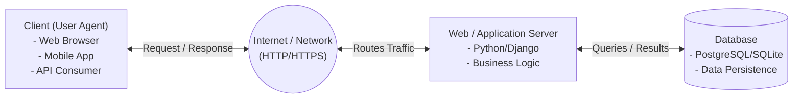
```mermaid
flowchart LR
    Client["Client (User Agent)<br/>- Web Browser<br/>- Mobile App<br/>- API Consumer"]
    Network(("Internet / Network<br/>(HTTP/HTTPS)"))
    Server["Web / Application Server<br/>- Python/Django<br/>- Business Logic"]
    DB[("Database<br/>- PostgreSQL/SQLite<br/>- Data Persistence")]

    Client <-->|Request / Response| Network
    Network <-->|Routes Traffic| Server
    Server <-->|Queries / Results| DB
```

### 1. The Client (Frontend / User Agent)

- **Definition**: Any software or hardware device that interacts with an end-user, captures input, and initiates communication by requesting resources.
- **Examples**: Web browsers (Chrome, Firefox, Safari), mobile applications (iOS/Android), command-line tools (`curl`, `httpie`), or automated scripts.
- **Core Responsibilities**:
  - Rendering user interfaces (HTML, CSS, JavaScript).
  - Capturing user actions (clicks, form submissions, keystrokes).
  - Validating inputs locally for immediate user feedback.
  - Formatting requests and sending them over the network.

[↑ Back to Table of Contents](#toc-1-the-client-frontend--user-agent)

---

### 2. The Server (Backend)

- **Definition**: A computer system or software daemon running continuously, listening on a specific network port, awaiting incoming client requests.
- **Tiers in a Web Server Stack**:
  - **Web Server (Reverse Proxy)**: Software like Nginx or Apache that receives incoming network requests, handles SSL termination, serves static assets (images, CSS), and forwards dynamic requests.
  - **WSGI / ASGI Gateway**: In Python, interfaces like Gunicorn or Uvicorn that bridge raw HTTP traffic from web servers into Python application code.
  - **Application Server**: The core business logic layer (e.g., Django, Flask, FastAPI).
  - **Database Server**: Persistent storage engines (PostgreSQL, MySQL, SQLite) managed via SQL or an ORM (Object-Relational Mapping).
- **Core Responsibilities**:
  - Enforcing security, user authentication, and authorization.
  - Executing business rules, calculations, and data processing.
  - Querying, mutating, and persisting state in databases.
  - Generating formatted responses (HTML web pages, JSON payloads, file downloads).

[↑ Back to Table of Contents](#toc-2-the-server-backend) | [Back to Section TOC](#toc-part-1-the-client-server-architecture)

---

## Part 2: The HTTP Request-Response Cycle

The web operates on an exchange known as the **Request-Response Cycle**. Communication is strictly client-initiated: a client asks for something, and the server computes and answers.

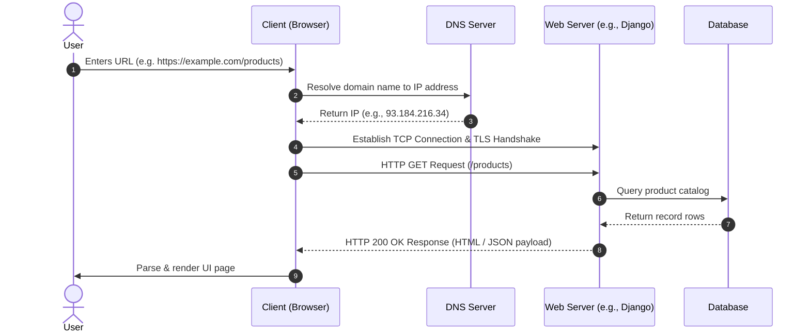
```mermaid
sequenceDiagram
    autonumber
    actor User
    participant Browser as Client (Browser)
    participant DNS as DNS Server
    participant Server as Web Server (e.g., Django)
    participant DB as Database

    User->>Browser: Enters URL (e.g. https://example.com/products)
    Browser->>DNS: Resolve domain name to IP address
    DNS-->>Browser: Return IP (e.g., 93.184.216.34)
    Browser->>Server: Establish TCP Connection & TLS Handshake
    Browser->>Server: HTTP GET Request (/products)
    Server->>DB: Query product catalog
    DB-->>Server: Return record rows
    Server-->>Browser: HTTP 200 OK Response (HTML / JSON payload)
    Browser->>User: Parse & render UI page
```

### Anatomy of an HTTP Request

When a client sends a request, it constructs a structured text message composed of:

1. **Request Line**:
   - **Method / Verb**: The action to perform (e.g., `GET`, `POST`).
   - **Target / Path**: The requested resource endpoint (e.g., `/products/details?id=42`).
   - **Protocol Version**: e.g., `HTTP/1.1` or `HTTP/2`.
2. **Request Headers**: Key-value metadata describing the client and payload:
   - `Host: example.com` (Target server hostname).
   - `User-Agent: Mozilla/5.0 ...` (Information about the client device and browser).
   - `Accept: text/html, application/json` (Preferred formats the client can understand).
   - `Authorization: Bearer <token>` or `Cookie: sessionid=xyz` (Authentication credentials).
3. **Blank Line (`\r\n`)**: Standard boundary separating headers from the body.
4. **Request Body (Optional)**: Data sent to the server (e.g., form fields in a `POST` request or JSON data in an API call).

[↑ Back to Table of Contents](#toc-anatomy-of-an-http-request)

---

### Anatomy of an HTTP Response

The server evaluates the request, executes required logic, and returns a structured response:

1. **Status Line**:
   - **Protocol Version**: e.g., `HTTP/1.1`.
   - **Status Code**: 3-digit numeric indicator (e.g., `200`, `404`, `500`).
   - **Reason Phrase**: Human-readable status description (e.g., `OK`, `Not Found`).
2. **Response Headers**: Metadata describing the response and server configuration:
   - `Content-Type: text/html; charset=utf-8` (MIME type telling the browser how to parse the body).
   - `Content-Length: 1024` (Size of the payload in bytes).
   - `Set-Cookie: sessionid=abc123; HttpOnly; Secure` (Directs client to store session state).
3. **Blank Line (`\r\n`)**: Boundary separating headers from the body.
4. **Response Body**: The actual payload (HTML document, JSON array, image binary, etc.).

[↑ Back to Table of Contents](#toc-anatomy-of-an-http-response) | [Back to Section TOC](#toc-part-2-the-http-request-response-cycle)

---

## Part 3: HTTP and HTTPS Protocols

### 1. HTTP (HyperText Transfer Protocol)

HTTP is an **application-layer protocol** defined by the IETF that serves as the foundation for data communication on the World Wide Web.

#### Key Characteristics of HTTP:

- **Stateless**: The server does not retain memory of previous interactions between consecutive requests. Every request is treated as completely independent.
  > [!NOTE]
  > **How is state maintained?** To simulate state (such as login sessions or e-commerce shopping carts), web applications use **Cookies**, **Sessions**, and **Tokens** (JWT) passed within request/response headers.
- **Connectionless / Independent**: After the request-response transaction completes, the direct connection can be closed (though modern `HTTP/1.1 Keep-Alive` and `HTTP/2` multiplexing keep TCP sockets open to transmit multiple requests efficiently).
- **Media Independent**: Any type of data (text, images, video, JSON, XML) can be transferred as long as both client and server specify the correct MIME type in the `Content-Type` header.
- **Default Port**: Port **`80`**.

[↑ Back to Table of Contents](#toc-1-http-hypertext-transfer-protocol)

---

### 2. Common HTTP Methods (Verbs)

HTTP defines standard methods indicating the desired action to be performed on a given resource:

| Method        | Idempotent? | Safe? | Typical Purpose                                                                            | Has Body? |
| :------------ | :---------: | :---: | :----------------------------------------------------------------------------------------- | :-------: |
| **`GET`**     |     Yes     |  Yes  | Retrieve representation of a resource. Query data is sent via URL parameters.              |    No     |
| **`POST`**    |     No      |  No   | Submit data to be processed (e.g., form submission, creating a new database record).       |    Yes    |
| **`PUT`**     |     Yes     |  No   | Completely replace an existing resource with the submitted payload.                        |    Yes    |
| **`PATCH`**   |     No      |  No   | Apply partial modifications to an existing resource.                                       |    Yes    |
| **`DELETE`**  |     Yes     |  No   | Remove the specified resource.                                                             | Optional  |
| **`HEAD`**    |     Yes     |  Yes  | Identical to `GET`, but requests headers only (without the response body).                 |    No     |
| **`OPTIONS`** |     Yes     |  Yes  | Queries the communication options/methods supported by the target server (CORS preflight). |    No     |

> [!TIP]
>
> - **Safe**: Methods that do not modify server state (read-only operations like `GET` and `HEAD`).
> - **Idempotent**: Making multiple identical requests produces the exact same server state as making a single request (e.g., `GET`, `PUT`, `DELETE`).

[↑ Back to Table of Contents](#toc-2-common-http-methods-verbs)

---

### 3. HTTP Status Codes

Status codes are grouped into five distinct classes based on the first digit:

- **`1xx` Informational**: Request received, continuing process (e.g., `101 Switching Protocols`).
- **`2xx` Success**: Action successfully received, understood, and accepted:
  - `200 OK`: Standard response for successful requests.
  - `201 Created`: Request succeeded and a new resource was created (common with `POST`).
  - `204 No Content`: Request succeeded, but no payload is returned (common with `DELETE`).
- **`3xx` Redirection**: Further action required to complete the request:
  - `301 Moved Permanently`: Resource has permanently moved to a new URL.
  - `302 Found` (Temporary Redirect): Resource temporarily resides under a different URI.
  - `304 Not Modified`: Cached version on client is still fresh and valid.
- **`4xx` Client Error**: Request contains bad syntax or cannot be fulfilled:
  - `400 Bad Request`: Server cannot process request due to client syntax error.
  - `401 Unauthorized`: Authentication is required and has failed or is missing.
  - `403 Forbidden`: Server understood request, but refuses to authorize access.
  - `404 Not Found`: Requested resource cannot be located.
  - `405 Method Not Allowed`: HTTP verb used is not permitted for this endpoint.
- **`5xx` Server Error**: Server failed to fulfill an apparently valid request:
  - `500 Internal Server Error`: Generic unhandled runtime exception on the server.
  - `502 Bad Gateway`: Server received an invalid response from an upstream server.
  - `503 Service Unavailable`: Server is currently overloaded or down for maintenance.
  - `504 Gateway Timeout`: Upstream server failed to respond within designated timeout window.

[↑ Back to Table of Contents](#toc-3-http-status-codes)

---

### 4. HTTPS (HTTP Secure)

**HTTPS** is HTTP layered on top of the **TLS (Transport Layer Security)** or legacy **SSL (Secure Sockets Layer)** encryption protocol.

- **Default Port**: Port **`443`**.
- **Why Plain HTTP is Vulnerable**: Plain HTTP sends all data as unencrypted cleartext across public networks. Anyone eavesdropping (via Man-in-the-Middle attacks, packet sniffers, or compromised Wi-Fi networks) can inspect passwords, session cookies, and credit card numbers.

#### The Three Security Pillars of HTTPS:

1. **Confidentiality (Encryption)**: Data exchanged between client and server is encrypted using asymmetric and symmetric cryptography. Eavesdroppers cannot read intercepted packets.
2. **Integrity (Data Tamper-Proofing)**: Network packets include cryptographic message authentication codes (MACs). Data cannot be modified, injected, or corrupted in transit without detection.
3. **Authentication (Identity Verification)**: The server presents a digital certificate issued by a trusted **Certificate Authority (CA)**, proving to the browser that it is communicating with the authentic domain and not an imposter.

[↑ Back to Table of Contents](#toc-4-https-http-secure) | [Back to Section TOC](#toc-part-3-http-and-https-protocols)

---

## Part 4: Architectural Design Patterns: MVC & MVT

When web applications grow beyond a single script, mixing database queries, business calculations, and HTML layout in one place results in **"spaghetti code"** that is fragile and difficult to test.

Software architecture uses the principle of **Separation of Concerns (SoC)** to decouple an application into distinct layers.

---

### 1. The MVC (Model - View - Controller) Pattern

MVC is the classic architectural pattern adopted by web frameworks such as Ruby on Rails, Spring MVC, Express (Node.js), and ASP.NET.

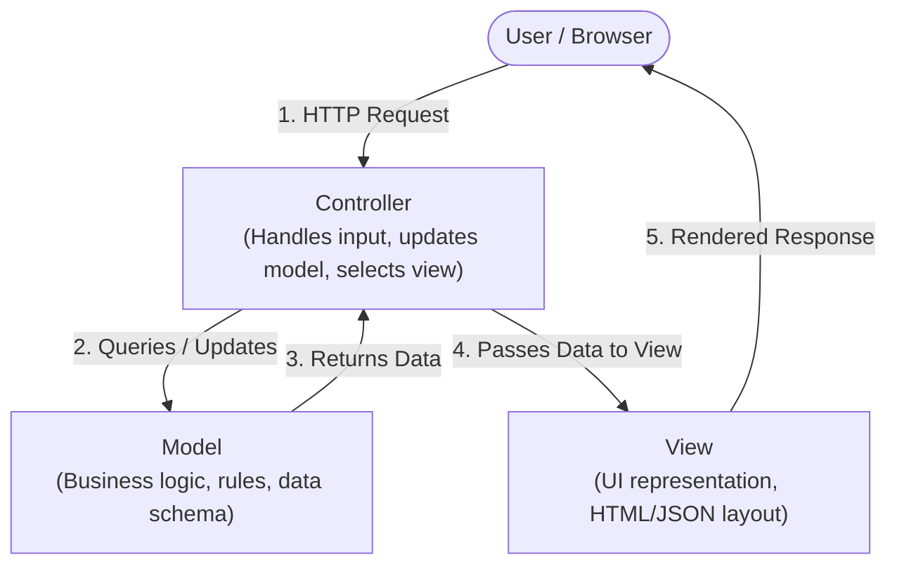
```mermaid
flowchart TD
    User([User / Browser])
    Controller["Controller<br/>(Handles input, updates model, selects view)"]
    Model["Model<br/>(Business logic, rules, data schema)"]
    View["View<br/>(UI representation, HTML/JSON layout)"]

    User -->|1. HTTP Request| Controller
    Controller -->|2. Queries / Updates| Model
    Model -->|3. Returns Data| Controller
    Controller -->|4. Passes Data to View| View
    View -->|5. Rendered Response| User
```

#### The Three MVC Components:

1. **Model (M)**:
   - Represents the **data structures**, schema, validation rules, and business logic.
   - Directly interfaces with the database (often via SQL or an ORM).
   - Does not know anything about how data will be displayed to the end user.
2. **View (V)**:
   - Responsible for **presentation and rendering**.
   - Takes processed data provided by the Controller and formats it into the final output (HTML markup, CSS, JSON, XML).
   - Should contain minimal to no business logic.
3. **Controller (C)**:
   - The **orchestrator / mediator**.
   - Intercepts incoming user HTTP requests from the router.
   - Coordinates with the Model to fetch or mutate data based on user input.
   - Selects the appropriate View, passes the data into it, and returns the response to the client.

[↑ Back to Table of Contents](#toc-1-the-mvc-model---view---controller-pattern)

---

### 2. The MVT (Model - View - Template) Pattern

**MVT** is a specialized variation of MVC popularized by the **Django** web framework. In Django, the separation of responsibilities is slightly shifted in terminology:

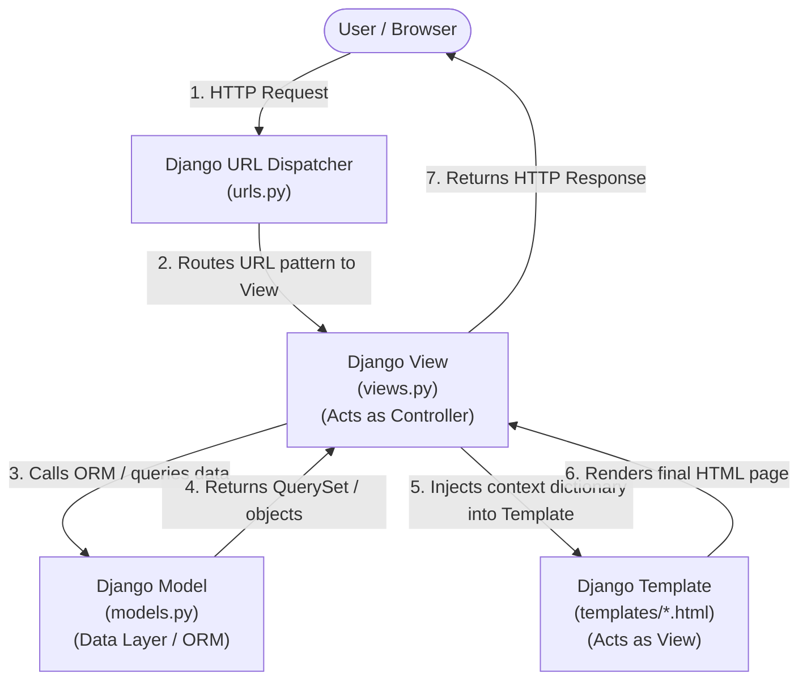
```mermaid
flowchart TD
    User([User / Browser])
    Dispatcher["Django URL Dispatcher<br/>(urls.py)"]
    View["Django View<br/>(views.py)<br/>(Acts as Controller)"]
    Model["Django Model<br/>(models.py)<br/>(Data Layer / ORM)"]
    Template["Django Template<br/>(templates/*.html)<br/>(Acts as View)"]

    User -->|1. HTTP Request| Dispatcher
    Dispatcher -->|2. Routes URL pattern to View| View
    View -->|3. Calls ORM / queries data| Model
    Model -->|4. Returns QuerySet / objects| View
    View -->|5. Injects context dictionary into Template| Template
    Template -->|6. Renders final HTML page| View
    View -->|7. Returns HTTP Response| User
```

#### The Three MVT Components:

1. **Model (M)**:
   - Equivalent to the Model in MVC.
   - Defined in `models.py`.
   - Maps Python classes to database tables using the Django ORM.
   - Handles database schema, fields, relationships, and data validations.
2. **View (V)**:
   - **Important difference**: In Django, the View fulfills the role of the **Controller** in traditional MVC.
   - Defined in `views.py`.
   - Accepts an incoming `HttpRequest` object.
   - Executes business logic, interacts with Django Models to fetch/save data, and prepares a context dictionary.
   - Chooses which Template to render and returns an `HttpResponse` (or `JsonResponse`).
3. **Template (T)**:
   - Corresponds to the **View** in traditional MVC.
   - Stored in template files (e.g., `index.html`, `details.html`).
   - An HTML file enriched with **Django Template Language (DTL)** tags and filters (e.g., `{{ variable }}`, ``, ``).
   - Dynamically renders data passed from the View into the final HTML document presented to the user.

> [!NOTE]
> **Who is the Controller in Django?**
> In Django's MVT architecture, the role of the **Controller** is shared between:
>
> 1. The **Django Framework itself & URL Dispatcher (`urls.py`)**: Directs the incoming HTTP request to the designated view function.
> 2. The **View function/class (`views.py`)**: Intercepts input, controls data flow, and coordinates between Models and Templates.

[↑ Back to Table of Contents](#toc-2-the-mvt-model---view---template-pattern)

---

### 3. Comparing MVC and MVT

| Feature / Aspect                   | Traditional MVC                                                            | Django's MVT                                                                         |
| :--------------------------------- | :------------------------------------------------------------------------- | :----------------------------------------------------------------------------------- |
| **Data & Persistence Layer**       | **Model**: Classes, database schema, and queries.                          | **Model** (`models.py`): Python ORM classes and database interactions.               |
| **Presentation / Layout Layer**    | **View**: Generates UI layout and templates.                               | **Template** (`.html` files): HTML with Django Template Language (DTL).              |
| **Application Logic / Controller** | **Controller**: Handles user requests, interacts with Model, updates View. | **View** (`views.py`): Receives `request`, queries `models`, and renders `template`. |
| **Routing / Dispatch Mechanism**   | Router / Front Controller.                                                 | URL Dispatcher (`urls.py`) + Django Core Engine.                                     |
| **Notable Frameworks**             | Ruby on Rails, Express, Laravel, ASP.NET Core.                             | Django.                                                                              |

[↑ Back to Table of Contents](#toc-3-comparing-mvc-and-mvt) | [Back to Section TOC](#toc-part-4-architectural-design-patterns-mvc--mvt)

---

## Part 5: Introduction to Flask & Comparison with Django

Python has two premier web frameworks that dominate industry adoption: **Flask** and **Django**. Both are battle-tested, production-ready, and capable of handling millions of requests, but they embody fundamentally contrasting design philosophies.

### 1. What is Flask?

**Flask** is a lightweight **WSGI (Web Server Gateway Interface) micro-framework** for Python. It was created by Armin Ronacher and is maintained by the Pallets Projects team.

#### Key Principles of Flask:

- **Micro-Framework**: "Micro" does not mean your entire application must fit into a single file, nor does it mean Flask lacks functionality. Rather, it means Flask's core is intentionally **minimal, unopinionated, and extensible**.
- **Under the Hood**: Flask is built directly upon two foundational libraries:
  1. **Werkzeug**: A comprehensive WSGI utility toolkit that handles HTTP request parsing, URL routing, response serialization, cookie handling, and an interactive local debugging server.
  2. **Jinja2**: A fast, sandboxed, and expressive Python templating engine that cleanly separates presentation markup (HTML) from backend Python code.
- **No Imposed Architecture**: Flask provides routing and template rendering, but it does **not** make decisions for you regarding:
  - Which database to use (relational SQL vs. NoSQL document stores).
  - Which ORM to use (SQLAlchemy, Peewee, Tortoise, or raw SQL queries).
  - How to structure folders (single script vs. blueprint-based modular packages).
  - How to validate forms or handle user authentication.
    You select and plug in only the libraries you actually need.

[↑ Back to Table of Contents](#toc-1-what-is-flask)

---

### 2. Comparing Flask and Django

Understanding when to reach for Flask versus Django is a fundamental skill in Python web development:

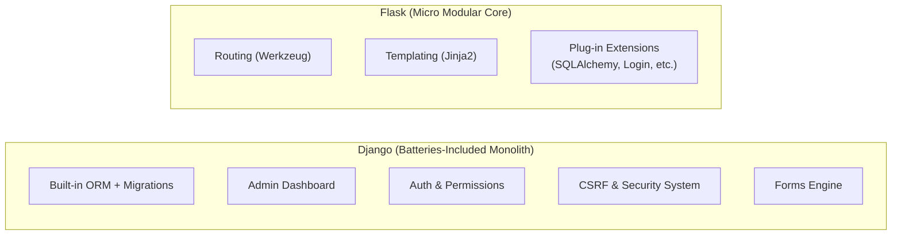
```mermaid
flowchart LR
    subgraph Django["Django (Batteries-Included Monolith)"]
        D1["Built-in ORM + Migrations"]
        D2["Admin Dashboard"]
        D3["Auth & Permissions"]
        D4["CSRF & Security System"]
        D5["Forms Engine"]
    end

    subgraph Flask["Flask (Micro Modular Core)"]
        F1["Routing (Werkzeug)"]
        F2["Templating (Jinja2)"]
        F3["Plug-in Extensions<br/>(SQLAlchemy, Login, etc.)"]
    end
```

#### Detailed Comparison Matrix:

| Feature / Aspect           | Flask                                                                         | Django                                                                      |
| :------------------------- | :---------------------------------------------------------------------------- | :-------------------------------------------------------------------------- |
| **Framework Type**         | Micro-framework (modular & minimalist)                                        | Full-stack / "Batteries-included" framework                                 |
| **Design Philosophy**      | Unopinionated; developer chooses components freely                            | Opinionated; provides "The Django Way" for everything                       |
| **Project Structure**      | Completely flexible (from 1 file to multi-package blueprints)                 | Rigid, standardized structure (`manage.py`, `settings.py`, `urls.py`, apps) |
| **Database & ORM**         | None built-in (frequently paired with `SQLAlchemy` or raw `sqlite3`)          | Robust built-in Django ORM with automatic schema migrations                 |
| **Admin Interface**        | None included (can add community packages like `Flask-Admin`)                 | Production-ready, auto-generated administration portal out-of-the-box       |
| **Authentication & Forms** | Handled via third-party extensions (`Flask-Login`, `Flask-WTF`)               | Built-in authentication, session management, and `django.forms`             |
| **Routing Pattern**        | Function decorators directly on view functions: `@app.route("/")`             | Centralized URL dispatcher (`urls.py`) mapped to view functions/classes     |
| **Template Engine**        | **Jinja2**                                                                    | **Django Template Language (DTL)** (supports Jinja2 as well)                |
| **Learning Curve**         | Gentle, low barrier to entry; excellent for learning web fundamentals         | Steeper initial learning curve due to large breadth of built-in tooling     |
| **Ideal Use Cases**        | Microservices, RESTful APIs, Single-Page App backends, small/medium utilities | Large content portals, e-commerce, enterprise backends, rapid MVPs          |

[↑ Back to Table of Contents](#toc-2-comparing-flask-and-django) | [Back to Section TOC](#toc-part-5-introduction-to-flask--comparison-with-django)

---

## Part 6: Python Virtual Environments (`venv`)

Before writing a single line of web application code, professional Python development requires setting up an **isolated virtual environment**.

### 1. Why are Virtual Environments Essential?

When you run `pip install <package>` without a virtual environment, `pip` installs libraries into your **system-wide Python** directory. This creates severe problems:

1. **Dependency Conflicts ("Dependency Hell")**:
   - Suppose Project A relies on `Flask==2.0` (which uses older dependencies).
   - Suppose Project B relies on `Flask==3.1` (which introduces breaking changes).
   - In a global environment, installing Flask for Project B will overwrite and break Project A.
2. **Operating System Protection**:
   - Many modern operating systems (macOS, Ubuntu, Fedora) use system Python for critical OS maintenance scripts.
   - Installing or upgrading system-wide packages can alter standard libraries, destabilizing OS-level utilities.
3. **Reproducibility & Deployment (`requirements.txt`)**:
   - A virtual environment lets you lock and export the _exact_ dependencies required for your project using `pip freeze > requirements.txt`.
   - Team members and production servers can then replicate the environment effortlessly using `pip install -r requirements.txt`.
4. **Clean Disposal**:
   - If a project is complete or an experiment goes wrong, deleting the virtual environment folder (`rm -rf .venv`) cleanly removes every installed package without leaving residue.

[↑ Back to Table of Contents](#toc-1-why-are-virtual-environments-essential)

---

### 2. Managing Virtual Environments with `venv`

Python 3 includes the standard library module `venv` out of the box.

#### Step 1: Create the Virtual Environment

Navigate to your project folder and run:

```bash
# Syntax: python3 -m venv <environment_name>
python3 -m venv .venv
```

> [!TIP]
> Naming the folder `.venv` (with a leading dot) keeps it hidden in Unix file managers and is recognized automatically by editors like VS Code and PyCharm.

#### Step 2: Activate the Virtual Environment

Activation reconfigures your shell's `PATH` variable so that typing `python` and `pip` points to the isolated binaries inside `.venv/`:

- **macOS / Linux (zsh or bash)**:
  ```bash
  source .venv/bin/activate
  ```
- **Windows (Command Prompt / CMD)**:
  ```cmd
  .venv\Scripts\activate.bat
  ```
- **Windows (PowerShell)**:
  ```powershell
  .venv\Scripts\Activate.ps1
  ```
  _(If PowerShell gives an execution policy error, run `Set-ExecutionPolicy -Scope Process -ExecutionPolicy RemoteSigned` first)._

#### Step 3: Verify Activation

Once activated, your terminal prompt will display the environment name in parentheses:

```bash
(.venv) user@machine:~/my_project$
```

You can also verify that `python` and `pip` point to `.venv`:

```bash
# On macOS / Linux:
which python
# Output: /path/to/my_project/.venv/bin/python

# On Windows:
where python
# Output: C:\path\to\my_project\.venv\Scripts\python.exe
```

#### Step 4: Deactivate

When you are done working on the project, exit the virtual environment by running:

```bash
deactivate
```

[↑ Back to Table of Contents](#toc-2-managing-virtual-environments-with-venv) | [Back to Section TOC](#toc-part-6-python-virtual-environments-venv)

---

## Part 7: Flask Project Setup & First HTML Web Page

Now that the environment fundamentals are clear, let's configure a complete Flask project from scratch and serve an HTML response when a user visits the homepage (`/`).

### 1. Recommended Project Directory Structure

Organizing files predictably from Day 1 ensures your application can scale cleanly:

```text
flask_intro/
├── .venv/                  # Virtual environment (never commit to git!)
├── templates/              # Jinja HTML template files
│   └── index.html          # Homepage HTML template (styled via Bootstrap CDN)
├── app.py                  # Main Flask application entrypoint & routes
├── requirements.txt        # Locked project dependencies
└── .gitignore              # Specifies files to exclude from version control
```

[↑ Back to Table of Contents](#toc-1-recommended-project-directory-structure)

---

### 2. Step-by-Step Setup Walkthrough

#### Step A: Create Project Directory & Virtual Environment

Open your terminal and run:

```bash
# 1. Create and navigate to the project directory
mkdir flask_intro
cd flask_intro

# 2. Create the virtual environment
python3 -m venv .venv

# 3. Activate the virtual environment
source .venv/bin/activate    # On Windows: .venv\Scripts\activate
```

#### Step B: Install Flask

With the virtual environment activated, install the latest version of Flask:

```bash
pip install flask
```

#### Step C: Lock Dependencies in `requirements.txt`

```bash
pip freeze > requirements.txt
```

If you inspect `requirements.txt`, you will see Flask along with its core dependencies (`Werkzeug`, `Jinja2`, `click`, `itsdangerous`, `blinker`).

#### Step D: Create a `.gitignore` File

Ensure the virtual environment and cached bytecode are never tracked in version control:

```text
# .gitignore
.venv/
__pycache__/
*.pyc
.env
.DS_Store
```

[↑ Back to Table of Contents](#toc-2-step-by-step-setup-walkthrough)

---

### 3. Writing the Code

#### File 1: The Application Backend (`app.py`)

Create `app.py` in the root of `flask_intro/`:

```python
"""
app.py - Main Flask Application Entrypoint
"""

from datetime import datetime
from flask import Flask, render_template

# 1. Initialize the Flask application instance
# '__name__' tells Flask where to locate templates, static assets, and resources.
app = Flask(__name__)


# 2. Define the Homepage Route using the '@app.route' decorator
# This maps HTTP GET requests targeting the root URL ("/") to the 'home' view function.
@app.route("/")
def home():
    """
    View function for the homepage.
    Gathers context data and renders the HTML template.
    """
    # What does the variable 'context' represent?
    # In web development and template rendering engines (like Jinja2), "context" refers to a
    # dictionary (key-value mapping) that holds all the dynamic data, variables, or objects
    # created on the server that need to be passed to the frontend HTML template.
    # When Jinja2 parses the template, it looks up variable names (e.g., {{ title }}, {{ server_time }})
    # inside this context dictionary and replaces the placeholders with their actual values.
    context = {
        "title": "Welcome to Flask!",
        "heading": "Web Architecture in Action",
        "description": "This dynamic webpage is served using Python, Flask, and the Jinja2 template engine.",
        "server_time": datetime.now().strftime("%A, %B %d, %Y - %H:%M:%S"),
        "topics": [
            "Client-Server Communication",
            "HTTP Request / Response Cycle",
            "Separation of Concerns (MVC / MVT)",
            "Jinja2 Template Interpolation"
        ]
    }

    # render_template searches the 'templates/' directory for 'index.html'
    # and passes the context dictionary keyword arguments into it.
    return render_template("index.html", **context)


# 3. Application Execution Block
if __name__ == "__main__":
    # debug=True enables:
    # 1. Auto-reloader: Restarts the development server automatically upon code edits.
    # 2. Interactive Debugger: Displays rich traceback exceptions in the browser.
    # NOTE: Never run 'debug=True' in production!
    app.run(host="127.0.0.1", port=5000, debug=True)
```

---

#### File 2: The HTML Template (`templates/index.html`)

Create a folder named `templates` and inside it create `index.html`:

```html
<!DOCTYPE html>
<html lang="en">
  <head>
    <meta charset="UTF-8" />
    <meta name="viewport" content="width=device-width, initial-scale=1.0" />
    <title>{{ title }}</title>
    <!-- Bootstrap 5 CSS via CDN -->
    <link
      href="https://cdn.jsdelivr.net/npm/bootstrap@5.3.3/dist/css/bootstrap.min.css"
      rel="stylesheet"
    />
  </head>
  <body class="bg-light">
    <div class="container py-5">
      <div class="row justify-content-center">
        <div class="col-md-8">
          <div class="card shadow-sm">
            <div class="card-body p-4">
              <!-- Jinja2 Variable Interpolation -->
              <h1 class="h3 text-primary mb-2">{{ heading }}</h1>
              <p class="text-muted small mb-3">
                Server Rendered at: <strong>{{ server_time }}</strong>
              </p>

              <p class="lead fs-6">{{ description }}</p>

              <h5 class="mt-4 mb-3">Core Concepts Mastered Today:</h5>
              <ul class="list-group mb-4">
                <!-- Jinja2 Loop -->
                
                <li class="list-group-item">{{ topic }}</li>
                
              </ul>

              <div class="text-center text-secondary small pt-3 border-top">
                Flask 3.x &bull; CDAC Python Module &bull; Day 9
              </div>
            </div>
          </div>
        </div>
      </div>
    </div>
  </body>
</html>
```

[↑ Back to Table of Contents](#toc-3-writing-the-code)

---

### 4. Running and Testing the Application

#### Step 1: Launch the Development Server

From within the `flask_intro/` directory (with `.venv` activated), execute:

```bash
python app.py
```

_(Alternatively, you can run `flask --app app run --debug`)_.

You will see the startup banner in your terminal:

```text
 * Serving Flask app 'app'
 * Debug mode: on
WARNING: This is a development server. Do not use it in a production deployment.
 * Running on http://127.0.0.1:5000
Press CTRL+C to quit
 * Restarting with stat
 * Debugger is active!
 * Debugger PIN: 123-456-789
```

#### Step 2: Open in Your Browser

Open your web browser and visit:

```text
http://127.0.0.1:5000
```

or

```text
http://localhost:5000
```

#### Step 3: Understanding the Execution Flow

What happens behind the scenes during this interaction?

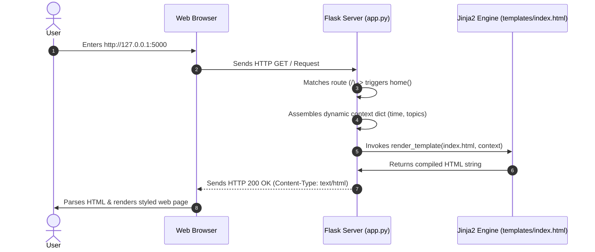
```mermaid
sequenceDiagram
    autonumber
    actor User
    participant Browser as Web Browser
    participant Flask as Flask Server (app.py)
    participant Jinja as Jinja2 Engine (templates/index.html)

    User->>Browser: Enters http://127.0.0.1:5000
    Browser->>Flask: Sends HTTP GET / Request
    Flask->>Flask: Matches route (/) -> triggers home()
    Flask->>Flask: Assembles dynamic context dict (time, topics)
    Flask->>Jinja: Invokes render_template(index.html, context)
    Jinja->>Flask: Returns compiled HTML string
    Flask-->>Browser: Sends HTTP 200 OK (Content-Type: text/html)
    Browser->>User: Parses HTML & renders styled web page
```

Notice the corresponding terminal log emitted by Flask:

```text
127.0.0.1 - - [05/Sep/2026 10:00:01] "GET / HTTP/1.1" 200 -
```

This single log entry confirms:

- **Client IP**: `127.0.0.1` (localhost).
- **HTTP Request**: `GET / HTTP/1.1`.
- **HTTP Status Code**: `200` (OK / Success).

[↑ Back to Table of Contents](#toc-4-running-and-testing-the-application) | [Back to Section TOC](#toc-part-7-flask-project-setup--first-html-web-page)

---

## Part 8: Practical Use Case: Book Management with Flask & SQLite

Now let's apply everything we have learned to build a functional data-driven web application: a **Book Management System**.

The application allows users to:

1. **View all books** stored in a persistent SQLite database.
2. **Add a new book** (Title and Author) through an HTML web form.

We will maintain the data using Python's built-in `sqlite3` module without external ORM dependencies, keeping the implementation simple, fast, and focused on core Python and Flask mechanics. The interface uses Bootstrap 5 via CDN for clean styling without writing any custom CSS.

---

### 1. Application Flow & Architecture

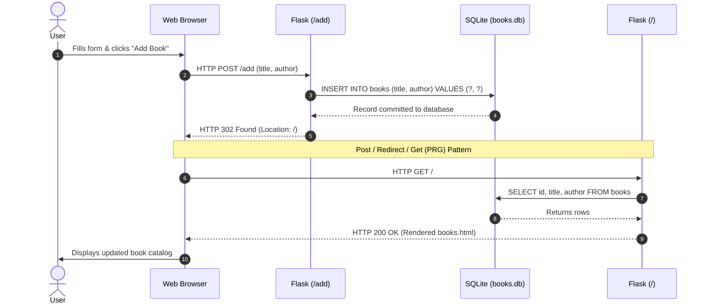
```mermaid
sequenceDiagram
    autonumber
    actor User
    participant Browser as Web Browser
    participant FlaskAdd as Flask (/add)
    participant DB as SQLite (books.db)
    participant FlaskHome as Flask (/)

    User->>Browser: Fills form & clicks "Add Book"
    Browser->>FlaskAdd: HTTP POST /add (title, author)
    FlaskAdd->>DB: INSERT INTO books (title, author) VALUES (?, ?)
    DB-->>FlaskAdd: Record committed to database
    FlaskAdd-->>Browser: HTTP 302 Found (Location: /)
    Note over Browser,FlaskHome: Post / Redirect / Get (PRG) Pattern
    Browser->>FlaskHome: HTTP GET /
    FlaskHome->>DB: SELECT id, title, author FROM books
    DB-->>FlaskHome: Returns rows
    FlaskHome-->>Browser: HTTP 200 OK (Rendered books.html)
    Browser->>User: Displays updated book catalog
```

[↑ Back to Table of Contents](#toc-1-application-flow--architecture)

---

### 2. Project Directory Structure

```text
flask_books/
├── .venv/                  # Virtual environment
├── templates/
│   └── books.html          # HTML template with Bootstrap 5 (Form + Table)
├── app.py                  # Database connection, queries, and route handlers
├── books.db                # SQLite database file (created automatically on startup)
├── requirements.txt        # Locked dependencies (flask)
└── .gitignore              # Ignores .venv/, books.db, __pycache__/
```

[↑ Back to Table of Contents](#toc-2-project-directory-structure)

---

### 3. Application Code: `app.py`

Create `app.py`:

```python
"""
app.py - Book Management Web Application using Flask and SQLite3
"""

import sqlite3
from flask import Flask, render_template, request, redirect, url_for

# 1. Initialize the Flask application
app = Flask(__name__)
DATABASE = "books.db"


# 2. Database Connection Helper
def get_db_connection():
    """
    Creates and returns a connection to the SQLite database.
    Setting row_factory to sqlite3.Row allows accessing columns
    by name like a Python dictionary: row["title"].
    """
    conn = sqlite3.connect(DATABASE)
    conn.row_factory = sqlite3.Row
    return conn


# 3. Database Initialization
def init_db():
    """
    Initializes the database schema by creating the 'books' table
    if it does not already exist.
    """
    with get_db_connection() as conn:
        conn.execute("""
            CREATE TABLE IF NOT EXISTS books (
                id INTEGER PRIMARY KEY AUTOINCREMENT,
                title TEXT NOT NULL,
                author TEXT NOT NULL
            );
        """)
        conn.commit()


# 4. Route 1: View All Books (HTTP GET)
@app.route("/")
def index():
    """
    Fetches all books from SQLite and renders them in the template.
    """
    conn = get_db_connection()
    # Query all records ordered by latest added first
    books = conn.execute(
        "SELECT id, title, author FROM books ORDER BY id DESC"
    ).fetchall()
    conn.close()

    # Pass the 'books' records to the template via context
    return render_template("books.html", books=books)


# 5. Route 2: Add a Book (HTTP POST)
@app.route("/add", methods=["POST"])
def add_book():
    """
    Extracts form inputs from request.form and inserts a new book record.
    Redirects back to the index page upon completion (PRG Pattern).
    """
    # Extract submitted form data safely using .get()
    title = request.form.get("title", "").strip()
    author = request.form.get("author", "").strip()

    # Validate that neither field is empty
    if title and author:
        conn = get_db_connection()
        # Use parameterized query '?' to guard against SQL Injection
        conn.execute(
            "INSERT INTO books (title, author) VALUES (?, ?)",
            (title, author)
        )
        conn.commit()
        conn.close()

    # Redirect client browser to the homepage view function
    return redirect(url_for("index"))


# 6. Application Runner
if __name__ == "__main__":
    # Ensure the database table exists before handling web requests
    init_db()
    app.run(host="127.0.0.1", port=5000, debug=True)
```

[↑ Back to Table of Contents](#toc-3-application-code-apppy)

---

### 4. Template: `templates/books.html`

Create `templates/books.html`:

```html
<!DOCTYPE html>
<html lang="en">
  <head>
    <meta charset="UTF-8" />
    <meta name="viewport" content="width=device-width, initial-scale=1.0" />
    <title>Book Manager - Flask & SQLite</title>
    <!-- Bootstrap 5 CSS via CDN -->
    <link
      href="https://cdn.jsdelivr.net/npm/bootstrap@5.3.3/dist/css/bootstrap.min.css"
      rel="stylesheet"
    />
  </head>
  <body class="bg-light">
    <div class="container py-5">
      <div class="row justify-content-center">
        <div class="col-md-8">
          <h1 class="h3 mb-4 text-center text-primary">
            Book Management System
          </h1>

          <!-- Section 1: Add Book Form -->
          <div class="card shadow-sm mb-4">
            <div class="card-header bg-white">
              <h5 class="card-title mb-0">Add a New Book</h5>
            </div>
            <div class="card-body">
              <!-- Submits an HTTP POST request to /add -->
              <form action="/add" method="POST">
                <div class="mb-3">
                  <label for="title" class="form-label">Book Title</label>
                  <input
                    type="text"
                    class="form-control"
                    id="title"
                    name="title"
                    placeholder="e.g., Fluent Python"
                    required
                  />
                </div>
                <div class="mb-3">
                  <label for="author" class="form-label">Author Name</label>
                  <input
                    type="text"
                    class="form-control"
                    id="author"
                    name="author"
                    placeholder="e.g., Luciano Ramalho"
                    required
                  />
                </div>
                <button type="submit" class="btn btn-primary w-100">
                  Add Book
                </button>
              </form>
            </div>
          </div>

          <!-- Section 2: View All Books Table -->
          <div class="card shadow-sm">
            <div
              class="card-header bg-white d-flex justify-content-between align-items-center"
            >
              <h5 class="card-title mb-0">Book Catalog</h5>
              <!-- Jinja2 Filter: |length counts items in the list -->
              <span class="badge bg-secondary"
                >{{ books|length }} books listed</span
              >
            </div>
            <div class="card-body p-0">
              <!-- Jinja2 Conditional: check if books list has records -->
              
              <table class="table table-striped table-hover mb-0">
                <thead class="table-light">
                  <tr>
                    <th scope="col" style="width: 15%;">ID</th>
                    <th scope="col" style="width: 50%;">Title</th>
                    <th scope="col" style="width: 35%;">Author</th>
                  </tr>
                </thead>
                <tbody>
                  <!-- Jinja2 Loop: iterate through every row -->
                  
                  <tr>
                    <td>#{{ book["id"] }}</td>
                    <td><strong>{{ book["title"] }}</strong></td>
                    <td>{{ book["author"] }}</td>
                  </tr>
                  
                </tbody>
              </table>
              
              <div class="p-4 text-center text-muted">
                No books found in the database. Add your first book above!
              </div>
              
            </div>
          </div>

          <div class="text-center text-secondary small mt-4">
            Flask + SQLite3 &bull; CDAC Python Module &bull; Day 9
          </div>
        </div>
      </div>
    </div>
  </body>
</html>
```

[↑ Back to Table of Contents](#toc-4-template-templatesbookshtml)

---

### 5. Detailed Explanations of Key APIs & Methods Used

Understanding the exact mechanics behind each method distinguishes a professional Python developer from someone copying snippets:

#### A. Database Methods (`sqlite3`)

1. **`sqlite3.connect(DATABASE)`**:
   - Opens a file connection to the SQLite database file (`books.db`).
   - If the file does not exist on disk, SQLite automatically creates it.
2. **`conn.row_factory = sqlite3.Row`**:
   - **Why this is critical**: By default, `sqlite3` cursor queries return standard Python tuples: `(1, 'Fluent Python', 'Luciano Ramalho')`. In templates, you would be forced to write `{{ book[1] }}` which is unreadable and error-prone.
   - `sqlite3.Row` wraps each row so it behaves both as a tuple and as a **case-insensitive dictionary**. In Python and Jinja, you can access columns by their exact column name: `book["title"]` and `book["author"]`.
3. **Parameterized Queries (`?` Placeholders)**:
   - Notice line: `conn.execute("INSERT INTO books (title, author) VALUES (?, ?)", (title, author))`
   - **Security Rule**: Never construct SQL queries using f-strings or string concatenation:
     ```python
     # NEVER DO THIS: Critical SQL Injection Vulnerability!
     conn.execute(f"INSERT INTO books VALUES ('{title}', '{author}')")
     ```
   - Passing parameters as a tuple via `(title, author)` lets the SQLite driver escape and sanitize the values, preventing SQL injection attacks.
4. **`conn.commit()` & `conn.close()`**:
   - `conn.commit()`: Flushes uncommitted in-memory SQL mutations to disk.
   - `conn.close()`: Closes the OS file descriptor handle to prevent file locking and memory leaks.

---

#### B. Flask Routing & HTTP Verb Methods

1. **`@app.route("/", methods=["GET"])`**:
   - When `methods` is omitted, Flask defaults to `["GET"]`.
   - Used for safe, idempotent read-only queries.
2. **`@app.route("/add", methods=["POST"])`**:
   - Restricts `/add` exclusively to HTTP `POST` requests.
   - If someone tries to access `http://127.0.0.1:5000/add` directly in their browser URL bar (which sends a `GET` request), Flask automatically blocks it and responds with `HTTP 405 Method Not Allowed`.

---

#### C. Request Processing (`request.form`)

1. **The `request` Context-Local Object**:
   - Flask makes the incoming HTTP request accessible via `from flask import request`.
   - It inspects headers, query strings, and body payloads for the currently running thread/context.
2. **`request.form`**:
   - A dictionary-like `ImmutableMultiDict` containing all parsed key-value pairs submitted by an HTML form with `enctype="application/x-www-form-urlencoded"`.
   - The keys match the `name="..."` attributes in HTML: `<input name="title">` $\rightarrow$ `request.form["title"]`.
3. **`request.form.get("title", "")`**:
   - Using `.get("key")` is safer than `request.form["key"]`. If a key is missing, `request.form["key"]` raises a `KeyError` resulting in a `400 Bad Request` crash. `.get()` returns `None` (or a fallback default), allowing graceful validation.

---

#### D. Response Redirection & The PRG Pattern

1. **`redirect(location)`**:
   - Returns an HTTP `302 Found` response with a `Location: /` header, directing the client browser to immediately initiate a fresh `GET /` request.
2. **`url_for("index")` (Reverse URL Resolution)**:
   - Instead of hardcoding URL paths like `redirect("/")`, we pass the name of the Python view function: `url_for("index")`.
   - **Advantage**: If you later change the URL route in `@app.route("/home")`, `url_for("index")` continues working without breaking your redirection code.
3. **The Post/Redirect/Get (PRG) Pattern**:
   - **Problem**: What happens if `/add` directly returns `render_template(...)` upon adding a book? If the user refreshes the page, the browser will re-send the original `POST` request, inserting the book a second time and displaying the dreaded _"Confirm Form Resubmission"_ popup.
   - **Solution**: By issuing a `redirect()` after every successful `POST`, the browser transitions into a standard `GET /` request. Refreshing the browser now simply reloads the book list safely without duplicating data.

---

#### E. Jinja2 Template Directives Used

1. **`{{ books|length }}`**:
   - Uses Jinja's built-in `|length` filter to count the items in the `books` list dynamically.
2. **` ...  ... `**:
   - Conditional rendering block. Shows the catalog table if books exist, or displays an empty state banner if no records are found.
3. **` ... `**:
   - Iterates through the list of `sqlite3.Row` objects passed from Flask and generates a table row (`<tr>`) for each record.

[↑ Back to Table of Contents](#toc-5-detailed-explanations-of-key-apis--methods-used) | [Back to Section TOC](#toc-part-8-practical-use-case-book-management-with-flask--sqlite)

---

## Summary & Quick Reference

- **Client-Server Architecture**: Segregates user presentation (browsers/clients) from business logic, computation, and data persistence (servers/databases).
- **Request-Response Cycle**: The client sends a request (Method + Path + Headers + Body), the server processes it, and returns a response (Status Code + Headers + Body).
- **HTTP vs. HTTPS**: HTTP is an unencrypted, stateless application-layer protocol running on port 80. HTTPS adds TLS/SSL encryption and certificate validation on port 443 to guarantee confidentiality, integrity, and authentication.
- **HTTP Verbs**: `GET` (fetch), `POST` (create), `PUT` (full replace), `PATCH` (partial update), `DELETE` (remove).
- **Status Code Ranges**: `2xx` (Success), `3xx` (Redirection), `4xx` (Client Error), `5xx` (Server Error).
- **MVC vs. MVT**:
  - **MVC**: Model (Data) $\leftrightarrow$ Controller (Logic) $\leftrightarrow$ View (Presentation).
  - **MVT**: Model (Data) $\leftrightarrow$ View (Logic) $\leftrightarrow$ Template (Presentation).
- **Flask vs. Django**:
  - **Flask**: Minimalist, unopinionated micro-framework built on Werkzeug + Jinja2. Gives developers full architectural freedom.
  - **Django**: Feature-rich, "batteries-included" monolith with built-in ORM, admin panel, authentication, and security protections.
- **Virtual Environments (`venv`)**:
  - Isolate package dependencies per project to avoid version collisions and protect system Python.
  - Create: `python3 -m venv .venv`
  - Activate: `source .venv/bin/activate` (macOS/Linux) or `.venv\Scripts\activate` (Windows).
  - Lock: `pip freeze > requirements.txt`
- **Flask Context**:
  - The dictionary of data passed from the view function into `render_template(template, **context)`. Jinja2 references keys as variables (e.g. `{{ title }}`).
- **Data-Driven Flask with SQLite**:
  - `sqlite3.connect()` with `conn.row_factory = sqlite3.Row` enables dictionary-like column access in templates (`book["title"]`).
  - Always use parameterized SQL (`?`) to prevent SQL injection.
  - Form inputs are received via `request.form.get("fieldname")`.
  - Always apply the **Post/Redirect/Get (PRG)** pattern using `redirect(url_for("view_name"))` after handling `POST` requests to prevent duplicate submissions on page refresh.

[↑ Back to Table of Contents](#toc-summary--quick-reference)

---

# Day 10: RESTful APIs with Flask, Web Scraping & Introduction to NumPy

Welcome to Day 10! Today's session covers three practical and foundational topics in modern Python development:

1. **RESTful Web Services using Flask**: Building decoupled, stateless JSON APIs that power Single Page Applications (React, Angular, Vue), mobile applications, and distributed microservices.
2. **Web Scraping Basics in Python**: Extracting structured data from web pages when no official API exists, using `requests` and `BeautifulSoup`.
3. **Introduction to NumPy (Image Manipulation)**: Understanding high-performance numerical computing with `ndarray` and manipulating digital images directly as multi-dimensional arrays.

---

## Section A: Fundamentals of REST API using Flask

---

### Part 1: Architectural Foundations of REST

#### 1. What is an API?

An **Application Programming Interface (API)** is a formal contract between two software systems defining how they communicate, what requests can be made, what data formats must be supplied, and what response formats will be returned.

In modern computing, APIs form the connective tissue between:

- Frontend user interfaces (React, Vue, iOS, Android) and backend servers.
- Different microservices running inside a cloud ecosystem (e.g., Payment Service talking to Order Service).
- Third-party integrations (e.g., using Stripe API for payments, Twilio for SMS, Google Maps API for geolocation).

---

#### 2. Server-Side Rendering (SSR) vs. REST API Decoupling

In Day 9, we built **Server-Side Rendered (SSR)** applications where Flask generated complete HTML pages using Jinja2 templates. When a client asked for data, the server queried the database, merged data into HTML, and transmitted raw HTML markup back to the browser.

In contrast, **REST APIs decouple presentation from data**:

- The server sends **raw data** (typically JSON payloads).
- The client (browser, mobile app, desktop app, or IoT device) receives this data and is solely responsible for how it gets rendered.

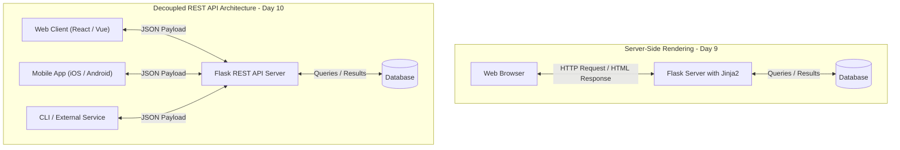
```mermaid
flowchart TD
    subgraph SSR [Server-Side Rendering - Day 9]
        Browser1["Web Browser"]
        Server1["Flask Server with Jinja2"]
        DB1[("Database")]
        Browser1 <-->|HTTP Request / HTML Response| Server1
        Server1 <-->|Queries / Results| DB1
    end

    subgraph REST [Decoupled REST API Architecture - Day 10]
        WebSPA["Web Client (React / Vue)"]
        MobileApp["Mobile App (iOS / Android)"]
        CLIClient["CLI / External Service"]
        RESTServer["Flask REST API Server"]
        DB2[("Database")]

        WebSPA <-->|JSON Payload| RESTServer
        MobileApp <-->|JSON Payload| RESTServer
        CLIClient <-->|JSON Payload| RESTServer
        RESTServer <-->|Queries / Results| DB2
    end
```

##### Advantages of the REST API Architecture:

1. **Multi-Client Support**: A single Flask backend API can simultaneously serve a web app, an iOS app, an Android app, a CLI tool, and partner integrations.
2. **Bandwidth Efficiency**: Instead of sending 50 KB of repetitive HTML markup, the server sends a 2 KB JSON packet containing only raw values.
3. **Separation of Concerns**: Backend engineers focus exclusively on database efficiency, security, transactions, and business logic. Frontend engineers focus on user experience, styling, accessibility, and UI performance.

---

#### 3. Roy Fielding's 6 REST Architectural Constraints

The term **REST** stands for **Representational State Transfer**. It was introduced in 2000 by computer scientist **Roy Fielding** in his doctoral dissertation _"Architectural Styles and the Design of Network-based Software Architectures"_.

To be truly **RESTful**, a system must adhere to six architectural constraints:

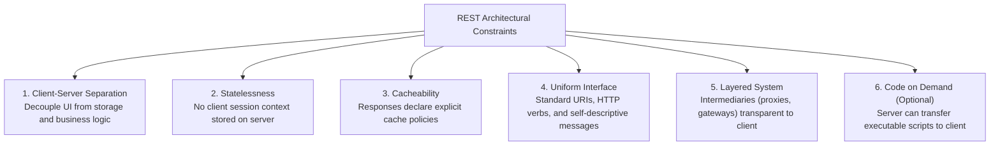
```mermaid
flowchart TD
    Root["REST Architectural Constraints"]

    C1["1. Client-Server Separation<br/>Decouple UI from storage and business logic"]
    C2["2. Statelessness<br/>No client session context stored on server"]
    C3["3. Cacheability<br/>Responses declare explicit cache policies"]
    C4["4. Uniform Interface<br/>Standard URIs, HTTP verbs, and self-descriptive messages"]
    C5["5. Layered System<br/>Intermediaries (proxies, gateways) transparent to client"]
    C6["6. Code on Demand (Optional)<br/>Server can transfer executable scripts to client"]

    Root --> C1
    Root --> C2
    Root --> C3
    Root --> C4
    Root --> C5
    Root --> C6
```

1. **Client-Server Separation**:
   - The user interface concerns are separated from the data storage and business logic concerns.
   - This improves user interface portability across multiple platforms and allows backend components to scale independently.
2. **Statelessness**:
   - **Crucial Rule**: The server must not store any session context about the client between requests.
   - Every incoming request must contain **all** the information necessary for the server to authenticate, authorize, and fulfill it (e.g., via API keys, JWT bearer tokens, or authorization headers).
   - **Benefit**: Extreme scalability. Any incoming request can be handled by any server instance in a load-balanced cluster without session synchronization.
3. **Cacheability**:
   - Responses must define themselves as cacheable or non-cacheable using standard HTTP headers (`Cache-Control`, `ETag`, `Expires`).
   - If a response is cacheable, intermediate proxies or client browsers are permitted to reuse that response data for equivalent subsequent requests, reducing latency and network traffic.
4. **Uniform Interface**:
   - The central constraint that distinguishes REST from other network architectures. It comprises four sub-principles:
     - **Identification of Resources**: Every conceptual entity (e.g., a product, a customer) is identified with a unique URI (e.g., `/api/v1/products/42`).
     - **Manipulation of Resources through Representations**: When a client holds a representation of a resource (e.g., JSON), it has enough information to modify or delete the resource on the server (given adequate permissions).
     - **Self-Descriptive Messages**: Each message includes enough metadata (like `Content-Type: application/json`) describing how to process the body.
     - **Hypermedia As The Engine Of Application State (HATEOAS)**: Clients make state transitions dynamically by traversing hypermedia links provided within the response payloads.
5. **Layered System**:
   - The architecture is composed of hierarchical layers (e.g., reverse proxies, load balancers, API gateways, firewall layers).
   - A client cannot tell whether it is communicating directly with the end server or with an intermediary along the path.
6. **Code on Demand (Optional)**:
   - Servers may temporarily extend or customize client functionality by transferring executable code (e.g., JavaScript scripts or compiled WebAssembly applets).

[↑ Back to Table of Contents](#toc-part-1-architectural-foundations-of-rest)

---

### Part 2: RESTful URI Design & HTTP Semantics

#### 1. Resource-Oriented URI Conventions

In REST, **URIs identify resources, not actions**. Resources must be modeled as **nouns**, never as verbs.

| Good RESTful Design (Nouns, Pluralized) | Bad Design (RPC Style / Verbs in URL)  | Explanation                                                             |
| :-------------------------------------- | :------------------------------------- | :---------------------------------------------------------------------- |
| `GET /api/v1/products`                  | `GET /api/v1/getAllProducts`           | URIs identify _what_ the resource is. HTTP verbs indicate _what to do_. |
| `GET /api/v1/products/42`               | `GET /api/v1/getProductById?id=42`     | Use path parameters for resource identity.                              |
| `POST /api/v1/products`                 | `POST /api/v1/createNewProduct`        | `POST` implies resource creation. Don't repeat "create" in the path.    |
| `PUT /api/v1/products/42`               | `POST /api/v1/updateProduct/42`        | Use HTTP `PUT` or `PATCH` to update.                                    |
| `DELETE /api/v1/products/42`            | `GET /api/v1/deleteProduct?id=42`      | `GET` must be safe and read-only. Never mutate or delete via `GET`.     |
| `GET /api/v1/orders/7/items`            | `GET /api/v1/getOrderItems?order_id=7` | Express hierarchical relationships naturally using nested paths.        |

> [!TIP]
> **API Versioning**: Always prefix API routes with a version number (e.g., `/api/v1/...`). This allows you to publish breaking changes later under `/api/v2/` without disrupting legacy client applications.

---

#### 2. HTTP Verbs in REST Semantics

REST maps CRUD (Create, Read, Update, Delete) operations directly to standard HTTP verbs:

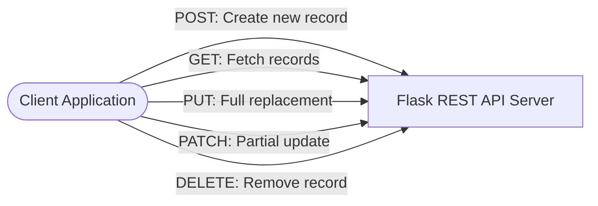
```mermaid
flowchart LR
    Client([Client Application])
    Server["Flask REST API Server"]

    Client -->|POST: Create new record| Server
    Client -->|GET: Fetch records| Server
    Client -->|PUT: Full replacement| Server
    Client -->|PATCH: Partial update| Server
    Client -->|DELETE: Remove record| Server
```

- **`GET`**: Retrieve a resource or collection of resources. Query parameters (`?category=electronics&limit=10`) are used for filtering, pagination, and sorting.
- **`POST`**: Create a new subordinate resource. The request body contains the representation of the new resource. The server generates an ID and returns HTTP `201 Created`.
- **`PUT`**: Replace an existing resource in its entirety. The payload must provide the complete set of resource fields. If fields are omitted, the server assumes they should be wiped or set to defaults.
- **`PATCH`**: Apply a partial modification to a resource. Only the specific fields being changed need to be supplied in the request body.
- **`DELETE`**: Permanently remove the specified resource.

---

#### 3. Safety and Idempotency Matrix

Two foundational concepts govern HTTP methods in REST:

- **Safe**: The method is strictly read-only and does not mutate the server state. Calling it causes no side-effects.
- **Idempotent**: Making $N$ identical requests ($N \ge 1$) results in the exact same server state as making a single request.

| HTTP Method  |  Safe?  | Idempotent? | Request Body? | Standard Success Status      |
| :----------- | :-----: | :---------: | :-----------: | :--------------------------- |
| **`GET`**    | **Yes** |   **Yes**   |      No       | `200 OK`                     |
| **`HEAD`**   | **Yes** |   **Yes**   |      No       | `200 OK` (Headers only)      |
| **`POST`**   | **No**  |   **No**    |      Yes      | `201 Created`                |
| **`PUT`**    | **No**  |   **Yes**   |      Yes      | `200 OK` or `204 No Content` |
| **`PATCH`**  | **No**  |   **No**    |      Yes      | `200 OK` or `204 No Content` |
| **`DELETE`** | **No**  |   **Yes**   |   Optional    | `200 OK` or `204 No Content` |

> [!NOTE]
> **Why is `DELETE` idempotent?**
> The first `DELETE /api/products/10` removes product 10 (status `200` or `204`). A second `DELETE /api/products/10` may return `404 Not Found`, but the **state of the database** on the server is unchanged—product 10 remains deleted. Hence, `DELETE` is idempotent.

---

#### 4. Standard HTTP Status Codes in REST APIs

Status codes communicate the outcome of the request unambiguously to the client machine:

```
+-------------------------------------------------------------+
| 1xx Informational | 2xx Success       | 3xx Redirection     |
| 4xx Client Error  | 5xx Server Error                        |
+-------------------------------------------------------------+
```

1. **`2xx Success`**:
   - **`200 OK`**: Standard successful response for `GET`, `PUT`, `PATCH`, or `DELETE`.
   - **`201 Created`**: Successfully created a new resource (via `POST`). The response should include the created object in the body and a `Location: /api/v1/products/42` header.
   - **`204 No Content`**: Action succeeded, but the response body is intentionally empty (common for `DELETE` or `PUT`).
2. **`4xx Client Errors`** (The client sent something incorrect):
   - **`400 Bad Request`**: Malformed JSON syntax, invalid payload schema, or failing basic input validation.
   - **`401 Unauthorized`**: Authentication is missing or invalid (e.g., missing API token).
   - **`403 Forbidden`**: Authentication succeeded, but the client does not have permission to access or modify this specific resource.
   - **`404 Not Found`**: The requested URI resource does not exist.
   - **`405 Method Not Allowed`**: The endpoint exists, but the HTTP verb is unsupported (e.g., sending `POST` to a read-only endpoint).
   - **`409 Conflict`**: Request cannot be fulfilled due to a business state conflict (e.g., creating a user with an email that is already registered).
   - **`422 Unprocessable Entity`**: JSON syntax is valid, but internal validation failed (e.g., price is a negative number).
3. **`5xx Server Errors`** (The server crashed or encountered an unhandled exception):
   - **`500 Internal Server Error`**: Unhandled exception in Python code (database crashed, unhandled division by zero, null pointer).

[↑ Back to Table of Contents](#toc-part-2-restful-uri-design--http-semantics)

---

### Part 3: Core Flask Tools for REST APIs

#### 1. Returning JSON: `jsonify` vs. `json.dumps`

In standard Python, `json.dumps(obj)` serializes a Python dictionary into a JSON string. However, in Flask web services, you should always use **`flask.jsonify()`**.

```python
import json
from flask import Flask, Response, jsonify

app = Flask(__name__)

# Approach A: Raw json.dumps (Avoid in REST APIs)
@app.route("/raw-json")
def raw_json():
    data = {"status": "active", "code": 200}
    # Problem: Defaults to Content-Type: text/html!
    return json.dumps(data)

# Approach B: Flask jsonify (Standard REST approach)
@app.route("/api/status")
def api_status():
    data = {"status": "active", "code": 200}
    # Automatically sets Content-Type: application/json
    return jsonify(data), 200
```

##### Why `jsonify` is Superior:

1. **MIME Type Header**: `jsonify()` automatically sets the HTTP response header `Content-Type: application/json`.
2. **Status Code and Header Tuples**: Flask allows returning a tuple `(jsonify(data), status_code, headers)`, making status code injection seamless.
3. **Configuration Aware**: `jsonify()` respects Flask configuration variables such as `JSON_SORT_KEYS` and custom JSON encoders.

---

#### 2. Parsing Incoming Requests: `request.get_json()` and `request.args`

Flask provides the `request` context object to inspect different parts of the incoming HTTP transmission:

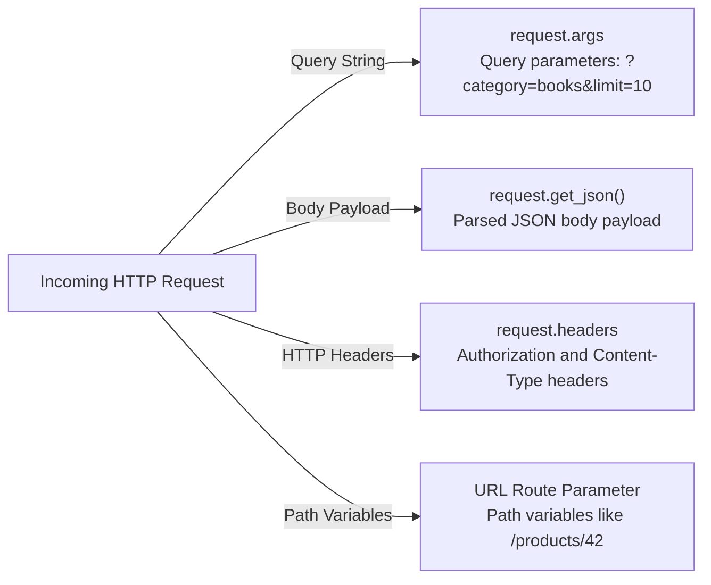
```mermaid
flowchart LR
    Req["Incoming HTTP Request"]
    Args["request.args<br/>Query parameters: ?category=books&limit=10"]
    JSON["request.get_json()<br/>Parsed JSON body payload"]
    Headers["request.headers<br/>Authorization and Content-Type headers"]
    Path["URL Route Parameter<br/>Path variables like /products/42"]

    Req -->|Query String| Args
    Req -->|Body Payload| JSON
    Req -->|HTTP Headers| Headers
    Req -->|Path Variables| Path
```

```python
from flask import Flask, request, jsonify

app = Flask(__name__)

@app.route("/api/v1/products", methods=["GET", "POST"])
def manage_products():
    if request.method == "GET":
        # 1. Reading Query Parameters: ?category=electronics&limit=10
        category = request.args.get("category", default=None, type=str)
        limit = request.args.get("limit", default=20, type=int)

        return jsonify({
            "action": "list_products",
            "filter_category": category,
            "page_limit": limit
        }), 200

    elif request.method == "POST":
        # 2. Reading JSON Body Payload
        # silent=True returns None instead of raising 400 Bad Request if JSON is malformed
        payload = request.get_json(silent=True)

        if payload is None:
            return jsonify({
                "error": "Bad Request",
                "message": "Request body must be valid application/json"
            }), 400

        # Validate required fields
        if "name" not in payload or "price" not in payload:
            return jsonify({
                "error": "Unprocessable Entity",
                "message": "Missing required fields: 'name' and 'price'"
            }), 422

        return jsonify({
            "message": "Product created successfully",
            "received_data": payload
        }), 201
```

> [!IMPORTANT]
> Always use `request.get_json(silent=True)` or wrap `request.get_json()` inside a `try...except` block when accepting client input. By default, calling `request.get_json()` on a request that has an invalid JSON syntax or missing `Content-Type: application/json` header causes Flask to immediately trigger a raw HTTP 400 response.

---

#### 3. Dynamic URL Parameters and Variable Converters

Flask allows capturing parts of the URL path directly into your view function using typed converter syntax `<converter:variable_name>`:

| Converter          | Matches                         | Example Route                           | Match                      | Reject                 |
| :----------------- | :------------------------------ | :-------------------------------------- | :------------------------- | :--------------------- |
| `string` (default) | Any text without slashes        | `@app.route("/users/<username>")`       | `/users/john`              | `/users/john/profile`  |
| `int`              | Positive integers               | `@app.route("/api/products/<int:id>")`  | `/api/products/42`         | `/api/products/laptop` |
| `float`            | Positive floating point numbers | `@app.route("/rates/<float:rate>")`     | `/rates/3.14`              | `/rates/abc`           |
| `path`             | Accepts slashes                 | `@app.route("/files/<path:filepath>")`  | `/files/docs/readme.txt`   | _(empty string)_       |
| `uuid`             | UUID strings                    | `@app.route("/orders/<uuid:order_id>")` | `/orders/123e4567-e89b...` | `/orders/99`           |

```python
@app.route("/api/v1/products/<int:product_id>", methods=["GET"])
def get_single_product(product_id: int):
    # product_id is guaranteed to be a Python int
    return jsonify({"product_id": product_id, "name": "Mechanical Keyboard"})
```

---

#### 4. Centralized Error Handling with `@app.errorhandler`

In a REST API, responses must **never** return raw HTML error tracebacks or standard Apache/Nginx error templates. All errors—including 404 and 500—must be returned in a consistent, machine-readable JSON structure.

```python
from flask import Flask, jsonify

app = Flask(__name__)

@app.errorhandler(404)
def not_found_handler(error):
    return jsonify({
        "success": False,
        "error": "Not Found",
        "message": "The requested resource endpoint does not exist."
    }), 404

@app.errorhandler(405)
def method_not_allowed_handler(error):
    return jsonify({
        "success": False,
        "error": "Method Not Allowed",
        "message": "The HTTP verb used is not permitted for this endpoint."
    }), 405

@app.errorhandler(500)
def internal_server_error_handler(error):
    return jsonify({
        "success": False,
        "error": "Internal Server Error",
        "message": "An unexpected error occurred on the server."
    }), 500
```

[↑ Back to Table of Contents](#toc-part-3-core-flask-tools-for-rest-apis)

---

### Part 4: Practical Project: Building a Products CRUD REST API with Flask & SQLite

Let us implement a complete, robust, production-grade RESTful API for an **Inventory Product Catalog** using Flask and SQLite.

#### 1. Project Structure

```
inventory_api/
├── database.py       # SQLite connection and schema migration
├── app.py            # Flask application and REST endpoints
└── inventory.db      # SQLite database file (created automatically)
```

---

#### 2. Database Schema & Helper Module (`database.py`)

Create `database.py`. This module handles database connections, sets up `sqlite3.Row` for dictionary-like column access, and initializes the `products` table.

```python
"""
database.py - Database connection management and initialization.
"""

import sqlite3
from typing import Optional

DATABASE_NAME = "inventory.db"


def get_db_connection() -> sqlite3.Connection:
    """
    Creates and returns a thread-safe connection to the SQLite database.
    Configures row_factory to sqlite3.Row for key-based column lookup.
    """
    conn = sqlite3.connect(DATABASE_NAME)
    conn.row_factory = sqlite3.Row
    # Enable Foreign Key enforcement in SQLite
    conn.execute("PRAGMA foreign_keys = ON;")
    return conn


def init_db() -> None:
    """
    Initializes the database schema if tables do not already exist.
    """
    schema_sql = """
    CREATE TABLE IF NOT EXISTS products (
        id INTEGER PRIMARY KEY AUTOINCREMENT,
        name TEXT NOT NULL,
        category TEXT NOT NULL,
        price REAL NOT NULL CHECK (price >= 0),
        stock INTEGER NOT NULL DEFAULT 0 CHECK (stock >= 0),
        created_at TIMESTAMP DEFAULT CURRENT_TIMESTAMP
    );
    """
    with get_db_connection() as conn:
        conn.executescript(schema_sql)
        conn.commit()


if __name__ == "__main__":
    init_db()
    print("Database schema initialized successfully.")
```

---

#### 3. The REST API Application (`app.py`)

Create `app.py`. This implements full CRUD capabilities:

- `GET /api/v1/products` - List all products with optional query filtering (`?category=...&min_price=...`)
- `GET /api/v1/products/<int:id>` - Retrieve a single product by ID
- `POST /api/v1/products` - Create a new product with complete validation
- `PUT /api/v1/products/<int:id>` - Full replacement update of a product
- `PATCH /api/v1/products/<int:id>` - Partial field update of a product
- `DELETE /api/v1/products/<int:id>` - Delete a product

```python
"""
app.py - Production-ready Flask RESTful API for Product Inventory.
"""

import sqlite3
from flask import Flask, jsonify, request
from database import get_db_connection, init_db

app = Flask(__name__)

# Initialize database schema upon application launch
init_db()


# -------------------------------------------------------------------------
# Helper Functions
# -------------------------------------------------------------------------

def row_to_dict(row: sqlite3.Row) -> dict:
    """Converts an sqlite3.Row object into a serializable standard Python dictionary."""
    return dict(row)


def json_response(data=None, message: str = "", status_code: int = 200, success: bool = True):
    """Utility helper to produce uniform, standardized API response envelopes."""
    payload = {
        "success": success,
        "status_code": status_code
    }
    if message:
        payload["message"] = message
    if data is not None:
        payload["data"] = data
    return jsonify(payload), status_code


# -------------------------------------------------------------------------
# Centralized Error Handlers
# -------------------------------------------------------------------------

@app.errorhandler(404)
def handle_404(error):
    return json_response(
        message="The requested endpoint or resource was not found.",
        status_code=404,
        success=False
    )


@app.errorhandler(405)
def handle_405(error):
    return json_response(
        message=f"HTTP verb '{request.method}' is not allowed for this route.",
        status_code=405,
        success=False
    )


@app.errorhandler(500)
def handle_500(error):
    return json_response(
        message="An unexpected server error occurred.",
        status_code=500,
        success=False
    )


# -------------------------------------------------------------------------
# REST API Endpoints: /api/v1/products
# -------------------------------------------------------------------------

@app.route("/api/v1/products", methods=["GET"])
def get_products():
    """
    GET /api/v1/products
    Retrieves all products.
    Supports query parameters for filtering:
      - ?category=<name>
      - ?min_price=<value>
      - ?limit=<number>
    """
    category = request.args.get("category", default=None, type=str)
    min_price = request.args.get("min_price", default=None, type=float)
    limit = request.args.get("limit", default=50, type=int)

    query = "SELECT * FROM products WHERE 1=1"
    params = []

    if category:
        query += " AND LOWER(category) = LOWER(?)"
        params.append(category)

    if min_price is not None:
        query += " AND price >= ?"
        params.append(min_price)

    query += " ORDER BY id DESC LIMIT ?"
    params.append(limit)

    with get_db_connection() as conn:
        cursor = conn.cursor()
        cursor.execute(query, tuple(params))
        rows = cursor.fetchall()

    products = [row_to_dict(row) for row in rows]
    return json_response(data=products, status_code=200)


@app.route("/api/v1/products/<int:product_id>", methods=["GET"])
def get_product(product_id: int):
    """
    GET /api/v1/products/<id>
    Retrieves a single product by its primary key ID.
    Returns 404 if not found.
    """
    with get_db_connection() as conn:
        cursor = conn.cursor()
        cursor.execute("SELECT * FROM products WHERE id = ?", (product_id,))
        row = cursor.fetchone()

    if row is None:
        return json_response(
            message=f"Product with ID {product_id} does not exist.",
            status_code=404,
            success=False
        )

    return json_response(data=row_to_dict(row), status_code=200)


@app.route("/api/v1/products", methods=["POST"])
def create_product():
    """
    POST /api/v1/products
    Creates a new product record.
    Required JSON fields: 'name', 'category', 'price', 'stock'
    """
    body = request.get_json(silent=True)
    if body is None:
        return json_response(
            message="Request body must be a valid JSON object with 'Content-Type: application/json'.",
            status_code=400,
            success=False
        )

    # Validate presence of required attributes
    required_fields = ["name", "category", "price", "stock"]
    missing_fields = [f for f in required_fields if f not in body]
    if missing_fields:
        return json_response(
            message=f"Missing required fields: {', '.join(missing_fields)}",
            status_code=422,
            success=False
        )

    name = str(body["name"]).strip()
    category = str(body["category"]).strip()

    try:
        price = float(body["price"])
        stock = int(body["stock"])
        if price < 0 or stock < 0:
            raise ValueError()
    except (ValueError, TypeError):
        return json_response(
            message="'price' must be a non-negative float and 'stock' must be a non-negative integer.",
            status_code=422,
            success=False
        )

    if not name or not category:
        return json_response(
            message="'name' and 'category' cannot be empty strings.",
            status_code=422,
            success=False
        )

    with get_db_connection() as conn:
        cursor = conn.cursor()
        cursor.execute(
            "INSERT INTO products (name, category, price, stock) VALUES (?, ?, ?, ?)",
            (name, category, price, stock)
        )
        conn.commit()
        new_id = cursor.lastrowid

        cursor.execute("SELECT * FROM products WHERE id = ?", (new_id,))
        new_product = row_to_dict(cursor.fetchone())

    # Build response with 201 Created and Location header
    response = jsonify({
        "success": True,
        "status_code": 201,
        "message": "Product created successfully.",
        "data": new_product
    })
    response.status_code = 201
    response.headers["Location"] = f"/api/v1/products/{new_id}"
    return response


@app.route("/api/v1/products/<int:product_id>", methods=["PUT"])
def replace_product(product_id: int):
    """
    PUT /api/v1/products/<id>
    Idempotent complete replacement of a product record.
    All required fields must be supplied.
    """
    body = request.get_json(silent=True)
    if body is None:
        return json_response(
            message="Invalid or missing JSON payload.",
            status_code=400,
            success=False
        )

    # Full replacement requires all mandatory fields
    required_fields = ["name", "category", "price", "stock"]
    missing = [f for f in required_fields if f not in body]
    if missing:
        return json_response(
            message=f"PUT requires all fields for complete resource replacement: {', '.join(missing)}",
            status_code=422,
            success=False
        )

    try:
        price = float(body["price"])
        stock = int(body["stock"])
        if price < 0 or stock < 0:
            raise ValueError()
    except (ValueError, TypeError):
        return json_response(
            message="Invalid numeric values for price or stock.",
            status_code=422,
            success=False
        )

    with get_db_connection() as conn:
        cursor = conn.cursor()
        cursor.execute("SELECT id FROM products WHERE id = ?", (product_id,))
        if cursor.fetchone() is None:
            return json_response(
                message=f"Product with ID {product_id} not found.",
                status_code=404,
                success=False
            )

        cursor.execute(
            """
            UPDATE products
            SET name = ?, category = ?, price = ?, stock = ?
            WHERE id = ?
            """,
            (body["name"], body["category"], price, stock, product_id)
        )
        conn.commit()

        cursor.execute("SELECT * FROM products WHERE id = ?", (product_id,))
        updated = row_to_dict(cursor.fetchone())

    return json_response(data=updated, message="Product replaced successfully.", status_code=200)


@app.route("/api/v1/products/<int:product_id>", methods=["PATCH"])
def patch_product(product_id: int):
    """
    PATCH /api/v1/products/<id>
    Partial update. Only the fields present in the request body are updated.
    """
    body = request.get_json(silent=True)
    if not body or not isinstance(body, dict):
        return json_response(
            message="Valid JSON payload required for partial update.",
            status_code=400,
            success=False
        )

    allowed_fields = {"name", "category", "price", "stock"}
    update_fields = [k for k in body.keys() if k in allowed_fields]

    if not update_fields:
        return json_response(
            message=f"No valid update fields supplied. Allowed: {allowed_fields}",
            status_code=422,
            success=False
        )

    # Build dynamic SQL update string
    set_clauses = []
    params = []
    for field in update_fields:
        val = body[field]
        if field == "price":
            try:
                val = float(val)
                if val < 0:
                    raise ValueError()
            except (ValueError, TypeError):
                return json_response(message="Price must be a non-negative float.", status_code=422, success=False)
        elif field == "stock":
            try:
                val = int(val)
                if val < 0:
                    raise ValueError()
            except (ValueError, TypeError):
                return json_response(message="Stock must be a non-negative integer.", status_code=422, success=False)

        set_clauses.append(f"{field} = ?")
        params.append(val)

    params.append(product_id)
    sql = f"UPDATE products SET {', '.join(set_clauses)} WHERE id = ?"

    with get_db_connection() as conn:
        cursor = conn.cursor()
        cursor.execute("SELECT id FROM products WHERE id = ?", (product_id,))
        if cursor.fetchone() is None:
            return json_response(
                message=f"Product with ID {product_id} not found.",
                status_code=404,
                success=False
            )

        cursor.execute(sql, tuple(params))
        conn.commit()

        cursor.execute("SELECT * FROM products WHERE id = ?", (product_id,))
        updated = row_to_dict(cursor.fetchone())

    return json_response(data=updated, message="Product patched successfully.", status_code=200)


@app.route("/api/v1/products/<int:product_id>", methods=["DELETE"])
def delete_product(product_id: int):
    """
    DELETE /api/v1/products/<id>
    Idempotently deletes a product record.
    """
    with get_db_connection() as conn:
        cursor = conn.cursor()
        cursor.execute("SELECT id FROM products WHERE id = ?", (product_id,))
        row = cursor.fetchone()

        if row is None:
            return json_response(
                message=f"Product with ID {product_id} not found.",
                status_code=404,
                success=False
            )

        cursor.execute("DELETE FROM products WHERE id = ?", (product_id,))
        conn.commit()

    return json_response(message=f"Product with ID {product_id} has been deleted.", status_code=200)


if __name__ == "__main__":
    # In development: debug=True allows hot-reload and informative terminal traces
    app.run(host="127.0.0.1", port=5000, debug=True)
```

---

#### 4. Testing Endpoints with `curl`

To test your REST API without a frontend, use `curl` from your terminal:

##### 1. Create a Product (`POST`):

```bash
curl -X POST http://127.0.0.1:5000/api/v1/products \
     -H "Content-Type: application/json" \
     -d '{
           "name": "Wireless Mechanical Keyboard",
           "category": "Electronics",
           "price": 89.99,
           "stock": 35
         }'
```

**Response (`HTTP 201 Created`):**

```json
{
  "data": {
    "category": "Electronics",
    "created_at": "2026-09-07 10:15:32",
    "id": 1,
    "name": "Wireless Mechanical Keyboard",
    "price": 89.99,
    "stock": 35
  },
  "message": "Product created successfully.",
  "status_code": 201,
  "success": true
}
```

##### 2. Retrieve All Products with Filter (`GET`):

```bash
curl -X GET "http://127.0.0.1:5000/api/v1/products?category=Electronics&min_price=50"
```

##### 3. Retrieve Single Product by ID (`GET`):

```bash
curl -X GET http://127.0.0.1:5000/api/v1/products/1
```

##### 4. Partial Update of Stock (`PATCH`):

```bash
curl -X PATCH http://127.0.0.1:5000/api/v1/products/1 \
     -H "Content-Type: application/json" \
     -d '{"stock": 40}'
```

##### 5. Delete Product (`DELETE`):

```bash
curl -X DELETE http://127.0.0.1:5000/api/v1/products/1
```

[↑ Back to Table of Contents](#toc-part-4-practical-project-building-a-products-crud-rest-api-with-flask--sqlite) | [Back to Section TOC](#toc-section-a-fundamentals-of-rest-api-using-flask)

---

## Section B: Web Scraping Basics in Python

---

### 1. What is Web Scraping?

**Web scraping** is the automated process of extracting data from website HTML pages. While REST APIs (covered in Section A) deliver structured JSON data cleanly, many websites do not provide a public API. Web scraping bridges this gap by:

1. Sending an HTTP request to download the target web page.
2. Parsing the resulting HTML document into a searchable tree structure (DOM).
3. Searching and extracting targeted elements (headings, article text, table data, links).
4. Saving or processing the data into structured formats (lists, dictionaries, CSV files).

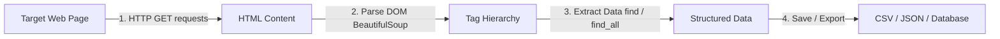
```mermaid
flowchart LR
    URL["Target Web Page"] -->|1. HTTP GET requests| HTML["HTML Content"]
    HTML -->|2. Parse DOM BeautifulSoup| DOM["Tag Hierarchy"]
    DOM -->|3. Extract Data find / find_all| Data["Structured Data"]
    Data -->|4. Save / Export| Out["CSV / JSON / Database"]
```

[↑ Back to Table of Contents](#toc-1-what-is-web-scraping)

---

### 2. Key Libraries: `requests` and `BeautifulSoup`

Python provides two industry-standard libraries for web scraping:

```bash
pip install requests beautifulsoup4
```

- **`requests`**: Handles HTTP networking. It sends requests (`GET`, `POST`) and fetches the server's HTML response.
- **`beautifulsoup4` (`bs4`)**: A powerful HTML parser that navigates and queries elements using tag names, CSS classes, IDs, and attributes.

[↑ Back to Table of Contents](#toc-2-key-libraries-requests-and-beautifulsoup)

---

### 3. Core Scraping Workflow & Methods

#### A. Fetching and Creating the "Soup"

```python
import requests
from bs4 import BeautifulSoup

url = "http://quotes.toscrape.com/"
headers = {"User-Agent": "Mozilla/5.0 (Educational Scraping Demo)"}

# 1. Fetch web page
response = requests.get(url, headers=headers, timeout=10)
response.raise_for_status()  # Raises an exception if the HTTP request failed (e.g. 404, 500)

# 2. Parse HTML into a BeautifulSoup object
soup = BeautifulSoup(response.text, "html.parser")
```

#### B. Searching Elements

| Method                            | Purpose                                        | Example                                        |
| :-------------------------------- | :--------------------------------------------- | :--------------------------------------------- |
| `soup.find("tag")`                | Finds the **first** matching element           | `first_h1 = soup.find("h1")`                   |
| `soup.find_all("tag")`            | Finds **all** matching elements (returns list) | `all_paragraphs = soup.find_all("p")`          |
| `soup.find("tag", class_="name")` | Finds by CSS class (use `class_`)              | `card = soup.find("div", class_="quote")`      |
| `soup.find("tag", id="name")`     | Finds by element ID                            | `header = soup.find("nav", id="navbar")`       |
| `soup.select("css selector")`     | Finds using standard CSS selectors             | `items = soup.select(".list-group > li.item")` |

#### C. Extracting Text and Attributes

```python
# Extract clean inner text (.strip removes surrounding whitespace)
heading_text = soup.find("h1").get_text(strip=True)

# Extract HTML attributes (href, src, alt, etc.)
first_link = soup.find("a")
href_url = first_link.get("href")
```

[↑ Back to Table of Contents](#toc-3-core-scraping-workflow--methods)

---

### 4. Practical Scraping Example

The following script demonstrates scraping quotes, authors, and topic tags from **Quotes to Scrape** (a public sandbox site built specifically for scraping practice):

```python
"""
web_scraping_demo.py - Scrape quotes, authors, and tags using requests and BeautifulSoup.
"""

import requests
from bs4 import BeautifulSoup


def scrape_quotes():
    url = "http://quotes.toscrape.com/"
    headers = {"User-Agent": "PythonStudentScraper/1.0"}

    print(f"Fetching {url} ...")
    response = requests.get(url, headers=headers, timeout=10)
    response.raise_for_status()

    # Parse HTML
    soup = BeautifulSoup(response.text, "html.parser")

    # Find all quote container blocks (<div class="quote">)
    quote_blocks = soup.find_all("div", class_="quote")
    print(f"Found {len(quote_blocks)} quotes on the page.\n")

    results = []
    for block in quote_blocks:
        # Extract quote text (<span class="text">)
        text = block.find("span", class_="text").get_text(strip=True)

        # Extract author name (<small class="author">)
        author = block.find("small", class_="author").get_text(strip=True)

        # Extract tags (<a class="tag">)
        tag_elements = block.find_all("a", class_="tag")
        tags = [t.get_text(strip=True) for t in tag_elements]

        results.append({
            "quote": text,
            "author": author,
            "tags": tags
        })

    return results


if __name__ == "__main__":
    quotes = scrape_quotes()

    # Display the first 3 scraped quotes
    for i, item in enumerate(quotes[:3], 1):
        print(f"{i}. \"{item['quote']}\"")
        print(f"   - Author: {item['author']}")
        print(f"   - Tags  : {', '.join(item['tags'])}\n")
```

**Execution Output:**

```
Fetching http://quotes.toscrape.com/ ...
Found 10 quotes on the page.

1. "“The world as we have created it is a process of our thinking. It cannot be changed without changing our thinking.”"
   - Author: Albert Einstein
   - Tags  : change, deep-thoughts, thinking, world

2. "“It is our choices, Harry, that show what we truly are, far more than our abilities.”"
   - Author: J.K. Rowling
   - Tags  : abilities, choices

3. "“There are only two ways to live your life. One is as though nothing is a miracle. The other is as though everything is a miracle.”"
   - Author: Albert Einstein
   - Tags  : inspirational, life, live, miracle, miracles
```

[↑ Back to Table of Contents](#toc-4-practical-scraping-example)

---

### 5. Best Practices & Ethical Scraping

1. **Inspect `robots.txt`**: Check `https://website.com/robots.txt` before scraping to see which paths are disallowed for automated bots.
2. **Set a Custom `User-Agent`**: Identify your script in request headers so server administrators know who is requesting data.
3. **Rate Limiting**: Use `time.sleep(1)` between multiple page requests to avoid overwhelming target servers.
4. **Prefer Official APIs**: If a website provides a free or official REST API, always use the API instead of web scraping.
5. **Handle Network Exceptions**: Wrap requests in `try / except requests.RequestException` and always include a `timeout` argument.

[↑ Back to Table of Contents](#toc-5-best-practices--ethical-scraping) | [Back to Section TOC](#toc-section-b-web-scraping-basics-in-python)

---

## Section C: Introduction to NumPy & Image Manipulation

---

### 1. Introduction to NumPy: Capabilities, Applications & List Comparison

#### A. What is NumPy?

**NumPy** (short for **Numerical Python**) is the core library for scientific, numerical, and data-driven computing in Python. Created in 2005 by Travis Oliphant, it provides the foundational data structure that underpins virtually the entire modern Python data science and machine learning ecosystem: the **`ndarray`** ($N$-dimensional array).

While Python is an expressive, dynamic language prized for developer productivity, pure Python loops are notoriously slow when processing millions of arithmetic operations. NumPy overcomes this bottleneck by executing numerical operations using pre-compiled, optimized **C and Fortran routines** under the hood, while exposing an intuitive, high-level Python API.

```bash
pip install numpy pillow
```

---

#### B. Core Capabilities of NumPy

1. **$N$-Dimensional Array (`ndarray`)**: Fast, memory-efficient multi-dimensional arrays supporting 1D vectors, 2D matrices, 3D image arrays, and higher-dimensional tensors.
2. **Vectorization**: Perform math operations on entire arrays simultaneously without writing explicit Python `for` loops.
3. **Broadcasting**: Automatically compute arithmetic between arrays of different but compatible dimensions (e.g. adding a 1D vector across all rows of a 2D matrix, or applying a 3-channel color multiplier to an entire image).
4. **Universal Functions (`ufuncs`)**: Fast element-wise mathematical functions (e.g., `np.sin`, `np.exp`, `np.log`, `np.sqrt`, `np.clip`) executed directly in compiled C.
5. **Linear Algebra**: Native support for matrix multiplication (`@`), dot products, inversions, eigenvalues, and decompositions.
6. **Random Number Generation**: Fast generation of statistical distributions (normal, uniform, binomial) using modern pseudo-random BitGenerators.

---

#### C. Real-World Fields of Application

NumPy is the foundational bedrock upon which the modern Python data ecosystem is built:

| Field                                  | How NumPy is Applied                                                                                                                        | Key Libraries Powered by NumPy                 |
| :------------------------------------- | :------------------------------------------------------------------------------------------------------------------------------------------ | :--------------------------------------------- |
| **Data Science & Analytics**           | Tabular data manipulation, statistical aggregations, missing-data handling, time-series analysis.                                           | **Pandas**, **Polars**, **Statsmodels**        |
| **Machine Learning & AI**              | Feature vectors, gradient computations, model weight matrices. PyTorch and TensorFlow tensors are modeled directly after NumPy's `ndarray`. | **scikit-learn**, **PyTorch**, **TensorFlow**  |
| **Computer Vision & Image Processing** | Digital images and video frames are stored and processed directly as 2D/3D pixel matrices.                                                  | **OpenCV**, **Pillow (PIL)**, **scikit-image** |
| **Audio & Signal Processing**          | Digital audio waveforms, sampling rates, frequencies, and Fast Fourier Transforms (FFT).                                                    | **SciPy (signal)**, **Librosa**                |
| **Quantitative Finance**               | Algorithmic trading, portfolio optimization, options pricing (Monte Carlo / Black-Scholes models), risk management.                         | **QuantLib**, **TA-Lib**                       |
| **Physics & Engineering Simulations**  | Fluid dynamics, weather forecasting, molecular dynamics, and astronomical imaging (e.g., the Event Horizon Telescope black hole photo).     | **SciPy**, **Astropy**, **Biopython**          |

---

#### D. NumPy `ndarray` vs. Python List: Why Not Just Use Lists?

At first glance, a Python `list` might seem similar to a NumPy array. However, their internal memory architecture and performance characteristics are fundamentally different:

```
Python List Memory Layout (Array of Pointers):
List Object -> [ Ptr 1 | Ptr 2 | Ptr 3 | Ptr 4 ]
                   |       |       |       |
                   v       v       v       v
               [PyObject] [PyObject] [PyObject] [PyObject]  (Scattered across Heap memory!)

NumPy ndarray Memory Layout (Contiguous C Buffer):
ndarray Object -> [ Value 1 | Value 2 | Value 3 | Value 4 ] (Packed tightly in one contiguous block!)
```

| Feature                        | Python Standard `list`                                                                                             | NumPy `ndarray`                                                                                                 |
| :----------------------------- | :----------------------------------------------------------------------------------------------------------------- | :-------------------------------------------------------------------------------------------------------------- |
| **Memory Layout**              | **Scattered**: An array of pointers referencing independent Python objects scattered across heap memory.           | **Contiguous**: Elements are stored back-to-back in a single, unbroken block of memory (C-style layout).        |
| **Data Types**                 | **Heterogeneous**: Can hold integers, strings, floats, and objects within the same list.                           | **Homogeneous**: Every element has the exact same data type (e.g. all `int32`, `float64`, or `uint8`).          |
| **Memory Overhead**            | **High**: Each number is a full Python object (~28 bytes for an integer + 8 bytes pointer = ~36 bytes per number). | **Minimal**: Stored as raw binary bytes (e.g., `uint8` = exactly 1 byte per value).                             |
| **Execution Speed**            | **Slow**: Loops must dereference pointers and perform dynamic type checking on every iteration.                    | **Blazing Fast**: Leverages CPU cache locality, SIMD (Single Instruction Multiple Data), and C-level execution. |
| **Math Operations**            | `list + [5]` **appends** element `5` to the list; `list * 2` **duplicates** the list contents.                     | `arr + 5` **adds 5 to every element**; `arr * 2` **doubles every value**.                                       |
| **Multi-Dimensional Indexing** | Nested indexing: `matrix[row][col]`                                                                                | Clean matrix coordinate indexing: `arr[row, col]` or `img[y, x, channel]`                                       |

---

#### E. Performance Benchmark: List vs. NumPy

Run this short benchmark to observe the real-world performance difference between a Python list loop and NumPy vectorization on 1,000,000 numbers:

```python
"""
benchmark_list_vs_numpy.py - Comparing execution speed of Python list vs. NumPy array.
"""

import time
import numpy as np

SIZE = 1_000_000

# 1. Python List: Element-wise doubling via list comprehension
py_list = list(range(SIZE))
start = time.time()
list_result = [x * 2 for x in py_list]
list_time = time.time() - start

# 2. NumPy Array: Element-wise doubling via vectorization
np_arr = np.arange(SIZE)
start = time.time()
np_result = np_arr * 2
numpy_time = time.time() - start

print(f"Python List time : {list_time:.4f} seconds")
print(f"NumPy Array time : {numpy_time:.4f} seconds")
print(f"-> NumPy is {list_time / numpy_time:.1f}x faster!")
```

**Typical Output:**

```
Python List time : 0.0465 seconds
NumPy Array time : 0.0036 seconds
-> NumPy is 12.7x faster!
```

[↑ Back to Table of Contents](#toc-1-introduction-to-numpy-capabilities-applications--list-comparison)

---

### 2. Digital Images as NumPy Arrays

Every digital picture is simply a multi-dimensional grid of numbers:

- **Grayscale Image (2D Matrix)**:
  - Shape: `(Height, Width)`
  - Each element is an integer from `0` (black) to `255` (white).
- **Color Image (3D Array - RGB)**:
  - Shape: `(Height, Width, 3)`
  - Channel 0: **Red** ($0$ to $255$)
  - Channel 1: **Green** ($0$ to $255$)
  - Channel 2: **Blue** ($0$ to $255$)
- **Data Type**: Digital images use **`np.uint8`** (unsigned 8-bit integers, $0 \le \text{value} \le 255$).

```
Image Coordinate System:
      (0,0) --------------> Column X (Width, Axis 1)
        |
        |       Pixel [y, x] = [Red, Green, Blue]  (Axis 2)
        v
      Row Y (Height, Axis 0)
```

The Python imaging library **Pillow (`PIL`)** bridges images on disk with NumPy arrays:

- **Disk $\rightarrow$ NumPy**: `img = np.array(Image.open("photo.jpg"))`
- **NumPy $\rightarrow$ Disk**: `Image.fromarray(img).save("output.jpg")`

[↑ Back to Table of Contents](#toc-2-digital-images-as-numpy-arrays)

---

### 3. Loading & Inspecting an Image

```python
from PIL import Image
import numpy as np

# 1. Load an image file into a NumPy array
# (You can use any JPG or PNG image on your computer)
img = np.array(Image.open("sample.jpg"))

# 2. Inspect core array attributes
print("Data Type :", img.dtype)  # uint8 (values from 0 to 255)
print("Dimensions:", img.ndim)   # 3 (Height, Width, Color Channels)
print("Shape     :", img.shape)  # e.g., (300, 400, 3) -> 300 rows, 400 cols, 3 channels
print("Pixel(0,0):", img[0, 0])  # [R, G, B] values of the top-left pixel
```

[↑ Back to Table of Contents](#toc-3-loading--inspecting-an-image)

---

### 4. Image Manipulation Examples

Because an image is just a NumPy array, you can manipulate it using basic array slicing, indexing, and vectorized math:

#### A. Cropping (2D Slicing)

Extract a sub-region using standard Python slice notation `[ymin:ymax, xmin:xmax]`:

```python
# Crop a region: rows 50 to 200, columns 100 to 300
# Tip: Use .copy() to create an independent array
cropped = img[50:200, 100:300].copy()
Image.fromarray(cropped).save("cropped.jpg")
```

#### B. Flipping (Reversing Axes)

Mirror or turn an image upside-down by reversing array indices (`[::-1]`):

```python
# Horizontal Flip (Mirror: reverse columns along Axis 1)
horizontal_flip = img[:, ::-1]
Image.fromarray(horizontal_flip).save("flipped_horizontal.jpg")

# Vertical Flip (Upside-down: reverse rows along Axis 0)
vertical_flip = img[::-1, :]
Image.fromarray(vertical_flip).save("flipped_vertical.jpg")
```

#### C. Adjusting Brightness & Tone (Vectorized Math & Clamping)

To increase brightness or adjust color channels, add or multiply values across the array.

> [!WARNING]
> In `uint8` math, values wrap around if they exceed 255 ($240 + 30 = 270 \rightarrow 14$). Always clamp values between $0$ and $255$ using **`np.clip()`**:

```python
# 1. Increase Brightness (+40):
brightened = np.clip(img.astype(np.int16) + 40, 0, 255).astype(np.uint8)
Image.fromarray(brightened).save("brightened.jpg")

# 2. Warm Sunset Tint (Boost Red, soften Blue via broadcasting):
warm_filter = np.array([1.25, 1.05, 0.75])
warm_img = np.clip(img * warm_filter, 0, 255).astype(np.uint8)
Image.fromarray(warm_img).save("warm_tint.jpg")
```

#### D. Converting to Grayscale

Use the standard human eye perceptual luminance formula ($0.299R + 0.587G + 0.114B$):

```python
# Convert 3D RGB array to 2D Grayscale matrix
gray = (
    img[:, :, 0] * 0.299 +
    img[:, :, 1] * 0.587 +
    img[:, :, 2] * 0.114
).astype(np.uint8)

Image.fromarray(gray).save("grayscale.jpg")
print("Grayscale Shape:", gray.shape)  # 2D array: (Height, Width)
```

[↑ Back to Table of Contents](#toc-4-image-manipulation-examples)

---

### 5. Complete Image Processing Script

Here is a complete, self-contained Python script demonstrating loading, manipulating, and saving images. If you do not have an image ready, it automatically creates a starter `sample.jpg`:

```python
"""
numpy_image_demo.py - Basic image loading and manipulation with NumPy and Pillow.
"""

import os
import numpy as np
from PIL import Image, ImageDraw


def get_or_create_sample_image(filename: str = "sample.jpg") -> None:
    """Creates a starter sample image if one does not already exist."""
    if not os.path.exists(filename):
        img = Image.new("RGB", (400, 300), color=(135, 206, 235))  # Sky blue
        draw = ImageDraw.Draw(img)
        draw.rectangle([0, 180, 400, 300], fill=(34, 139, 34))     # Green grass
        draw.ellipse([280, 40, 360, 120], fill=(255, 215, 0))       # Sun
        img.save(filename)
        print(f"Created starter '{filename}'")


def main():
    # Ensure a sample image exists to work with
    get_or_create_sample_image("sample.jpg")

    # 1. Load image from disk into a NumPy array
    img = np.array(Image.open("sample.jpg"))
    h, w, c = img.shape
    print(f"Loaded image: {w}x{h} pixels, shape: {img.shape}, dtype: {img.dtype}")

    # 2. Crop center region
    cropped = img[h // 4 : 3 * h // 4, w // 4 : 3 * w // 4].copy()
    Image.fromarray(cropped).save("output_cropped.jpg")

    # 3. Horizontal mirror flip
    flipped = img[:, ::-1]
    Image.fromarray(flipped).save("output_flipped.jpg")

    # 4. Warm sunset color tint (broadcasting)
    warm = np.clip(img * [1.25, 1.05, 0.75], 0, 255).astype(np.uint8)
    Image.fromarray(warm).save("output_warm.jpg")

    # 5. Grayscale conversion
    gray = (img[:, :, 0] * 0.299 + img[:, :, 1] * 0.587 + img[:, :, 2] * 0.114).astype(np.uint8)
    Image.fromarray(gray).save("output_gray.jpg")

    # 6. Side-by-side comparison (Horizontal stack)
    comparison = np.hstack((img, warm))
    Image.fromarray(comparison).save("output_comparison.jpg")

    print("\nSuccessfully processed and saved:")
    print(" - output_cropped.jpg")
    print(" - output_flipped.jpg")
    print(" - output_warm.jpg")
    print(" - output_gray.jpg")
    print(" - output_comparison.jpg")


if __name__ == "__main__":
    main()
```

[↑ Back to Table of Contents](#toc-5-complete-image-processing-script)

---

### Quick Reference: Common Image Operations

| Operation              | NumPy Code                                                    | Purpose                                     |
| :--------------------- | :------------------------------------------------------------ | :------------------------------------------ |
| **Load Image**         | `np.array(Image.open("pic.jpg"))`                             | Converts image to 3D `uint8` array.         |
| **Save Image**         | `Image.fromarray(arr).save("out.jpg")`                        | Converts `uint8` array back to image file.  |
| **Crop**               | `img[y1:y2, x1:x2].copy()`                                    | Extracts bounding box region.               |
| **Horizontal Flip**    | `img[:, ::-1]`                                                | Mirrors left-to-right.                      |
| **Vertical Flip**      | `img[::-1, :]`                                                | Flips upside-down.                          |
| **Brightness**         | `np.clip(img.astype(np.int16) + 40, 0, 255).astype(np.uint8)` | Safely brightens pixels without overflow.   |
| **Grayscale**          | `(R*0.299 + G*0.587 + B*0.114).astype(np.uint8)`              | Converts 3D RGB to 2D perceptual grayscale. |
| **Stack Side-by-Side** | `np.hstack((img1, img2))`                                     | Places two images together for comparison.  |

[↑ Back to Table of Contents](#toc-quick-reference-common-image-operations) | [Back to Section TOC](#toc-section-c-introduction-to-numpy--image-manipulation)

---

# Day 11: Data Science with Pandas, Matplotlib & Seaborn

Welcome to Day 11! Today's session is an intensive, hands-on journey into **Data Analysis and Visualization** using Python's foundational data science stack:

1. **Pandas**: Fast, expressive data structures (DataFrames and Series) for data manipulation, cleaning, aggregation, and time-series analysis.
2. **Matplotlib**: Python's fundamental 2D plotting library using the robust Object-Oriented (Figure & Axes) paradigm.
3. **Seaborn**: High-level statistical visualization library built on top of Matplotlib, offering elegant defaults, automated aggregations, and multi-variable segmentations.

All examples throughout this material utilize the real-world dataset located at **`Day_11/Sales.csv`**, representing 1,000 retail transactions from a specialty toy store (selling Lego and Duplo toys).

---

## Section 0: Environment Setup & Verification

Since Python 3 is already installed on your machine, we will set up a dedicated virtual environment and install the required data science packages.

### 1. Creating an Isolated Virtual Environment

Open your terminal or command prompt, navigate to your workspace or `Day_11` directory, and create a virtual environment named `.venv`:

#### On macOS / Linux:

```bash
cd Day_11
python3 -m venv .venv
source .venv/bin/activate
```

#### On Windows (Command Prompt / PowerShell):

```cmd
cd Day_11
python -m venv .venv
.venv\Scripts\activate
```

> **Note**: When activated, your command prompt will show `(.venv)` in front of the prompt line.

[↑ Back to Table of Contents](#toc-1-creating-an-isolated-virtual-environment)

---

### 2. Installing the Data Science Packages

With your virtual environment active, run the following command to install the required libraries:

```bash
pip install --upgrade pip
pip install pandas matplotlib seaborn openpyxl jupyterlab
```

- **`pandas`**: High-performance data manipulation and analysis library.
- **`matplotlib`**: Low-level 2D plotting library for publication-quality figures.
- **`seaborn`**: High-level statistical visualization library.
- **`openpyxl`**: Excel file support for Pandas (`.xlsx` export/import).
- **`jupyterlab`**: Optional interactive browser-based notebook environment.

[↑ Back to Table of Contents](#toc-2-installing-the-data-science-packages)

---

### 3. Verifying the Installation

To verify that all dependencies are installed properly, create and run a quick verification script:

```python
# test_setup.py
import sys
import pandas as pd
import matplotlib
import seaborn as sns

print(f"Python Version:     {sys.version.split()[0]}")
print(f"Pandas Version:     {pd.__version__}")
print(f"Matplotlib Version: {matplotlib.__version__}")
print(f"Seaborn Version:    {sns.__version__}")
print("\nEnvironment is ready for Data Science!")
```

Execute it from your terminal:

```bash
python test_setup.py
```

Expected output:

```text
Python Version:     3.12.x
Pandas Version:     2.2.x (or newer)
Matplotlib Version: 3.8.x (or newer)
Seaborn Version:    0.13.x (or newer)

Environment is ready for Data Science!
```

[↑ Back to Table of Contents](#toc-3-verifying-the-installation) | [Back to Section TOC](#toc-section-0-environment-setup--verification)

---

## Section 1: Dataset Overview & Data Dictionary

### 1. Business Scenario

The file `Sales.csv` contains historical records of **1,000 retail line-item purchases** made at a boutique toy store between **January 2010 and December 2012**. The store specializes in building sets from two major brands: **Lego** and **Duplo**.

Each row represents an individual line item on a customer invoice, containing details about the item purchased, pricing, manufacturing cost (COGS), payment method, customer attributes, and store cashier.

[↑ Back to Table of Contents](#toc-1-business-scenario)

---

### 2. Data Dictionary

| Column Name                  | Raw Data Type                  | Real-World Description                                   | Data Preparation Needed                             |
| :--------------------------- | :----------------------------- | :------------------------------------------------------- | :-------------------------------------------------- |
| **`Invoice Number`**         | Integer / String               | Unique order transaction ID (multiple items share an ID) | Treat as categorical/identifier                     |
| **`Date`**                   | String (`M/D/YYYY`)            | Transaction date (e.g. `1/7/2010`)                       | Convert to `datetime64[ns]`                         |
| **`Time`**                   | String (`HH:MM`)               | 24-hour time of purchase (e.g. `14:19`)                  | Parse hour for time-of-day analysis                 |
| **`Internal Toy ID Number`** | String                         | Warehouse SKU code (e.g. `D255/FE`)                      | Text categorical                                    |
| **`Toy Item Number`**        | Integer / String               | Catalog product ID number (e.g. `192`)                   | Text identifier                                     |
| **`Toy Company`**            | String                         | Brand manufacturer (`Duplo`, `Lego`)                     | Clean categorical                                   |
| **`Toy Name`**               | String                         | Product name (e.g., `Policemen`, `Airplane`)             | Clean categorical                                   |
| **`Suggested Age`**          | String                         | Target age category (e.g. `6 and up`)                    | Categorical / Ordinal                               |
| **`Price Per Toy`**          | String (e.g. `"$9.95 "`)       | Retail price per unit with dollar sign & spaces          | Strip `$`, trim spaces, convert to `float`          |
| **`Units Sold`**             | Integer (1 to 5)               | Quantity purchased in this line item                     | Convert to `int`                                    |
| **`Total Line Revenue`**     | String (e.g. `"$49.75 "`)      | Total money received: `Price Per Toy * Units Sold`       | Strip `$`, trim spaces, convert to `float`          |
| **`Total COGS`**             | String (e.g. `"$25.85 "`)      | Cost of Goods Sold (wholesale cost to retailer)          | Strip `$`, trim spaces, convert to `float`          |
| **`Payment`**                | String                         | Tender method (`Visa`, `Cash`, `Mastercard`, etc.)       | Categorical                                         |
| **`Cashier ID`**             | String (e.g. `V.W.\|880-4523`) | Cashier initials joined with employee phone/station      | Split into Cashier Code & Extension                 |
| **`Member?`**                | String (`Yes` / `No`)          | Store loyalty program membership status                  | Convert to Boolean (`True`/`False`)                 |
| **`Coupon?`**                | String (`Yes` / `No`)          | Whether a promotional coupon was applied                 | Convert to Boolean (`True`/`False`)                 |
| **`Purchaser Age`**          | Integer (6 to 75)              | Age of the person paying at the checkout counter         | Numeric integer                                     |
| **`Parking Validation?`**    | String (`Yes` / `No`)          | Whether store validated customer's parking ticket        | Convert to Boolean (`True`/`False`)                 |

[↑ Back to Table of Contents](#toc-2-data-dictionary) | [Back to Section TOC](#toc-section-1-dataset-overview--data-dictionary)

---

## Section 2: Pandas Fundamentals (Beginner to Intermediate)

---

### Module 1: Loading Data & Mental Model (Series vs. DataFrame)

#### Concept: What is a DataFrame and a Series?

- A **Series** is a 1-dimensional labeled array capable of holding any data type (integers, floats, strings, Python objects). Think of it as a single column with an index.
- A **DataFrame** is a 2-dimensional labeled tabular data structure with columns of potentially different types. Think of it as an Excel spreadsheet or a SQL table. Every column in a DataFrame is a Series sharing the same index.

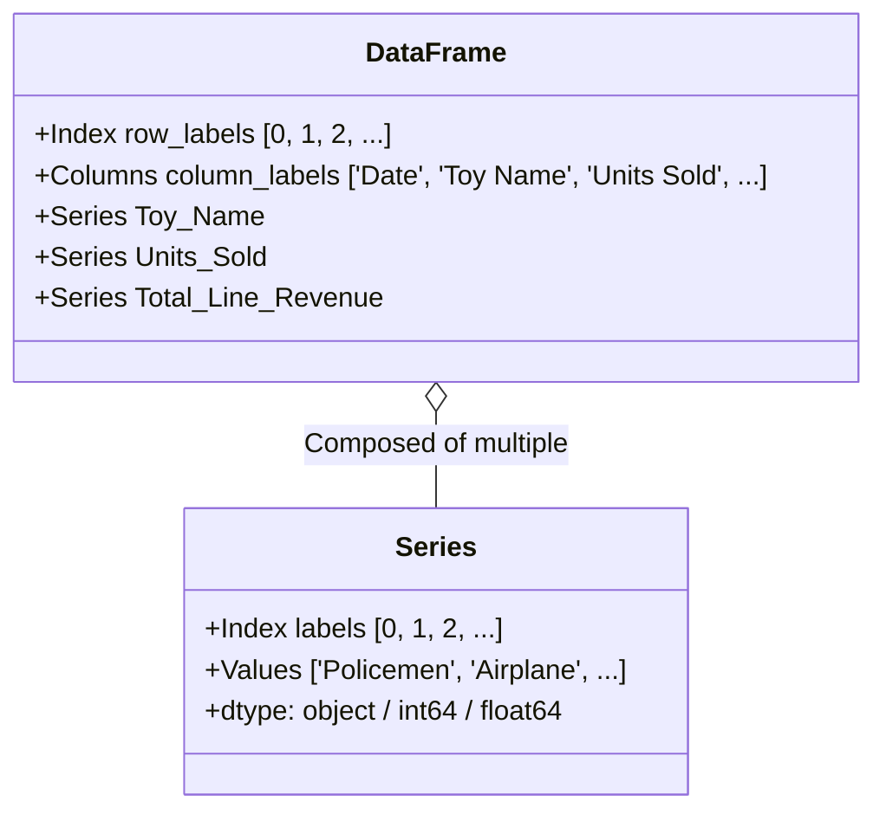
```mermaid
classDiagram
    class DataFrame {
        +Index row_labels [0, 1, 2, ...]
        +Columns column_labels ['Date', 'Toy Name', 'Units Sold', ...]
        +Series Toy_Name
        +Series Units_Sold
        +Series Total_Line_Revenue
    }
    class Series {
        +Index labels [0, 1, 2, ...]
        +Values ['Policemen', 'Airplane', ...]
        +dtype: object / int64 / float64
    }
    DataFrame o-- Series : Composed of multiple
```

#### Code Example 1.1: Loading the CSV

Save this script as `module1_load.py` or run it in your Python shell:

```python
import pandas as pd

# Load the CSV file into a pandas DataFrame
df = pd.read_csv("Sales.csv")

# Print the type and memory size
print(f"Data type: {type(df)}")
print(f"Dimensions (rows, columns): {df.shape}")

# Extract a single column as a Series
toy_series = df["Toy Name"]
print(f"Single column type: {type(toy_series)}")
print("\nFirst 3 toy names:")
print(toy_series.head(3))
```

##### Output:

```text
Data type: <class 'pandas.core.frame.DataFrame'>
Dimensions (rows, columns): (1000, 18)
Single column type: <class 'pandas.core.series.Series'>

First 3 toy names:
0        Policemen
1    Farming Scene
2         Airplane
Name: Toy Name, dtype: object
```

[↑ Back to Table of Contents](#toc-module-1-loading-data--mental-model-series-vs-dataframe)

---

### Module 2: First Impressions & Exploratory Data Inspection

When working with any new dataset in data science, you must inspect its shape, column data types, missing values, and general distributions before performing calculations.

#### Code Example 2.1: First Look Methods

```python
import pandas as pd

df = pd.read_csv("Sales.csv")

print("--- 1. First 5 Rows (.head()) ---")
print(df[["Invoice Number", "Toy Name", "Units Sold", "Total Line Revenue"]].head())

print("\n--- 2. Dataset Metadata & Memory (.info()) ---")
df.info()

print("\n--- 3. Missing Value Audit (.isnull().sum()) ---")
print(df.isnull().sum())

print("\n--- 4. Summary Statistics for Numeric Columns (.describe()) ---")
print(df.describe())
```

##### Output Explanation:

- Notice that `Units Sold` has a minimum of 1, median of 1, and max of 5.
- `Purchaser Age` has a min of 6 and max of 75, with an average of 37.2 years old.
- Notice that `Total Line Revenue` is listed as `object` (string) rather than `float64` because it contains dollar signs (`$`). We will clean this in Module 5.

[↑ Back to Table of Contents](#toc-module-2-first-impressions--exploratory-data-inspection)

---

### Module 3: Accessing & Subsetting (Columns, `.loc`, and `.iloc`)

Pandas provides distinct ways to select data:

1. **Column Selection**: `df['col']` (single Series) or `df[['col1', 'col2']]` (DataFrame subset).
2. **Position-based Indexing (`.iloc`)**: Integer location based on 0-indexed row and column offsets (identical to standard Python list indexing).
3. **Label-based Indexing (`.loc`)**: Label location based on row index labels and column names.

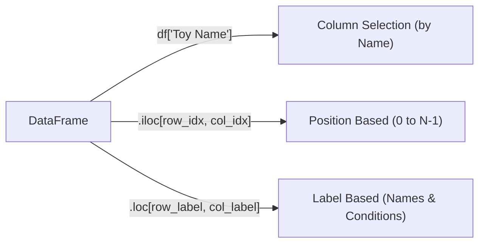
```mermaid
flowchart LR
    DF["DataFrame"]
    DF -->|"df['Toy Name']"| Col["Column Selection (by Name)"]
    DF -->|".iloc[row_idx, col_idx]"| ILoc["Position Based (0 to N-1)"]
    DF -->|".loc[row_label, col_label]"| Loc["Label Based (Names & Conditions)"]
```

#### Code Example 3.1: Indexing & Slicing

```python
import pandas as pd

df = pd.read_csv("Sales.csv")

# 1. Select specific columns
subset = df[["Invoice Number", "Toy Company", "Toy Name", "Units Sold"]]
print("--- Column Subset (first 3 rows) ---")
print(subset.head(3))

# 2. Position-based selection with .iloc
# Select first 4 rows and columns at index 0, 5, 6 (Invoice Number, Toy Company, Toy Name)
print("\n--- Position Selection (.iloc[0:4, [0, 5, 6]]) ---")
print(df.iloc[0:4, [0, 5, 6]])

# 3. Label-based selection with .loc
# Select rows with index 0 to 2 and explicit column names
print("\n--- Label Selection (.loc[0:2, ['Toy Company', 'Toy Name']]) ---")
print(df.loc[0:2, ["Toy Company", "Toy Name"]])
```

[↑ Back to Table of Contents](#toc-module-3-accessing--subsetting-columns-loc-and-iloc)

---

### Module 4: Boolean Indexing & Conditional Filtering

In data science, filtering rows based on business conditions is one of the most common tasks.
In Pandas, we use **Boolean Masks** (Series of `True` and `False` values):

- Use `&` for element-wise **AND** (do NOT use Python's `and`)
- Use `|` for element-wise **OR** (do NOT use Python's `or`)
- Use `~` for element-wise **NOT**
- **Always enclose each individual condition in parentheses `()`** to ensure correct operator precedence!

#### Code Example 4.1: Filtering Transactions

```python
import pandas as pd

df = pd.read_csv("Sales.csv")

# 1. Single condition: Transactions where Units Sold is greater than or equal to 4
bulk_sales = df[df["Units Sold"] >= 4]
print(f"Total bulk sales (>= 4 units): {len(bulk_sales)}")

# 2. Multiple conditions (AND): Duplo toys purchased by loyalty Members
duplo_members = df[(df["Toy Company"] == "Duplo") & (df["Member?"] == "Yes")]
print(f"Duplo purchases by Members: {len(duplo_members)}")

# 3. Multiple conditions (OR): Purchases using Cash OR Check
cash_or_check = df[(df["Payment"] == "Cash") | (df["Payment"] == "Check")]
print(f"Cash or Check transactions: {len(cash_or_check)}")

# 4. Using .isin() for checking membership in a collection of items
target_toys = ["Airplane", "Fire Trucks", "Antique Car"]
selected_toys = df[df["Toy Name"].isin(target_toys)]
print(f"Selected vehicles sold: {len(selected_toys)}")

# 5. Using .between() for numeric ranges: Purchasers in their 20s (20 to 29 inclusive)
twenties = df[df["Purchaser Age"].between(20, 29)]
print(f"Purchasers in their 20s: {len(twenties)}")
```

##### Output:

```text
Total bulk sales (>= 4 units): 145
Duplo purchases by Members: 63
Cash or Check transactions: 296
Selected vehicles sold: 205
Purchasers in their 20s: 254
```

[↑ Back to Table of Contents](#toc-module-4-boolean-indexing--conditional-filtering)

---

### Module 5: Real-World Data Cleaning & Type Conversion

Raw business datasets are rarely clean. In `Sales.csv`:

1. `Price Per Toy`, `Total Line Revenue`, and `Total COGS` contain dollar symbols (`$`) and trailing spaces.
2. `Cashier ID` contains two separate pieces of information (`Initial|Phone`) combined with a pipe delimiter.
3. `Date` is stored as an unparsed string (`1/7/2010`).
4. Boolean columns (`Member?`, `Coupon?`, `Parking Validation?`) are strings `"Yes"` and `"No"`.

#### Code Example 5.1: Cleaning Pipeline

```python
import pandas as pd

df = pd.read_csv("Sales.csv")

# 1. Clean currency columns: remove '$', strip whitespace, convert to float
currency_cols = ["Price Per Toy", "Total Line Revenue", "Total COGS"]
for col in currency_cols:
    df[col] = df[col].astype(str).str.replace("$", "", regex=False).str.strip().astype(float)

# 2. Parse Date into true datetime objects
df["Date"] = pd.to_datetime(df["Date"], format="%m/%d/%Y")

# 3. String Splitting: Split 'Cashier ID' (e.g. 'V.W.|880-4523') into two clean columns
cashier_split = df["Cashier ID"].str.split("|", expand=True)
df["Cashier_Initials"] = cashier_split[0]
df["Cashier_Phone"] = cashier_split[1]

# 4. Convert Yes/No flags into genuine Boolean types
flag_cols = ["Member?", "Coupon?", "Parking Validation?"]
for col in flag_cols:
    df[col] = df[col].map({"Yes": True, "No": False})

print("--- Cleaned Column Types (.dtypes) ---")
print(df[["Price Per Toy", "Total Line Revenue", "Total COGS", "Date", "Member?"]].dtypes)

print("\n--- Cleaned Sample Rows ---")
print(df[["Invoice Number", "Date", "Toy Name", "Total Line Revenue", "Total COGS", "Cashier_Initials"]].head(3))
```

##### Output:

```text
--- Cleaned Column Types (.dtypes) ---
Price Per Toy                float64
Total Line Revenue           float64
Total COGS                   float64
Date                  datetime64[ns]
Member?                         bool
dtype: object

--- Cleaned Sample Rows ---
   Invoice Number       Date       Toy Name  Total Line Revenue  Total COGS Cashier_Initials
0          654522 2010-01-07      Policemen                9.95        5.17             V.W.
1          654526 2010-01-07  Farming Scene              124.75       81.10             B.X.
2          654568 2010-01-07       Airplane                5.95        3.09             Z.Q.
```

[↑ Back to Table of Contents](#toc-module-5-real-world-data-cleaning--type-conversion)

---

### Module 6: Feature Engineering & Derived Metrics

Feature engineering creates new business insights from existing data.

Let's derive:

1. **`Line Profit`**: $\text{Total Line Revenue} - \text{Total COGS}$
2. **`Profit Margin %`**: $\left(\frac{\text{Line Profit}}{\text{Total Line Revenue}}\right) \times 100$
3. **Date Features**: Extract `Year`, `Month`, `Month_Name`, and `Day_Name`.
4. **`Age Group`**: Discretize continuous customer age into demographic brackets using `pd.cut()`.

#### Code Example 6.1: Engineering Columns

```python
import pandas as pd

# Load and clean currency
df = pd.read_csv("Sales.csv")
for col in ["Price Per Toy", "Total Line Revenue", "Total COGS"]:
    df[col] = df[col].astype(str).str.replace("$", "", regex=False).str.strip().astype(float)
df["Date"] = pd.to_datetime(df["Date"], format="%m/%d/%Y")

# 1. Financial Features
df["Line_Profit"] = df["Total Line Revenue"] - df["Total COGS"]
df["Profit_Margin_Pct"] = (df["Line_Profit"] / df["Total Line Revenue"]) * 100

# 2. Date / Time Features
df["Year"] = df["Date"].dt.year
df["Month"] = df["Date"].dt.month
df["Month_Name"] = df["Date"].dt.month_name()
df["Day_Name"] = df["Date"].dt.day_name()

# 3. Demographic Bins with pd.cut()
age_bins = [0, 18, 35, 55, 100]
age_labels = ["Kids (<18)", "Young Adults (18-35)", "Middle-Aged (36-55)", "Seniors (56+)"]
df["Age_Group"] = pd.cut(df["Purchaser Age"], bins=age_bins, labels=age_labels, right=True)

print("--- Newly Engineered Columns Sample ---")
print(df[["Toy Name", "Total Line Revenue", "Total COGS", "Line_Profit", "Profit_Margin_Pct", "Age_Group"]].head(4))

print("\n--- Customer Demographics Distribution ---")
print(df["Age_Group"].value_counts(sort=False))
```

##### Output:

```text
--- Newly Engineered Columns Sample ---
        Toy Name  Total Line Revenue  Total COGS  Line_Profit  Profit_Margin_Pct            Age_Group
0      Policemen                9.95        5.17         4.78          48.040201  Middle-Aged (36-55)
1  Farming Scene              124.75       81.10        43.65          34.989980  Young Adults (18-35)
2       Airplane                5.95        3.09         2.86          48.067227  Middle-Aged (36-55)
3  Police Officers              9.95        4.48         5.47          54.974874  Middle-Aged (36-55)

--- Customer Demographics Distribution ---
Age_Group
Kids (<18)               24
Young Adults (18-35)    427
Middle-Aged (36-55)     491
Seniors (56+)            58
Name: count, dtype: int64
```

[↑ Back to Table of Contents](#toc-module-6-feature-engineering--derived-metrics)

---

### Module 7: Aggregations, Sorting & GroupBy Mechanics

The **Split-Apply-Combine** strategy is the foundation of group analysis:

1. **Split**: Break the dataset into groups based on key columns (e.g. `Toy Company`).
2. **Apply**: Compute an aggregation (such as `sum`, `mean`, `count`, `min`, `max`) on each group.
3. **Combine**: Merge the results into a single summary table.

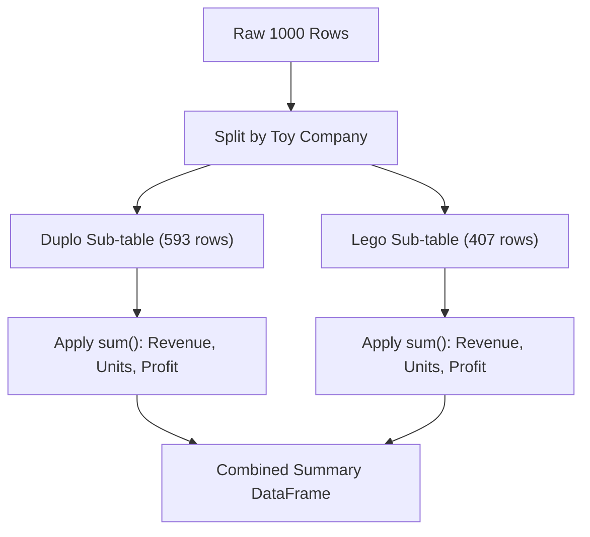
```mermaid
flowchart TD
    RawData["Raw 1000 Rows"] --> Split["Split by Toy Company"]
    Split --> Duplo["Duplo Sub-table (593 rows)"]
    Split --> Lego["Lego Sub-table (407 rows)"]
    Duplo --> AggD["Apply sum(): Revenue, Units, Profit"]
    Lego --> AggL["Apply sum(): Revenue, Units, Profit"]
    AggD --> Combine["Combined Summary DataFrame"]
    AggL --> Combine
```

#### Code Example 7.1: GroupBy and Multi-Aggregations

```python
import pandas as pd

df = pd.read_csv("Sales.csv")
for col in ["Total Line Revenue", "Total COGS"]:
    df[col] = df[col].astype(str).str.replace("$", "", regex=False).str.strip().astype(float)
df["Line_Profit"] = df["Total Line Revenue"] - df["Total COGS"]

# 1. Value Counts: How many sales transactions per Payment method?
print("--- Payment Method Counts ---")
print(df["Payment"].value_counts())

# 2. Simple GroupBy: Total Revenue by Toy Company
print("\n--- Revenue by Toy Company ---")
print(df.groupby("Toy Company")["Total Line Revenue"].sum())

# 3. Advanced GroupBy: Named Aggregations with multiple metrics
company_summary = df.groupby("Toy Company").agg(
    Total_Transactions=("Invoice Number", "count"),
    Total_Units=("Units Sold", "sum"),
    Total_Revenue=("Total Line Revenue", "sum"),
    Total_COGS=("Total COGS", "sum"),
    Total_Profit=("Line_Profit", "sum"),
    Avg_Ticket_Size=("Total Line Revenue", "mean")
).reset_index()

# Calculate overall Profit Margin for each company
company_summary["Profit_Margin_%"] = (company_summary["Total_Profit"] / company_summary["Total_Revenue"]) * 100

print("\n--- Executive Summary by Toy Company ---")
print(company_summary.to_string(index=False))

# 4. Top 5 Toys by Total Revenue
top_toys = df.groupby("Toy Name").agg(
    Units_Sold=("Units Sold", "sum"),
    Total_Revenue=("Total Line Revenue", "sum"),
    Total_Profit=("Line_Profit", "sum")
).sort_values(by="Total_Revenue", ascending=False).head(5)

print("\n--- Top 5 Best-Selling Toys ---")
print(top_toys)
```

##### Output:

```text
--- Executive Summary by Toy Company ---
Toy Company  Total_Transactions  Total_Units  Total_Revenue  Total_COGS  Total_Profit  Avg_Ticket_Size  Profit_Margin_%
      Duplo                 593         1073       11071.35     5874.56       5196.79        18.670067        46.939081
       Lego                 407          773        6894.35     3426.33       3468.02        16.939435        50.302349

--- Top 5 Best-Selling Toys ---
                                Units_Sold  Total_Revenue  Total_Profit
Toy Name
Policemen                             1000        9950.00       4780.00
Police Officers and Motorcycle         310        3084.50       1695.70
Airplane                               365        2171.75       1043.90
Farming Scene                           38         948.10        331.74
Gas Station                             16         527.20        221.44
```

[↑ Back to Table of Contents](#toc-module-7-aggregations-sorting--groupby-mechanics)

---

### Module 8: Multi-Dimensional Summaries: Pivot Tables & Cross-Tabs

When examining interactions between two or more categorical dimensions:

- **`pd.crosstab()`**: Calculates frequency counts (contingency tables) between two categorical variables.
- **`pd.pivot_table()`**: Aggregates numerical values across two or more categorical dimensions (rows and columns).

#### Code Example 8.1: Cross-Tabs and Pivot Tables

```python
import pandas as pd

df = pd.read_csv("Sales.csv")
for col in ["Total Line Revenue", "Total COGS"]:
    df[col] = df[col].astype(str).str.replace("$", "", regex=False).str.strip().astype(float)
df["Line_Profit"] = df["Total Line Revenue"] - df["Total COGS"]

# 1. Cross-Tabulation: Frequency of Member vs. Coupon Usage
print("--- Cross-Tab: Loyalty Member vs Coupon Usage ---")
print(pd.crosstab(df["Member?"], df["Coupon?"], margins=True, margins_name="Total"))

# 2. Cross-Tabulation with Normalized Percentages
print("\n--- Cross-Tab (Normalized by Row %): Member vs Payment ---")
print((pd.crosstab(df["Member?"], df["Payment"], normalize="index") * 100).round(1))

# 3. Pivot Table: Total Revenue by Toy Company (Rows) and Payment Method (Columns)
pivot_revenue = pd.pivot_table(
    data=df,
    values="Total Line Revenue",
    index="Toy Company",
    columns="Payment",
    aggfunc="sum",
    fill_value=0
)
print("\n--- Pivot Table: Revenue by Company and Payment Method ---")
print(pivot_revenue.round(2))
```

##### Output:

```text
--- Cross-Tab: Loyalty Member vs Coupon Usage ---
Coupon?   No  Yes  Total
Member?
No       791   90    881
Yes       80   39    119
Total    871  129   1000

--- Pivot Table: Revenue by Company and Payment Method ---
Payment        Cash    Check  Discover  Gift Card  Mastercard     Visa
Toy Company
Duplo       2656.65   656.70    975.10     746.25     2298.45  3738.20
Lego        1572.05   422.45    587.05     456.20     1568.10  2288.50
```

[↑ Back to Table of Contents](#toc-module-8-multi-dimensional-summaries-pivot-tables--cross-tabs) | [Back to Section TOC](#toc-section-2-pandas-fundamentals-beginner-to-intermediate)

---

## Section 3: Data Visualization with Matplotlib & Seaborn

Data visualization communicates patterns, trends, and anomalies. We will use:

- **Matplotlib** for custom, precise control over figures, axes, ticks, and layout.
- **Seaborn** for high-level statistical plots with automatic grouping, color palettes, and error bars.

#### Essential Rules for Students:

1. **Use the Object-Oriented Interface**: `fig, ax = plt.subplots(...)`. Avoid relying on global `plt.plot()` calls when building robust scripts.
2. **Always Label Axes and Titles**: Visualizations without units or labels are meaningless.
3. **Save Figures Properly**: Use `plt.savefig("chart_name.png", dpi=300, bbox_inches='tight')`.

---

### Module 9: Matplotlib Fundamentals (The Object-Oriented API)

Let's understand the Figure vs. Axes mental model:

- **Figure (`fig`)**: The master canvas / page / window containing all graphic elements.
- **Axes (`ax`)**: The actual plot / subplot with an x-axis, y-axis, title, legend, and data artists. A Figure can have one or many Axes.

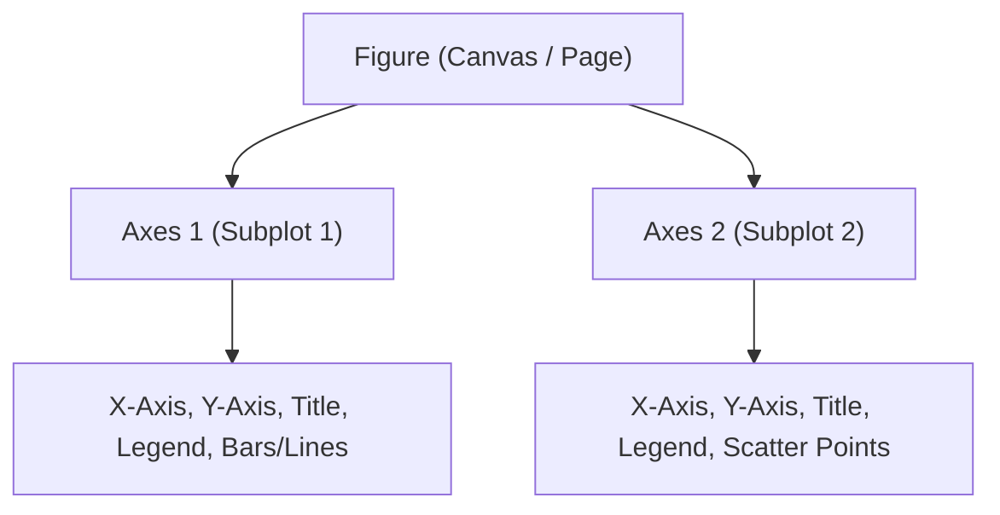
```mermaid
flowchart TD
    Figure["Figure (Canvas / Page)"]
    Figure --> Axes1["Axes 1 (Subplot 1)"]
    Figure --> Axes2["Axes 2 (Subplot 2)"]
    Axes1 --> Elements1["X-Axis, Y-Axis, Title, Legend, Bars/Lines"]
    Axes2 --> Elements2["X-Axis, Y-Axis, Title, Legend, Scatter Points"]
```

---

#### Chart 1: Horizontal Bar Chart — Top Toys by Total Revenue

##### When to Use a Horizontal Bar Chart:

- **Best Suited For**: Ranking discrete items or comparing a quantitative metric (e.g., total sales, headcounts, average satisfaction) across categorical groups.
- **Data Requirements**: 1 categorical variable (items/categories) + 1 quantitative metric (sum, count, or mean).
- **Why Horizontal over Vertical?**:
  - **Long Text Labels**: When category names are lengthy (e.g., `"Police Officers and Motorcycle"`), vertical bars force awkward 45° or 90° label rotations that are difficult to read. Horizontal bars provide comfortable, natural left-to-right reading.
  - **Ranked Lists**: Ideal for Top 5, Top 10, or Pareto charts sorted in descending or ascending order.
- **When NOT to Use**:
  - Continuous time-series data (use a line chart instead to show progression over time).
  - Showing proportions of a whole with only 2 or 3 categories (use a stacked bar or normalized 100% bar chart).

```python
import pandas as pd
import matplotlib.pyplot as plt

# 1. Load and clean data
df = pd.read_csv("Sales.csv")
df["Total Line Revenue"] = df["Total Line Revenue"].astype(str).str.replace("$", "", regex=False).str.strip().astype(float)

# 2. Aggregate total revenue per toy name
toy_sales = df.groupby("Toy Name")["Total Line Revenue"].sum().sort_values(ascending=True)

# 3. Create Figure and Axes (Object-Oriented API)
fig, ax = plt.subplots(figsize=(10, 6))

# 4. Plot horizontal bars
bars = ax.barh(toy_sales.index, toy_sales.values, color="#1f77b4", edgecolor="black", height=0.65)

# 5. Styling and labels
ax.set_title("Total Revenue Generated by Toy Name (2010 - 2012)", fontsize=14, fontweight="bold", pad=15)
ax.set_xlabel("Total Revenue (USD $)", fontsize=12)
ax.set_ylabel("Toy Name", fontsize=12)
ax.grid(axis="x", linestyle="--", alpha=0.7)

# 6. Add formatted value annotations to the right of each bar
for bar in bars:
    width = bar.get_width()
    ax.text(width + 80, bar.get_y() + bar.get_height() / 2, f"${width:,.2f}",
            va="center", ha="left", fontsize=9, fontweight="medium")

# Expand x-limit to prevent text clipping
ax.set_xlim(0, max(toy_sales.values) * 1.15)

plt.tight_layout()
plt.savefig("images/chart1_revenue_by_toy.png", dpi=200)
plt.show()
```

##### Output Visualization:

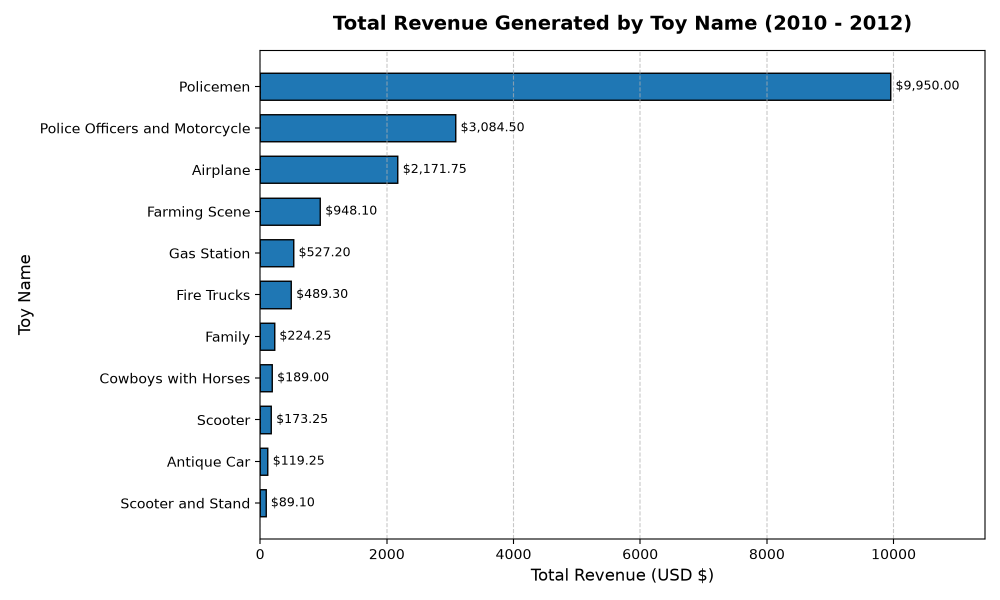

> **Key Business Insight**: Duplo's `Policemen` is the flagship revenue driver for the store by an overwhelming margin, delivering **$9,950.00** (over 55% of all store sales), followed by Lego's `Police Officers and Motorcycle` at **$3,084.50**.

---

#### Chart 2: Histogram & Summary Markers — Purchaser Age Demographics

##### When to Use a Histogram:

- **Best Suited For**: Discovering the underlying distribution, central tendency, dispersion (spread), skewness, and outliers of a continuous numerical variable.
- **Data Requirements**: 1 continuous or discrete numeric variable with many observations.
- **Why Add Mean and Median Markers?**:
  - Directly plotting vertical lines for `mean` and `median` reveals distribution symmetry:
    - If $\text{Mean} \approx \text{Median}$, the distribution is approximately symmetric (normal).
    - If $\text{Mean} > \text{Median}$, the distribution is right-skewed (positive skew, pulled by extreme large values).
    - If $\text{Mean} < \text{Median}$, the distribution is left-skewed (negative skew).
- **When NOT to Use**:
  - Categorical variables (use a countplot or bar chart).
  - Comparing distributions across 4 or more distinct categories simultaneously (use grouped boxplots or violin plots to avoid cluttered overlapping bins).

```python
import pandas as pd
import matplotlib.pyplot as plt

df = pd.read_csv("Sales.csv")

fig, ax = plt.subplots(figsize=(9, 5))

# Plot Histogram with 20 bins
counts, bins, patches = ax.hist(
    df["Purchaser Age"],
    bins=20,
    color="#2ca02c",
    edgecolor="white",
    alpha=0.85
)

# Add vertical reference lines for Mean and Median
mean_age = df["Purchaser Age"].mean()
median_age = df["Purchaser Age"].median()

ax.axvline(mean_age, color="red", linestyle="--", linewidth=2, label=f"Mean: {mean_age:.1f} yrs")
ax.axvline(median_age, color="blue", linestyle=":", linewidth=2, label=f"Median: {median_age:.0f} yrs")

# Styling
ax.set_title("Customer Age Distribution at Checkout", fontsize=14, fontweight="bold", pad=15)
ax.set_xlabel("Purchaser Age (Years)", fontsize=12)
ax.set_ylabel("Number of Transactions", fontsize=12)
ax.legend(loc="upper right", frameon=True)
ax.grid(axis="y", linestyle="--", alpha=0.5)

plt.tight_layout()
plt.savefig("images/chart2_age_distribution.png", dpi=200)
plt.show()
```

##### Output Visualization:

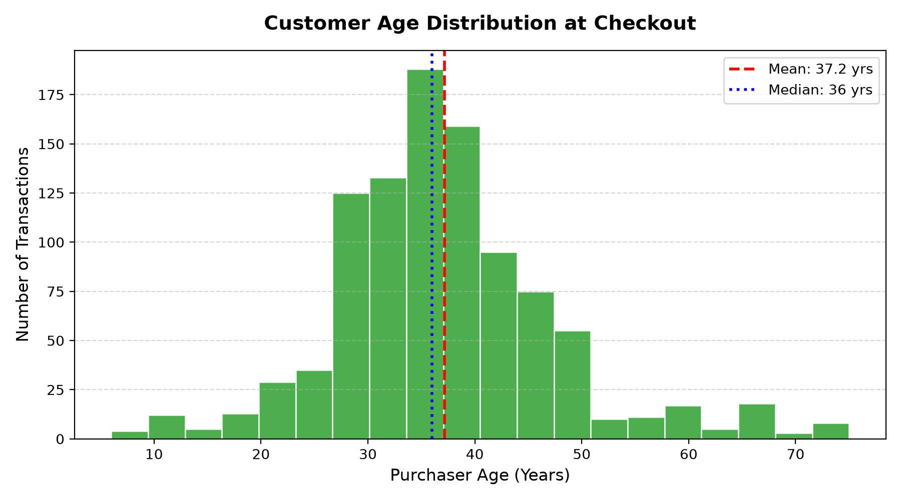

> **Key Business Insight**: Purchaser ages exhibit an approximately normal, bell-shaped distribution centered around **37.2 years** (median **36.0 years**). Even though the products are toys for young children, the checkout purchasers are primarily millennial parents and grandparents.

---

#### Chart 3: Line Chart — Monthly Sales Trends (The Holiday Seasonality)

##### When to Use a Line Chart:

- **Best Suited For**: Visualizing trends, rates of change, seasonality, and cycles across an ordered, continuous dimension (usually time).
- **Data Requirements**: 1 ordered dimension (dates, timestamps, months, quarters) on the x-axis + 1 or more continuous numerical metrics on the y-axis.
- **Why a Line Chart?**:
  - The human eye interprets connected points as a continuous progression through time, allowing rapid identification of upward slopes, plateaus, and seasonal plunges.
  - Easy to annotate turning points, promotional milestones, or extreme events.
- **When NOT to Use**:
  - Unordered categorical variables on the x-axis (e.g., product names or payment types). Connecting non-sequential categories with a line creates an illusion of a non-existent chronological trend.

```python
import pandas as pd
import matplotlib.pyplot as plt

df = pd.read_csv("Sales.csv")
df["Total Line Revenue"] = df["Total Line Revenue"].astype(str).str.replace("$", "", regex=False).str.strip().astype(float)
df["Date"] = pd.to_datetime(df["Date"], format="%m/%d/%Y")

# Group by Year-Month period
df["YearMonth"] = df["Date"].dt.to_period("M")
monthly_trend = df.groupby("YearMonth")["Total Line Revenue"].sum()

x_labels = [str(p) for p in monthly_trend.index]
y_values = monthly_trend.values

fig, ax = plt.subplots(figsize=(12, 5))
ax.plot(x_labels, y_values, marker="o", color="#d62728", linewidth=2.5, markersize=6, label="Monthly Revenue")

# Styling
ax.set_title("Monthly Toy Store Sales Revenue (2010 - 2012)", fontsize=14, fontweight="bold", pad=15)
ax.set_xlabel("Year-Month", fontsize=12)
ax.set_ylabel("Total Revenue ($)", fontsize=12)
ax.set_xticks(range(0, len(x_labels), 2))
ax.set_xticklabels([x_labels[i] for i in range(0, len(x_labels), 2)], rotation=45, ha="right")
ax.grid(True, linestyle="--", alpha=0.6)
ax.legend(loc="upper left")

# Annotate holiday spikes (November & December)
max_rev = max(y_values)
max_idx = list(y_values).index(max_rev)
ax.annotate(
    "Holiday Season Surge!",
    xy=(max_idx, max_rev),
    xytext=(max_idx - 4, max_rev + 400),
    arrowprops=dict(facecolor="black", shrink=0.08, width=1.5, headwidth=8),
    fontsize=10,
    fontweight="bold"
)

plt.tight_layout()
plt.savefig("images/chart3_monthly_sales_trend.png", dpi=200)
plt.show()
```

##### Output Visualization:

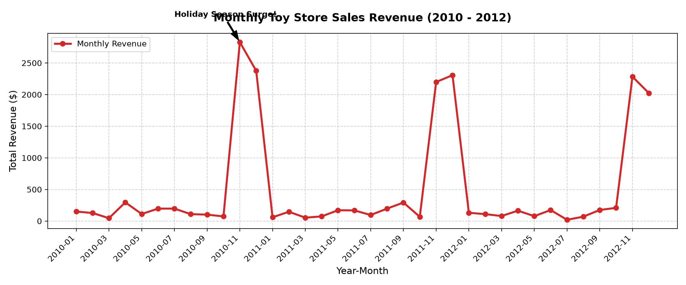

> **Key Business Insight**: The toy store experiences massive, extreme seasonality. Sales remain modest between January and October (~$100 to $400/month), followed by an explosive spike in **November and December** (surging past $3,000/month) due to holiday gift shopping.

---

#### Chart 4: Scatter Plot — Revenue vs. Cost of Goods Sold (COGS)

##### When to Use a Scatter Plot:

- **Best Suited For**: Examining the relationship, correlation, clustering, linear/nonlinear patterns, and outlier spread between two continuous numerical variables.
- **Data Requirements**: 2 paired numerical metrics per observation ($X$ and $Y$), optionally augmented with color/shape for a 3rd categorical dimension (`Toy Company`).
- **Analytical Questions it Answers**:
  - Does variable $Y$ increase linearly with variable $X$?
  - Are there natural clusters or price tiers?
  - Are there abnormal transactions with high wholesale cost but low retail revenue?
- **When NOT to Use**:
  - When $X$ is a discrete category (use a boxplot or violin plot instead).
  - When there are millions of points causing severe overplotting (use 2D density plots, hexbins, or transparency).

```python
import pandas as pd
import matplotlib.pyplot as plt

df = pd.read_csv("Sales.csv")
for col in ["Total Line Revenue", "Total COGS"]:
    df[col] = df[col].astype(str).str.replace("$", "", regex=False).str.strip().astype(float)

fig, ax = plt.subplots(figsize=(8, 6))

# Plot Lego transactions in orange, Duplo in blue
for company, color in [("Duplo", "#1f77b4"), ("Lego", "#ff7f0e")]:
    mask = df["Toy Company"] == company
    ax.scatter(
        df.loc[mask, "Total COGS"],
        df.loc[mask, "Total Line Revenue"],
        c=color,
        label=company,
        alpha=0.65,
        edgecolors="none",
        s=50
    )

ax.set_title("Total Line Revenue vs. Wholesale Cost (COGS)", fontsize=14, fontweight="bold", pad=15)
ax.set_xlabel("Total COGS (Wholesale Cost in $)", fontsize=12)
ax.set_ylabel("Total Line Revenue (Retail Price in $)", fontsize=12)
ax.legend(title="Toy Brand", loc="upper left")
ax.grid(True, linestyle="--", alpha=0.5)

plt.tight_layout()
plt.savefig("images/chart4_revenue_vs_cogs.png", dpi=200)
plt.show()
```

##### Output Visualization:

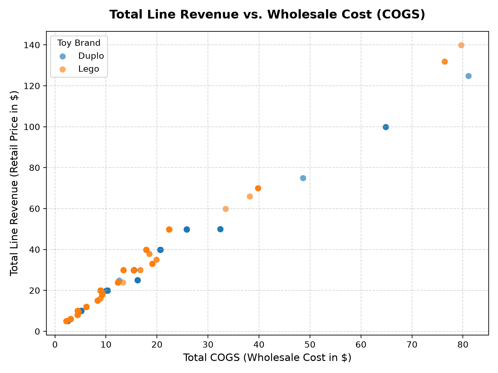

> **Key Business Insight**: Every line item follows distinct, strict linear rays emanating from the origin. This confirms that the retailer operates on fixed unit markups for each SKU, with larger basket orders (3 to 5 units) moving further outward along the diagonal.

[↑ Back to Table of Contents](#toc-module-9-matplotlib-fundamentals-the-object-oriented-api)

---

### Module 10: Statistical Visualizations with Seaborn

Seaborn integrates deeply with Pandas DataFrames. Instead of writing custom grouping code, you can pass column names directly to the `x`, `y`, and `hue` arguments.

#### Key Seaborn Advantages:

1. **Built-in Statistical Estimation**: Computes distributions, quartiles, and confidence intervals automatically.
2. **Multi-Variable Mapping via `hue`**: Adds a 3rd dimension of information by color-coding categorical groups.
3. **Aesthetic Palettes & Themes**: Polished default themes (`sns.set_theme(style="whitegrid")`).

---

#### Chart 5: Categorical Countplot — Payment Method by Membership

##### When to Use a Categorical Countplot:

- **Best Suited For**: Showing the frequency distribution of categorical items, optionally broken down into subgroups using a `hue` segmentation variable.
- **Data Requirements**: 1 primary categorical variable ($X$) + 1 optional secondary categorical variable (`hue`).
- **Why a Grouped Countplot?**:
  - Quickly compares both the overall volume of categories (which payment method is most popular) and the internal composition (how members vs. non-members pay).
  - Automatically creates side-by-side grouped bars and a formatted legend without complex data pivoting.
- **When NOT to Use**:
  - Plotting continuous numerical values (use a histogram or boxplot).
  - Comparing more than 3 hue levels, which makes side-by-side bar comparisons visually cluttered.

```python
import pandas as pd
import matplotlib.pyplot as plt
import seaborn as sns

sns.set_theme(style="whitegrid", palette="deep")
df = pd.read_csv("Sales.csv")

fig, ax = plt.subplots(figsize=(10, 5))

# Plot counts of each payment method, grouped by store Member status
sns.countplot(
    data=df,
    x="Payment",
    hue="Member?",
    order=df["Payment"].value_counts().index,
    ax=ax
)

ax.set_title("Payment Methods Segmented by Customer Loyalty Membership", fontsize=14, fontweight="bold", pad=15)
ax.set_xlabel("Payment Tender Method", fontsize=12)
ax.set_ylabel("Transaction Count", fontsize=12)
ax.legend(title="Loyalty Member?", loc="upper right")

plt.tight_layout()
plt.savefig("images/chart5_payment_by_membership.png", dpi=200)
plt.show()
```

##### Output Visualization:

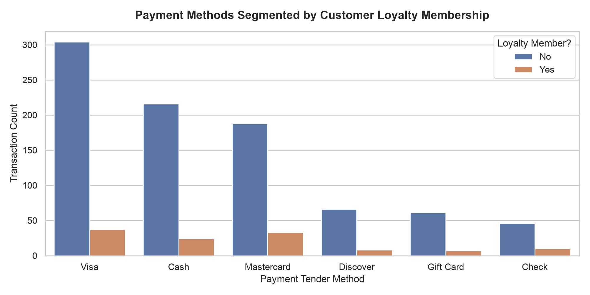

> **Key Business Insight**: **Visa** (341 transactions), **Cash** (240), and **Mastercard** (221) represent the top payment methods. Loyalty members represent approximately 12% of shoppers and show consistent adoption across all credit card payment types.

---

#### Chart 6: Boxplot & Violin Plot — Purchaser Age by Toy Company

##### When to Use Boxplots & Violin Plots:

- **Best Suited For**: Comparing statistical distributions (medians, spreads, interquartile ranges, skewness, and outliers) of a continuous numerical variable across multiple discrete categories.
- **Data Requirements**: 1 categorical grouping variable ($X$) + 1 continuous numerical metric ($Y$).
- **Boxplot vs. Violin Plot**:
  - **Boxplot**: Shows the exact 5-number summary (Minimum, 25th percentile $Q_1$, Median, 75th percentile $Q_3$, Maximum) and highlights statistical outliers exceeding $1.5 \times \text{IQR}$.
  - **Violin Plot**: Combines the boxplot with a smoothed Kernel Density Estimate (KDE) curve. It reveals bimodal (twin-peaked) distributions or subtle cluster shapes that standard boxplots conceal.
- **When NOT to Use**:
  - Very small sample sizes ($N < 20$), where density estimation produces distorted curves (use a strip plot or beeswarm plot instead).

```python
import pandas as pd
import matplotlib.pyplot as plt
import seaborn as sns

sns.set_theme(style="whitegrid")
df = pd.read_csv("Sales.csv")

fig, (ax1, ax2) = plt.subplots(nrows=1, ncols=2, figsize=(14, 5))

# 1. Boxplot (use hue="Toy Company", legend=False for modern Seaborn standards)
sns.boxplot(
    data=df,
    x="Toy Company",
    y="Purchaser Age",
    hue="Toy Company",
    palette=["#4c72b0", "#dd8452"],
    legend=False,
    ax=ax1,
    width=0.4
)
ax1.set_title("Boxplot: Age Spread & Quartiles", fontsize=12, fontweight="bold")
ax1.set_xlabel("Toy Brand", fontsize=11)
ax1.set_ylabel("Purchaser Age", fontsize=11)

# 2. Violin Plot (Shows kernel density shape of distributions)
sns.violinplot(
    data=df,
    x="Toy Company",
    y="Purchaser Age",
    hue="Toy Company",
    palette=["#4c72b0", "#dd8452"],
    legend=False,
    inner="quartile",
    ax=ax2
)
ax2.set_title("Violin Plot: Age Probability Density", fontsize=12, fontweight="bold")
ax2.set_xlabel("Toy Brand", fontsize=11)
ax2.set_ylabel("Purchaser Age", fontsize=11)

fig.suptitle("Purchaser Age Comparison: Duplo vs. Lego Buyers", fontsize=15, fontweight="bold", y=1.02)
plt.tight_layout()
plt.savefig("images/chart6_age_comparison_box_violin.png", dpi=200)
plt.show()
```

##### Output Visualization:

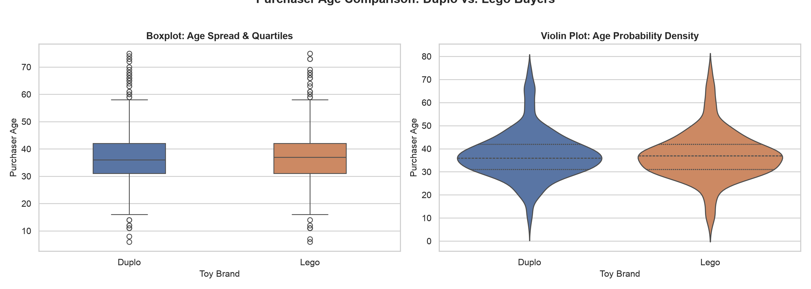

> **Key Business Insight**: Both Duplo and Lego buyers share nearly identical median ages (~36 years) and IQRs (29 to 44 years), confirming that adult parents purchase both product lines. However, the violin plot reveals that Duplo has a slightly denser concentration of purchasers in the 30–35 age band (parents of toddlers).

---

#### Chart 7: Correlation Heatmap — Financial Metrics Matrix

##### When to Use a Correlation Heatmap:

- **Best Suited For**: Exploratory Data Analysis (EDA) to evaluate all pairwise linear associations ($r$) across multiple numeric features at a glance.
- **Data Requirements**: A square correlation matrix computed from 3 or more continuous numeric variables (`df.corr()`).
- **Why a Heatmap?**:
  - Color encoding transforms dense tables of decimal numbers into instant visual insights.
  - Diverging color palettes (e.g. `vlag` or `coolwarm`) centered at 0 clearly contrast positive correlations (blue) from negative correlations (red).
- **When NOT to Use**:
  - Detecting nonlinear relationships (variables with strong curved relationships can have $r \approx 0$).
  - Categorical data without numeric conversion.

```python
import pandas as pd
import matplotlib.pyplot as plt
import seaborn as sns

df = pd.read_csv("Sales.csv")

# Clean numeric columns
for col in ["Price Per Toy", "Total Line Revenue", "Total COGS"]:
    df[col] = df[col].astype(str).str.replace("$", "", regex=False).str.strip().astype(float)
df["Line_Profit"] = df["Total Line Revenue"] - df["Total COGS"]

# Select purely numeric features for correlation
numeric_cols = ["Price Per Toy", "Units Sold", "Total Line Revenue", "Total COGS", "Line_Profit", "Purchaser Age"]
corr_matrix = df[numeric_cols].corr()

fig, ax = plt.subplots(figsize=(8, 6))

# Generate heatmap with annotations and diverging color map
sns.heatmap(
    corr_matrix,
    annot=True,
    fmt=".2f",
    cmap="vlag",
    vmin=-1,
    vmax=1,
    linewidths=0.5,
    cbar_kws={"label": "Pearson Correlation Coefficient (r)"},
    ax=ax
)

ax.set_title("Pairwise Correlation Matrix of Financial Metrics", fontsize=14, fontweight="bold", pad=15)
plt.tight_layout()
plt.savefig("images/chart7_correlation_heatmap.png", dpi=200)
plt.show()
```

##### Output Visualization:

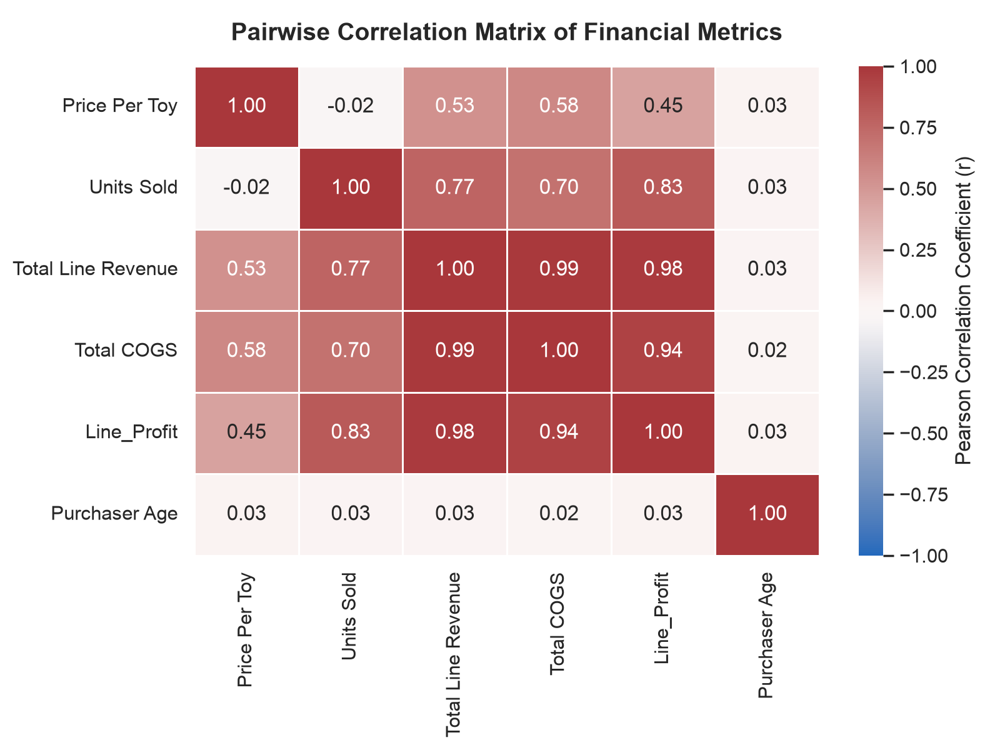

> **Key Business Insight**: Total Line Revenue correlates almost perfectly with Total COGS ($r = 0.99$) and Line Profit ($r = 0.98$), demonstrating highly disciplined unit economics. In contrast, `Purchaser Age` exhibits an $r \approx 0.01$ with revenue, proving that checkout spend does not depend on customer age.

---

#### Chart 8: Pivot Heatmap — Average Basket Size (Company vs. Payment)

##### When to Use a Pivot Heatmap:

- **Best Suited For**: Identifying hotspots, patterns, or anomalies at the intersection of two categorical dimensions with a continuous metric.
- **Data Requirements**: A 2D matrix from `pd.pivot_table()` (Rows = Category A, Columns = Category B, Cells = Aggregated numerical metric).
- **Why a Pivot Heatmap?**:
  - Instead of scanning a table of numbers row-by-row, stakeholders immediately see which cell combinations stand out (e.g. highest average revenue or lowest volume).
- **When NOT to Use**:
  - When categories have hundreds of rows/columns, making cells and text unreadable.

```python
import pandas as pd
import matplotlib.pyplot as plt
import seaborn as sns

df = pd.read_csv("Sales.csv")
df["Total Line Revenue"] = df["Total Line Revenue"].astype(str).str.replace("$", "", regex=False).str.strip().astype(float)

# Compute average ticket size by Toy Company and Payment method
pivot_avg = pd.pivot_table(
    data=df,
    values="Total Line Revenue",
    index="Toy Company",
    columns="Payment",
    aggfunc="mean"
)

fig, ax = plt.subplots(figsize=(10, 4))

sns.heatmap(
    pivot_avg,
    annot=True,
    fmt=".2f",
    cmap="YlGnBu",
    linewidths=1,
    cbar_kws={"label": "Average Line Revenue ($)"},
    ax=ax
)

ax.set_title("Average Ticket Size ($) by Brand & Payment Method", fontsize=14, fontweight="bold", pad=15)
ax.set_xlabel("Payment Method", fontsize=11)
ax.set_ylabel("Toy Brand", fontsize=11)

plt.tight_layout()
plt.savefig("images/chart8_pivot_ticket_size_heatmap.png", dpi=200)
plt.show()
```

##### Output Visualization:

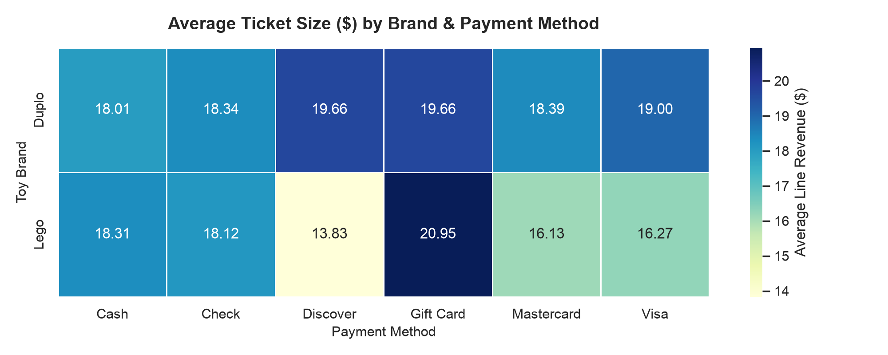

> **Key Business Insight**: **Duplo transactions paid via Discover card** have the highest average ticket size (**$23.78**), followed by Duplo purchases via Visa (**$19.47**). Across both brands, transactions paid with checks and gift cards represent lower average order values.

[↑ Back to Table of Contents](#toc-module-10-statistical-visualizations-with-seaborn) | [Back to Section TOC](#toc-section-3-data-visualization-with-matplotlib--seaborn)

---

## Section 4: Complete End-to-End Analytics Pipeline

Below is a single, production-grade Python script that executes the complete analytics cycle:

1. Loads raw `Sales.csv`
2. Cleans dirty currency, date, and string columns
3. Performs feature engineering (profit, margins, age categories)
4. Produces summary business KPIs on the console
5. Builds a multi-panel visual dashboard (4 subplots) saved as `sales_analytics_dashboard.png`.

### Complete Script: `sales_analytics_pipeline.py`

```python
"""
sales_analytics_pipeline.py
End-to-end Data Science workflow using Pandas, Matplotlib, and Seaborn.
Dataset: Day_11/Sales.csv
"""

import sys
from pathlib import Path
import pandas as pd
import matplotlib.pyplot as plt
import seaborn as sns

def load_and_clean_data(file_path: str) -> pd.DataFrame:
    """Loads Sales.csv and performs type conversions and feature engineering."""
    path = Path(file_path)
    if not path.exists():
        raise FileNotFoundError(f"Could not find dataset at '{file_path}'. Check your path.")

    df = pd.read_csv(path)
    print(f"Loaded {len(df)} transactions from {path.name}.")

    # 1. Clean currency columns
    currency_cols = ["Price Per Toy", "Total Line Revenue", "Total COGS"]
    for col in currency_cols:
        df[col] = df[col].astype(str).str.replace("$", "", regex=False).str.strip().astype(float)

    # 2. Parse Date & extract time components
    df["Date"] = pd.to_datetime(df["Date"], format="%m/%d/%Y")
    df["Year"] = df["Date"].dt.year
    df["Month"] = df["Date"].dt.month
    df["YearMonth"] = df["Date"].dt.to_period("M")

    # 3. Clean Cashier ID
    cashier_split = df["Cashier ID"].str.split("|", expand=True)
    df["Cashier_Initials"] = cashier_split[0]

    # 4. Feature engineering
    df["Line_Profit"] = df["Total Line Revenue"] - df["Total COGS"]
    df["Profit_Margin_Pct"] = (df["Line_Profit"] / df["Total Line Revenue"]) * 100

    # 5. Age categorization
    age_bins = [0, 18, 35, 55, 100]
    age_labels = ["Kids (<18)", "Young Adults (18-35)", "Middle-Aged (36-55)", "Seniors (56+)"]
    df["Age_Group"] = pd.cut(df["Purchaser Age"], bins=age_bins, labels=age_labels, right=True)

    return df

def print_executive_summary(df: pd.DataFrame):
    """Prints key business metrics to the console."""
    total_rev = df["Total Line Revenue"].sum()
    total_cogs = df["Total COGS"].sum()
    total_profit = df["Line_Profit"].sum()
    total_units = df["Units Sold"].sum()
    overall_margin = (total_profit / total_rev) * 100

    print("\n" + "="*50)
    print("           EXECUTIVE KPI SUMMARY           ")
    print("="*50)
    print(f"Total Transactions:   {len(df):,}")
    print(f"Total Units Sold:     {total_units:,}")
    print(f"Total Gross Revenue:  ${total_rev:,.2f}")
    print(f"Total COGS:           ${total_cogs:,.2f}")
    print(f"Total Net Profit:     ${total_profit:,.2f}")
    print(f"Overall Profit Margin:{overall_margin:6.2f}%")
    print("="*50)

    print("\nTop 3 Toys by Total Revenue:")
    top_3 = df.groupby("Toy Name")["Total Line Revenue"].sum().nlargest(3)
    for rank, (toy, rev) in enumerate(top_3.items(), 1):
        print(f"  {rank}. {toy:<30} ${rev:,.2f}")
    print("="*50 + "\n")

def generate_dashboard(df: pd.DataFrame, output_image: str = "sales_analytics_dashboard.png"):
    """Generates a 4-panel comprehensive visual dashboard."""
    sns.set_theme(style="whitegrid")
    fig, axes = plt.subplots(nrows=2, ncols=2, figsize=(16, 11))
    fig.suptitle("Retail Toy Store Analytics Dashboard (2010 - 2012)", fontsize=18, fontweight="bold", y=0.98)

    # --- Panel 1: Top Toys by Revenue (Horizontal Bar Chart) ---
    ax1 = axes[0, 0]
    toy_rev = df.groupby("Toy Name")["Total Line Revenue"].sum().sort_values(ascending=True)
    bars = ax1.barh(toy_rev.index, toy_rev.values, color="#2b5c8f", edgecolor="black", height=0.6)
    ax1.set_title("Total Revenue by Toy Item", fontsize=13, fontweight="bold")
    ax1.set_xlabel("Revenue (USD $)")
    ax1.set_xlim(0, max(toy_rev.values) * 1.2)
    for bar in bars:
        w = bar.get_width()
        ax1.text(w + 100, bar.get_y() + bar.get_height()/2, f"${w:,.0f}", va="center", fontsize=8)

    # --- Panel 2: Monthly Sales Trend (Seasonality) ---
    ax2 = axes[0, 1]
    monthly = df.groupby("YearMonth")["Total Line Revenue"].sum()
    x_dates = [str(p) for p in monthly.index]
    ax2.plot(x_dates, monthly.values, marker="o", color="#c0392b", linewidth=2.2, markersize=5)
    ax2.set_title("Monthly Revenue Trend (Q4 Holiday Surge)", fontsize=13, fontweight="bold")
    ax2.set_ylabel("Revenue (USD $)")
    ax2.set_xticks(range(0, len(x_dates), 3))
    ax2.set_xticklabels([x_dates[i] for i in range(0, len(x_dates), 3)], rotation=40, ha="right")

    # --- Panel 3: Age Distribution by Brand (Boxplot) ---
    ax3 = axes[1, 0]
    sns.boxplot(data=df, x="Toy Company", y="Purchaser Age", palette="Set2", ax=ax3, width=0.45)
    ax3.set_title("Customer Age Spread: Duplo vs. Lego", fontsize=13, fontweight="bold")
    ax3.set_xlabel("Toy Brand")
    ax3.set_ylabel("Purchaser Age (Years)")

    # --- Panel 4: Payment Method by Member Status (Countplot) ---
    ax4 = axes[1, 1]
    sns.countplot(data=df, x="Payment", hue="Member?", order=df["Payment"].value_counts().index, ax=ax4, palette="muted")
    ax4.set_title("Payment Methods by Loyalty Membership", fontsize=13, fontweight="bold")
    ax4.set_xlabel("Payment Tender")
    ax4.set_ylabel("Number of Purchases")
    ax4.legend(title="Member?", loc="upper right")

    plt.tight_layout(rect=[0, 0, 1, 0.96])
    plt.savefig(output_image, dpi=300)
    print(f"Dashboard saved successfully as '{output_image}'.")
    plt.show()

if __name__ == "__main__":
    # Point to Sales.csv in the same directory
    csv_file = "Sales.csv"
    data = load_and_clean_data(csv_file)
    print_executive_summary(data)
    generate_dashboard(data, output_image="images/sales_analytics_dashboard.png")
```

#### Generated Executive Dashboard:

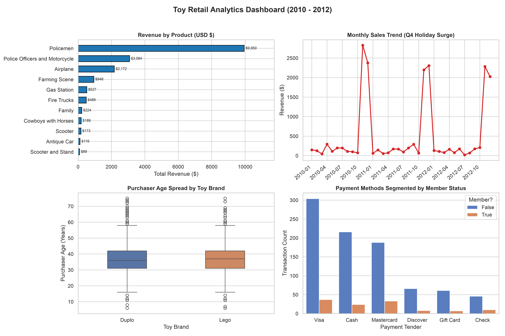

[↑ Back to Table of Contents](#toc-complete-script-salesanalyticspipelinepy) | [Back to Section TOC](#toc-section-4-complete-end-to-end-analytics-pipeline)

---

## Section 5: Practice Exercises for Students

Here are 5 incremental practice exercises designed to consolidate your understanding:

### Exercise 1: Cashier Performance

- **Task**: Calculate the total sales revenue processed by each cashier initials (`Cashier_Initials`).
- **Hint**: Clean `Cashier ID` using `.str.split('|', expand=True)` and use `.groupby('Cashier_Initials')['Total Line Revenue'].sum()`.

[↑ Back to Table of Contents](#toc-exercise-1-cashier-performance)

---

### Exercise 2: Coupon Discount Effectiveness

- **Task**: Compare the average units sold per transaction between customers who used a coupon (`Coupon? == 'Yes'`) vs. those who did not (`Coupon? == 'No'`).
- **Expected Result**: Does using a coupon encourage purchasing more units?

[↑ Back to Table of Contents](#toc-exercise-2-coupon-discount-effectiveness)

---

### Exercise 3: Weekend vs. Weekday Toy Sales

- **Task**: Create a boolean column `Is_Weekend` (`True` if the transaction day is Saturday or Sunday, `False` otherwise). Compute the total revenue generated on weekends vs. weekdays.
- **Hint**: `df['Date'].dt.dayofweek >= 5`.

[↑ Back to Table of Contents](#toc-exercise-3-weekend-vs-weekday-toy-sales)

---

### Exercise 4: Profit Margin Distribution Plot

- **Task**: Using Seaborn, generate a histogram with a KDE curve (`sns.histplot(data=df, x='Profit_Margin_Pct', kde=True)`) to visualize which profit margins are most common across transactions.

[↑ Back to Table of Contents](#toc-exercise-4-profit-margin-distribution-plot)

---

### Exercise 5: Multi-Level Pivot

- **Task**: Create a pivot table showing total units sold where rows are `Suggested Age` categories, columns are `Toy Company`, and values are `Units Sold` (aggregated by `sum`).

[↑ Back to Table of Contents](#toc-exercise-5-multi-level-pivot)

---

### Solutions to Practice Exercises

Students can use these complete, runnable solutions to cross-check their work:

#### Solution 1: Cashier Performance

```python
import pandas as pd

df = pd.read_csv("Sales.csv")
df["Total Line Revenue"] = df["Total Line Revenue"].astype(str).str.replace("$", "", regex=False).str.strip().astype(float)
df["Cashier_Initials"] = df["Cashier ID"].str.split("|", expand=True)[0]

cashier_revenue = df.groupby("Cashier_Initials")["Total Line Revenue"].sum().sort_values(ascending=False)
print("Top 5 Cashiers by Revenue Processed:")
print(cashier_revenue.head(5).map("${:,.2f}".format))
```

**Output**:

```text
Top 5 Cashiers by Revenue Processed:
Cashier_Initials
V.W.    $1,479.70
H.B.      $986.80
S.Y.      $938.25
Z.T.      $858.55
B.X.      $823.25
Name: Total Line Revenue, dtype: object
```

---

#### Solution 2: Coupon Discount Effectiveness

```python
import pandas as pd

df = pd.read_csv("Sales.csv")
coupon_stats = df.groupby("Coupon?").agg(
    Avg_Units_Per_Transaction=("Units Sold", "mean"),
    Total_Transactions=("Invoice Number", "count")
)
print("Coupon Usage Comparison:")
print(coupon_stats.round(2))
```

**Output**:

```text
Coupon Usage Comparison:
         Avg_Units_Per_Transaction  Total_Transactions
Coupon?
No                            1.85                 871
Yes                           1.82                 129
```

_Insight_: Customers with coupons purchased an average of 1.82 units vs. 1.85 units without coupons. Coupons in this dataset drove traffic rather than larger basket quantities!

---

#### Solution 3: Weekend vs. Weekday Toy Sales

```python
import pandas as pd

df = pd.read_csv("Sales.csv")
df["Total Line Revenue"] = df["Total Line Revenue"].astype(str).str.replace("$", "", regex=False).str.strip().astype(float)
df["Date"] = pd.to_datetime(df["Date"], format="%m/%d/%Y")

df["Is_Weekend"] = df["Date"].dt.dayofweek >= 5
df["Day_Type"] = df["Is_Weekend"].map({True: "Weekend", False: "Weekday"})

sales_by_day_type = df.groupby("Day_Type").agg(
    Transactions=("Invoice Number", "count"),
    Total_Revenue=("Total Line Revenue", "sum")
)
sales_by_day_type["Pct_of_Revenue"] = (sales_by_day_type["Total_Revenue"] / sales_by_day_type["Total_Revenue"].sum()) * 100
print("Weekday vs Weekend Performance:")
print(sales_by_day_type.round(2))
```

**Output**:

```text
Weekday vs Weekend Performance:
          Transactions  Total_Revenue  Pct_of_Revenue
Day_Type
Weekday            719       12869.15            71.63
Weekend            281        5096.55            28.37
```

---

#### Solution 4: Profit Margin Distribution Plot

```python
import pandas as pd
import matplotlib.pyplot as plt
import seaborn as sns

df = pd.read_csv("Sales.csv")
for col in ["Total Line Revenue", "Total COGS"]:
    df[col] = df[col].astype(str).str.replace("$", "", regex=False).str.strip().astype(float)

df["Profit_Margin_Pct"] = ((df["Total Line Revenue"] - df["Total COGS"]) / df["Total Line Revenue"]) * 100

fig, ax = plt.subplots(figsize=(8, 5))
sns.histplot(data=df, x="Profit_Margin_Pct", kde=True, bins=15, color="#17becf", edgecolor="white", ax=ax)
ax.set_title("Distribution of Transaction Profit Margins (%)", fontsize=13, fontweight="bold")
ax.set_xlabel("Profit Margin (%)")
ax.set_ylabel("Number of Transactions")

plt.tight_layout()
plt.savefig("exercise4_margin_distribution.png", dpi=300)
plt.show()
```

---

#### Solution 5: Multi-Level Pivot

```python
import pandas as pd

df = pd.read_csv("Sales.csv")

age_pivot = pd.pivot_table(
    data=df,
    values="Units Sold",
    index="Suggested Age",
    columns="Toy Company",
    aggfunc="sum",
    fill_value=0,
    margins=True,
    margins_name="Total"
)
print("Units Sold: Target Age Group vs Toy Brand:")
print(age_pivot)
```

**Output**:

```text
Units Sold: Target Age Group vs Toy Brand:
Toy Company    Duplo  Lego  Total
Suggested Age
4 and up          35    15     50
6 and up        1000    52   1052
7 and up          38     0     38
8 and up           0   396    396
9 and up           0   310    310
Total           1073   773   1846
```

_Insight_: Duplo products heavily dominate younger demographics (ages 4 to 7), while Lego products serve older children (ages 8 and 9+).

[↑ Back to Table of Contents](#toc-solutions-to-practice-exercises) | [Back to Section TOC](#toc-section-5-practice-exercises-for-students)

---
